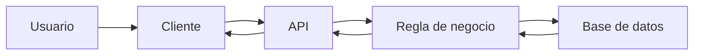
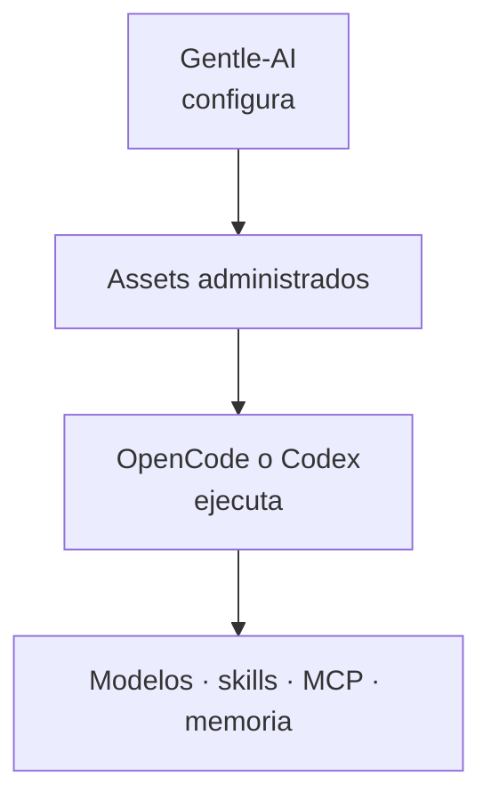
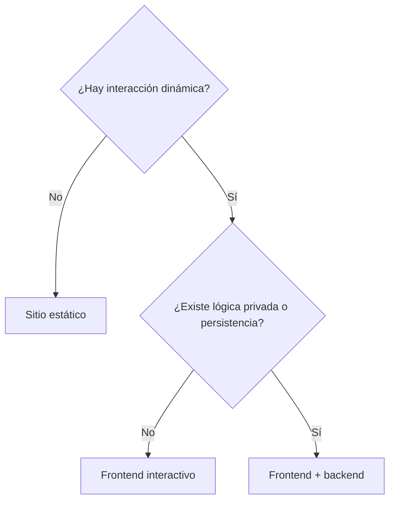
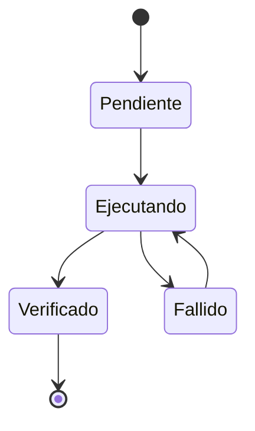

# Diagrams and Examples

## One diagram, one question

A diagram must answer one of these:

- What talks to what?
- Where does data live?
- What happens next?
- Who owns each responsibility?
- Which option should I choose?
- What changes under failure or scale?

## Diagram types

### Request flow



### Responsibility layers



### Decision tree



### State lifecycle



## Diagram constraints

- 3–12 nodes by default.
- No paragraphs inside nodes.
- No unexplained acronyms.
- The visual order matches reading order.
- Color is optional and never the only meaning.
- Add a textual explanation immediately after the diagram.
- Split a diagram if mobile labels become unreadable.
- Mermaid validation must pass.

## Continuous example pattern

Use the same scenario at increasing depth.

### Basic

```text
A user confirms an order and receives a confirmation.
```

### Operational

```text
The frontend sends a request, the API validates stock, the database stores the order and the operator checks the resulting record.
```

### Advanced

```text
Under higher load, introduce an index, cache or queue only after explaining the measured bottleneck and the new failure modes.
```

## Code and command examples

- Label the shell.
- Use safe, copyable commands.
- Do not include real secrets.
- Explain placeholders.
- Show expected output when practical.
- Never show an unsupported command as “conceptual syntax”.

## Example anti-patterns

- Five unrelated toy examples.
- “Netflix uses this” as proof.
- A complex distributed system before a single-process baseline.
- An analogy with no stated limit.
- A diagram that repeats the paragraph without adding structure.
