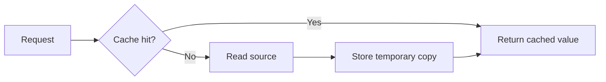

# Reference Lesson Pattern — Cache

This is a compact structural example, not text to copy into the manual.

## Resultado de aprendizaje

Explain what a cache stores, identify when it can improve a measured bottleneck and describe the risk of stale data.

## Respuesta simple

A cache keeps a temporary copy of data that is expensive or slow to obtain. A cache is not automatically faster in every system; it adds another place where data exists.

## Modelo mental

A cache resembles keeping frequently used documents on a desk instead of walking to an archive room each time. The analogy is limited: software caches need eviction, capacity, consistency and failure rules.

## Recorrido

## Continuous example

A product page repeatedly reads the same catalog data. Measurements show database reads dominate latency. A short-lived cache can reduce repeated reads, but inventory availability may need a different freshness rule.

## Trade-offs

- lower latency versus stale copies;
- fewer reads versus invalidation complexity;
- better throughput versus another operational dependency.

## Checkpoint

Given product description, account balance and one-time password, justify which could be cached and under what freshness rule.

## Sources and scope

Use primary cache/database documentation for implementation-specific claims.
