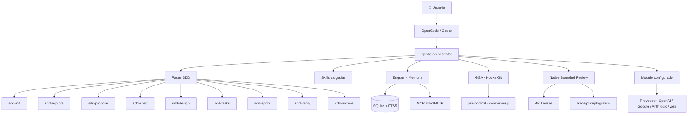

# Gentle AI — Mega Manual (Español)

El manual pedagógico, técnico e interactivo del ecosistema **Gentleman Programming**.

---

## 🎯 Propósito

Este repositorio contiene un curso completo, un manual de referencia y una aplicación web interactiva que enseña **qué es el ecosistema Gentle-AI, cómo funciona internamente, cómo configurarlo y cómo construir productos reales con él**.

No es una guía de comandos. Es un sistema de aprendizaje progresivo que lleva al lector desde "no sé nada de programación" hasta "puedo diseñar, construir, revisar y gobernar un producto con agentes de IA".

---

## 🧭 ¿Qué es Gentle-AI?

**Gentle-AI** es una capa de configuración, gobierno y herramientas que se instala sobre **OpenCode** (y próximamente **Codex**) para transformar un asistente de código genérico en un ecosistema estructurado de desarrollo con agentes.

Agrega:

| Capacidad | ¿Qué resuelve? |
|-----------|---------------|
| **SDD (Spec-Driven Development)** | Planificar antes de codificar, con fases, artefactos y verificación |
| **Engram** | Memoria persistente entre sesiones, con búsqueda y gobierno |
| **Skills** | Conocimiento especializado cargado según contexto |
| **GGA (Gentleman Guardian Angel)** | Hooks de Git que revisan código antes de cada commit |
| **Judgment Day** | Revisión adversarial ciega con dos jueces independientes |
| **Native Bounded Review** | Revisión determinística con presupuesto, linaje y receipt |
| **Model Routing** | Asignación de modelos por agente, fase y perfil de costo |
| **Personas** | Personalidades predefinidas para el orquestador |
| **Perfiles** | Configuraciones reutilizables (económico, equilibrado, potente) |

---

## 🗺️ Diagrama del ecosistema



---

## 🚀 Instalación y ejecución local

```bash
# Clonar el repositorio
git clone https://github.com/Gentleman-Programming/gentle-ai-mega-manual-es.git
cd gentle-ai-mega-manual-es

# Instalar dependencias
npm install

# Ejecutar en modo desarrollo
npm run dev

# Compilar versión estática
npm run build

# Previsualizar build
npm run preview
```

---

## 📚 Rutas de aprendizaje

| Soy... | Empieza por... |
|--------|---------------|
| 🟢 **Principiante total** | `content/00-empezar-aqui/` → fundamentos → primer proyecto |
| 🟡 **Ya sé programar** | `content/04-ecosistema-gentle/` → instalación → SDD |
| 🔵 **Uso OpenCode** | `content/12-opencode/` → configuración → modelos |
| 🟣 **Uso Codex** | `content/13-codex/` → perfiles → multiagente |
| 🟠 **Quiero entender Engram** | `content/09-engram/` → memoria → protocolo |
| 🔴 **Quiero configurar modelos** | `content/14-modelos-y-enrutamiento/` → catálogo → routing |
| ⚫ **Quiero construir un producto** | `content/18-construccion-de-productos/` → laboratorios |
| 🟤 **Quiero entender la arquitectura** | `content/16-arquitectura-tecnica/` → código fuente |
| ⚪ **Quiero contribuir** | `CONTRIBUTING.md` → `appendices/` |

---

## 📸 Snapshot de versiones

Ver [SOURCE_SNAPSHOT.md](SOURCE_SNAPSHOT.md) para las versiones congeladas usadas en esta edición del manual.

Ver [MODEL_CATALOG_SNAPSHOT.md](MODEL_CATALOG_SNAPSHOT.md) para el catálogo de modelos verificado.

---

## ⚠️ Funciones experimentales

Las funciones marcadas como **experimentales** o **beta** están señalizadas en todo el manual con este aviso:

> 🧪 **Experimental**: esta funcionalidad puede cambiar sin previo aviso. Verificada en Gentle-AI X.Y.Z, commit abc123.

---

## 🤝 Contribución

Ver [CONTRIBUTING.md](CONTRIBUTING.md).

Este manual sigue un proceso estructurado de contribución con:
- Snapshot de versiones
- Trazabilidad de fuentes
- Validación automática de enlaces, Mermaid, modelos y comandos

---

## 📄 Licencia

Ver [LICENSE](LICENSE).

---

## 🔗 Repositorios del ecosistema

| Repositorio | Propósito |
|------------|-----------|
| [gentle-ai](https://github.com/Gentleman-Programming/gentle-ai) | Orquestador, CLI, configuración, SDD |
| [engram](https://github.com/Gentleman-Programming/engram) | Memoria persistente |
| [gentleman-guardian-angel](https://github.com/Gentleman-Programming/gentleman-guardian-angel) | Hooks Git de revisión |
| [Gentleman-Skills](https://github.com/Gentleman-Programming/Gentleman-Skills) | Biblioteca de skills curadas |

---

*Manual en construcción activa. ¿Encontraste un error? ¿Querés contribuir? Abrí un issue o un PR.*
