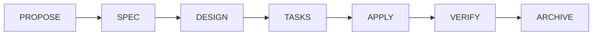

# Especificación de componentes pedagógicos

> **Versión**: 2026-07-20 | **Componentes**: 25 | **Implementación**: Fase 2 (Web)

---

## Propósito

Estos componentes Astro/MDX enriquecen el contenido Markdown con elementos visuales pedagógicos. Cada componente tiene un propósito didáctico claro: guiar, advertir, ejemplificar o profundizar.

**Principio**: Un solo documento Markdown por capítulo. Los componentes controlan la presentación, no el contenido.

---

## Catálogo de componentes

### 1. `<Definicion>`

**Propósito**: Destacar la definición formal de un término en su primera aparición.

```mdx
<Definicion term="Agente">
Un programa que usa un modelo de IA, tiene instrucciones, puede usar herramientas
y actúa por su cuenta para cumplir una tarea.
</Definicion>
```

**Visual**: Caja con borde izquierdo azul, badge "Definición", enlace al glosario.

---

### 2. `<Analogia>`

**Propósito**: Presentar una analogía como apoyo, seguida de la explicación técnica real.

```mdx
<Analogia titulo="El cuaderno de proyecto">
Engram se parece a un cuaderno de proyecto donde guardás decisiones importantes.
</Analogia>
```

**Visual**: Caja con borde punteado, ícono de bombilla, tipografía itálica. Siempre seguida del mecanismo técnico.

---

### 3. `<ExplicacionTecnica>`

**Propósito**: Explicar el mecanismo real detrás de un concepto o analogía.

```mdx
<ExplicacionTecnica>
Engram recibe llamadas MCP como mem_save, persiste observaciones estructuradas
en SQLite y usa FTS5 para búsquedas de texto completo.
</ExplicacionTecnica>
```

**Visual**: Caja con borde izquierdo gris oscuro, badge "Mecanismo técnico".

---

### 4. `<EjemploBasico>`

**Propósito**: Mostrar un ejemplo mínimo funcional.

```mdx
<EjemploBasico>
```bash
engram mem_save --project "mi-proyecto" --type "discovery" --content "Hoy aprendí X"
```
</EjemploBasico>
```

**Visual**: Caja con fondo sutil, badge "Ejemplo básico", código con syntax highlighting.

---

### 5. `<EjemploAvanzado>`

**Propósito**: Mostrar un ejemplo complejo con múltiples pasos o archivos.

```mdx
<EjemploAvanzado titulo="SDD completo con fallback de modelos">
...
</EjemploAvanzado>
```

**Visual**: Caja expandible (collapsible), badge "Ejemplo avanzado".

---

### 6. `<Advertencia>`

**Propósito**: Señalar un riesgo, limitación o consecuencia no obvia.

```mdx
<Advertencia>
Si cambiás el modelo de sdd-apply a uno sin tool calling, los tests fallarán
sin un mensaje claro. Verificá tool calling antes de asignar.
</Advertencia>
```

**Visual**: Caja amarilla, ícono ⚠️, borde naranja.

---

### 7. `<Peligro>`

**Propósito**: Señalar una acción que puede causar pérdida de datos, seguridad o costo.

```mdx
<Peligro>
Ejecutar `rm -rf ~/.config/opencode` elimina TODA tu configuración de OpenCode.
No tiene confirmación ni papelera.
</Peligro>
```

**Visual**: Caja roja, ícono 🛑, borde rojo oscuro.

---

### 8. `<Nota>`

**Propósito**: Información complementaria que no es crítica pero es útil.

```mdx
<Nota>
En Windows, los paths de configuración usan `%APPDATA%` en lugar de `~/.config`.
</Nota>
```

**Visual**: Caja gris claro, ícono ℹ️.

---

### 9. `<Consejo>`

**Propósito**: Recomendación práctica basada en experiencia.

```mdx
<Consejo>
Para sesiones largas de SDD, usá el perfil equilibrado. El perfil potente solo
se justifica en sdd-design y sdd-verify.
</Consejo>
```

**Visual**: Caja verde claro, ícono 💡.

---

### 10. `<ErrorFrecuente>`

**Propósito**: Documentar un error común y cómo evitarlo o corregirlo.

```mdx
<ErrorFrecuente
  problema="El comando dice 'engram not found' después de instalarlo"
  causa="El directorio de binarios no está en el PATH"
  solucion="Agregá `~/AppData/Local/engram/bin` al PATH de tu sistema"
/>
```

**Visual**: Caja con borde rojo, secciones colapsables: Problema / Causa / Solución.

---

### 11. `<ResultadoEsperado>`

**Propósito**: Mostrar qué output deberías ver si todo funciona.

```mdx
<ResultadoEsperado>
```text
✓ gentle-ai v2.1.10
✓ opencode v1.17.20
✓ engram v1.19.0
✓ git v2.55.0
```
</ResultadoEsperado>
```

**Visual**: Caja con fondo verde muy sutil, badge "Resultado esperado".

---

### 12. `<ComoVerificar>`

**Propósito**: Pasos concretos para confirmar que algo funciona.

```mdx
<ComoVerificar>
1. Ejecutá `gentle-ai doctor`
2. Confirmá que todos los checks muestren ✓
3. Si algún check muestra ✗, leé la sección de errores frecuentes
</ComoVerificar>
```

**Visual**: Lista numerada con ícono ✓ verde por paso.

---

### 13. `<ComoRevertir>`

**Propósito**: Pasos para deshacer una acción o volver a un estado seguro.

```mdx
<ComoRevertir>
```bash
git checkout -- .gentle-ai/config.yml   # Restaurar configuración
gentle-ai sync                           # Re-sincronizar desde remoto
```
</ComoRevertir>
```

**Visual**: Caja con borde naranja, badge "Reversión".

---

### 14. `<Ejercicio>`

**Propósito**: Una tarea práctica para reforzar el aprendizaje.

```mdx
<Ejercicio
  titulo="Creá tu primer memoria en Engram"
  tiempo="5 minutos"
  dificultad="fácil"
>
1. Abrí una terminal en tu proyecto
2. Ejecutá `mem_save` con un discovery sobre algo que hayas aprendido
3. Verificá que `mem_search` lo encuentre
4. ¿Qué `topic_key` usaste? ¿Por qué?
</Ejercicio>
```

**Visual**: Caja con borde azul, header con título/tiempo/dificultad, checklist.

---

### 15. `<Pregunta>`

**Propósito**: Pregunta de autoevaluación o reflexión.

```mdx
<Pregunta>
¿Por qué Judgment Day usa dos jueces independientes en lugar de uno solo?
</Pregunta>

<details>
<summary>Respuesta</summary>
Para reducir errores correlacionados. Si ambos jueces usan el mismo modelo
y proveedor, pueden compartir los mismos sesgos y puntos ciegos.
</details>
```

**Visual**: Caja con ícono ❓, respuesta colapsable.

---

### 16. `<Fuente>`

**Propósito**: Citar la fuente verificada de una afirmación.

```mdx
<Fuente
  repositorio="gentle-ai"
  commit="b0a88fa"
  archivo="internal/app/help.go"
  fecha="2026-07-20"
/>
```

**Visual**: Línea compacta al pie, enlace al snapshot.

---

### 17. `<Experimental>`

**Propósito**: Marcar una funcionalidad como experimental, beta o preview.

```mdx
<Experimental version="1.20.0" componente="Engram Autosync">
Esta funcionalidad puede cambiar sin previo aviso. Verificada en engram v1.20.0,
commit 763a6ba.
</Experimental>
```

**Visual**: Badge naranja "🧪 Experimental", texto explicativo.

---

### 18. `<DiferenciaVersion>`

**Propósito**: Documentar un cambio de comportamiento entre versiones.

```mdx
<DiferenciaVersion
  desde="1.19.0"
  hasta="1.20.0"
  componente="Engram"
>
En v1.19.0, `mem_save` no incluía `capture_prompt`. En v1.20.0,
este campo controla si se captura el prompt del usuario automáticamente.
</DiferenciaVersion>
```

**Visual**: Caja con dos columnas (antes/después), badge de versión.

---

### 19. `<CasoOpenCode>`

**Propósito**: Mostrar un ejemplo o comportamiento específico de OpenCode.

```mdx
<CasoOpenCode>
En OpenCode, los modelos se configuran en `opencode.json` bajo `agents.<nombre>.model`.
Usá `opencode models` para ver el catálogo actual.
</CasoOpenCode>
```

**Visual**: Caja con logo de OpenCode, borde morado.

---

### 20. `<CasoCodex>`

**Propósito**: Mostrar un ejemplo o comportamiento específico de Codex.

```mdx
<CasoCodex>
En Codex, los modelos se configuran en `config.toml` bajo `[model]`.
El reasoning effort usa valores `low`/`medium`/`high`.
</CasoCodex>
```

**Visual**: Caja con logo de Codex, borde verde.

---

### 21. `<CasoTerminal>`

**Propósito**: Mostrar una sesión de terminal completa con prompt y output.

```mdx
<CasoTerminal>
```ansi
$ gentle-ai doctor
✓ gentle-ai v2.1.10
✓ opencode v1.17.20
✓ engram v1.19.0
✓ git v2.55.0
```
</CasoTerminal>
```

**Visual**: Caja estilo terminal (fondo oscuro, texto mono), prompt `$`.

---

### 22. `<RecomendacionModelo>`

**Propósito**: Recomendar un modelo para una tarea o agente específico.

```mdx
<RecomendacionModelo
  agente="sdd-apply"
  tarea="Implementación de código"
  riesgo="medio"
>
| Proveedor | Modelo | Razonamiento |
|-----------|--------|-------------|
| OpenAI | gpt-5.6-terra | medium |
| Google | gemini-3.5-flash | medium |
| Anthropic | claude-sonnet-5 | medium |
</RecomendacionModelo>
```

**Visual**: Tabla con badge de riesgo, enlace al catálogo completo.

---

### 23. `<AlternativaEconomica>`

**Propósito**: Sugerir una alternativa más barata al modelo recomendado.

```mdx
<AlternativaEconomica>
Si el costo de `gpt-5.6-terra` es alto para tu uso, probá `deepseek-v4-pro`
en OpenCode Go. Perdés algo de velocidad pero el costo es significativamente menor.
</AlternativaEconomica>
```

**Visual**: Caja verde claro, ícono 💰.

---

### 24. `<EscalamientoModelo>`

**Propósito**: Documentar la cadena de escalamiento para un agente.

```mdx
<EscalamientoModelo agente="sdd-design">
1. `gpt-5.6-terra` (medium) — intento inicial
2. `gpt-5.6-sol` (high) — si el diseño es incorrecto o incompleto
3. `claude-opus-4.8` (xhigh) — si la decisión es crítica para seguridad
</EscalamientoModelo>
```

**Visual**: Lista numerada con flechas de escalamiento, badges de razonamiento.

---

### 25. `<Diagrama>`

**Propósito**: Insertar un diagrama Mermaid con caption y fuente.

```mdx
<Diagrama titulo="Ciclo SDD" fuente="gentle-ai v2.1.10, AGENTS.md">

</Diagrama>
```

**Visual**: Diagrama Mermaid renderizado, caption abajo, badge de fuente.

---

## Estados visuales comunes

Todos los componentes comparten:

| Estado | Comportamiento |
|--------|---------------|
| **Modo claro** | Colores adaptados al tema claro de Starlight |
| **Modo oscuro** | Colores adaptados al tema oscuro de Starlight |
| **Mobile** | Cajas full-width, tipografía ajustada |
| **Impresión** | Bordes visibles, fondos simplificados |
| **Sin JS** | Contenido siempre visible (colapsables usan `<details>`) |

---

## Implementación

- **Fase 2 (Web)**: Crear los componentes como `.astro` en `src/components/pedagogicos/`
- **Registro MDX**: Registrar en `astro.config.mjs` para uso directo en MDX sin imports
- **CSS**: Usar variables CSS de Starlight para coherencia visual

---

*Especificación alineada con la sección 10 de la misión (Componentes pedagógicos) y ADR-009 (Modos de lectura).*
