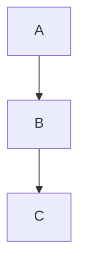

# ADR-003: Diagramas Mermaid

## Estado

Aceptado

## Contexto

El manual requiere diagramas para explicar arquitectura, flujos y relaciones entre componentes.

## Decisión

Usar Mermaid para todos los diagramas basados en texto.

Mermaid permite:
- Diagramas de flujo (`graph`)
- Diagramas de secuencia (`sequenceDiagram`)
- Diagramas de clases (`classDiagram`)
- Diagramas de Gantt
- Diagramas de entidad-relación (`erDiagram`)
- Diagramas de estado (`stateDiagram-v2`)

Los diagramas se incluyen como bloques de código en Markdown:

Durante cada build de Astro, `rehype-mermaid` transforma esos bloques en SVG inline mediante la estrategia `inline-svg`. El proceso usa Playwright, por lo que Chromium debe estar instalado en el entorno de build.

## Validación

Todos los diagramas Mermaid deben validarse con:

- `npm run check-mermaid` — usa el parser oficial de Mermaid para verificar la sintaxis fuente.
- `npm run build` — genera los SVG inline con `rehype-mermaid`.
- `npm run check-site` — comprueba en el sitio generado que existe salida Mermaid en SVG y que no sobreviven bloques `language-mermaid` sin renderizar.

## Consecuencias

- Los diagramas viajan con el contenido Markdown
- La salida publicada contiene SVG inline y no depende de JavaScript de Mermaid en el navegador
- Playwright Chromium es un requisito del entorno de build
- Sin dependencia de herramientas gráficas externas
- Sin imágenes binarias en el repositorio
- Mermaid tiene limitaciones en diagramas muy complejos (>50 nodos)

## Referencias

- https://mermaid.js.org/
- https://starlight.astro.build/
