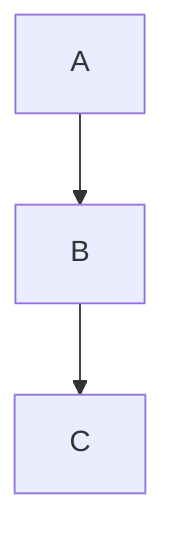

# ADR-003: Diagramas Mermaid

## Estado

Aceptado

## Contexto

El manual requiere diagramas para explicar arquitectura, flujos y relaciones entre componentes.

## Decisión

Usar Mermaid para todos los diagramas basados en texto.

Mermaid permite:
- Diagramas de flujo (`graph`)
- Diagramas de secuencia (`sequenceDiagram`)
- Diagramas de clases (`classDiagram`)
- Diagramas de Gantt
- Diagramas de entidad-relación (`erDiagram`)
- Diagramas de estado (`stateDiagram-v2`)

Los diagramas se incluyen como bloques de código en Markdown:

## Validación

Todos los diagramas Mermaid deben validarse con:
- `npm run check-mermaid` — script que parsea y verifica sintaxis
- Build de Starlight (Mermaid plugin nativo)

## Consecuencias

- Los diagramas viajan con el contenido Markdown
- Sin dependencia de herramientas gráficas externas
- Sin imágenes binarias en el repositorio
- Mermaid tiene limitaciones en diagramas muy complejos (>50 nodos)
- Algunos navegadores antiguos pueden no renderizar correctamente

## Referencias

- https://mermaid.js.org/
- https://starlight.astro.build/
