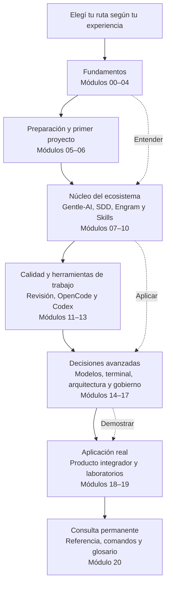

## ¿Qué es este manual?

Este manual es un **curso técnico y práctico en español** para aprender a trabajar con el ecosistema **Gentleman Programming** de forma progresiva, desde los fundamentos hasta la construcción y el gobierno de productos de software asistidos por agentes de inteligencia artificial.

No está diseñado para que memorices una colección de comandos. Su objetivo es que puedas responder cinco preguntas frente a cada herramienta o proceso:

1. **Qué es** y qué problema resuelve.
2. **Por qué existe** y cuándo aporta valor.
3. **Cómo se utiliza** en un proyecto real.
4. **Cómo funciona internamente** y qué componentes participan.
5. **Cómo verificar** que el resultado es correcto y diagnosticarlo cuando falla.

El recorrido combina fundamentos tecnológicos, Git y GitHub, conceptos de IA, instalación, Gentle-AI, SDD, Engram, Skills, revisión de código, configuración de OpenCode y Codex, selección de modelos, seguridad, costos, arquitectura y laboratorios prácticos.

Cada concepto se presenta por capas: primero construís un **modelo mental sencillo**, luego lo aplicás con ejemplos y comandos, y finalmente podés profundizar en su arquitectura, riesgos y decisiones técnicas. De esta manera, una persona principiante puede avanzar sin quedar bloqueada por la jerga, mientras un lector avanzado puede ir directamente a las secciones de mayor profundidad.

El contenido se vincula con versiones, commits, código fuente y fuentes verificadas. Aun así, este ecosistema evoluciona rápidamente: cuando una función depende de una versión, es experimental o todavía necesita validación, el manual debe indicarlo expresamente.

La meta final no es solo que puedas ejecutar Gentle-AI, sino que entiendas **qué está ocurriendo, qué decisión está tomando cada componente y cuándo corresponde intervenir como responsable del producto o del código**.

### Cómo avanza el curso



El curso no obliga a todas las personas a recorrer cada módulo en el mismo orden. Las rutas recomendadas permiten omitir conocimientos que ya dominás y concentrarte en el resultado que necesitás: aprender desde cero, configurar el ecosistema, optimizar agentes y modelos, comprender su arquitectura o construir un producto completo.

## ¿Para quién es?

Este manual tiene **tres perfiles de lector** y cada uno debería poder encontrar lo que necesita:

### 🟢 Perfil 1: Principiante

Nunca programaste, o recién empezás. No sabés qué es Git, una terminal, o un modelo de IA.

**Tu ruta**: `00 → 01 → 02 → 03 → 04 → 05 → 06 → 15`

El manual te enseña cada concepto desde cero, sin asumir que ya sabés algo. Cada término técnico se define la primera vez que aparece y se enlaza al glosario.

### 🟡 Perfil 2: Programador con experiencia

Ya sabés programar, usás Git, entendés lo básico de IA. Querés configurar Gentle-AI y empezar a usarlo.

**Tu ruta**: `03 → 04 → 05 → 06 → 07 → 08 → 09 → 10`

Saltás los fundamentos y vas directo a la configuración y uso del ecosistema.

### 🔵 Perfil 3: Arquitecto o power user

Ya usaste Gentle-AI y querés entender cómo funciona por dentro, optimizar modelos, diseñar fallbacks, o contribuir al código.

**Tu ruta**: `04 → 07 → 08 → 09 → 11 → 14 → 16 → 17`

Vas directo a los capítulos de profundidad técnica.

## Cómo usar este manual

### Niveles de lectura

Cada capítulo tiene un **nivel** indicado en el frontmatter:

| Dificultad | Significado | ¿Para quién? |
|------------|-------------|-------------|
| **1** | Conceptos básicos, definiciones, analogías | Principiantes |
| **2** | Uso práctico, comandos, configuraciones | Usuarios intermedios |
| **3** | Arquitectura, código, protocolos, riesgos | Avanzados |

Un capítulo de nivel 2 asume que entendés los conceptos del nivel 1, pero siempre podés consultar el glosario si un término no te suena.

### Los 3 niveles de explicación

Dentro de cada capítulo, los conceptos se explican en tres niveles progresivos:

1. **Visión simple**: qué es, para qué sirve, qué problema resuelve. Sin jerga técnica.
2. **Uso práctico**: cómo se utiliza, qué comando ejecutar, qué resultado esperar.
3. **Profundidad técnica**: cómo funciona internamente, qué componentes participan, qué código lo implementa.

Podés leer solo el nivel 1 para formarte una idea general, o los tres niveles para entender el mecanismo completo.

### Estructura del manual

```text
Módulo 00 → Empezar aquí (este capítulo)
Módulo 01 → Fundamentos tecnológicos (computadoras, terminal, programación)
Módulo 02 → Git y GitHub (control de versiones desde cero)
Módulo 03 → Fundamentos de IA (modelos, agentes, MCP, tokens)
Módulo 04 → Ecosistema Gentle (el mapa completo)
Módulo 05 → Instalación (cómo instalar todo)
Módulo 06 → Primer proyecto (tu primera app con SDD)
Módulo 07 → Gentle-AI (el orquestador en profundidad)
Módulo 08 → SDD (desarrollo guiado por especificaciones)
Módulo 09 → Engram (memoria persistente)
Módulo 10 → Skills (conocimiento especializado)
Módulo 11 → Calidad y revisión (GGA, Native Review, Judgment Day)
Módulo 12 → OpenCode (configuración avanzada)
Módulo 13 → Codex (Codex CLI y multiagente)
Módulo 14 → Modelos y enrutamiento (selección, costos, fallbacks)
Módulo 15 → Terminal (CLI vs TUI, shells, pipes)
Módulo 16 → Arquitectura técnica (código fuente del ecosistema)
Módulo 17 → Seguridad, costos y gobierno
Módulo 18 → Construcción de productos (ciclo completo)
Módulo 19 → Laboratorios (ejercicios prácticos)
Módulo 20 → Referencia (comandos, glosario, catálogo)
```

### Navegación

- **Barra lateral izquierda**: todos los módulos y capítulos en orden
- **Tabla de contenidos derecha**: secciones dentro del capítulo actual
- **Breadcrumbs**: rastro de migas para saber dónde estás
- **Anterior / Siguiente**: botones al final de cada capítulo
- **Buscador**: buscá cualquier término o concepto

### Glosario

Cada término técnico está definido en el archivo `GLOSSARY.md` (raíz del repositorio). La primera vez que aparece un término en un capítulo, se explica en el texto. Pero si más adelante no recordás qué significa "topic_key" o "linaje", el glosario está a un clic.

### Verificación de versiones

La tecnología cambia rápido. Los modelos de IA se deprecan, los comandos cambian, las versiones avanzan.

Cada capítulo incluye al final:

```markdown
## Fuentes verificadas
- Repositorio: gentle-ai, commit b0a88faf1296...
- Versión: gentle-ai 2.1.10
- Fecha: 2026-07-20
- Estado: 🟢 Verificado
```

El **estado** te dice si la información fue verificada contra el código real (`🟢 Verificado`), contra documentación (`🟡 Documentado`), o está pendiente (`🔴 PENDIENTE`).

Si encontrás algo que no coincide con tu versión, consultá el archivo `appendices/MIGRATIONS-AND-LEGACY.md` para ver cambios documentados entre versiones.

## Lo que NO es este manual

- **No es un reemplazo de la documentación oficial** de OpenCode, Codex, o cualquier proveedor. Es un complemento que organiza y relaciona esa información.
- **No es un curso de programación general**. Te enseñamos los fundamentos necesarios para entender el ecosistema, pero si querés aprender Python o React en profundidad, necesitás otros recursos.
- **No es un prompt library**. No vas a encontrar "los 10 mejores prompts para X". Vas a entender cómo funcionan los agentes para que puedas diseñar tus propias instrucciones.
- **No es infalible**. La información se verifica contra código real, pero los errores existen. Si encontrás uno, abrí un issue o un PR.

## Requisitos para empezar

Para seguir este manual, necesitás:

- Una computadora con Windows, macOS o Linux
- Conexión a internet (para instalar herramientas y acceder a modelos)
- Una cuenta de GitHub (gratuita)
- Ganas de aprender (no es chiste — algunos capítulos son densos)

No necesitás:
- Saber programar (empezamos desde cero)
- Tener una GPU o hardware especial
- Pagar por herramientas (todo tiene versión gratuita)
- Ser experto en matemáticas o IA

## Empecemos

Elegí tu ruta en el archivo `INDEX.md` (raíz del repositorio) y empezá por el primer módulo de tu nivel.

Si no sabés por dónde empezar, la ruta segura es: **00 → 01 → 02 → 03 → 04**. Son los fundamentos que todo el mundo necesita, sin importar el nivel.

---

> **Siguiente**: [Módulo 01 — Fundamentos tecnológicos](../../01-fundamentos-tecnologicos/01-como-funciona-una-computadora/)
