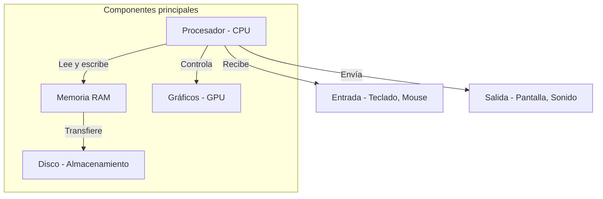

# Cómo funciona una computadora

## Qué aprenderás

Antes de hablar de agentes de IA, modelos y herramientas de programación, necesitás entender el terreno donde todo eso vive: **la computadora**.

En este capítulo vas a aprender qué es realmente una computadora, de qué partes está hecha y cómo trabajan juntas para ejecutar programas.

No necesitás saber nada de antemano. Empezamos desde la idea más básica.

## Por qué importa

Cuando instalás Gentle-AI, Engram o cualquier herramienta del ecosistema, estás poniendo programas en tu computadora. Esos programas van a crear procesos, leer y escribir archivos, usar memoria, y comunicarse entre sí.

Si no entendés qué es un proceso, un archivo o la memoria, no vas a poder diagnosticar por qué algo falla. Y en el mundo del desarrollo con IA, las cosas fallan seguido.

## Visión simple

Una computadora es una máquina que hace cuatro cosas:

1. **Recibe** información (teclado, mouse, internet)
2. **Procesa** esa información (hace cálculos, toma decisiones)
3. **Guarda** resultados (en disco, en la nube)
4. **Muestra** resultados (en pantalla, por parlantes)

Esas cuatro operaciones las hacen dos tipos de componentes:

- **Hardware**: las partes físicas que podés tocar (procesador, memoria, disco, pantalla)
- **Software**: las instrucciones que le dicen al hardware qué hacer (programas, sistema operativo)

## Hardware: las partes físicas



### Procesador (CPU)

Es el "cerebro" de la computadora. Ejecuta instrucciones, una por una, a una velocidad de miles de millones por segundo (GHz = gigahertz = mil millones de operaciones por segundo).

Cada instrucción es muy simple: "sumá estos dos números", "compará si este valor es mayor que este otro", "leé el próximo byte del archivo". La magia está en que puede hacer millones de estas por segundo.

### Memoria RAM

Es la "mesa de trabajo" del procesador. Cuando abrís un programa, se carga desde el disco a la RAM. La RAM es:

- **Rápida**: el procesador puede leer y escribir en nanosegundos
- **Volátil**: cuando apagás la computadora, todo lo que estaba en RAM se pierde
- **Limitada**: tu computadora tiene una cantidad fija (8 GB, 16 GB, 32 GB)

Cuando un programa usa más RAM de la disponible, la computadora se vuelve lenta porque empieza a usar el disco como "RAM falsa" (swap), y el disco es mucho más lento.

### Disco (SSD o HDD)

Es el "archivo" de la computadora. Guarda información de forma permanente. Cuando apagás la computadora, los datos en disco no se pierden.

Hay dos tipos:
- **HDD** (disco duro): mecánico, más lento, más barato, mayor capacidad
- **SSD** (disco sólido): electrónico, mucho más rápido, más caro

Hoy en día casi todo usa SSD. La diferencia de velocidad es enorme: un SSD puede ser 100 veces más rápido que un HDD.

### Gráficos (GPU)

Procesa imágenes y video. Originalmente solo para juegos, hoy es fundamental para inteligencia artificial porque puede hacer miles de cálculos en paralelo, mientras que la CPU los hace de a uno.

No necesitás una GPU cara para usar Gentle-AI. Los modelos de IA corren en servidores remotos (la nube), no en tu computadora.

## Software: las instrucciones

### Sistema operativo

El sistema operativo es el programa más importante de tu computadora. Es el intermediario entre vos y el hardware.

Sus trabajos principales:

1. **Administrar recursos**: decide qué programa usa el procesador, cuánta memoria recibe, qué archivos puede leer
2. **Proveer una interfaz**: te permite interactuar con la computadora (ventanas, íconos, línea de comandos)
3. **Aislar programas**: evita que un programa interfiera con otro
4. **Manejar archivos**: organiza los datos en carpetas y archivos

Los sistemas operativos más comunes:
- **Windows**: el que probablemente estás usando
- **macOS**: el de las computadoras Apple
- **Linux**: gratuito, de código abierto, muy usado en servidores

### ¿Qué es un programa?

Un programa es un archivo que contiene instrucciones que el procesador puede ejecutar. Cuando hacés doble clic en un ícono, el sistema operativo:

1. Lee el archivo del programa desde el disco
2. Lo carga en la memoria RAM
3. Le dice al procesador: "empezá a ejecutar desde la primera instrucción"

Eso es lo que llamamos un **proceso**: un programa en ejecución.

### Procesos

Cuando abrís un programa, se crea un **proceso**. Un proceso tiene:

- **Un ID único**: un número que lo identifica
- **Memoria asignada**: una porción de RAM que solo él puede usar
- **Archivos abiertos**: qué archivos está leyendo o escribiendo
- **Un estado**: ejecutándose, esperando, dormido, terminado

Podés ver los procesos de tu computadora en:
- Windows: `Ctrl+Shift+Esc` → Administrador de tareas
- macOS: `Cmd+Espacio` → "Monitor de Actividad"
- Linux: comando `ps aux` o `htop` en la terminal

### Archivos y carpetas

Un **archivo** es una colección de datos guardados en disco con un nombre. Por ejemplo:

- `foto.jpg`: una imagen
- `documento.pdf`: un PDF
- `programa.exe`: un programa ejecutable
- `datos.json`: datos estructurados

Una **carpeta** (o directorio) es un contenedor que organiza archivos:

```
C:\
├── Users\
│   └── harry\
│       ├── Documentos\
│       │   └── proyecto\
│       │       └── main.js
│       └── Descargas\
└── Windows\
```

La ruta `C:\Users\harry\Documentos\proyecto\main.js` te dice exactamente dónde está ese archivo, navegando desde la raíz del disco `C:`.

### Variables de entorno

Son valores que el sistema operativo guarda y que los programas pueden leer. Funcionan como "configuración global".

Por ejemplo, la variable `PATH` contiene una lista de carpetas donde el sistema busca programas ejecutables. Cuando escribís `gentle-ai` en la terminal, el sistema busca en cada carpeta del `PATH` hasta encontrar `gentle-ai.exe`.

Otras variables útiles:
- `HOME` o `USERPROFILE`: tu carpeta personal
- `TEMP`: carpeta para archivos temporales
- `LANG`: idioma del sistema

En Windows podés verlas con: `Get-ChildItem Env:` (PowerShell)
En macOS/Linux: `env` o `echo $HOME`

## Cómo funciona todo junto

Cuando abrís Visual Studio Code (o cualquier editor de código):

1. El sistema operativo lee `Code.exe` del disco
2. Lo carga en RAM como un proceso nuevo
3. Le asigna un ID de proceso y memoria
4. El proceso muestra una ventana en pantalla
5. Cuando escribís código, el proceso guarda los cambios en disco
6. Cuando cerrás el editor, el proceso termina y libera la memoria

Cuando abrís Gentle-AI desde la terminal:

1. Escribís `gentle-ai` y presionás Enter
2. El sistema busca `gentle-ai.exe` en las carpetas del `PATH`
3. Lo encuentra en `C:\Users\harry\AppData\Local\gentle-ai\bin\`
4. Crea un proceso nuevo
5. Ese proceso abre una interfaz visual (TUI) en la terminal
6. Cuando seleccionás componentes, el proceso modifica archivos de configuración en `~\.config\opencode\`

## Resumen

| Concepto | ¿Qué es? | ¿Dónde vive? |
|----------|---------|-------------|
| Hardware | Partes físicas | La computadora |
| Software | Instrucciones | Archivos en disco |
| Sistema operativo | Administrador de recursos | Arranca al prender |
| Proceso | Programa en ejecución | RAM |
| Archivo | Datos con nombre | Disco |
| Carpeta | Contenedor de archivos | Disco |
| PATH | Dónde buscar programas | Variable de entorno |

## Preguntas

1. ¿Cuál es la diferencia entre RAM y disco?
2. ¿Qué hace el sistema operativo?
3. ¿Cómo encuentra tu computadora el programa `gentle-ai` cuando lo ejecutás?
4. ¿Qué información tiene un proceso?
5. ¿Por qué las variables de entorno son útiles?

## Ejercicio

1. Abrí el administrador de tareas de tu sistema y observá los procesos en ejecución
2. Buscá dónde está instalado `node` en tu sistema: en PowerShell escribí `where.exe node`
3. Mirá las variables de entorno: en PowerShell escribí `Get-ChildItem Env: | Select-Object Name`

## Fuentes verificadas

- Sistema operativo: Windows 10/11 (win32), PowerShell 5.1
- Fecha: 2026-07-20
- Estado: 🟢 Verificado (conocimiento fundamental, no depende de versión específica)
