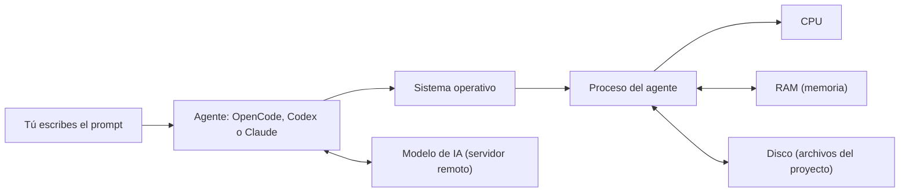

# Cómo funciona una computadora

## Propósito

Esta lección asume que ya sabes qué es una computadora y que la usas todos los días. No vamos a explicar qué es un programa ni cómo se escribe: eso viene en la lección de programación.

Aquí vas a conocer los componentes que intervienen cuando trabajas con agentes de IA como OpenCode, Codex o Claude. Cuando le pides algo a un agente, en tu computadora se ponen en marcha la memoria, el disco, el sistema operativo, los archivos de tu proyecto y varios programas en ejecución. Entender ese terreno te ayuda a usar los agentes con confianza y a diagnosticar qué falla cuando algo no funciona.

## Respuesta simple

Cuando usas un agente de IA, tu computadora es el escenario donde ocurre todo: el agente es un programa que corre en tu computadora, lee y escribe archivos de tu disco, usa la memoria para trabajar y, cuando necesita pensar, consulta al modelo de IA por internet.

Cuatro piezas hacen posible ese recorrido: la memoria RAM, donde se trabaja con lo que está en uso; el disco, donde se guarda todo de forma permanente; el sistema operativo, que administra los programas y los archivos; y los procesos, que son los programas ya en ejecución. A eso se suman las carpetas y archivos donde vive tu trabajo, y las herramientas donde el agente se apoya, como el IDE y la terminal.

## Analogía: tu computadora como una oficina

Imagina tu computadora como una oficina con tres muebles.

- El **escritorio** es la memoria RAM: sobre él trabajas con lo que tienes a la mano. Si el escritorio se llena, tienes que guardar cosas para seguir, y al apagar la luz, todo lo que quedó sobre el escritorio se pierde.
- El **archivador** es el disco: allí guardas documentos de forma permanente. Puedes apagar la oficina y los documentos siguen en su lugar.
- La persona que **procesa** el trabajo es el procesador (CPU): toma documentos del escritorio, los lee, los modifica y los devuelve al archivador.

Esta analogía tiene un límite: en una oficina el trabajo avanza a ritmo humano, mientras que una computadora ejecuta miles de millones de operaciones por segundo. Tampoco refleja la estricta disciplina con que el sistema operativo reparte la atención entre todos los programas: si un programa falla, no puede llevarse puesta la memoria de los demás.

## Ejemplo continuo: Camila y su informe

Camila trabaja en administración: organiza documentos, prepara informes y lleva los cronogramas de su equipo. No programa, usa Windows y su día transcurre entre Word, Excel, Outlook y el navegador.

Su tarea de hoy: convertir varias notas dispersas en un informe ordenado. En lugar de armarlo sola, abre OpenCode y le pide al agente que reúna las notas, las ordene por tema y le deje un borrador listo. Lo que pasa después en su computadora es el hilo conductor de esta lección: el agente tendrá que leer archivos del disco, trabajar con la memoria, apoyarse en el sistema operativo y, al final, guardar un archivo nuevo con el informe.

## Explicación progresiva

### Memoria, disco y procesador: los tres que trabajan

Empecemos por los tres componentes que participan en cada tarea, incluida la de Camila.

La **CPU (procesador)**\* es el componente que ejecuta las instrucciones de los programas. Cuando el agente ordena las notas de Camila, es la CPU la que va avanzando esas instrucciones una por una. La velocidad de la CPU se mide en gigahertz (GHz): una frecuencia de reloj de un gigahertz significa mil millones de ciclos por segundo. Cuántas operaciones logra en cada ciclo depende del diseño de la CPU y de la tarea, así que el GHz sirve como referencia de potencia, no como una equivalencia directa de velocidad.

La **RAM (memoria)**\* es la mesa de trabajo: guarda, de forma temporal, lo que los programas están usando en este momento. Cuando el agente abre las notas de Camila, las carga desde el disco a la RAM para trabajar con ellas. La RAM es rápida, pero volátil: si la computadora se apaga, todo lo que estaba en la RAM se pierde. Por eso, si tu equipo se pone lento cuando hay muchos programas abiertos, lo más probable es que la RAM esté al límite.

El **Disco (almacenamiento)**\* es el archivador permanente: allí se guardan los programas, los documentos y los archivos de tus proyectos, y todo sigue ahí aunque apagues la computadora. Hoy los discos son casi siempre SSD, que son mucho más rápidos que los discos mecánicos (HDD) de antes. Cuando el agente de Camila guarda el informe, lo escribe en el disco.

La diferencia clave entre RAM y disco es el tiempo: la RAM es rápida y temporal, el disco es lento y permanente. Cada vez que un programa necesita algo del disco, lo copia primero a la RAM.

### La GPU: cuándo importa de verdad

La **GPU (tarjeta gráfica)**\* es un componente especializado en hacer muchas operaciones en paralelo. Nació para dibujar imágenes y video, y por eso es la estrella de los juegos y de la edición de video.

Quizá escuchaste que la IA necesita GPUs potentes, y es cierto para los servidores que entrenan y ejecutan los modelos. Cuando usas un agente, los modelos suelen correr en servidores remotos, no en tu computadora, así que en el caso habitual no necesitas una GPU cara para trabajar con OpenCode, Codex o Claude: una computadora común alcanza. Existe también la opción de usar proveedores locales (por ejemplo, Ollama o llama.cpp), donde el modelo corre en tu propia máquina y puede aprovechar la GPU local; ese caso se explica en la lección de modelos y proveedores. En el uso cotidiano, la GPU local solo se ocupa de dibujar la interfaz que ves en pantalla.

### El sistema operativo: el encargado

El **Sistema operativo**\* es el programa base que administra todos los recursos de la computadora: decide qué programa usa la CPU, cuánta RAM recibe cada uno y qué archivos puede leer. También organiza los archivos en carpetas y aísla los programas entre sí para que uno no interfiera con otro.

Los tres sistemas operativos principales son Windows, macOS y Linux. El mismo agente, como OpenCode o Codex, puede correr en los tres; lo que cambia son los detalles, como la forma de abrir la terminal o el lugar donde se guardan las configuraciones. Esas diferencias las verás en la próxima lección, cuando trabajemos con la terminal.

### Archivos y carpetas: dónde vive tu trabajo

Un **Archivo**\* es una unidad de datos guardada en el disco con un nombre: un documento, una imagen, un informe. Una **Carpeta (directorio)**\* es un contenedor que organiza archivos y otras carpetas dentro del disco.

Los archivos de Camila podrían verse así:

```
C:\Users\Camila\Documentos\Informes\
├── notas-reunion.txt
├── datos-ventas.csv
└── borrador-final.txt
```

La ruta `C:\Users\Camila\Documentos\Informes\notas-reunion.txt` indica exactamente dónde vive ese archivo, desde la raíz del disco hasta el nombre. Cuando el agente de Camila dice "voy a leer tus notas", está abriendo archivos como este desde su carpeta real, no desde "dentro" de la aplicación.

### El IDE y la terminal: tus herramientas de trabajo

Para trabajar con agentes de IA se usan dos tipos de herramientas. El **IDE (entorno de desarrollo integrado)**, como Visual Studio Code, reúne en una sola aplicación el editor de archivos, una terminal y otras herramientas para programar y revisar proyectos. La **terminal** es una ventana donde se escriben comandos de texto; es la puerta de entrada a los programas de línea de comandos (CLI) y la estudiaremos a fondo en la próxima lección.

El agente no es un componente separado de tu computadora: es un programa que vive en estas herramientas. Cuando abres OpenCode, Codex o Claude, estás abriendo un programa más, como abrirías Word.

### Procesos: los programas en acción

Un **Proceso (informática)**\* es un programa en ejecución dentro del sistema operativo. Cuando Camila abre OpenCode, el sistema operativo lee el programa desde el disco, lo carga en la RAM y crea un proceso. Ese proceso tiene memoria asignada, archivos abiertos y un estado: está ejecutándose.

Cada vez que el agente ejecuta una herramienta —leer un archivo, buscar un texto, guardar un borrador—, también lo hace como proceso o dentro del proceso del agente. Todos esos procesos conviven en la misma computadora, y el sistema operativo reparte entre ellos la CPU y la RAM.

Puedes ver los procesos de tu sistema en el Administrador de tareas de Windows (Ctrl+Shift+Esc), en el Monitor de Actividad de macOS o con el comando `ps` en Linux.

## Aplicación práctica: el agente en tu computadora

Ahora une las piezas con el caso de Camila. Este diagrama muestra quién interviene cuando ella le pide algo al agente:


```mermaid
flowchart LR
    U["Tú escribes el prompt"] --> AG["Agente: OpenCode, Codex o Claude"]
    AG --> OS["Sistema operativo"]
    OS --> PR["Proceso del agente"]
    PR --> CPU["CPU"]
    PR <--> RAM["RAM (memoria)"]
    PR <--> DSK["Disco (archivos del proyecto)"]
    AG <--> MOD["Modelo de IA (servidor remoto)"]
```

Se lee de izquierda a derecha: tú escribes el pedido, el agente se convierte en un proceso administrado por el sistema operativo, la CPU ejecuta sus instrucciones, la RAM guarda el trabajo en curso y el disco aporta los archivos del proyecto. Cuando el agente necesita razonar, consulta al modelo de IA, que responde desde un servidor remoto a través de internet.

El recorrido completo del informe de Camila es este:

1. Camila abre OpenCode y escribe su pedido: "reúne estas notas y deja un borrador ordenado".
2. El sistema operativo crea el proceso del agente y le asigna RAM.
3. El agente usa una herramienta para leer las notas desde el disco: los archivos pasan del disco a la RAM.
4. La CPU procesa la tarea mientras el agente consulta al modelo por internet para ordenar y redactar.
5. El agente escribe el resultado en un archivo nuevo del disco, dentro de la carpeta del proyecto.

Si quieres comprobarlo con tus propios ojos, puedes ver los procesos que más CPU usan con este comando en PowerShell:

```powershell
Get-Process | Sort-Object CPU -Descending | Select-Object -First 5
```

Verás una tabla con los cinco procesos que más CPU están consumiendo. Entre ellos suele aparecer el proceso de tu navegador y, si tienes un agente abierto, el proceso de ese programa.

## Decisiones y límites

Esta lección marca el terreno, pero deja fuera varios temas a propósito:

- **Variables de entorno**: se explican en la lección de programación, donde encajan con la lógica de configuración de los programas.
- **La terminal a fondo**: qué es un shell, qué es un comando y cómo se abre en cada sistema se ve en la siguiente lección.
- **Cómo se escribe un programa**: compilar, interpretar y los lenguajes de programación son tema de la lección de programación.
- **Cliente, servidor y la nube**: dónde corren las aplicaciones y cómo se comunican se explica en la lección de frontend y backend.

También conviene conocer los límites de lo que aprendiste aquí. Si la RAM se llena, la computadora empieza a usar el disco como memoria de respaldo y todo se vuelve lento; por eso cerrar programas que no usas devuelve fluidez. Y recuerda que, en el caso habitual, el modelo de IA no vive en tu computadora: sin internet, tú puedes abrir y revisar tus archivos locales con normalidad, pero un agente que depende de un modelo remoto no puede seguir trabajando hasta que vuelva la conexión. La excepción son los proveedores locales (Ollama, llama.cpp y similares), donde el modelo corre en tu máquina y el agente puede responder sin conexión.

## Errores frecuentes

### El agente no responde y creo que mi computadora está haciendo todo el trabajo

- Qué observas: el agente se queda sin respuesta y piensas que la culpa es del hardware.
- Qué significa: el agente sí corre como proceso en tu computadora, pero el modelo responde desde un servidor remoto. Sin internet, no hay respuesta del modelo.
- Cómo comprobar: abre el Administrador de tareas y busca el proceso del agente: estará usando CPU y RAM.
- Cómo resolver: revisa tu conexión a internet antes de culpar a la computadora.
- Cómo confirmar: al restablecer la conexión, el agente vuelve a responder.

### Creo que necesito una GPU potente para usar agentes de IA

- Qué observas: ves promociones de "GPU para IA" y dudas si tu computadora alcanza.
- Qué significa: los modelos que usan los agentes corren en servidores remotos, no en tu GPU.
- Cómo comprobar: una computadora común, sin GPU dedicada, puede ejecutar OpenCode, Codex o Claude.
- Cómo resolver: no necesitas comprar hardware para empezar a trabajar con agentes.
- Cómo confirmar: el agente responde igual en una computadora con GPU modesta.

### No encuentro el archivo que el agente generó

- Qué observas: guardaste el trabajo, pero no ves el resultado "dentro" de la aplicación.
- Qué significa: los archivos viven en el disco, dentro de carpetas con una ruta; ninguna aplicación los "contiene".
- Cómo comprobar: abre el explorador de archivos y navega hasta la carpeta del proyecto.
- Cómo resolver: busca el archivo en la ruta que el agente te indicó al guardar.
- Cómo confirmar: puedes abrir el archivo desde su carpeta real y ver su contenido.

## Resumen

| Pieza | Qué hace | Dónde vive |
|---|---|---|
| CPU (procesador) | Ejecuta las instrucciones de los programas | En el equipo |
| RAM (memoria) | Mesa de trabajo rápida y temporal | En el equipo |
| Disco (almacenamiento) | Guarda datos de forma permanente | En el equipo |
| GPU (tarjeta gráfica) | Operaciones en paralelo para gráficos | En el equipo |
| Sistema operativo | Administra procesos, memoria y archivos | Se inicia al encender |
| Archivo y carpeta | Organizan el trabajo en el disco | En el disco |
| Proceso | Programa en ejecución | En la RAM |
| Agente de IA | Programa que corre en tu equipo y usa el modelo | En tu computadora |

Lo esencial para recordar: el agente corre en tu computadora como un proceso, trabaja sobre archivos reales del disco, y solo el modelo de IA vive fuera, en un servidor remoto.

## Términos de esta lección

- **CPU (procesador)**: componente que ejecuta las instrucciones de un programa.
- **GPU (tarjeta gráfica)**: componente optimizado para operaciones en paralelo, especialmente gráficos y algunas cargas de IA.
- **RAM (memoria)**: memoria rápida y temporal donde se guarda lo que está en uso.
- **Disco (almacenamiento)**: medio persistente donde se guardan los datos aunque la computadora esté apagada.
- **Sistema operativo**: programa base que administra los componentes y permite ejecutar otros programas.
- **Archivo**: unidad de datos almacenada en el disco con un nombre.
- **Carpeta (directorio)**: contenedor que organiza archivos y otras carpetas dentro del disco.
- **Proceso (informática)**: programa en ejecución dentro del sistema operativo, con su memoria y recursos asignados.

Las definiciones canónicas de todos los términos del manual están en el [glosario](../../20-referencia/02-glosario/).

## Para seguir aprendiendo

- [Khan Academy — Computación](https://es.khanacademy.org/computing): introducción visual y amable a la computación y la programación, en español y gratis.
- [freeCodeCamp](https://www.freecodecamp.org/espanol/): certificaciones gratuitas con ejercicios interactivos, con versión en español.

La próxima lección te lleva a la [terminal](../02-la-terminal/), donde aprenderás a escribir comandos y a llamar a los programas desde el teclado.
