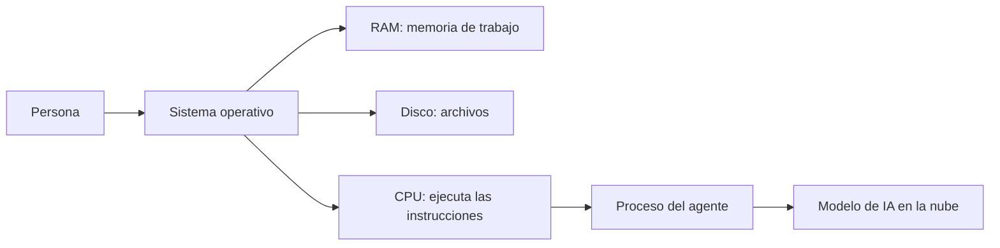

## Propósito

Antes de hablar de agentes de IA, modelos y herramientas de programación, conviene entender el terreno donde todo eso vive: la computadora. Cuando usas un agente en OpenCode, Codex o Claude Code, ese agente es un programa que tu computadora ejecuta: ocupa memoria, lee archivos y crea procesos. Si entiendes esas piezas, podrás explicar por qué algo falla, por qué una tarea es lenta o dónde se guarda la información que produce el agente.

## Respuesta simple

Una computadora es una máquina que recibe información, la procesa, la guarda y muestra resultados. Ese trabajo lo hacen dos tipos de componentes:

- El **hardware**: las partes físicas que puedes tocar, como el procesador, la memoria y el disco.
- El **software**: las instrucciones que le dicen al hardware qué hacer, como el sistema operativo y los programas.

Para usar agentes de IA, las piezas que más importan son la CPU, la memoria RAM, el disco, el sistema operativo, los archivos, la terminal, el editor de código y los procesos.

## Analogía

Imagina una oficina de administración. La CPU es la persona que resuelve los trámites: atiende uno por uno y con rapidez. La memoria RAM es el escritorio: ahí deja los papeles que está usando en este momento, y al final del día (al apagar la computadora) todo se tira. El disco es el archivero: guarda los documentos de forma permanente. El sistema operativo es la jefatura de la oficina: decide quién usa qué escritorio, qué trámite sigue y qué archivo se puede abrir.

La analogía tiene un límite: una computadora ejecuta millones de operaciones por segundo y el sistema operativo reparte esa capacidad entre muchos programas a la vez, algo que una oficina humana no puede hacer.

## Ejemplo continuo

Camila trabaja en administración y usa su computadora con Windows. Un día abre OpenCode para pedirle a un agente que organice una lista de facturas. Sin saberlo, al hacerlo está activando esta cadena: el sistema operativo carga el programa del agente en la memoria, crea un proceso para él, y le da CPU y memoria mientras trabaja. Cuando el agente lee una hoja de cálculo o guarda un informe, está usando el disco. Todo eso ocurre detrás de la ventana que Camila ve.

```mermaid
flowchart LR
    Persona[Persona] --> SO[Sistema operativo]
    SO --> RAM["RAM: memoria de trabajo"]
    SO --> DISK[Disco: archivos]
    SO --> CPU[CPU: ejecuta las instrucciones]
    CPU --> PROC[Proceso del agente]
    PROC --> CLOUD[Modelo de IA en la nube]
```

La persona abre el programa, el sistema operativo lo convierte en un proceso y ese proceso se comunica con el modelo de IA en la nube para responder las instrucciones de Camila.

## Las partes que importan

### CPU

La CPU (procesador) ejecuta las instrucciones de los programas. Es rápida, pero hace las cosas de a una a la vez. Si un proceso usa mucha CPU, los demás esperan su turno y la computadora se siente lenta.

### GPU

La GPU es un procesador especializado en cálculos paralelos. Nació para gráficos y videojuegos, y hoy también se usa para ejecutar modelos de IA. Para usar agentes no necesitas una GPU potente en tu computadora: los modelos suelen ejecutarse en servidores remotos, en la nube.

### RAM

La memoria RAM es el espacio de trabajo del procesador. Guarda lo que los programas están usando en este momento. Es rápida, pero volátil: al apagar la computadora se pierde todo lo que contenía. Cada programa abierto ocupa una parte de la RAM, y si la RAM se agota, la computadora empieza a usar el disco como respaldo y todo se vuelve lento.

### Disco (almacenamiento)

El disco guarda datos de forma permanente: el sistema operativo, los programas instalados y tus archivos. A diferencia de la RAM, la información del disco sobrevive al apagado. Hay discos mecánicos (HDD) y discos sólidos (SSD); los SSD son notablemente más rápidos, por eso las computadoras modernas los usan.

## El sistema operativo y los procesos

El sistema operativo es el software que administra los recursos de la computadora. Sus tareas principales son:

1. Cargar los programas en la memoria cuando la persona los abre.
2. Crear y administrar los procesos de cada programa.
3. Repartir la CPU y la memoria entre los procesos que están activos.
4. Organizar los archivos en el disco.
5. Aislar un programa de otro para que un fallo no afecte a todo el sistema.

Cuando Camila abre OpenCode, el sistema operativo carga y administra el proceso del agente: le asigna CPU y memoria, atiende los archivos que necesita y lo cierra cuando ella sale del programa.

Un proceso es un programa en ejecución. Cada proceso tiene un identificador, su memoria asignada y un estado. Puedes ver los procesos de tu computadora en el administrador de tareas (Windows con `Ctrl+Shift+Esc`), en el monitor de actividad (macOS) o con un comando en la terminal (Linux).

### Dos medidas de CPU que no debes confundir

En el administrador de tareas verás dos medidas distintas para cada proceso: el **uso actual de CPU**, un porcentaje que indica cuánto del procesador está ocupando el proceso ahora mismo, y el **tiempo de CPU acumulado**, que indica cuántos segundos de procesador usó el proceso desde que se inició.

| Proceso | Uso actual de CPU (%) | Tiempo de CPU acumulado (s) |
|---------|----------------------|----------------------------|
| Editor de código | 3 % | 1 245 |
| Terminal | 1 % | 320 |
| Agente en OpenCode | 12 % | 8 940 |
| Navegador | 45 % | 20 110 |

El uso actual sube y baja constantemente: es una foto del momento. El tiempo acumulado solo suma: nunca baja. Si un proceso muestra un uso actual alto de forma sostenida, es señal de que está trabajando intensamente o de que algo no va bien.

## Archivos, carpetas y el editor

El disco organiza la información en archivos y carpetas. Un archivo es una colección de datos con un nombre, por ejemplo `facturas.xlsx` o `notas.md`. Una carpeta agrupa archivos relacionados, igual que una carpeta física en un archivero.

Para trabajar con código y con agentes, se usan dos herramientas más:

- El **IDE** o editor de código: una aplicación para escribir y revisar código, como VS Code.
- La **terminal**: una aplicación que muestra texto y permite escribir comandos. El programa que interpreta esos comandos se llama **shell** (en Windows suele ser PowerShell, en macOS y Linux suele ser Bash). Los detalles de la terminal los verás en la próxima lección.

## Decisiones y límites

No hace falta comprar hardware especial para empezar a usar agentes. La mayoría del trabajo pesado ocurre en la nube: el modelo de IA se ejecuta en un servidor remoto y tu computadora solo muestra la conversación y guarda los archivos del proyecto. Lo que sí conviene tener presente es el límite de la memoria RAM: con muchos programas abiertos a la vez, la computadora se vuelve lenta porque el sistema operativo debe repartir un recurso limitado.

## Resumen

| Concepto | ¿Qué es? | ¿Dónde vive? |
|----------|----------|--------------|
| CPU | Ejecuta las instrucciones de los programas | En la placa de la computadora |
| GPU | Procesador para cálculos paralelos y gráficos | En la placa o en el servidor remoto |
| RAM | Memoria rápida y volátil de trabajo | En la computadora |
| Disco | Almacenamiento permanente de archivos | En la computadora |
| Sistema operativo | Administra procesos, memoria y archivos | Arranca al encender la computadora |
| Proceso | Un programa en ejecución | En la memoria RAM |
| Archivo | Datos con nombre guardados en disco | En el disco |
| Terminal | Aplicación para escribir comandos | En la computadora |
| IDE | Aplicación para escribir y revisar código | En la computadora |

## Términos de esta lección

CPU, GPU, RAM, Disco (almacenamiento), Sistema operativo, Proceso, Archivo, Terminal, IDE (Entorno de desarrollo integrado) y Shell. Todos están definidos en el [glosario](../../20-referencia/02-glosario/).

## Para seguir aprendiendo

- [Khan Academy — Computación](https://es.khanacademy.org/computing): curso gratuito y visual para principiantes absolutos.
- La siguiente lección, [La terminal](../02-la-terminal/), explica cómo escribir tus primeros comandos.
