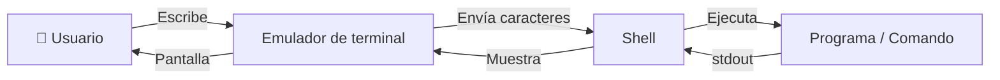
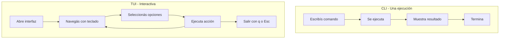

# La terminal

## Qué aprenderás

Casi todas las herramientas del ecosistema Gentle se usan desde la **terminal**: Gentle-AI, Engram, GGA, OpenCode, Codex, y Git. No tienen ventanas con botones. Son cajas de texto donde escribís comandos.

En este capítulo vas a entender qué es realmente la terminal, cómo funciona, y por qué es la herramienta principal del ecosistema.

## Por qué importa

Si le tenés miedo a la terminal, no vas a poder usar Gentle-AI. Si no entendés cómo funciona, cada error va a ser un misterio. Pero si la entendés, se vuelve una herramienta poderosa: más rápida que una interfaz gráfica para muchas tareas, y la única forma de usar las herramientas del ecosistema correctamente.

## Visión simple

Imaginá que tu computadora tiene dos formas de recibir órdenes:

1. **Interfaz gráfica** (GUI): click en botones, menúes, íconos. Como el Explorador de Windows.
2. **Interfaz de texto** (CLI): escribís comandos y leés respuestas. Como la terminal.

La terminal es simplemente un programa que te permite escribir comandos y ver resultados. Es más antigua que las ventanas con botones, pero para desarrollo de software es superior: podés encadenar comandos, automatizar tareas, y trabajar más rápido una vez que la dominás.

## Cómo funciona realmente

### Tres componentes

Lo que llamamos "terminal" son en realidad tres cosas que trabajan juntas:



1. **Emulador de terminal**: la ventana donde ves el texto. Windows Terminal, iTerm2, GNOME Terminal.
2. **Shell**: el programa que interpreta tus comandos. PowerShell, Bash, Zsh, Fish.
3. **Comando**: el programa que querés ejecutar. `git`, `node`, `gentle-ai`.

Cuando escribís `gentle-ai --version`:

1. El emulador de terminal recibe las teclas que presionás y las muestra
2. Cuando presionás Enter, envía la línea completa al shell
3. El shell la divide en palabras: `gentle-ai` y `--version`
4. El shell busca `gentle-ai.exe` en las carpetas del PATH
5. Lo ejecuta como un proceso nuevo, pasándole `--version` como argumento
6. El programa escribe `2.1.10` en su **salida estándar**
7. El shell captura esa salida y la muestra en pantalla

### Windows vs macOS vs Linux

Cada sistema operativo tiene su terminal y shell por defecto:

| Sistema | Terminal típica | Shell por defecto |
|---------|----------------|-------------------|
| Windows | Windows Terminal | PowerShell (o el clásico cmd) |
| macOS | Terminal.app | Zsh |
| Linux | GNOME Terminal | Bash |

**En Windows, necesitás cualquiera de estas**:
- PowerShell (viene instalado)
- Git Bash (viene con Git for Windows)
- WSL (Windows Subsystem for Linux — una máquina virtual Linux dentro de Windows)

Gentle-AI y el ecosistema funcionan en todas estas opciones.

### Comandos básicos

Estos comandos funcionan en **PowerShell** (Windows). Sus equivalentes en macOS/Linux son similares:

| Acción | PowerShell | Bash (macOS/Linux) |
|--------|-----------|-------------------|
| ¿Dónde estoy? | `Get-Location` o `pwd` | `pwd` |
| Listar archivos | `Get-ChildItem` o `ls` | `ls` |
| Cambiar de carpeta | `Set-Location carpeta` o `cd carpeta` | `cd carpeta` |
| Crear carpeta | `New-Item -ItemType Directory nombre` o `mkdir nombre` | `mkdir nombre` |
| Leer un archivo | `Get-Content archivo.txt` o `cat archivo.txt` | `cat archivo.txt` |
| Borrar archivo | `Remove-Item archivo.txt` o `rm archivo.txt` | `rm archivo.txt` |
| Mover archivo | `Move-Item origen destino` o `mv origen destino` | `mv origen destino` |
| Copiar archivo | `Copy-Item origen destino` o `cp origen destino` | `cp origen destino` |
| Limpiar pantalla | `Clear-Host` o `cls` | `clear` |

### Rutas

En Windows, las rutas usan `\`:
```
C:\Users\harry\Documentos\proyecto\
```

En macOS/Linux, usan `/`:
```
/home/harry/proyecto/
```

PowerShell acepta ambos estilos. Pero cuando trabajes con herramientas del ecosistema, prestá atención al formato de ruta que esperan.

### stdin, stdout, stderr

Todo proceso tiene tres "canales" de comunicación:

| Canal | Nombre | Propósito | Ejemplo |
|-------|--------|-----------|---------|
| **stdin** | Entrada estándar | Recibe datos del teclado u otro programa | Escribir en un formulario |
| **stdout** | Salida estándar | Resultados normales | El output de `gentle-ai --version` |
| **stderr** | Salida de error | Mensajes de error | "Error: no se encontró el archivo" |

Estos canales permiten **encadenar programas**:

```bash
# PowerShell: filtrar output
gentle-ai doctor 2>&1 | Select-String "ERROR"

# Bash: guardar errores en un archivo
engram mcp 2> errores.log
```

### Códigos de salida

Cuando un programa termina, devuelve un número al sistema operativo:

| Código | Significado |
|--------|------------|
| `0` | Todo salió bien ✅ |
| `1` | Algo salió mal ❌ |
| `2` en adelante | Error específico (depende del programa) |

Por ejemplo, GGA devuelve:
- `0` = código aprobado
- `1` = código rechazado
- `124` = timeout

Podés ver el código de salida del último comando:
- PowerShell: `$LASTEXITCODE`
- Bash: `echo $?`

### Argumentos y flags

Cuando ejecutás un comando, podés pasarle información adicional:

```bash
gentle-ai --version
#         ^^^^^^^^ flag (opción)

git commit -m "mensaje"
#          ^^ flag corta
#             ^^^^^^^^^ argumento (valor)

engram mcp --project mi-proyecto --tools agent
#          ^^^^^^^^^^^^^^^^^^^^^ flag larga con valor
#                                ^^^^^^^^^^^^^ flag larga con valor
```

Convenciones:
- `-x`: flag corta de una letra
- `--nombre`: flag larga con nombre descriptivo
- `--nombre valor`: flag que recibe un valor
- `valor`: argumento posicional (el orden importa)

### Paths absolutos vs relativos

- **Absoluto**: empieza desde la raíz. `C:\Users\harry\proyecto\main.js` o `/home/harry/proyecto/main.js`
- **Relativo**: empieza desde donde estás parado. Si estás en `C:\Users\harry`, entonces `proyecto\main.js` es lo mismo que `C:\Users\harry\proyecto\main.js`

Atajos útiles:
- `.` = la carpeta actual
- `..` = la carpeta de arriba (padre)
- `~` = tu carpeta personal (home)

### CLI vs TUI

Dos tipos de interfaces en terminal:

| Tipo | Ejemplo | Interacción |
|------|---------|-----------|
| **CLI** (Command Line Interface) | `git status` | Escribís un comando, leés el resultado. Terminó. |
| **TUI** (Text User Interface) | `gentle-ai` (sin argumentos) | Interfaz interactiva con paneles, menúes, navegación con teclas. |

Cuando ejecutás `gentle-ai` sin argumentos, abre una **TUI** (construida con Bubbletea). Podés navegar con teclas, seleccionar componentes, y ver progreso. Cuando ejecutás `gentle-ai --version`, es **CLI**: un comando, una respuesta.



## Por qué el ecosistema usa terminal

Gentle-AI, Engram, GGA, OpenCode y Codex son herramientas de **desarrolladores**. Y los desarrolladores usan terminal porque:

1. **Automatización**: podés escribir un script que ejecute 10 comandos en secuencia. No podés automatizar clicks.
2. **Precisión**: un comando hace exactamente lo que dice. Un botón puede tener comportamientos ocultos.
3. **Velocidad**: para un experto, escribir `git commit -m "fix"` es más rápido que abrir una app, buscar el botón de commit, escribir el mensaje...
4. **Integración**: GGA es un hook de Git que se ejecuta automáticamente cuando hacés commit. No podría funcionar si Git fuera solo una app gráfica.
5. **Remoto**: podés usar estas herramientas en un servidor sin pantalla, solo con texto.

## Ejemplo práctico

Vamos a usar la terminal para navegar y crear algo:

```powershell
# 1. ¿Dónde estoy?
Get-Location
# → C:\Users\harry

# 2. Ir a Documentos
Set-Location Documentos
# (ahora estoy en C:\Users\harry\Documentos)

# 3. Crear una carpeta para un proyecto
New-Item -ItemType Directory mi-primer-proyecto

# 4. Entrar a la carpeta
Set-Location mi-primer-proyecto

# 5. Crear un archivo
"¡Hola, mundo del desarrollo!" | Out-File -FilePath README.md

# 6. Ver qué hay en la carpeta
Get-ChildItem
# → README.md

# 7. Leer el archivo
Get-Content README.md
# → ¡Hola, mundo del desarrollo!

# 8. Volver atrás
Set-Location ..
```

## Errores frecuentes

1. **"No se reconoce el comando"**: el programa no está instalado o no está en el PATH. Solución: instalar el programa o agregar su carpeta al PATH.
2. **"Acceso denegado"**: no tenés permisos para leer o escribir ese archivo. En Windows, ejecutar PowerShell como administrador.
3. **"No se encuentra el archivo"**: la ruta está mal escrita o el archivo no existe. Verificá con `Get-ChildItem` o `ls`.
4. **PowerShell muestra caracteres raros**: el archivo usa codificación que PowerShell no entiende. Usá `-Encoding UTF8` al leer.

## Resumen

| Concepto | ¿Qué es? |
|----------|---------|
| Terminal | La ventana donde escribís comandos |
| Shell | El programa que interpreta los comandos (PowerShell, Bash) |
| Comando | El programa que querés ejecutar (`git`, `gentle-ai`) |
| Argumento | Información que le pasás al comando |
| Flag | Opción que modifica el comportamiento (--version) |
| PATH | Lista de carpetas donde se buscan comandos |
| stdout/stderr | Canales de salida (resultados y errores) |
| Código de salida | Número que indica si el comando funcionó (0 = bien) |
| CLI | Ejecutás, leés, terminó |
| TUI | Interfaz interactiva navegable con teclado |

## Preguntas

1. ¿Cuál es la diferencia entre un emulador de terminal y un shell?
2. ¿Para qué sirve el código de salida de un programa?
3. ¿Por qué el ecosistema prefiere terminal en vez de interfaz gráfica?
4. Si un comando no se encuentra, ¿qué revisás primero?
5. ¿Qué diferencia hay entre CLI y TUI?

## Ejercicio

1. Abrí PowerShell o tu terminal preferida
2. Navegá hasta tu carpeta de Documentos
3. Creá una carpeta llamada `practica-terminal`
4. Dentro de ella, creá un archivo `notas.txt` con el texto "Hoy aprendí a usar la terminal"
5. Leé el archivo para verificar que se creó correctamente
6. Borrá la carpeta de práctica

## Fuentes verificadas

- Shell: PowerShell 5.1 en Windows 10/11
- Ecosistema: gentle-ai 2.1.10, engram 1.19.0 ejecutados desde terminal
- Fecha: 2026-07-20
- Estado: 🟢 Verificado
