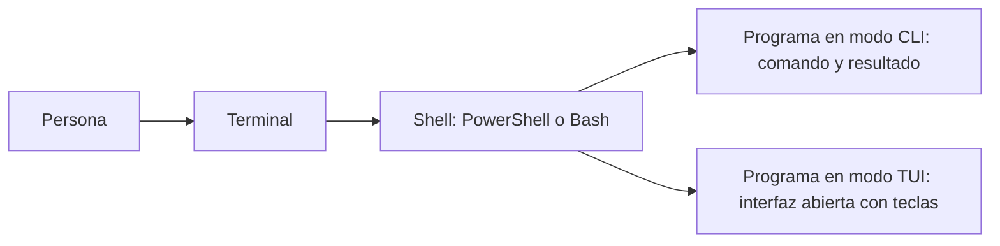

## Propósito

Los agentes de IA se usan desde una terminal: allí escribes comandos, ves el progreso de una tarea y ejecutas herramientas como Git, npm o el propio agente. La terminal parece misteriosa al principio, pero en realidad tiene pocas piezas: una ventana, un intérprete de comandos y las interfaces que usan los programas que invocas. Entender esas piezas te permite operar cualquier herramienta de línea de comandos sin depender de tutoriales memorizados.

## Respuesta simple

La **terminal** es la ventana donde escribes comandos. El **shell** es el programa que interpreta esos comandos y ejecuta lo que pides. La **CLI** es una interfaz de texto para usar un programa comando a comando, y la **TUI** es una interfaz de texto con paneles y menús que queda abierta esperando tus teclas. Terminal, shell, CLI y TUI no son lo mismo, aunque a menudo se usan como si lo fueran.

## Analogía

Imagina el mostrador de atención de una empresa. La terminal es el mostrador: la ventana física por donde hablas. El shell es la persona que atiende: recibe tu pedido, lo interpreta y lo ejecuta. La CLI es la forma de pedir algo con una frase breve que termina y listo ("una fotocopia, por favor"). La TUI es la forma de pedir algo y quedarte conversando hasta resolverlo ("acompáñame a completar este formulario"). La analogía tiene un límite: un shell no entiende lenguaje natural, solo comandos con una sintaxis exacta.

## Ejemplo continuo

Laura trabaja en operaciones y necesita revisar una lista de incidencias guardada en su computadora con Windows. Abre la terminal (PowerShell) y escribe un primer comando:

```powershell
Get-ChildItem
```

El shell interpreta el comando y muestra la lista de archivos y carpetas de la carpeta actual. Laura acaba de usar una CLI: escribió un comando, recibió un resultado y el comando terminó. Si en cambio escribe el nombre de una herramienta sin argumentos, como `git`, la herramienta puede abrir una TUI: una interfaz que se queda en pantalla esperando que Laura navegue con las teclas.

## Cómo abrir una terminal

Cada sistema operativo tiene su forma de abrir la ventana de la terminal:

| Sistema operativo | Cómo abrir la terminal | Shell inicial |
|-------------------|------------------------|---------------|
| Windows | Menú inicio, escribir `PowerShell` y elegir "Windows PowerShell" | PowerShell |
| macOS | `Cmd + Espacio`, escribir `Terminal` y presionar Enter | Zsh o Bash |
| Linux | Atajo de teclado o menú de aplicaciones, buscar "Terminal" | Bash |

En Windows, PowerShell es el camino inicial recomendado: viene instalado y es el shell nativo del sistema. No necesitas instalar Bash para los primeros pasos.

## Cuándo instalar Bash en Windows

Bash es el shell clásico de Unix/Linux. En Windows no viene instalado, y no hace falta instalarlo para usar agentes: las herramientas del ecosistema funcionan con PowerShell. Solo lo necesitas cuando quieres ejecutar scripts escritos para Unix o herramientas que esperan un entorno de Bash. En ese caso tienes dos opciones documentadas en las fuentes oficiales:

- **Git Bash**: un entorno que emula Bash y viene incluido con Git for Windows. Sirve para comandos de Git y scripts simples.
- **WSL** (Windows Subsystem for Linux): instala un Linux real dentro de Windows y es la opción completa si necesitas herramientas de Linux.

La documentación oficial de Git explica cómo descargar Git for Windows en [git-scm.com](https://git-scm.com/), y Microsoft documenta la instalación de WSL en su centro de aprendizaje.

## PowerShell y Bash

PowerShell y Bash son shells distintos con sintaxis distinta. No son intercambiables: un comando de Bash no funciona en PowerShell sin cambios, y viceversa. Estas son las diferencias que más verás al empezar:

| Acción | PowerShell | Bash |
|--------|-----------|------|
| Listar archivos | `Get-ChildItem` | `ls` |
| Leer un archivo | `Get-Content archivo.txt` | `cat archivo.txt` |
| Variable de entorno | `$env:NOMBRE` | `echoNOMBRE` |
| Código de salida | `$LASTEXITCODE` | `$?` |
| Encadenar solo si funciona | `cmd1; if ($?) { cmd2 }` | `cmd1 && cmd2` |

En esta tabla puedes ver dos elementos estructurales de todo comando: la **variable de entorno**, un valor que el shell pone a disposición de los programas que lanza, y el **código de salida**, el número que un programa devuelve al terminar (`0` para éxito, otro valor para error).

PowerShell trabaja con objetos y usa verbos como `Get-` o `Set-`. Bash trabaja con texto y usa comandos cortos. No necesitas memorizar las dos sintaxis: alcanza con saber que existen, que son distintas y que puedes consultar la ayuda de cada una.

## CLI y TUI como modalidades de interacción

Un programa de terminal puede ofrecer dos modalidades de interacción:

- **CLI** (Command Line Interface): escribes un comando con sus argumentos, el programa ejecuta la tarea, devuelve el resultado y termina. Es la modalidad para automatizar y encadenar pasos.
- **TUI** (Text User Interface): el programa dibuja una interfaz con paneles, menús y colores dentro de la terminal, y se queda abierta esperando tus teclas. Es la modalidad para explorar opciones de forma visual.

CLI y TUI son interfaces, no programas en sí: son la forma en que un programa se presenta dentro de la terminal. Tanto una CLI como una TUI se invocan desde la terminal, a través del shell.


```mermaid
flowchart LR
    Persona[Persona] --> Term[Terminal]
    Term --> Shell[Shell: PowerShell o Bash]
    Shell --> CLI[Programa en modo CLI: comando y resultado]
    Shell --> TUI[Programa en modo TUI: interfaz abierta con teclas]
```

Cuando ejecutas un programa en modo CLI, el shell lo lanza, el programa hace su trabajo y el control vuelve al shell. Cuando lo ejecutas en modo TUI, el programa toma el control de la pantalla hasta que decides salir.

## Errores frecuentes

### ¿Por qué el sistema dice que un comando no se reconoce?

**Qué observas:** escribes un comando y el shell responde algo como "el término no se reconoce" o "command not found".

**Qué suele significar:** el programa que intentas usar no está instalado, o el shell no sabe dónde buscarlo.

**Cómo comprobarlo:** confirma el nombre del comando y verifica si el programa está instalado (por ejemplo, en Windows con `Get-Command git`).

**Cómo resolverlo:** instala el programa desde su fuente oficial o agrega su carpeta a la variable de entorno `PATH` siguiendo la documentación del programa.

**Cómo confirmar la solución:** vuelve a escribir el comando y verifica que el shell lo ejecute sin errores.

### ¿Estoy en PowerShell o en Bash?

**Qué observas:** no sabes qué shell está interpretando tus comandos.

**Qué suele significar:** en Windows la terminal abre PowerShell por defecto; en macOS y Linux abre Bash o Zsh. Son shells distintos con comandos distintos.

**Cómo comprobarlo:** en PowerShell escribe `$PSVersionTable`; en Bash escribe `echo $0` o `echo $BASH_VERSION`.

**Cómo resolverlo:** según el shell que veas, usa la sintaxis correspondiente: verbos como `Get-ChildItem` en PowerShell o comandos cortos como `ls` en Bash.

**Cómo confirmar la solución:** ejecuta el comando equivalente en cada shell y compara el resultado.

## Resumen

| Concepto | ¿Qué es? | Ejemplo |
|----------|----------|---------|
| Terminal | La ventana donde escribes comandos | Windows Terminal, Terminal de macOS |
| Shell | El intérprete que ejecuta los comandos | PowerShell, Bash, Zsh |
| CLI | Interfaz de texto comando a comando | `git status` |
| TUI | Interfaz de texto con paneles y menús | un programa abierto en la terminal |
| PowerShell | Shell nativo de Windows, orientado a objetos | `Get-ChildItem` |
| Bash | Shell clásico de Unix/Linux, basado en texto | `ls` |

## Términos de esta lección

Terminal, Shell, CLI (Command Line Interface), TUI (Text User Interface), PowerShell, Bash y Comando. Todos están definidos en el [glosario](../../20-referencia/02-glosario/).

## Para seguir aprendiendo

- [Microsoft Learn — PowerShell](https://learn.microsoft.com/es-es/training/powershell/): rutas de aprendizaje oficiales de PowerShell en español.
- [Git — Documentation](https://git-scm.com/doc): documentación oficial de Git y el libro Pro Git gratuito.
- La siguiente lección, [Programación](../03-programacion/), explica qué es un programa y cómo se crea.
