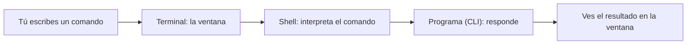

# La terminal

## Propósito

En la lección anterior viste dónde vive el software: el disco, la memoria, el sistema operativo y las carpetas con tus archivos. Esta lección abre la puerta que te conecta con los programas a través del texto: la terminal.

Aquí vas a aprender qué es una terminal, qué es un shell y qué es un comando, cómo distinguir CLI de TUI, cómo abrir tu terminal en Windows, macOS o Linux y cómo llamar desde ahí a los programas de línea de comandos. Esa es la misma vía por la que llamarás a los agentes OpenCode, Codex o Claude Code cuando los tengas instalados. No necesitas programar para esta lección: solo tu computadora y unos minutos.

## Respuesta simple

La terminal es la ventana, el shell es el programa que interpreta lo que escribes y el comando es la instrucción. Son tres cosas distintas que trabajan juntas: abres la terminal, dentro de ella corre un shell y el shell ejecuta los comandos que escribes.

En Windows el shell que viene instalado es PowerShell. En Linux lo habitual es Bash, y en macOS el shell por defecto es Zsh (con Bash disponible). Y desde la terminal puedes llamar a los programas de línea de comandos: cuando instalas una herramienta como Git, OpenCode o Codex, su nombre se convierte en un comando que puedes escribir.

## Analogía: el mostrador de instrucciones exactas

Imagina que la terminal es el mostrador de una oficina y que el shell es el empleado que atiende detrás de él. Tú escribes tu pedido en una nota, el empleado la lee, la lleva al programa correspondiente y te devuelve la respuesta escrita en la misma ventana.

Esta analogía tiene un límite importante: el empleado no interpreta intenciones. No lee "entre líneas" ni tolera errores de tipeo. Una letra de más, un espacio en el lugar equivocado o una instrucción escrita en el idioma de otro shell producen un mensaje de error. Por eso escribir comandos exige precisión, no buena voluntad.

## Ejemplo continuo: Camila y su terminal

Camila trabaja en administración: organiza documentos, prepara informes y no programa. Usa Windows y, en la lección anterior, le pidió a un agente de OpenCode que ordenara sus notas en un borrador.

Hoy quiere ver con sus propios ojos dónde vive ese trabajo y cómo la terminal llama a las herramientas. Su recorrido será el hilo conductor de esta lección: abrir PowerShell, preguntar en qué carpeta está, ver los archivos de su proyecto y pedirle a una herramienta que le diga qué versión tiene instalada.

## Explicación progresiva

### La terminal, el shell y el comando

La **Terminal**\* es la aplicación que muestra una ventana de texto y te deja escribir. Ejemplos: la aplicación Terminal de Windows (la que abre PowerShell por defecto en Windows 11), Terminal.app en macOS y GNOME Terminal en muchas computadoras Linux. La terminal, por sí sola, es solo la ventana.

El **Shell**\* es el programa que corre dentro de esa ventana y que interpreta lo que escribes. Los shells más comunes son PowerShell, Bash y Zsh. Cada shell habla su propio idioma: lo que escribes en PowerShell no siempre funciona en Bash, y al revés.

Un **comando** es una instrucción que escribes para el shell. En la mayoría de los casos es el nombre de un programa, a veces acompañado de opciones. Cuando escribes un comando y presionas Enter, el shell lo lee, busca el programa, lo ejecuta y la ventana muestra el resultado.

Cuando alguien dice "abre la terminal", en la práctica quiere decir "abre la aplicación de terminal con un shell corriendo dentro". Tú ves una sola ventana; detrás trabajan dos piezas distintas.

### CLI y TUI: dos formas de usar un programa

Desde la terminal se usan dos estilos de programas, y conviene distinguirlos porque la palabra "terminal" se usa para los tres.

Un **CLI (Command Line Interface)**\* es un programa que se opera escribiendo comandos: escribes su nombre, agregas opciones y presionas Enter. Git, OpenCode y Codex son ejemplos de programas con CLI. Este manual usa constantemente programas así.

Una **TUI (Text User Interface)**\* es un programa que, dentro de la misma ventana de texto, dibuja paneles y menús que navegas con las teclas. El programa `htop` en Linux es un ejemplo clásico: muestra una lista de procesos que se actualiza sola, en vez de esperar comandos.

La terminal es el lugar; CLI y TUI son dos maneras en que los programas usan ese lugar. Cuando el manual dice "llama al CLI de una herramienta", significa que escribes su nombre como comando.

### PowerShell, el camino inicial en Windows

**PowerShell**\* es el shell que viene instalado con Windows, junto con su propio lenguaje de comandos. Camila no necesita instalar nada para empezar: abre PowerShell y ya puede trabajar.

PowerShell usa verbos para nombrar sus comandos. Los dos primeros que conviene conocer son `Get-Location`, que responde "¿en qué carpeta estoy?", y `Get-ChildItem`, que lista los archivos de la carpeta actual. El mismo comando existe en Bash, pero con otro nombre:

| Lo que quieres hacer | PowerShell | Bash |
|---|---|---|
| Saber en qué carpeta estás | `Get-Location` | `pwd` |
| Listar archivos | `Get-ChildItem` | `ls` |
| Leer un archivo | `Get-Content archivo.txt` | `cat archivo.txt` |
| Cambiar de carpeta | `cd ruta` | `cd ruta` |

Los nombres cambian, la idea es la misma: preguntar dónde estás, ver qué hay, leer, moverte. PowerShell acepta algunos atajos clásicos como `ls` o `pwd`, pero su comportamiento puede diferir del de Bash; para empezar, usa los verbos completos.

### Bash: qué es y por qué instalarlo

**Bash**\* es el shell clásico de los sistemas Unix: es el que viene por defecto en la mayoría de las distribuciones Linux, y en macOS el shell por defecto es Zsh (con Bash disponible). Los ejemplos de muchas guías, incluida buena parte de este manual, asumen la sintaxis de Bash.

Windows no incluye Bash: incluye PowerShell. Entonces, ¿por qué instalar Bash en Windows? Porque muchas herramientas e instrucciones del ecosistema (Git, documentación de proyectos de código abierto, scripts de los agentes) están escritas para Bash. Tener Bash en Windows te permite seguir esas instrucciones sin traducirlas.

La forma más simple es **Git Bash**, el entorno que viene incluido con Git for Windows: lo instalas desde la [descarga oficial de Git](https://git-scm.com/downloads) y obtienes una ventana con Bash sin salir de Windows. Si algún día necesitas un entorno Linux completo, existe WSL (Windows Subsystem for Linux), pero no lo necesitas para empezar: Git Bash alcanza para seguir este manual.

Un punto importante: PowerShell y Bash no tienen sintaxis intercambiable. Un comando escrito para Bash no funciona tal cual en PowerShell, y al revés. No es que uno sea mejor; son idiomas distintos que hacen lo mismo.

### Cómo abrir la terminal en cada sistema

El modo de abrir la terminal depende del **Sistema operativo**\* que uses:

- **Windows**: presiona la tecla Windows, escribe `PowerShell` y presiona Enter. En Windows 11 también puedes buscar `Terminal`.
- **macOS**: presiona Cmd + Espacio, escribe `Terminal` y presiona Enter. Se abre Terminal.app, que usa Zsh (o Bash si lo configuras).
- **Linux**: abre el menú de aplicaciones y busca `Terminal`. El nombre depende de la distribución: GNOME Terminal en las de GNOME, Konsole en las de KDE. En casi todas, el shell por defecto es Bash.

En los tres casos verás una ventana con un recuadro donde puedes escribir y, a veces, una línea de texto que termina en `>` (PowerShell) o en `$` (Bash). Ese espacio para escribir es el prompt, y es la señal de que el shell está listo.

## Aplicación práctica: de la terminal a los programas

Este diagrama resume el flujo que acabas de estudiar y el que vas a probar ahora:


```mermaid
flowchart LR
    U["Tú escribes un comando"] --> W["Terminal: la ventana"]
    W --> SH["Shell: interpreta el comando"]
    SH --> P["Programa (CLI): responde"]
    P --> R["Ves el resultado en la ventana"]
```

Se lee de izquierda a derecha: escribes un comando en la ventana de la terminal, el shell lo interpreta y ejecuta el programa correspondiente, y el resultado vuelve a la misma ventana.

### Práctica guiada: tu primer comando

Vamos a comprobarlo con Camila. Necesitas solo tu terminal abierta.

1. Abre tu terminal según tu sistema, como viste recién.
2. En Windows, escribe el comando que responde dónde estás y el que lista archivos:

```powershell
Get-Location
Get-ChildItem
```

Verás, en orden, la ruta de tu carpeta actual y la lista de archivos que contiene.

3. En macOS o Linux, los mismos dos pedidos se escriben así:

```bash
pwd
ls
```

4. Ahora llama a un programa desde la terminal. Escribe el nombre de una herramienta instalada con una opción que pide su versión:

```powershell
git --version
```

```bash
git --version
```

Nota que este comando es idéntico en los dos shells: cuando instalas un programa con CLI, su nombre se convierte en un comando que el shell conoce, y `--version` le pide que diga qué versión tiene. El resultado es una línea parecida a `git version 2.55.0`. Puedes probar lo mismo con `opencode --version` si tienes OpenCode instalado.

5. Verificación: si ves tu ruta, tu lista de archivos y la versión de Git, tu terminal funciona y alcanza a los programas instalados. Si un comando "no se reconoce", revisa los errores frecuentes al final de esta lección.

Todos los comandos de esta práctica son seguros: solo preguntan información y no modifican nada.

## Decisiones y límites

- **PowerShell primero en Windows**: viene instalado y alcanza para casi todo lo de este manual. Bash se instala cuando necesitas seguir instrucciones escritas para Unix o usar Git Bash.
- **Git Bash no es Linux**: comparte la sintaxis de Bash, pero el sistema debajo sigue siendo Windows. Algunas herramientas de Linux no funcionan ahí; para eso existe WSL, que queda fuera del alcance de esta lección.
- **Lo que queda fuera**: encadenar comandos con pipes y escribir scripts se ve en el módulo de terminal avanzada; las variables de entorno se explican en la lección de programación.
- **Idiomas distintos**: PowerShell y Bash no comparten sintaxis. Cuando un ejemplo de este manual etiqueta el comando como `powershell` o `bash`, usa el que corresponde a tu sistema.

## Errores frecuentes

### Escribo un comando y dice que no se reconoce

- Qué observas: la terminal responde con un mensaje como "El término no se reconoce" (PowerShell) o "command not found" (Bash).
- Qué significa: estás usando la sintaxis de un shell dentro del otro, o escribiste mal el nombre del comando.
- Cómo comprobar: mira qué shell tienes abierto: PowerShell muestra `PS` al inicio de la línea y Bash muestra `$`.
- Cómo resolver: usa los comandos del shell que tienes abierto. En PowerShell, `Get-ChildItem`; en Bash, `ls`.
- Cómo confirmar: el comando correcto responde sin error.

### Escribo el nombre de un programa y tampoco se reconoce

- Qué observas: `git --version` o `opencode --version` devuelven un error de comando no encontrado.
- Qué significa: el programa no está instalado, o la terminal se abrió antes de instalarlo y no lo conoce.
- Cómo comprobar: instala el programa (por ejemplo, Git for Windows desde su descarga oficial) y abre una ventana de terminal nueva.
- Cómo resolver: después de instalar, cierra la terminal y ábrela de nuevo para que el shell encuentre el programa.
- Cómo confirmar: el comando de versión responde con una línea de texto.

### No encuentro la terminal en mi computadora

- Qué observas: buscas la aplicación y no la ves entre los programas.
- Qué significa: cada sistema operativo esconde su terminal en un lugar distinto.
- Cómo comprobar: usa la búsqueda: menú Inicio en Windows, Cmd + Espacio en macOS, menú de aplicaciones en Linux.
- Cómo resolver: escribe el nombre (`PowerShell`, `Terminal` o `Konsole`) en el buscador correspondiente.
- Cómo confirmar: se abre una ventana con un prompt donde puedes escribir.

## Resumen

| Concepto | Qué es | Ejemplos |
|---|---|---|
| Terminal | La ventana donde escribes comandos | Terminal de Windows, Terminal.app, GNOME Terminal |
| Shell | El programa que interpreta los comandos | PowerShell, Bash, Zsh |
| Comando | La instrucción que escribes | `Get-Location`, `pwd`, `ls` |
| CLI (Command Line Interface) | Programa que se opera por comandos | Git, OpenCode, Codex |
| TUI (Text User Interface) | Interfaz de texto con paneles y menús | `htop` |
| PowerShell | Shell incluido en Windows | — |
| Bash | Shell clásico de Unix; en Windows llega con Git Bash o WSL | — |

Lo esencial para recordar: la terminal es la ventana, el shell decide el idioma que escribes y, desde ahí, llamas a los programas de línea de comandos de tus herramientas.

## Términos de esta lección

- **Terminal**: interfaz de texto donde escribes comandos para que la computadora los ejecute.
- **Shell**: el programa que interpreta comandos en la terminal (PowerShell, Bash, Zsh).
- **CLI (Command Line Interface)**: interfaz de texto donde se escriben comandos.
- **TUI (Text User Interface)**: interfaz de usuario basada en texto con elementos visuales como paneles y menús.
- **PowerShell**: shell y lenguaje de script predeterminado en Windows. Es una buena puerta de entrada para comandos en ese sistema.
- **Bash**: shell y lenguaje de script común en macOS y GNU/Linux. También disponible en Windows.
- **Carpeta (directorio)**: contenedor que organiza archivos y otras carpetas dentro del disco.
- **Sistema operativo**: programa base que administra los componentes de la computadora y permite ejecutar otros programas.

Las definiciones canónicas de todos los términos del manual están en el [glosario](../../20-referencia/02-glosario/).

## Para seguir aprendiendo

- [Microsoft Learn — PowerShell](https://learn.microsoft.com/es-es/training/powershell/): rutas de aprendizaje oficiales de PowerShell, en español y gratis.
- [Git — Documentation](https://git-scm.com/doc): documentación oficial de Git y el libro Pro Git gratuito, disponible en español.

La próxima lección te lleva a [programación](../03-programacion/), donde verás qué es un programa, cómo se crea y por qué conviene entenderlo para trabajar con agentes.
