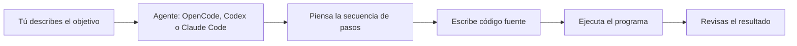

# Programación

## Propósito

En las dos lecciones anteriores viste dónde vive el software y cómo se llama a los programas desde la terminal. Esta lección responde la pregunta que queda pendiente: ¿qué es un programa y qué pasa cuando un agente de IA programa por ti?

Aquí vas a entender qué es un programa, qué es la lógica de programación y qué es la abstracción, cómo pedirle a un agente como OpenCode, Codex o Claude Code que cree un programa para ti, qué son el código fuente, compilar e interpretar, para qué sirven las variables de entorno y cuáles son los lenguajes de programación más usados. No necesitas escribir código para esta lección: se trata de entender la idea.

## Respuesta simple

Un programa es una secuencia de instrucciones que la computadora ejecuta para cumplir una tarea. La lógica de programación es la capacidad de partir esa tarea en pasos ordenados, y la abstracción es pensar en la idea o el proceso sin ocuparte de los detalles internos.

Cuando le pides a un agente que programe, tú aportas la abstracción (qué quieres lograr) y el agente se encarga del detalle: piensa los pasos, escribe el código fuente y puede ejecutarlo para mostrarte el resultado. Las variables de entorno son valores que el sistema operativo guarda para que los programas se comporten de forma distinta según el entorno, sin tocar el código.

## Analogía: la receta de cocina

Un programa es como una receta de cocina. La receta lista los pasos en orden, indica decisiones ("si la masa queda pegajosa, agrega un poco más de harina") y repeticiones ("mezcla durante cinco minutos"). El texto de la receta es el código fuente, el idioma en que está escrita es el lenguaje de programación y el cocinero que la ejecuta es la computadora.

Esta analogía tiene un límite importante: un cocinero humano tolera instrucciones vagas como "un poco de sal" o "hasta que esté a punto". Una computadora no: ejecuta exactamente lo que está escrito, ni más ni menos. Un paso fuera de orden, un número equivocado o una instrucción mal redactada producen un resultado distinto del esperado. Por eso programar exige precisión, no buena voluntad.

## Ejemplo continuo: Camila y su informe automático

Camila trabaja en administración: organiza documentos, prepara informes y no programa. En la primera lección le pidió a un agente que ordenara sus notas, y en la segunda aprendió a abrir la terminal. Hoy su tarea es distinta: todos los meses tiene que combinar las ventas de varios archivos de Excel en un informe único, y está cansada de hacerlo a mano.

En lugar de armarlo sola, le pide al agente en OpenCode: "haz un programa que lea las ventas de estos archivos, las sume por mes y deje el informe en un archivo nuevo". El agente piensa la secuencia de pasos, escribe el código, lo ejecuta y le muestra el resultado. Camila no escribió una línea de código: entendió qué necesitaba, describió la idea y el agente resolvió el detalle. Ese recorrido, de la idea al programa funcionando, es el hilo conductor de esta lección.

## Explicación progresiva

### Qué es un programa: instrucciones en orden

Un **Programa**\* es un conjunto de instrucciones que la computadora ejecuta para cumplir una tarea. En un programa sencillo y lineal, cada instrucción se ejecuta en orden, una después de la otra: si el paso 3 dice "lee el archivo de ventas", eso ocurre antes del paso 4, que dice "suma los totales". En programas con decisiones o repeticiones (que verás enseguida), algunas instrucciones se saltan o se repiten; el modelo lineal es un buen punto de partida, no la regla universal.

La **lógica de programación** es la habilidad de pensar la tarea como una secuencia de pasos. Tres piezas aparecen en casi cualquier programa:

- La **secuencia**: los pasos en orden.
- La **decisión**: elegir un camino según una condición, como "si el archivo no existe, avisa en pantalla".
- La **repetición**: hacer lo mismo varias veces, como sumar los valores de cada fila del archivo.

El informe de Camila, visto como lógica, es simple: leer los archivos, sumar los valores por mes, escribir el resultado. La computadora no sabe qué es "un informe": solo ejecuta los pasos exactos que el programa le indica.

### Abstracción: la idea sin los detalles

La **Abstracción**\* es la capacidad de pensar en una idea o proceso sin ocuparte de todos los detalles internos. Ya la usas todos los días: "prepara el informe" no requiere saber qué fórmulas usa la planilla, y "conduce el auto" no requiere saber cómo funciona el motor.

Cuando le pides algo a un agente de IA, tú haces la abstracción y el agente resuelve los detalles. En el pedido de Camila, la abstracción fue "suma las ventas por mes y déjame el informe"; los detalles, como qué instrucciones exactas necesita la computadora o qué función calcula la suma, los escribió el agente.

La abstracción tiene un límite: el agente no conoce tu contexto por defecto. Si Camila no le dice qué archivos usar, en qué carpeta están o qué formato quiere para el informe, el agente hará suposiciones. Cuanto mejor describes el qué, mejor resulta el cómo.

### Cómo pedirle a un agente que programe por ti

Recuerda de la primera lección: el agente es un programa que corre en tu computadora y consulta a un modelo de IA. Cuando le escribes un mensaje, tu pedido en lenguaje natural (el prompt), el agente hace tres cosas: piensa la secuencia de pasos, escribe el código y, si se lo pides, lo ejecuta para verificar que funciona.

El recorrido de Camila paso a paso:

1. Camila abre OpenCode y escribe su pedido con el objetivo y los archivos.
2. El agente piensa la lógica: leer, sumar por mes, escribir el informe.
3. El agente escribe el código fuente del programa.
4. El agente ejecuta el programa sobre los archivos reales.
5. Camila revisa el informe generado y le pide ajustes si hace falta.

No necesitas entender cada línea del código que escribe el agente para usar el resultado. Lo que sí necesitas entender es qué esperas obtener, porque la verificación final siempre es tuya: el informe tiene que tener las ventas bien sumadas.

### Código fuente, compilar e interpretar

El **Código fuente**\* es el texto que se escribe en un **Lenguaje de programación**\*, es decir, un lenguaje formal que una computadora puede convertir en instrucciones. Es lo que escribe la persona que programa, o el agente cuando programa por ti.

La computadora no entiende ese texto directamente: hay que convertirlo. Hay dos caminos, y conviene distinguirlos porque aparecen todo el tiempo al leer sobre software.

**Compilar**\* es convertir todo el código fuente en un archivo ejecutable de una vez, antes de correrlo. El resultado es un archivo que la computadora puede ejecutar directamente, sin necesitar nada más. Lenguajes como Go, Rust y C# se compilan.

**Interpretar**\* es ejecutar el código fuente línea por línea, en el momento, con la ayuda de un programa llamado intérprete. No se genera un archivo ejecutable previo: el intérprete lee la línea, la ejecuta y pasa a la siguiente. Lenguajes como JavaScript y Python se interpretan (la explicación real es un poco más matizada: los motores modernos usan técnicas como la compilación justo a tiempo para acelerarlos, pero la idea general es esta).

| | Compilar | Interpretar |
|--|----------|-------------|
| Proceso | Convierte todo de una vez | Ejecuta línea por línea |
| Resultado | Archivo ejecutable listo para correr | Se ejecuta en el momento |
| Errores de sintaxis | Se detectan al compilar | Se detectan al leer el código |
| Errores de ejecución | Aparecen al correr el programa | Aparecen al correr el programa |
| Ejemplos | Go, Rust, Java, C# | JavaScript, Python |

### Runtime: el entorno que hace falta para correr

El **Runtime**\* es el entorno donde se ejecuta un programa. En los lenguajes interpretados, ese entorno es imprescindible: JavaScript y TypeScript necesitan Node.js instalado, y sin Node.js un archivo `.js` no se puede ejecutar. En los lenguajes compilados, la historia es variada: algunos generan un ejecutable que ya trae consigo lo necesario (por ejemplo, un binario de Go), mientras que otros necesitan un entorno de ejecución aparte (Java necesita la JVM y C# normalmente necesita .NET, salvo que se empaquete como autónomo). Por eso, al instalar una herramienta, la pregunta práctica no es solo "¿en qué lenguaje está escrita?" sino "¿qué necesita instalado para correr?".

Esto tiene consecuencias prácticas que ya viste en el ecosistema: OpenCode y Codex necesitan Node.js instalado para funcionar. Las herramientas del ecosistema escritas en Go, como gentle-ai y Engram, se distribuyen como binarios que ya traen todo dentro y no necesitan Go instalado para ejecutarse.

### Variables de entorno: configuración fuera del código

Una **Variable de entorno**\* es un valor que el sistema operativo guarda y que los programas pueden leer. Funciona como configuración que vive fuera del código: el programa pregunta "¿qué valor tiene la variable X?" y se comporta según la respuesta.

¿Para qué sirven? Para configurar el comportamiento de un programa según el entorno, sin modificar el código. Ejemplos reales: la clave de acceso a un proveedor de IA, el idioma de una aplicación o el modo de pruebas de un programa. Un programa puede leer la misma variable y comportarse distinto en tu computadora que en un servidor, porque el entorno es distinto.

Prueba el concepto en tu terminal. En Windows con PowerShell:

```powershell
$env:MI_NOMBRE = "Camila"
$env:MI_NOMBRE
```

En macOS o Linux con Bash:

```bash
export MI_NOMBRE="Camila"
echo $MI_NOMBRE
```

En los dos casos creas una variable llamada `MI_NOMBRE`, la llenas con un valor y le pides al shell que la muestre. Eso es todo lo que pasa: un valor guardado en el entorno y un programa —el shell— que lo lee y lo imprime; la terminal solo muestra el resultado en la ventana.

Puedes ver todas las variables de tu sistema con `Get-ChildItem Env:` en PowerShell o con `printenv` en Bash. Un detalle importante: las variables definidas a mano duran solo mientras la terminal está abierta; cuando la cierras, se pierden. Por eso las configuraciones que deben durar se guardan en archivos de perfil, un tema que verás cuando configures tus herramientas.

Cuando instales y configures agentes como OpenCode o Codex, valores como las claves de API de los proveedores de IA suelen vivir en variables de entorno o en archivos de configuración. La lección de instalación lo muestra en la práctica; aquí solo necesitas la idea: el programa lee el valor del entorno en lugar de tenerlo escrito en el código.

### Panorama de lenguajes más usados

Los lenguajes de programación son muchos, pero los más usados se reparten por el tipo de operación para la que se eligen. Esta tabla es una referencia cualitativa, sin cifras: te da una idea de qué esperar cuando alguien menciona un lenguaje.

| Lenguaje | Tipo de operación | Para qué se usa |
|----------|-------------------|-----------------|
| JavaScript / TypeScript | Web: frontend y backend | Interfaces web, aplicaciones interactivas y herramientas como OpenCode |
| Python | Scripts, datos y automatización | Ciencia de datos, automatizaciones, prototipos y proyectos de IA |
| Go | Sistemas y herramientas de línea de comandos | Herramientas de infraestructura; gentle-ai y Engram están escritos en Go |
| Rust | Sistemas de alto rendimiento | Donde importan la velocidad y la seguridad de la memoria, como navegadores y bases de datos |
| Java | Aplicaciones empresariales | Aplicaciones grandes de empresas y sistemas de servidor |
| C# | Aplicaciones empresariales y de Windows | Ecosistema .NET de Microsoft: aplicaciones de escritorio, web y de negocio |

Si miras la tabla con lo que ya sabes de compilar e interpretar, verás que algunos de estos lenguajes se compilan (Go, Rust, Java, C#) y otros se interpretan (JavaScript, Python). Cuando un agente elige un lenguaje para una tarea, esa diferencia define cómo se ejecutará el resultado y qué necesita instalado la computadora.

No hace falta que aprendas todos: la tabla es para que, cuando leas o escuches un nombre, sepas en qué tipo de operación se mueve. Y recuerda que los agentes escriben código en todos estos lenguajes: tu trabajo es describir bien la tarea, no memorizar sintaxis.

## Aplicación práctica: el agente programando por ti

Este diagrama resume el recorrido completo del programa de Camila, desde su pedido hasta el resultado:



Se lee de izquierda a derecha: tú describes el objetivo en lenguaje natural, el agente piensa la secuencia de pasos, escribe el código fuente, ejecuta el programa y tú revisas el resultado. La lógica y la abstracción que viste recién están en la mitad del recorrido: el agente convierte tu idea abstracta en instrucciones exactas, y la computadora las ejecuta.

Vuelve al caso de Camila: su pedido no fue código, fue una descripción con contexto (los archivos, la suma por mes, el archivo nuevo). El agente hizo la lógica y la escritura, y Camila hizo la verificación final: abrir el informe y comprobar que las sumas coinciden. Si algo no cerraba, el siguiente pedido era un ajuste, no una reescritura.

## Decisiones y límites

- **Esta lección no enseña a programar**: explica la lógica y la abstracción para que entiendas qué hace el agente. Aprender a escribir código, si lo quieres, es cosa de los recursos de aprendizaje del final.
- **La abstracción no es magia**: el agente solo sabe lo que le cuentas. Un pedido con contexto produce un mejor programa que un pedido vago.
- **Las variables de entorno se explican solo aquí**: no aparecerán duplicadas en otras lecciones. Cuando las uses al configurar tus herramientas, el concepto ya está visto.
- **El panorama de lenguajes es cualitativo a propósito**: no hay estadísticas de uso ni ranking definitivo; solo una referencia de qué tipo de operación hace cada lenguaje.
- **Lo que queda fuera**: las librerías, los frameworks y las dependencias, y cómo elegir un conjunto de tecnologías para un proyecto, se explican en las lecciones de stack tecnológico y de arquitectura.

## Errores frecuentes

### El agente me devolvió código y no sé qué hacer con él

- Qué observas: el agente te mostró un bloque de código que no entiendes y no sabes si funciona.
- Qué significa: el código fuente es texto; para verlo en acción hay que ejecutarlo, ya sea compilándolo o interpretándolo.
- Cómo comprobar: pregúntale al agente si ya lo ejecutó y qué resultado obtuvo.
- Cómo resolver: pídele que lo ejecute él mismo y te muestre el resultado, o que te lo explique en lenguaje simple.
- Cómo confirmar: tienes el resultado del programa, no solo el código.

### Cambié una variable de entorno y el programa sigue igual

- Qué observas: definiste una variable y el programa se comporta como antes.
- Qué significa: los programas leen las variables cuando arrancan, no en cada instante.
- Cómo comprobar: verifica con la terminal que la variable existe y tiene el valor que esperas.
- Cómo resolver: reinicia el programa desde la misma terminal donde definiste la variable, porque los valores temporales solo viven en ese shell; si abres una terminal nueva, la variable ya no existe y el programa seguirá sin verla. Para que sobreviva, debes guardarla en tu archivo de perfil (lo verás en la configuración de tus herramientas).
- Cómo confirmar: el programa refleja el nuevo valor.

### Escribí mal el nombre de una variable y no pasa nada

- Qué observas: el programa no da error, pero tampoco usa tu valor.
- Qué significa: si una variable no existe, el programa lee un valor vacío o usa un valor por defecto; no siempre avisa.
- Cómo comprobar: lista las variables con `Get-ChildItem Env:` o `printenv` y busca el nombre exacto.
- Cómo resolver: revisa la ortografía exacta del nombre. En Windows los nombres de variables no distinguen mayúsculas de minúsculas, pero en Linux y macOS sí; si copiaste el nombre de otro sistema, fíjate bien en las letras.
- Cómo confirmar: el programa vuelve a leer la variable y cambia su comportamiento.

### ¿Tengo que aprender a programar para usar agentes?

- Qué observas: piensas que sin saber programar no puedes aprovechar OpenCode, Codex o Claude Code.
- Qué significa: no es necesario para empezar: el agente escribe el código por ti y tú haces la abstracción y la verificación.
- Cómo comprobar: Camila no programa y su informe quedó resuelto en el ejemplo de esta lección.
- Cómo resolver: empieza describiendo tareas pequeñas con contexto; aprende los fundamentos cuando el agente te muestre algo que quieras entender mejor.
- Cómo confirmar: completas tareas reales describiendo objetivos, sin escribir código.

## Resumen

| Concepto | Qué es | Ejemplo |
|----------|--------|---------|
| Programa | Secuencia de instrucciones que la computadora ejecuta | El programa que suma las ventas de Camila |
| Lógica de programación | Partir una tarea en pasos ordenados, con decisiones y repeticiones | Leer, sumar por mes, escribir el informe |
| Abstracción | Pensar en la idea sin los detalles internos | "Suma las ventas por mes" sin decir cómo |
| Código fuente | Texto escrito en un lenguaje de programación | El archivo que escribió el agente |
| Compilar | Convertir todo el código fuente a un ejecutable de una vez | Go, Rust, Java, C# |
| Interpretar | Ejecutar el código fuente línea por línea en el momento | JavaScript, Python |
| Lenguaje de programación | Lenguaje formal para escribir instrucciones | JavaScript, Python, Go, Rust, Java, C# |
| Runtime | El entorno donde se ejecuta un programa | Node.js para JavaScript y TypeScript |
| Variable de entorno | Valor que el sistema guarda y los programas leen | `MI_NOMBRE`, claves de API |

Lo esencial para recordar: la computadora ejecuta instrucciones exactas; tú describes la idea con abstracción, el agente escribe el código y lo ejecuta, y las variables de entorno configuran el comportamiento de los programas sin tocar el código.

## Términos de esta lección

- **Programa**: conjunto de instrucciones que una computadora ejecuta para cumplir una tarea.
- **Código fuente**: texto escrito por personas en un lenguaje de programación, antes de convertirse en un programa ejecutable.
- **Compilar**: convertir código fuente en un programa ejecutable, todo de una vez.
- **Interpretar**: ejecutar código fuente línea por línea en el momento, sin generar un archivo ejecutable previo.
- **Lenguaje de programación**: lenguaje formal que se usa para escribir las instrucciones que luego ejecuta una computadora.
- **Abstracción**: capacidad de pensar en una idea o proceso sin ocuparse de todos los detalles internos.
- **Variable de entorno**: valor configurado en el sistema que los programas leen para comportarse de forma distinta según el entorno.
- **Runtime**: el entorno donde se ejecuta un programa (Node.js, Go, navegador).

Las definiciones canónicas de todos los términos del manual están en el [glosario](../../20-referencia/02-glosario/).

## Para seguir aprendiendo

- [Cómo aprender arquitectura correctamente (Gentleman Programming)](https://youtu.be/mNwVtWU_Gtc): video en español sobre el razonamiento de arquitectura de software; está pensado como una mirada adelante: no lo necesitas hoy, pero te muestra hacia dónde crece la disciplina.
- [Khan Academy — Computación](https://es.khanacademy.org/computing): introducción visual y amable a la programación, en español y gratis.
- [freeCodeCamp](https://www.freecodecamp.org/espanol/): certificaciones gratuitas con ejercicios interactivos, con versión en español.
- [The Odin Project](https://www.theodinproject.com/): currículo completo de desarrollo web basado en proyectos, en inglés y gratis.

La próxima lección te lleva al [frontend y backend](../04-frontend-backend/), donde verás los dos grandes tipos de operación del software: lo que se ve en pantalla y lo que trabaja detrás.
