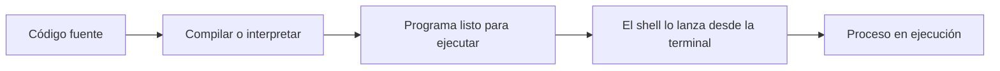

## Propósito

Un agente de IA es un programa. Para usarlo bien no necesitas programar, pero sí entender qué es un programa, cómo se crea y qué piezas lo componen. Con esa base podrás leer configuraciones, entender los errores que aparecen en la terminal y saber por qué un agente puede leer archivos, ejecutar comandos o recordar información.

## Respuesta simple

Un programa es un conjunto de instrucciones que una computadora ejecuta para cumplir una tarea. Las personas escriben esas instrucciones en un **lenguaje de programación** y las guardan en un archivo de texto llamado **código fuente**. Para que la computadora ejecute el programa, ese código se compila o se interpreta.

## Analogía

Imagina una receta de cocina. El código fuente es la receta escrita en un cuaderno: pasos claros, uno después de otro, con decisiones ("si la masa está pegajosa, agrega harina"). Compilar es traducir la receta completa a un instructivo exacto que el cocinero puede seguir de punta a punta. Interpretar es tener a una persona que lee la receta paso a paso y cocina cada instrucción en el momento.

La analogía tiene un límite: una computadora no tiene sentido común ni improvisa. Ejecuta exactamente lo que dice el programa, ni más ni menos. Cuando un programa falla, suele ser porque la instrucción escrita no era la correcta para la situación real.

## Ejemplo continuo

Camila le pide a un agente en OpenCode que organice sus facturas por fecha. El agente es un programa: sigue instrucciones para leer archivos, comparar fechas y ordenar resultados. Camila no escribe ese programa, pero puede observar sus efectos: ve qué archivos lee, qué comandos ejecuta y qué resultados produce. Ese comportamiento es posible porque detrás hay código fuente, un lenguaje de programación y un mecanismo para ejecutarlo.

## Código fuente y ejecución

El código fuente es texto legible que describe instrucciones. Se escribe en un lenguaje de programación, que es un idioma formal con reglas precisas. Este es un ejemplo mínimo de código fuente:

```javascript
const mensaje = "Hola, bienvenida al manual";
console.log(mensaje);
```

Ese texto no lo ejecuta la computadora directamente: primero debe transformarse. Hay dos caminos:

- **Compilar**: traducir el código fuente completo a un archivo ejecutable (un binario) antes de ejecutarlo. El binario ya está listo para correr y no necesita nada más.
- **Interpretar**: ejecutar el código fuente línea por línea usando un intérprete, que es el programa que lee y ejecuta cada instrucción en el momento.

El **runtime** (entorno de ejecución) es el programa que permite ejecutar el código interpretado. Por ejemplo, JavaScript se ejecuta con el runtime de Node.js. Los lenguajes compilados, como Go, generan un binario que ya incluye todo lo necesario.



## Lenguajes comunes y tipos de software

No hace falta conocer todos los lenguajes, pero sí reconocer cuáles existen y para qué se usan. El código fuente de cada lenguaje se guarda en archivos con una extensión reconocible:

| Lenguaje | Tipo | Para qué se usa | Archivos típicos |
|----------|------|-----------------|------------------|
| Go | Compilado | Herramientas de terminal y servidores | `.go` |
| JavaScript / TypeScript | Interpretado | Aplicaciones web, automatización, agentes | `.js`, `.ts` |
| Python | Interpretado | Análisis de datos, automatización, IA | `.py` |
| Bash | Interpretado | Scripts de automatización en la terminal | `.sh` |
| SQL | Lenguaje de consulta | Consultar y modificar bases de datos | `.sql` |
| Markdown / YAML / JSON | Lenguaje de marcado o datos | Documentación y configuración | `.md`, `.yml`, `.json` |

Los programas también se clasifican por su tipo: un **programa de terminal** como Git, una **aplicación web** que se ve en el navegador, o un **servicio** que corre en un servidor sin pantalla. Los agentes de IA son programas que además se conectan con un modelo y con herramientas para cumplir tareas.

## Abstracción: usar sin conocer los detalles

La **abstracción** es la capacidad de usar algo complejo a través de una interfaz simple, sin conocer sus detalles internos. Cuando escribes un comando como `git status`, no sabes (ni necesitas saber) cómo Git organiza los archivos internamente: la abstracción te da una instrucción simple para una tarea compleja.

Los agentes están llenos de abstracciones. Cuando le pides a un agente que ordene facturas, no describes cómo se lee cada archivo ni cómo se compara cada fecha: describes el resultado deseado y el agente resuelve los detalles. Saber que existe esa capa de abstracción te ayuda a distinguir qué controlas tú (el objetivo) y qué resuelve el programa (el mecanismo).

## Variables de entorno

Una **variable de entorno** es un valor que el sistema operativo guarda y que los programas pueden leer para ajustar su configuración. Cuando el shell lanza un programa, lee las variables de entorno y las pone a disposición del programa. No están escritas dentro del código fuente, así que puedes cambiar la configuración sin tocar el código.

Un ejemplo frecuente: un agente necesita saber qué proveedor de modelo usar o dónde está su archivo de configuración. Esa información suele vivir en variables de entorno. Para ver las variables de entorno desde la terminal:

```powershell
Get-ChildItem Env:
```

```bash
env
```

Cada programa decide qué variables lee y qué hace si una variable no existe, por ejemplo usar un valor por defecto. Por eso dos personas con la misma herramienta pueden tener comportamientos distintos: sus variables de entorno son distintas.

## Librerías y dependencias

Un programa rara vez se escribe desde cero. Los programas reutilizan piezas llamadas **librerías**: conjuntos de funciones que otros ya escribieron y que el programa llama cuando las necesita. Una **dependencia** es cualquier librería que tu programa necesita para funcionar.

Por ejemplo, un programa que trabaja con tablas puede usar una librería que ya sabe leer hojas de cálculo. El programa solo describe qué necesita en un archivo de configuración, y un gestor de paquetes (como `npm` en Node.js) instala esas dependencias automáticamente.

## Errores frecuentes

### ¿Por qué aparece "module not found" o "command not found"?

**Qué observas:** al ejecutar un programa, la terminal muestra un error de módulo o de comando inexistente.

**Qué suele significar:** falta una dependencia (un módulo no está instalado) o el programa que se intenta ejecutar no está instalado o no está en el `PATH`.

**Cómo comprobarlo:** revisa si el archivo de dependencias del proyecto existe y si el programa está instalado con su comando de verificación (por ejemplo `node --version`).

**Cómo resolverlo:** instala las dependencias con el gestor correspondiente del proyecto o instala el programa desde su fuente oficial.

**Cómo confirmar la solución:** vuelve a ejecutar el programa y verifica que termine sin errores.

### ¿Por qué un programa da un error de sintaxis?

**Qué observas:** el programa no se ejecuta y el intérprete o compilador indica una línea concreta del código.

**Qué suele significar:** el código fuente tiene un error de escritura: falta un símbolo, un paréntesis o una palabra clave mal escrita.

**Cómo comprobarlo:** lee el mensaje de error, que indica la línea y el carácter exacto.

**Cómo resolverlo:** corrige el texto del código fuente en esa línea siguiendo las reglas del lenguaje.

**Cómo confirmar la solución:** vuelve a compilar o ejecutar el programa y verifica que el error desaparezca.

## Resumen

| Concepto | ¿Qué es? | Ejemplo |
|----------|----------|---------|
| Programa | Conjunto de instrucciones que la computadora ejecuta | Un agente de IA |
| Código fuente | Texto legible escrito en un lenguaje | `main.go`, `index.js` |
| Compilar | Traducir todo el código a un binario | Go, C |
| Interpretar | Ejecutar el código línea por línea | JavaScript, Python |
| Lenguaje de programación | Idioma formal para escribir instrucciones | Go, Python, SQL |
| Abstracción | Usar algo complejo con una interfaz simple | `git status` |
| Variable de entorno | Valor que el shell ofrece a los programas | `PATH`, claves de configuración |
| Runtime | Programa que ejecuta código interpretado | Node.js |
| Dependencia | Librería que un programa necesita para funcionar | npm la instala |

## Términos de esta lección

Programa, Código fuente, Compilar, Interpretar, Lenguaje de programación, Abstracción, Variable de entorno, Runtime, Dependencia y Librería. Todos están definidos en el [glosario](../../20-referencia/02-glosario/).

## Para seguir aprendiendo

- [freeCodeCamp](https://www.freecodecamp.org/espanol/): certificaciones gratuitas con ejercicios interactivos en español.
- [Khan Academy — Computación](https://es.khanacademy.org/computing): introducción visual a la programación.
- [The Odin Project](https://www.theodinproject.com/): currículo completo de desarrollo web con proyectos (en inglés).
- La siguiente lección, [Frontend y backend](../04-frontend-backend/), explica cómo se organizan las aplicaciones modernas.
