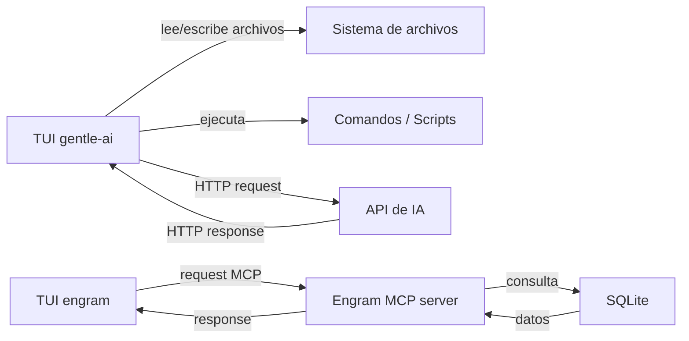

# Frontend y backend

## Qué aprenderás

Cuando abrís Gentle-AI en la terminal, ves una interfaz con colores, menús y texto. Esa interfaz se comunica con programas que procesan datos, consultan archivos y ejecutan agentes de IA.

Toda aplicación moderna se divide en dos grandes partes: lo que el usuario **ve** (frontend) y lo que procesa los **datos** (backend). En este capítulo vas a entender cómo funcionan, cómo se comunican y dónde está cada uno en el ecosistema Gentle.

## Por qué importa

Cuando usás Gentle-AI, Engram o cualquier herramienta, estás interactuando con un frontend que se comunica con uno o más backends. Cuando algo falla, saber si el error está en el frontend o en el backend te ahorra horas de búsqueda. Cuando leés documentación o archivos de configuración, entender esta división te da contexto sobre qué hace cada pieza.

## Visión simple

Toda aplicación tiene dos caras:

1. **Frontend**: lo que el usuario ve y con lo que interactúa. Botones, menús, pantallas, formularios. Su trabajo es mostrar información y capturar lo que el usuario hace.
2. **Backend**: lo que procesa los datos. Recibe pedidos del frontend, los procesa, consulta bases de datos, ejecuta lógica, y devuelve resultados. El usuario nunca ve el backend directamente.

El frontend **pide**. El backend **responde**.

## Analogía

Imaginá un restaurante.

El **frontend** es el menú, el mozo y la mesa. Vos ves el menú (interfaz), elegís un plato (interacción), y se lo decís al mozo (request). El mozo te trae el plato (response). Nunca ves lo que pasa en la cocina.

El **backend** es la cocina. Los cocineros reciben tu pedido, buscan los ingredientes, cocinan el plato, y se lo pasan al mozo para que te lo lleve. Vos no entrás a la cocina. Solo ves el resultado.

El **dato** que viaja es el pedido: "milanesa con papas fritas". Ese mismo dato lo escribe el mozo (frontend), lo lee el cocinero (backend), y el resultado viaja de vuelta.

Si la cocina se quema (error de backend), el mozo no tiene plato para traerte. Si el menú está mal escrito (error de frontend), pedís algo que no existe.

## Cómo funciona realmente

### Frontend: lo que el usuario ve

El **frontend** es un programa que se ejecuta en el dispositivo del usuario. Su responsabilidad es:

1. **Mostrar información** al usuario (texto, listas, gráficos, paneles)
2. **Capturar interacciones** (teclas que presiona, clics, comandos que escribe)
3. **Enviar datos** al backend cuando el usuario hace algo
4. **Recibir respuestas** del backend y actualizar lo que se muestra

Los frontends pueden tener muchas formas:

| Tipo | Ejemplo | ¿Dónde corre? |
|------|---------|--------------|
| **CLI** | `git status` | Terminal |
| **TUI** | `gentle-ai` (sin argumentos) | Terminal |
| **Web** | Gmail, GitHub | Navegador |
| **App móvil** | Twitter, WhatsApp | Teléfono |
| **App de escritorio** | VS Code | Computadora |

Todos son frontends. Todos muestran algo y capturan interacción del usuario.

### Backend: lo que procesa datos

El **backend** es un programa que se ejecuta en un **servidor** (otra computadora, o la misma). No tiene pantalla. No muestra nada. Solo:

1. **Recibe requests** (pedidos) del frontend
2. **Procesa datos**: consulta una base de datos, ejecuta lógica, llama a otros servicios
3. **Devuelve responses** (respuestas) al frontend

El backend no sabe si el frontend es una TUI, una web o una app móvil. Solo recibe datos y devuelve datos.

### Cliente y servidor

**Cliente**: el programa que **inicia** la comunicación. Pide algo. El frontend es siempre el cliente.

**Servidor**: el programa que **espera** comunicaciones. Responde a los pedidos. El backend es siempre el servidor.

```
Cliente (frontend)                  Servidor (backend)
      │                                  │
      │──── GET /api/agentes ──────────>│
      │                                  │  (busca agentes en la base de datos)
      │<─── { agentes: [...] } ──────────│
      │                                  │
```

Esta comunicación usa un **protocolo** (un conjunto de reglas). El protocolo más común es **HTTP** (HyperText Transfer Protocol), el mismo que usa la web.

### API

**API** (Application Programming Interface): es la "carta del restaurante" del backend. Define qué pedidos acepta y cómo deben ser.

Imaginá que el backend tiene estas operaciones disponibles:

```
GET    /api/agentes       → devuelve lista de agentes
POST   /api/agentes       → crea un agente nuevo
GET    /api/agentes/:id   → devuelve un agente específico
DELETE /api/agentes/:id   → borra un agente
```

Cada línea es un **endpoint** de la API. El frontend hace un request a un endpoint y recibe un response.

Un request HTTP se ve así:

```
GET /api/agentes HTTP/1.1
Host: localhost:8080
Authorization: Bearer token123
```

Un response HTTP se ve así:

```
HTTP/1.1 200 OK
Content-Type: application/json

{
  "agentes": [
    { "id": 1, "nombre": "code-reviewer", "activo": true },
    { "id": 2, "nombre": "doc-writer", "activo": false }
  ]
}
```

Los **códigos de estado HTTP** te dicen si el request funcionó:

| Código | Significado | Ejemplo de uso |
|--------|------------|----------------|
| `200` | OK (todo bien) | GET exitoso |
| `201` | Creado | POST exitoso (creó un recurso) |
| `400` | Bad Request (pedido mal formado) | Faltan datos obligatorios |
| `404` | Not Found (no existe) | URL mal escrita |
| `500` | Internal Server Error | El backend falló internamente |

### Estado

El **estado** de una aplicación es toda la información que define "cómo están las cosas en este momento".

Ejemplos de estado:

- "El usuario está logueado o no"
- "Hay 3 agentes seleccionados en la lista"
- "El archivo se está guardando" (estado de carga)
- "El modal de confirmación está abierto o cerrado"

El estado puede vivir en dos lugares:

**Estado local** (frontend): información que solo le importa a la interfaz. Por ejemplo, si un menú está desplegado o no. Si cerrás la app, ese estado se pierde.

**Estado del servidor** (backend): información persistente que vive en la base de datos. Por ejemplo, la lista de agentes configurados. Si cerrás la app, el estado sigue ahí.

El frontend sincroniza su estado con el backend a través de la API. Cuando el usuario hace algo, el frontend envía un request al backend, el backend actualiza la base de datos, y devuelve el nuevo estado.

### Base de datos como parte del backend

La **base de datos** es donde el backend guarda información de forma permanente. Cuando el backend necesita recordar algo (un agente, una configuración, un usuario), lo escribe en la base de datos. Cuando necesita recuperarlo, lo consulta.

```
Frontend ──> Backend ──> Base de datos
              │
              │ (procesa el request,
              │  consulta la BD,
              │  forma la respuesta)
              │
              v
           Response al frontend
```

### Procesos distintos

Frontend y backend son **procesos separados**. Cada uno tiene su propia memoria, su propio código, y puede ejecutarse en computadoras diferentes.

```
Computadora del usuario               Servidor remoto
┌─────────────────────┐              ┌──────────────────────┐
│  gentle-ai (TUI)    │  ──── HTTP ──> │  API server           │
│  (proceso #1234)    │  <─── JSON ──── │  (proceso #5678)      │
│                     │              │                       │
│  frontend           │              │  backend + BD          │
└─────────────────────┘              └──────────────────────┘
```

Esto significa que el frontend puede fallar sin afectar al backend, y viceversa. También significa que podés tener varios frontends distintos (TUI, web, móvil) conectados al mismo backend.

### TUI también es un frontend

Es común pensar que frontend = página web. Pero no. Una **TUI** (Text User Interface) es un frontend tan válido como una página web.

En el ecosistema Gentle:

- **gentle-ai** (sin argumentos) abre una TUI. Usa Bubbletea, un framework de Go para construir interfaces de terminal con teclas, colores, paneles y navegación. El usuario selecciona componentes, escribe prompts, ve progreso. Eso es frontend.

- **Engram** también tiene TUI. Cuando ejecutás `engram` sin argumentos, ves una interfaz para navegar y buscar memoria. Eso es frontend.

- El **backend** de Engram es el servidor MCP que recibe requests de la TUI o de otras herramientas y responde con datos de memoria.

Ejemplo concreto:



### Componentes, navegación, validación

Los frontends, sean TUI, web o móvil, comparten conceptos:

**Componentes**: piezas reutilizables de la interfaz. Un botón, una lista, un campo de texto, un panel. En la TUI de gentle-ai, el selector de componentes es un componente. La barra de progreso es otro.

**Navegación**: cómo el usuario se mueve entre pantallas o secciones. En una TUI, con teclas (Tab, flechas, Enter). En una web, con clicks en links o botones.

**Validación**: verificar que los datos que ingresa el usuario son correctos antes de enviarlos al backend. Por ejemplo, si el usuario escribe un prompt vacío, el frontend muestra un error sin molestar al backend.

Validación del lado del frontend:

```
Usuario escribe "" (vacío)
       │
Frontend: "El prompt no puede estar vacío"
       │
       └── (no envía nada al backend)
```

Validación del lado del backend:

```
Usuario escribe "" (vacío)
       │
Frontend envía POST /api/ejecutar
       │
Backend: "error: prompt vacío"
       │
Frontend muestra el error
```

Las aplicaciones bien diseñadas validan en ambos lados: el frontend para responder rápido, el backend como protección de seguridad.

## Errores frecuentes

1. **"Error 500" en la TUI**: el backend falló. Revisá que el servidor esté corriendo, que la base de datos esté disponible, y que el request sea correcto.
2. **"No se pudo conectar"**: el frontend no encuentra el backend. Verificá que la URL y el puerto sean correctos. En Engram, que el MCP server esté iniciado.
3. **La interfaz no responde**: puede ser que el frontend esté esperando una respuesta del backend que nunca llega. Revisá el backend. También puede ser que el frontend tenga un error de lógica (bug).
4. **"CORS error"**: el navegador bloquea requests del frontend web a un backend en otro dominio. No aplica a TUI/CLI porque no usan navegador.
5. **Estado desincronizado**: el frontend muestra datos viejos porque no refrescó su estado después de un cambio en el backend. Solución: refrescar (reiniciar la TUI, recargar la página).

## Resumen

| Concepto | ¿Qué es? | ¿Dónde está? |
|----------|---------|-------------|
| Frontend | La interfaz que ve el usuario | En la computadora del usuario |
| Backend | El que procesa datos | En un servidor |
| Cliente | El que inicia la comunicación | Generalmente el frontend |
| Servidor | El que espera y responde | Generalmente el backend |
| API | La "carta" del backend (qué endpoints acepta) | Definida por el backend |
| HTTP | Protocolo de comunicación | Viaja por la red |
| Request | Pedido del cliente al servidor | Ej: GET /api/agentes |
| Response | Respuesta del servidor | Ej: JSON con datos |
| Estado local | Info efímera del frontend | Memoria del frontend |
| Estado persistente | Info guardada en BD | Base de datos |
| Endpoint | Una operación específica de la API | Ej: POST /api/agentes |
| Componente | Pieza reutilizable de la interfaz | Botón, lista, panel |

## Preguntas

1. ¿Cuál es la diferencia principal entre frontend y backend?
2. ¿Qué es una API y para qué sirve?
3. ¿Qué significa que el frontend y el backend sean procesos distintos?
4. ¿Por qué la validación debe hacerse tanto en frontend como en backend?
5. En el ecosistema Gentle, ¿qué parte es frontend y qué parte es backend?

## Ejercicio

1. Abrí Gentle-AI en la terminal con `gentle-ai`. Identificá qué partes son frontend (interfaz, menús) y qué partes son backend (procesamiento, llamadas a API de IA).
2. Si tenés Engram instalado, ejecutá `engram doctor` (CLI) y después `engram` (TUI). Notá la diferencia. El CLI devuelve un resultado y termina. La TUI queda abierta esperando tu interacción. Ambas son frontends.
3. Abrí PowerShell y ejecutá `Get-Process | Where-Object ProcessName -like "*node*"` para ver si algún proceso backend de Node.js está corriendo.
4. Pensá en una aplicación que uses (WhatsApp, Gmail, GitHub). Identificá: ¿cuál es el frontend? ¿Cuál es el backend? ¿Cómo se comunican?

## Fuentes verificadas

- Concepto: documentación general de arquitectura de software
- Protocolo: HTTP/1.1 (RFC 7231)
- Ecosistema: gentle-ai 2.x (Bubbletea TUI), engram 1.x (TUI + MCP server)
- Fecha: 2026-07-20
- Estado: 🟢 Verificado (conocimiento fundamental, no depende de versión específica)
