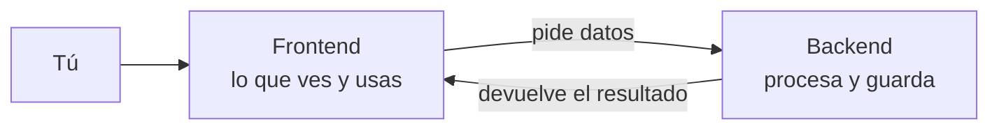
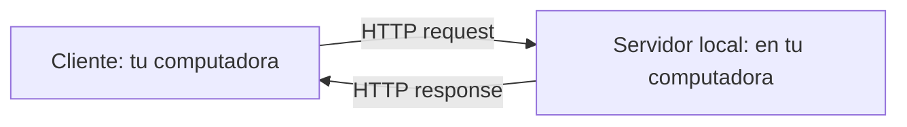
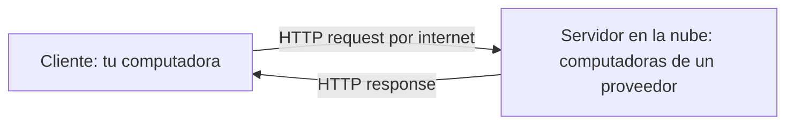
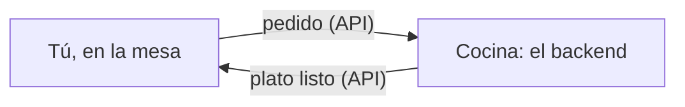
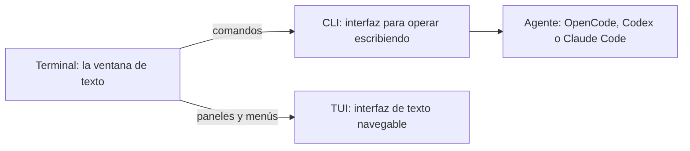
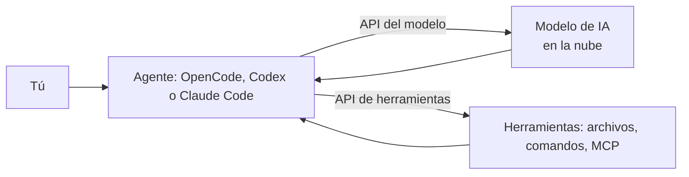

## Propósito

En la lección de programación viste que un programa es una secuencia de instrucciones y que un agente puede escribirlo por ti. Ahora falta responder otra pregunta: ¿dónde vive el software que usas y en qué partes se divide?

Esta lección te da el mapa de las dos caras de casi todo software: el **frontend** (lo que ves y usas), el **backend** (lo que procesa y guarda detrás) y la **API**, el contrato que los conecta. También vas a ver dónde corre cada parte, en tu computadora o en la nube, y por qué toda esta división importa cuando trabajas con agentes como OpenCode, Codex o Claude Code. No necesitas programar: se trata de entender el mapa.

## Respuesta simple

Toda aplicación tiene dos caras. El frontend es la parte que ves y con la que interactúas: botones, formularios, menús y pantallas. El backend es la parte que trabaja detrás: recibe lo que el frontend le pide, procesa los datos y devuelve resultados. No se comunican a gritos: usan una API, un contrato que define qué operaciones ofrece el backend y cómo pedirlas.

El backend corre en un servidor, un programa que espera pedidos y responde. Ese servidor puede estar en tu propia computadora (servidor local) o en computadoras de otra persona a las que llegas por internet (la nube). Y la interfaz desde la que usas tus agentes, la terminal con sus programas de comandos y sus interfaces de texto, también es un frontend, igual que la pantalla de una aplicación.

## Analogía: el restaurante

Imagina que una aplicación es un restaurante. El frontend es lo que tú ves: la mesa, el menú y el mozo que te atiende. El backend es la cocina: nadie entra, pero allí se prepara el plato. La API es el menú: define qué puedes pedir y cómo lo pides. El mozo es la comunicación: lleva tu pedido a la cocina y te trae el plato listo. Tú, el cliente, pides; la cocina, el servidor, recibe el pedido y responde.

Esta analogía tiene un límite: un mozo tolera pedidos imprecisos, como "algo fresco", pero una API exige exactitud. Cada operación tiene una dirección y un formato precisos; si pides mal, obtienes un error. Además, en un restaurante la mesa y la cocina están en el mismo edificio; en el software, cliente y servidor suelen vivir en computadoras distintas, conectadas por internet.

## Ejemplo continuo: Camila y el formulario de vacaciones

Camila trabaja en administración: organiza documentos y cronogramas, no programa y usa Windows. En la lección anterior le pidió a un agente que sumara las ventas de varios archivos. Hoy tiene otro problema: las vacaciones del equipo se coordinan por correo y se pierden pedidos.

Quiere una página simple donde sus compañeros carguen sus fechas y ella vea la lista. Abre OpenCode y le pide al agente que la construya. El agente va a crear dos partes: el formulario que ven sus compañeros (frontend) y la parte que guarda los pedidos y los lista (backend), conectadas por una API. Primero todo correrá en la computadora de Camila, para probar (servidor local); después, con ayuda del agente, publicará la página para que el equipo la use desde internet (la nube). Camila no escribe código: sigue el trabajo del agente con el mapa de esta lección.

## Explicación progresiva

### Frontend y backend: dos responsabilidades, no dos tecnologías

El **Frontend**\* es la parte de una aplicación que corre en el dispositivo de la persona que la usa y gestiona la interfaz: muestra información, captura lo que la persona hace y envía los datos al backend.

El **Backend**\* es la parte que procesa los datos: recibe pedidos, los valida, consulta información, ejecuta la lógica y devuelve resultados. No tiene pantalla: nadie lo ve, solo habla con los demás programas.

La división es por responsabilidad, no por tecnología. Un frontend puede ser una página web, una aplicación de celular, un programa de escritorio o una interfaz de terminal; lo que lo hace frontend es que la persona lo ve y lo usa. El frontend pide; el backend responde.

```mermaid
flowchart LR
    U["Tú"] --> F["Frontend<br/>lo que ves y usas"]
    F -->|"pide datos"| B["Backend<br/>procesa y guarda"]
    B -->|"devuelve el resultado"| F
```

Se lee de izquierda a derecha: tú usas el frontend, el frontend pide datos al backend y el backend devuelve el resultado, que el frontend muestra. El recorrido del formulario de Camila es el mismo: sus compañeros ven el formulario, el formulario pide guardar las fechas y el backend guarda el pedido y lo devuelve a la lista.

Otra idea útil: el **estado**. El frontend guarda un estado pasajero, lo que la pantalla muestra en este momento; el backend guarda los datos que deben durar, como los pedidos de vacaciones guardados. Cómo se guardan esos datos de forma permanente es el tema de la próxima lección, bases de datos.

### Cliente y servidor: quién pide y quién responde

El **Cliente (contexto red)**\* es el programa que inicia la comunicación: el que pide. El **Servidor (contexto red)**\* es el programa que espera los pedidos y responde. En una aplicación típica el frontend es el cliente y el backend es el servidor, pero el rol no lo define la tecnología: lo define quién inicia el pedido.

¿Dónde vive el servidor? En dos lugares, y conviene diferenciarlos.

**Servidor local**: corre en tu propia computadora, como cualquier programa. Cuando Camila prueba el formulario en su PC, el agente levanta el servidor en su computadora y su navegador se conecta a él escribiendo `localhost` en la dirección.

```mermaid
flowchart LR
    C["Cliente: tu computadora"] -->|"HTTP request"| S["Servidor local: en tu computadora"]
    S -->|"HTTP response"| C
```

Cliente y servidor viven en la misma computadora, pero siguen siendo dos programas distintos: uno pide y el otro responde. Esto es lo que pasa cada vez que pruebas una aplicación en tu equipo.

**Servidor en la nube**: la **Nube (computación en la nube)**\* son computadoras y servicios de otra persona, un proveedor como Google, Amazon o Microsoft, a los que accedes por internet. Cuando el formulario queda publicado para el equipo, el servidor vive en la nube: no mantienes ninguna computadora, pero dependes de internet.

```mermaid
flowchart LR
    C["Cliente: tu computadora"] -->|"HTTP request por internet"| S["Servidor en la nube: computadoras de un proveedor"]
    S -->|"HTTP response"| C
```

El pedido viaja por internet hasta el servidor, y la respuesta vuelve por el mismo camino. Recuerda de la primera lección que el modelo de IA de tus agentes también corre en un servidor remoto: eso es la nube en acción.

### La API: el menú de operaciones

La **API**\* (Application Programming Interface) es el contrato que permite que dos programas se comuniquen: define qué operaciones ofrece el backend y cómo se piden. Es el menú del restaurante: no entras a la cocina, pides del menú.

```mermaid
flowchart LR
    M["Tú, en la mesa"] -->|"pedido (API)"| CO["Cocina: el backend"]
    CO -->|"plato listo (API)"| M
```

La API es la interfaz que expone el backend: define las operaciones disponibles y el formato de los datos, como el menú del restaurante. El que recibe el pedido, lo procesa y responde es el propio backend (la cocina); la API no es un servicio intermedio aparte, sino el contrato que dice cómo se habla con él. En el formulario de Camila, la API define operaciones como "guardar un pedido de vacaciones" y "listar los pedidos guardados".

Para pedir, los programas usan un protocolo común en internet: **HTTP (HyperText Transfer Protocol)**. El pedido se llama request y la respuesta, response. La respuesta trae un código que resume el resultado: 200 significa "todo bien", 404 "no existe lo que pediste" y 500 "el servidor falló". Por ahora no necesitas más que eso.

¿Por qué importa entender la API en este manual? Porque los agentes viven de APIs:

- Cuando el agente necesita pensar, llama a la API del proveedor del modelo de IA, que corre en la nube.
- Cuando el agente necesita actuar, usa herramientas (leer archivos, ejecutar comandos) y cada herramienta es una API. Los servidores MCP (Model Context Protocol), que conectan herramientas con agentes, también definen APIs; se estudian a fondo en su propio módulo.
- Cuando le pides al agente que construya un servicio como el de Camila, él crea la API que conecta el formulario con la parte que guarda datos.

Entender qué es una API te da el mapa de dónde se unen los programas y de qué hacer cuando uno de esos puntos falla.

### CLI, TUI y terminal: tres cosas que se confunden

En la lección de la terminal viste la diferencia entre la ventana y el programa que interpreta comandos. Ahora conviene separar otros tres conceptos que suenan igual.

La **Terminal**\* es la ventana: el lugar de texto donde escribes. Un **CLI (Command Line Interface)**\* es una interfaz que un programa expone para operarse escribiendo comandos: `opencode` y `codex` son comandos que escribes en la terminal. Una **TUI (Text User Interface)**\* es una interfaz que, dentro de la misma ventana, dibuja paneles y menús que navegas con las teclas; la interfaz con la que se abre OpenCode en la terminal es una TUI. Un mismo programa puede ofrecer ambas interfaces según cómo lo uses.

```mermaid
flowchart LR
    T["Terminal: la ventana de texto"] -->|"comandos"| C["CLI: interfaz para operar escribiendo"]
    T -->|"paneles y menús"| U["TUI: interfaz de texto navegable"]
    C --> A["Agente: OpenCode, Codex o Claude Code"]
```

La terminal es el lugar; el CLI y la TUI son dos maneras en que los programas se presentan en ese lugar. Y hay un matiz que evita confusiones: cuando una conversación sobre una aplicación dice "el frontend", se habla de la parte visible de esa aplicación; cuando hablas de tus herramientas, la terminal, el CLI y la TUI desde donde usas tus agentes también son un frontend. Es el mismo concepto, la interfaz visible, aplicado a dos escenarios.

## Aplicación práctica: el agente y las APIs

Este diagrama resume el mapa completo de lo que pasa cuando usas un agente:

```mermaid
flowchart LR
    U["Tú"] --> A["Agente: OpenCode, Codex o Claude Code"]
    A -->|"API del modelo"| M["Modelo de IA<br/>en la nube"]
    A -->|"API de herramientas"| H["Herramientas: archivos, comandos, MCP"]
    M --> A
    H --> A
```

Se lee de izquierda a derecha: tú hablas con el agente, el agente llama por API al modelo de IA para pensar y por API a sus herramientas para actuar, y los resultados vuelven a él. Cada punto de unión de este diagrama es una API. Cuando algo falla, saber cuál de estas uniones es la que falla te dice si el problema es de red, del proveedor del modelo o de una herramienta.

### Práctica guiada: ver el frontend y el backend en acción

Para afianzar el mapa, mira dos videos cortos en español, en orden:

1. [Todo lo que necesitas saber del desarrollo frontend](https://youtu.be/Rla0IMxIlNc): qué es el frontend y qué hace.
2. [Todo lo que necesitas saber del desarrollo backend](https://youtu.be/l3HJsXA-Fa4): qué es el backend y cómo se relaciona con el frontend.

Después responde con tus palabras (puedes escribirlas o pedírselas a tu agente): ¿de qué se encarga el frontend? ¿De qué se encarga el backend? ¿Cómo se comunican?

Como comprobación final, elige una aplicación que uses a diario (el correo, una página de trámites, una app del celular) e identifica en ella la parte que ves y la parte que procesa los datos. Si puedes explicar esa diferencia, la lección cumplió su objetivo. La consigna es abierta: no hay examen.

## Decisiones y límites

- **MCP y protocolos de herramientas** se estudian a fondo en sus propios módulos; aquí solo aparece como ejemplo de por qué la API importa.
- **Esta lección no enseña a elegir tecnologías**: eso es la lección de elegir stack. Tampoco construye una aplicación completa: eso es la lección de cómo funciona una aplicación moderna.
- **HTTP se explica solo a nivel de idea** (request, response y códigos); los detalles son tema de las lecciones de la web.
- **Frontend y backend son roles, no marcas**: un mismo programa puede contener ambas partes, y cada parte puede usar tecnologías distintas.
- **El estado se menciona solo como idea**: cómo se guardan los datos de forma permanente es el tema de la próxima lección.

## Errores frecuentes

### Veo "404" o "500" en una página y no sé qué significa

- Qué observas: la página carga, pero el contenido no aparece y hay un número de error.
- Qué significa: el frontend llegó a la API, pero algo falló: 404 es "no existe lo que pediste" y 500 es "el servidor falló".
- Cómo comprobar: el error aparece al pedir un dato específico, no al abrir la página.
- Cómo resolver: para 404, revisa la dirección o el enlace; para 500, suele ser un problema del backend que debes avisar o esperar.
- Cómo confirmar: al reintentar, la página muestra el contenido.

### Dice "no se puede conectar con el servidor"

- Qué observas: la aplicación avisa que no encuentra al servidor.
- Qué significa: el frontend está, pero el backend no responde: puede estar apagado, no iniciado (servidor local) o con una dirección incorrecta.
- Cómo comprobar: si es un servicio local, confirma que el programa servidor esté corriendo.
- Cómo resolver: inicia el servidor o verifica la dirección; si es la nube, revisa tu conexión a internet.
- Cómo confirmar: la aplicación responde de nuevo.

### Confundo CLI, TUI y terminal

- Qué observas: usas las tres palabras como sinónimos.
- Qué significa: la terminal es la ventana; el CLI y la TUI son dos formas de interfaz de los programas que corren en ella.
- Cómo comprobar: si te comunicas escribiendo comandos u opciones, es un CLI; si quedan paneles que navegas con las teclas, es una TUI. Que un programa termine o siga abierto no define la interfaz: una CLI puede ser de larga duración o interactiva.
- Cómo resolver: di "terminal" al lugar, y "CLI" o "TUI" a la forma del programa.
- Cómo confirmar: describes cada pieza con su palabra correcta.

### "Frontend es lo mismo que página web"

- Qué observas: piensas que solo las páginas web tienen frontend.
- Qué significa: frontend es toda interfaz visible: también la de los programas de terminal, las apps de celular y las de escritorio.
- Cómo comprobar: la interfaz desde la que usas OpenCode en la terminal es un frontend y no es una página web.
- Cómo resolver: piensa en "la parte que ves y usas", no en una tecnología.
- Cómo confirmar: identificas frontends en programas que no son web.

## Resumen

| Concepto | Qué es | Ejemplo |
|----------|--------|---------|
| Frontend | La parte que la persona ve y usa | El formulario de vacaciones |
| Backend | La parte que procesa y guarda datos | Guardar los pedidos de vacaciones |
| API | El contrato que conecta programas | Las operaciones del formulario |
| Cliente (contexto red) | El programa que pide | El navegador de los compañeros de Camila |
| Servidor (contexto red) | El programa que espera y responde | El programa que guarda los pedidos |
| Servidor local | Servidor en tu propia computadora | La prueba en la PC de Camila |
| Nube (computación en la nube) | Computadoras ajenas a las que llegas por internet | La página publicada para el equipo |
| Terminal | La ventana de texto | PowerShell, Terminal.app |
| CLI (Command Line Interface) | Programa que se opera por comandos | Git, OpenCode, Codex |
| TUI (Text User Interface) | Interfaz de texto con paneles y menús | La interfaz de OpenCode en la terminal |

Lo esencial para recordar: el frontend es lo que ves, el backend es lo que trabaja detrás, la API es el contrato que los conecta, el servidor puede vivir en tu computadora o en la nube, y la terminal, el CLI y la TUI son tres piezas distintas que a menudo se confunden.

## Términos de esta lección

- **Frontend**: la parte de una aplicación que corre en el dispositivo del usuario y gestiona la interfaz que ve y usa.
- **Backend**: la parte de una aplicación que corre en el servidor y gestiona datos, lógica y autenticación.
- **API**: contrato que permite que dos programas se comuniquen entre sí.
- **Cliente (contexto red)**: el programa que inicia la comunicación, pidiendo algo al servidor.
- **Servidor (contexto red)**: el programa que espera los pedidos del cliente y responde.
- **Nube (computación en la nube)**: computadoras y servicios a los que se accede por internet, sin mantener el hardware propio.
- **CLI (Command Line Interface)**: interfaz de texto donde se escriben comandos.
- **TUI (Text User Interface)**: interfaz de usuario basada en texto con elementos visuales como paneles y menús.
- **Terminal**: interfaz de texto donde escribes comandos para que la computadora los ejecute.

Las definiciones canónicas de todos los términos del manual están en el [glosario](../../20-referencia/02-glosario/).

## Para seguir aprendiendo

- [Todo lo que necesitas saber del desarrollo frontend (BettaTech)](https://youtu.be/Rla0IMxIlNc): video en español que introduce qué es el frontend y qué hace.
- [Todo lo que necesitas saber del desarrollo backend (BettaTech)](https://youtu.be/l3HJsXA-Fa4): video en español que explica el backend y su relación con el frontend.
- [MDN Web Docs](https://developer.mozilla.org/es/): referencia técnica autorizada de tecnologías web, con versión en español.
- [freeCodeCamp](https://www.freecodecamp.org/espanol/): certificaciones gratuitas con ejercicios interactivos, con versión en español.

La próxima lección te lleva a [bases de datos](../05-bases-de-datos/), donde verás cómo el backend guarda los datos de forma permanente.
