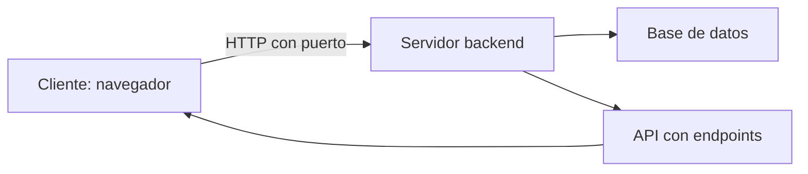
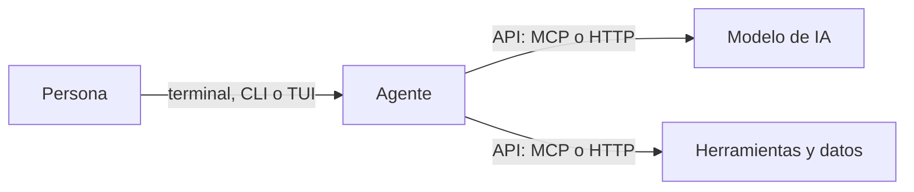

## Propósito

Cualquier aplicación moderna se divide en partes con responsabilidades distintas: la interfaz que ves, la lógica que procesa los datos y la comunicación entre ambas. Entender esa división te ayuda a saber dónde está el problema cuando algo falla, a leer documentación técnica y a comprender cómo se conecta un agente de IA con el modelo y con sus herramientas.

## Respuesta simple

Toda aplicación tiene dos caras. El **frontend** es lo que la persona ve y con lo que interactúa: botones, menús, pantallas. El **backend** es lo que procesa los datos: recibe pedidos, los resuelve y devuelve resultados. Entre ambos hay una **API**: el contrato que define cómo se comunican. El frontend pide, el backend responde, y la API es el canal acordado para que eso ocurra.

## Analogía

Imagina un restaurante. El frontend es el menú, el mozo y la mesa: la parte que ves y con la que hablas. El backend es la cocina: los cocineros reciben el pedido, preparan el plato y lo devuelven por el mozo. La API es la carta del restaurante: la lista exacta de platos que la cocina acepta preparar. No entras a la cocina: haces tu pedido por el canal establecido y esperas el resultado.

La analogía tiene un límite: en una aplicación, el frontend y el backend no son personas sino programas, y la comunicación es instantánea y automatizada, sin conversación humana.

## Ejemplo continuo

Valentina trabaja en marketing y revisa el panel de una campaña en su navegador. Lo que ve (los gráficos, los filtros, los números) es el frontend: corre en su computadora, dentro del programa navegador. Los datos que aparecen en el panel los prepara el backend: un programa en un servidor que consulta la base de datos y devuelve los números. Entre ambos hay una API por HTTP: el frontend pide datos, el backend los calcula y los envía.

Durante el desarrollo del sitio de la campaña, Valentina abre la aplicación en su computadora en una dirección como `http://localhost:4321/` para verla antes de publicarla. El número que aparece en esa dirección es el puerto: identifica qué servicio corre en esa computadora.

## Frontend: la interfaz

El frontend es un programa que se ejecuta en el dispositivo de la persona. Su responsabilidad es mostrar información y capturar lo que la persona hace. Tiene muchas formas posibles: una página web en un navegador, una aplicación móvil, una aplicación de escritorio, o una interfaz en la terminal. Según la modalidad de interacción, una interfaz de terminal puede ser una CLI (comando que termina con un resultado) o una TUI (interfaz abierta con paneles y menús). Todas son frontends: todas muestran algo y capturan interacción.

El **cliente** es el programa que inicia la comunicación: en una web, el cliente es el navegador; en una aplicación de escritorio, la propia aplicación. El cliente no es "la computadora" en abstracto: es el programa concreto que pide datos.

## Backend: la lógica y los datos

El backend es un programa que se ejecuta en un servidor (otra computadora, o la misma). No tiene pantalla: no muestra nada. Recibe pedidos del frontend, los procesa, consulta la base de datos si hace falta y devuelve una respuesta. El **servidor** es el programa que espera esas comunicaciones y responde. El frontend siempre pide; el backend siempre responde.

## La API y la comunicación por HTTP

La **API** define qué pedidos acepta el backend y cómo deben ser. Cada operación disponible se llama **endpoint**. La comunicación entre el frontend y el backend suele viajar por **HTTP**, el protocolo de la web. Un pedido HTTP tiene una dirección (por ejemplo `http://localhost:4321/api/campanas`) y el puerto indica qué servicio atiende esa dirección.

El frontend y el backend son procesos separados: pueden estar en la misma computadora o en computadoras distintas, y pueden fallar de forma independiente. Por eso un mismo backend puede atender varios frontends a la vez: la web, la app móvil y una TUI.

```mermaid
flowchart LR
    Navegador["Cliente: navegador"] -->|HTTP con puerto| Servidor["Servidor backend"]
    Servidor --> BD["Base de datos"]
    Servidor --> API["API con endpoints"]
    API --> Navegador
```

## La persona, el agente y las conexiones por API

Los agentes de IA también se conectan por API, pero no con la persona. Cuando la persona conversa con el agente, lo hace a través de la terminal, de una CLI o de una TUI; no es una conexión por API. En cambio, el agente se conecta al modelo y a sus herramientas a través de APIs, por ejemplo con MCP o HTTP: esas conexiones sí son APIs, porque conectan programas entre sí.

```mermaid
flowchart LR
    Persona["Persona"] -->|terminal, CLI o TUI| Agente["Agente"]
    Agente -->|API: MCP o HTTP| Modelo["Modelo de IA"]
    Agente -->|API: MCP o HTTP| Herramientas["Herramientas y datos"]
```

Distinguir estos dos canales evita la confusión más común: la persona no "se conecta por API" al agente. La persona usa una interfaz; el agente usa APIs para hablar con otros programas.

## Persistencia: no es exclusiva del backend

Es común creer que guardar datos es cosa del backend, pero no es así. La persistencia es la capacidad de conservar datos entre sesiones, y puede vivir en varias capas. El backend suele guardar los datos principales en una base de datos, pero el frontend también puede guardar información: un navegador puede conservar preferencias o contenido temporal usando mecanismos locales como localStorage o IndexedDB, que sobreviven al cierre de la pestaña o del navegador.

Por eso, cuando una aplicación pierde datos, primero conviene preguntarse dónde estaban guardados: ¿en la base de datos del backend, en el navegador o solo en la memoria del programa? Cada capa tiene reglas distintas de duración y de acceso.

## Errores frecuentes

### ¿Por qué aparece un error 500?

**Qué observas:** la interfaz muestra un mensaje de error del servidor.

**Qué suele significar:** el backend falló al procesar el pedido: puede ser un error interno, una base de datos caída o una consulta mal formada.

**Cómo comprobarlo:** revisa los registros del servidor o el mensaje de error que devuelve la API.

**Cómo resolverlo:** verifica que el servidor esté activo y que la base de datos responda, y corrige el problema en el backend o en el pedido que se envió.

**Cómo confirmar la solución:** repite la acción y verifica que la interfaz muestre el resultado esperado.

### ¿Por qué la aplicación no se conecta al servidor?

**Qué observas:** la interfaz dice que no puede conectar o que la dirección no responde.

**Qué suele significar:** el backend no está corriendo, o la dirección que se usa tiene un puerto o una ruta incorrectos.

**Cómo comprobarlo:** abre la dirección completa en el navegador, por ejemplo `http://localhost:4321/`, y observa qué responde el servidor.

**Cómo resolverlo:** inicia el servidor o corrige la dirección y el puerto en la configuración del frontend.

**Cómo confirmar la solución:** recarga la aplicación y verifica que los datos aparezcan.

## Resumen

| Concepto | ¿Qué es? | ¿Dónde está? |
|----------|----------|--------------|
| Frontend | La interfaz que ve y usa la persona | En el dispositivo de la persona |
| Backend | El programa que procesa los datos | En un servidor |
| Cliente | El programa que inicia la comunicación | El navegador o la aplicación |
| Servidor | El programa que espera y responde | En el servidor |
| API | El contrato de comunicación entre programas | Definido por el backend |
| Endpoint | Una operación concreta de la API | En la dirección de la API |
| Puerto | Número que identifica un servicio | En la dirección de la aplicación |
| Persistencia | Conservar datos entre sesiones | En el backend o en el navegador |

## Términos de esta lección

Frontend, Backend, API, Cliente (contexto red), Servidor (contexto red), HTTP (HyperText Transfer Protocol), Endpoint, Puerto (red), Navegador, MCP (Model Context Protocol) e Interfaz. Todos están definidos en el [glosario](../../20-referencia/02-glosario/).

## Para seguir aprendiendo

- [MDN Web Docs](https://developer.mozilla.org/es/): documentación autorizada de tecnologías web en español.
- [freeCodeCamp](https://www.freecodecamp.org/espanol/): cursos gratuitos con ejercicios interactivos.
- La siguiente lección, [Bases de datos](../05-bases-de-datos/), explica cómo se guardan los datos de forma organizada.
