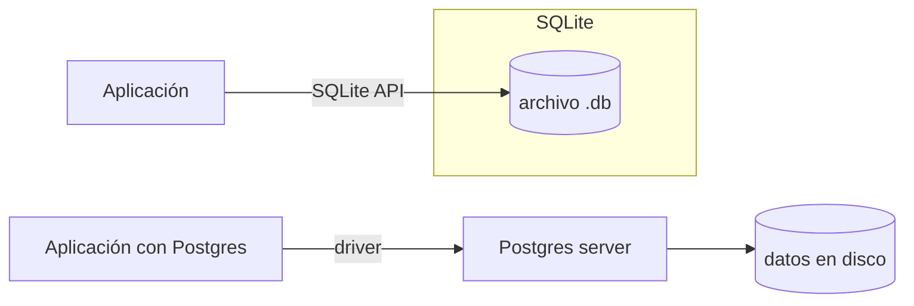

# Bases de datos

## Qué aprenderás

Cuando cerrás Gentle-AI y lo volvés a abrir, tu configuración sigue ahí. Cuando Engram guarda un recuerdo de una conversación anterior, lo recupera después de reiniciar el sistema. Eso es posible gracias a una **base de datos**: un sistema que guarda información de forma permanente y permite buscarla rápidamente.

En este capítulo vas a entender qué son los datos, cómo se guardan, qué es SQL, por qué Engram usa SQLite, y cuándo se necesita Postgres.

## Por qué importa

Engram, la herramienta de memoria persistente del ecosistema Gentle, usa una base de datos SQLite para guardar todos tus recuerdos, decisiones y descubrimientos. Cuando ejecutás `engram search` o `mem_search`, estás consultando una base de datos SQLite con búsqueda de texto completo (FTS5). Sin entender qué es una base de datos, no podés entender cómo funciona Engram ni por qué es confiable. Tampoco vas a poder diagnosticar por qué una búsqueda no encuentra algo, o por qué tu configuración desapareció.

## Visión simple

Un **dato** es un valor: un nombre, un número, una fecha. Por ejemplo: `"Harry"`, `42`, `2026-07-20`.

Una **base de datos** es un sistema para guardar datos de forma organizada y recuperarlos rápidamente. Es como un archivero con carpetas etiquetadas, en vez de tirar todos los papeles en una caja.

La **persistencia** es la capacidad de que los datos sobrevivan entre ejecuciones de un programa. Cuando apagás la computadora y la volvés a prender, los datos persistentes siguen ahí. Los datos no persistentes (como los que están en la RAM) se pierden.

## Analogía

Imaginá una biblioteca.

Los **datos** son los libros. Cada libro tiene un título, un autor, un año, un género.

La **base de datos** es la biblioteca completa: los estantes, el sistema de clasificación, el catálogo, el bibliotecario.

Las **tablas** son los estantes. Un estante para novelas, otro para ciencia, otro para historia. Cada estante solo tiene libros de una categoría.

Las **filas** son cada libro individual. En el estante de novelas, cada libro es una fila.

Las **columnas** son los datos de cada libro: título, autor, año, género. Todos los libros tienen los mismos campos.

El **bibliotecario** es el sistema de base de datos (SQLite, Postgres). Vos le pedís: "dame todos los libros de ciencia ficción del año 2000 en adelante". El bibliotecario busca en el estante correcto, aplica el filtro, y te trae los resultados.

## Cómo funciona realmente

### Dato

Un **dato** es la unidad mínima de información. Puede ser:

| Tipo de dato | Ejemplo | ¿Para qué se usa? |
|-------------|---------|-------------------|
| Texto (`TEXT`) | `"Harry"` | Nombres, descripciones, contenido |
| Número entero (`INTEGER`) | `42` | IDs, edades, contadores |
| Número decimal (`REAL`) | `3.14` | Mediciones, precios |
| Booleano (`BOOLEAN`) | `true` / `false` | Sí/no, activo/inactivo |
| Fecha (`DATE`) | `2026-07-20` | Fechas de creación, modificación |
| Hora (`TIMESTAMP`) | `2026-07-20 15:30:00` | Fechas con hora exacta |

En el contexto de Engram, un dato puede ser el texto de una memoria (`"Fixed N+1 query en UserList"`), su tipo (`"bugfix"`), o su fecha de creación.

### Persistencia

La **persistencia** es lo que separa un programa "descartable" de uno "que recuerda".

Un programa sin persistencia:

```
1. Ejecutás el programa
2. Configurás algo
3. Cerrás el programa
4. Todo lo que configuraste se pierde
```

Un programa con persistencia:

```
1. Ejecutás el programa
2. Configurás algo
3. El programa escribe la configuración en disco
4. Cerrás el programa
5. Volvés a ejecutarlo
6. El programa lee la configuración del disco
7. Tu configuración sigue ahí
```

La persistencia se logra escribiendo datos en **disco** (SSD/HDD), no en **RAM**. El disco mantiene los datos cuando la energía se corta.

### Archivo vs base de datos

Podés guardar datos en un archivo de texto o en una base de datos. ¿Cuándo usar cada uno?

| | Archivo plano | Base de datos |
|--|--------------|---------------|
| Formato | TXT, JSON, YAML, CSV | Binario / SQL |
| Estructura | La define el programador | Tablas con filas y columnas |
| Búsqueda | Leer todo y filtrar en código | SQL optimizado con índices |
| Concurrente | Un programa a la vez | Múltiples programas simultáneos |
| Consistencia | Manual (el programa debe cuidarla) | Automática (transacciones) |
| Velocidad | Lento con muchos datos | Rápido con índices y optimizaciones |

Usá un **archivo** cuando:
- Son pocos datos (decenas o cientos de elementos)
- Solo un programa accede a la vez
- La estructura es simple
- Ejemplo: un archivo `.env` con variables de entorno

Usá una **base de datos** cuando:
- Son muchos datos (miles, millones de registros)
- Varios programas o procesos necesitan acceder al mismo tiempo
- Necesitás búsquedas rápidas y complejas
- Necesitás garantías de que los datos no se corrompan
- Ejemplo: todas las memorias de Engram

Engram usa una base de datos SQLite para guardar sus observaciones. Podría usar archivos JSON, pero la búsqueda sería lenta y propensa a errores con varios procesos.

### Tablas, filas, columnas

Una **tabla** es una estructura que organiza datos en filas y columnas.

Ejemplo de tabla `memorias`:

| id | titulo | tipo | fecha |
|----|--------|------|-------|
| 1 | Fixed N+1 query | bugfix | 2026-07-19 |
| 2 | Decidí usar SQLite | decision | 2026-07-18 |
| 3 | Descubrí FTS5 | discovery | 2026-07-17 |

- **Columna**: un campo específico (`id`, `titulo`, `tipo`, `fecha`). Todas las filas tienen las mismas columnas, pero los valores pueden ser diferentes.
- **Fila**: un registro completo. Cada memoria es una fila.
- **Celda**: el valor en la intersección de una fila y una columna. Por ejemplo, `"bugfix"` es la celda de la fila 1, columna `tipo`.

### Clave primaria

La **clave primaria** (primary key) es una columna (o combinación de columnas) que identifica **de forma única** cada fila.

En la tabla de arriba, `id` es la clave primaria. Ninguna fila puede tener el mismo `id`. Si intentás insertar otra fila con `id = 1`, la base de datos te va a rechazar.

La clave primaria garantiza que siempre podés referirte a un registro específico sin ambigüedad.

### Índice

Un **índice** es una estructura que la base de datos usa para encontrar filas rápido, sin tener que leer toda la tabla.

Sin índice, buscar todas las memorias de tipo `"bugfix"` obliga a la base de datos a leer **cada fila** de la tabla y revisar si el tipo coincide. Eso se llama **full table scan** y es lento cuando la tabla tiene millones de filas.

Con un índice en la columna `tipo`, la base de datos mantiene una lista ordenada de tipos con punteros a las filas correspondientes. La búsqueda es casi instantánea.

```sql
-- Crear un índice en la columna tipo
CREATE INDEX idx_tipo ON memorias(tipo);

-- Ahora esta consulta es rápida aunque haya millones de filas
SELECT * FROM memorias WHERE tipo = 'bugfix';
```

El índice es como el índice alfabético al final de un libro. No leés el libro entero para encontrar "FTS5". Buscás en el índice, ves "página 42", y vas directo.

### SQL

**SQL** (Structured Query Language) es el lenguaje que se usa para comunicarse con bases de datos relacionales. No es un lenguaje de programación general (no podés escribir un videojuego en SQL). Es un lenguaje de consulta: solo sirve para hablar con bases de datos.

Los cuatro comandos fundamentales son:

**SELECT** — Leer datos:

```sql
-- Traer todas las memorias
SELECT * FROM memorias;

-- Traer solo las de tipo 'bugfix'
SELECT * FROM memorias WHERE tipo = 'bugfix';

-- Traer solo título y fecha, ordenado por fecha descendente
SELECT titulo, fecha FROM memorias ORDER BY fecha DESC;

-- Limitar a 10 resultados
SELECT * FROM memorias LIMIT 10;
```

**INSERT** — Agregar datos:

```sql
INSERT INTO memorias (titulo, tipo, fecha)
VALUES ('Fixed N+1 query en UserList', 'bugfix', '2026-07-19');
```

**UPDATE** — Modificar datos:

```sql
UPDATE memorias
SET titulo = 'Fixed N+1 query en UserList (completo)'
WHERE id = 1;
```

**DELETE** — Borrar datos:

```sql
DELETE FROM memorias WHERE id = 3;
```

Cuidado con `UPDATE` y `DELETE` sin `WHERE`: afectan **todas** las filas.

### SQLite

**SQLite** es un sistema de base de datos **embebido**, **sin servidor** y **archivo único**.

- **Embebido**: no es un programa separado. Es una librería que tu programa (Go, Node.js, Python) incluye y usa directamente. No necesitás instalar nada.
- **Sin servidor**: no hay un proceso "servidor de base de datos" corriendo. Tu programa lee y escribe directamente el archivo `.db`.
- **Archivo único**: toda la base de datos es un solo archivo en tu disco. Si copiás ese archivo, copiás toda la base de datos.



**Ventajas de SQLite**:
- Cero configuración: no instalás nada, no iniciás ningún servicio
- Portátil: copiás un archivo y tenés todos los datos
- Rápido para lecturas locales
- Ideal para aplicaciones de escritorio, terminales, dispositivos móviles
- FTS5 (búsqueda de texto completo) incluido

**Desventajas**:
- Escritura concurrente limitada (un proceso escribe a la vez)
- No pensado para múltiples usuarios escribiendo al mismo tiempo
- No escala horizontalmente (no podés tener 10 servidores compartiendo el mismo SQLite)

**Por qué Engram usa SQLite**: Engram corre en tu computadora local. Solo vos lo usás. No necesitás un servidor de base de datos. SQLite permite que Engram guarde memoria de forma simple, rápida y portátil. Tu archivo de memoria Engram es un archivo `.db` que podés respaldar copiándolo.

### FTS5

**FTS5** (Full-Text Search versión 5) es una extensión de SQLite que permite búsqueda de texto completo.

La búsqueda normal de SQL es así:

```sql
SELECT * FROM memorias WHERE contenido LIKE '%N+1%';
```

Esto funciona pero es lento (tiene que leer todas las filas) y no entiende de palabras: busca exactamente el texto `%N+1%` en cualquier lugar del contenido.

FTS5 permite:

```sql
-- Crear una tabla virtual FTS5
CREATE VIRTUAL TABLE memorias_fts USING fts5(titulo, contenido);

-- Insertar datos (la tabla FTS se sincroniza)
INSERT INTO memorias_fts(titulo, contenido)
VALUES ('Fixed N+1', 'Se arregló la query N+1 en UserList');

-- Buscar: encuentra "query" o "N+1" o ambos
SELECT * FROM memorias_fts WHERE memorias_fts MATCH 'query OR N+1';

-- Buscar frase exacta
SELECT * FROM memorias_fts WHERE memorias_fts MATCH '"N+1"';
```

FTS5:
- **Indexa palabras** individualmente, no busca subcadenas
- **Entiende de búsqueda**: podés buscar `"query N+1"`, `"query AND N+1"`, `"query NOT lento"`
- **Ordena por relevancia**: los resultados más relevantes aparecen primero
- **Es rápido**: usa un índice inverso en vez de escanear filas

Cuando ejecutás `mem_search` o `engram search`, detrás de escena Engram usa FTS5 para encontrar rápido qué memorias contienen las palabras que buscás.

### Postgres

**PostgreSQL** (o Postgres) es un sistema de base de datos **cliente-servidor**. A diferencia de SQLite, Postgres corre como un proceso separado (el servidor) al que los programas se conectan a través de la red.

**Cuándo se necesita Postgres** en lugar de SQLite:

| Situación | SQLite | Postgres |
|-----------|--------|----------|
| Un solo usuario local | ✅ Ideal | ❌ Excesivo |
| Varios usuarios concurrentes | ❌ Limitado | ✅ Ideal |
| Aplicación web con muchos usuarios | ❌ No escala | ✅ Escala horizontal |
| Backup en caliente (mientras corre) | ❌ Complejo | ✅ Nativo |
| Replicación geográfica | ❌ No | ✅ Sí |
| Funcionalidades avanzadas (JSONB, arrays) | ❌ Parcial | ✅ Completo |

**Engram Cloud** (si existe en el futuro) usaría Postgres para permitir que múltiples usuarios y dispositivos compartan memoria. Engram local usa SQLite porque es más simple y no necesita servidor.

### Transacciones

Una **transacción** es un conjunto de operaciones que se ejecutan como una sola unidad atómica: **todas se ejecutan o ninguna**.

Ejemplo: transferencia bancaria entre dos cuentas.

```sql
BEGIN TRANSACTION;

-- Paso 1: debitar de cuenta A
UPDATE cuentas SET saldo = saldo - 100 WHERE id = 'A';

-- Paso 2: acreditar a cuenta B
UPDATE cuentas SET saldo = saldo + 100 WHERE id = 'B';

-- Si todo salió bien, confirmar
COMMIT;

-- Si algo falló (ej. cuenta B no existe), deshacer todo
ROLLBACK;
```

Sin transacciones, si el paso 1 se ejecuta pero el paso 2 falla (por ejemplo, porque la cuenta B no existe), la plata desaparece. Con transacciones, si algo falla, la base de datos vuelve al estado anterior como si nada hubiera pasado.

SQLite soporta transacciones. Postgres también. Engram las usa para garantizar que las memorias se guarden completas o no se guarden.

### Source of truth

**Source of truth** (fuente de verdad) es el lugar autorizado donde vive un dato. Si hay una discrepancia entre dos lugares, el source of truth es el que manda.

En Engram local:

```
El archivo SQLite en ~/.config/opencode/memory.db
es la fuente de verdad de todas las memorias.
```

Si Engram también mostrara datos en una interfaz web, esos datos podrían estar en caché (copia temporal). Pero si la interfaz muestra algo distinto al SQLite, el SQLite tiene la razón. La interfaz web se actualiza consultando el SQLite.

**Arquitectura típica con dos fuentes de verdad**:

```
Engram local → SQLite (source of truth local)
Engram cloud → Postgres (source of truth cloud)

La TUI lee de SQLite local.
El servidor cloud escribe en Postgres.
Si usás ambos, se sincronizan.
```

### Backup (copia de seguridad)

Con SQLite, el backup es trivial: copiás el archivo `.db`.

```powershell
# PowerShell
Copy-Item "$env:USERPROFILE\.config\opencode\memory.db" "$env:USERPROFILE\backup-memory-$(Get-Date -Format 'yyyy-MM-dd').db"
```

```bash
# Bash
cp ~/.config/opencode/memory.db ~/backup-memory-$(date +%Y-%m-%d).db
```

**Por qué Engram no requiere backup externo con SQLite**: SQLite es un solo archivo. No hay un servidor que tengas que detener para respaldar. Podés copiar el archivo mientras Engram está cerrado (o incluso abierto, con precaución). Eso significa que vos controlás tus datos: copiás el archivo a un disco externo, a la nube, o lo que quieras.

Con Postgres, el backup requiere herramientas específicas (`pg_dump`) y es más complejo.

## Errores frecuentes

1. **"SQLITE_BUSY"**: otro proceso está escribiendo en la base de datos. SQLite permite un escritor por vez. Esperá a que termine y reintentá.
2. **"no such table"**: el nombre de la tabla está mal escrito. Verificá con `.tables` en SQLite o `\dt` en Postgres.
3. **"UNIQUE constraint failed"**: intentaste insertar un valor duplicado en una columna que requiere valores únicos (como la clave primaria).
4. **Olvidar el WHERE en UPDATE o DELETE**: ejecutar `UPDATE memorias SET tipo = 'bugfix'` sin WHERE cambia **todas** las filas. Siempre verificá antes.
5. **Base de datos corrupta**: raro con SQLite, pero puede pasar si el archivo se daña (disco lleno, corte de energía durante una escritura). Engram tiene mecanismos de integridad y un solo archivo fácil de restaurar desde backup.

## Resumen

| Concepto | ¿Qué es? | Ejemplo |
|----------|---------|---------|
| Dato | Valor individual | `"Harry"`, `42`, `2026-07-20` |
| Persistencia | Datos que sobreviven al apagar | Archivos en disco, BD |
| Base de datos | Sistema organizado de persistencia | SQLite, Postgres |
| Tabla | Estructura de filas y columnas | `memorias` |
| Fila | Un registro | Una memoria |
| Columna | Un campo de datos | `tipo`, `fecha` |
| Clave primaria | Identificador único de fila | `id` |
| Índice | Acelerador de búsqueda | `idx_tipo` |
| SQL | Lenguaje para consultar BD | `SELECT * FROM...` |
| SQLite | BD embebida, archivo único | `memory.db` |
| FTS5 | Búsqueda de texto completo | `MATCH 'query OR N+1'` |
| Postgres | BD cliente-servidor, multiusuario | Para Engram Cloud |
| Transacción | Operación atómica (todo o nada) | `BEGIN...COMMIT` |
| Source of truth | Lugar autorizado del dato | SQLite local |

## Preguntas

1. ¿Cuál es la diferencia entre guardar datos en un archivo JSON y en SQLite?
2. ¿Qué es una clave primaria y por qué es necesaria?
3. ¿Para qué sirve un índice? ¿Qué pasa si una tabla no tiene índices?
4. ¿Por qué Engram usa SQLite y no Postgres?
5. ¿Qué significa que una transacción sea "atómica"?

## Ejercicio

1. Abrí PowerShell y ejecutá `sqlite3` para ver si SQLite está disponible. Si lo está, salí con `.quit`.
2. Si Engram está instalado, buscá el archivo de base de datos: `Get-ChildItem -Recurse -Filter "*.db" "$env:USERPROFILE\.config\opencode\"`.
3. Si tenés acceso a la base de datos de Engram, podés explorarla con: `sqlite3 "$env:USERPROFILE\.config\opencode\memory.db"` y dentro escribir `.tables` para ver las tablas.
4. Sin salir de sqlite3, probá `SELECT * FROM observations LIMIT 5;` (ajustá el nombre de tabla según corresponda).
5. Salí con `.quit`.

## Fuentes verificadas

- SQLite: documentación oficial (sqlite.org), versión 3.46
- PostgreSQL: documentación oficial (postgresql.org), versión 17
- FTS5: documentación oficial SQLite FTS5 Extension
- Ecosistema: engram 1.x (SQLite + FTS5 para memoria persistente)
- Fecha: 2026-07-20
- Estado: 🟢 Verificado (conocimiento fundamental, no depende de versión específica)
