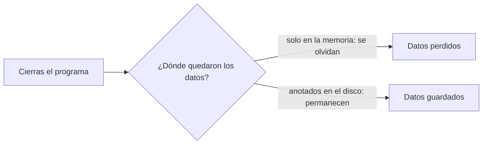
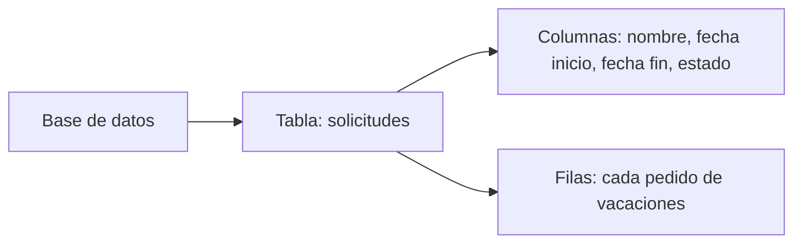
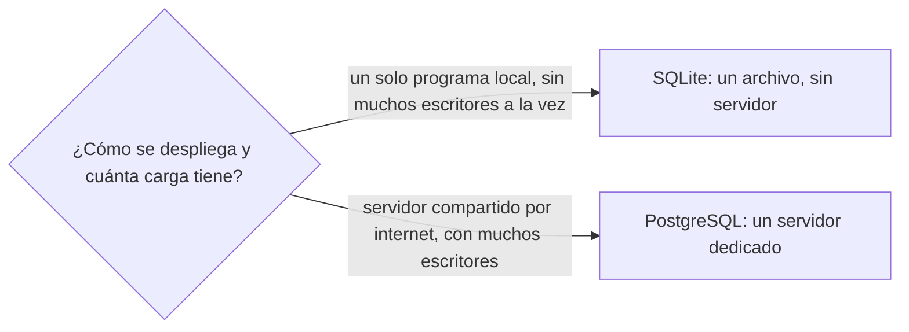
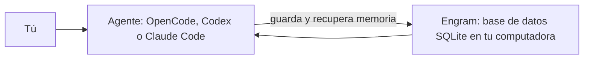

# Bases de datos

## Propósito

En la lección anterior viste que el frontend es lo que ves y el backend es la parte que procesa y guarda los datos. Quedó pendiente una pregunta: ¿dónde quedan guardados esos datos cuando cierras el programa? Este capítulo la responde.

Aquí vas a entender qué es la **persistencia** (la capacidad de que los datos sobrevivan al apagado), cómo se organiza una base de datos en tablas, qué papel juega SQL, cuándo conviene SQLite o PostgreSQL, y cómo se relaciona todo esto con la memoria de tus agentes. Es una lección de ideas: no necesitas programar para seguirla.

## Respuesta simple

Cuando un programa se cierra, lo que tenía en la memoria se pierde. Los datos que deben durar se guardan en el **disco**, el mismo lugar donde viven tus archivos. Guardar datos de forma que sobrevivan se llama **persistencia**, y la manera más organizada de lograrlo es una **base de datos**: un sistema que guarda datos de forma ordenada y permite recuperarlos después.

Dentro de una base de datos, los datos viven en **tablas** (filas y columnas, como una planilla), y se consultan con un lenguaje llamado **SQL**. Hay bases de datos livianas que son un solo archivo, como **SQLite**, y otras que corren como un servidor, como **PostgreSQL**. Y en este manual hay un ejemplo cercano: **Engram**, la memoria de los agentes de Gentle-AI, es una base de datos SQLite que guarda lo que el agente aprende entre sesiones. Es una integración opcional: se usa cuando está instalada y configurada en tu agente, no viene en cualquier configuración por defecto.

## Analogía: la memoria y el cuaderno

Imagina que trabajas en una oficina. Para recordar algo a corto plazo confías en tu memoria: la retienes mientras la necesitas, pero al final del día se desvanece. Para lo importante usas un cuaderno: lo que escribes queda anotado, y mañana puedes volver a leerlo aunque te hayas olvidado.

La computadora funciona igual. La memoria rápida (RAM) es como tu memoria de trabajo: es veloz, pero se vacía cuando apagas el equipo. El disco es el cuaderno: es más lento, pero conserva lo escrito. Por eso los programas que quieren recordar algo entre ejecuciones lo escriben en el disco, casi siempre dentro de una base de datos.


```mermaid
flowchart LR
    A["Cierras el programa"] --> B{"¿Dónde quedaron los datos?"}
    B -->|"solo en la memoria: se olvidan"| C["Datos perdidos"]
    B -->|"anotados en el disco: permanecen"| D["Datos guardados"]
```

Se lee de izquierda a derecha: al cerrar el programa, si los datos estaban solo en la memoria se pierden; si estaban anotados en el disco, permanecen. Esa anotación en el disco es la persistencia.

Esta analogía tiene un límite: un cuaderno no hace nada por ti; solo guarda. Una base de datos, en cambio, organiza la información, la busca con rapidez y responde preguntas. Y la memoria de la computadora no es un olvido: es velocidad; por eso se usa para el trabajo del momento y el disco para lo que debe durar.

## Ejemplo continuo: Camila y los pedidos de vacaciones

Camila trabaja en administración, no programa y usa Windows. En la lección anterior, un agente le construyó un formulario donde sus compañeros cargan los pedidos de vacaciones y ella ve la lista. El formulario es el frontend; la parte que guarda los pedidos es el backend. Hoy Camila quiere saber algo práctico: si cierra el programa o apaga la computadora, ¿los pedidos siguen ahí?

La respuesta es sí, porque el backend no guarda los pedidos en la memoria del momento, sino en una base de datos. En este ejemplo, el formulario y el backend corren en la computadora de Camila, así que la base de datos es un archivo de esa máquina donde cada pedido queda anotado: puede cerrar todo, volver al día siguiente y la lista sigue completa. Sin persistencia, cada cierre del programa borraría el trabajo de todo el equipo. Cuando una aplicación se publica en la nube, la base de datos vive junto al backend en el servidor, no en la computadora de quien la usa.

## Explicación progresiva

### Teoría: datos y persistencia

Un **dato** es un valor simple: un nombre, una fecha, un número. "Luciana", "2026-08-10" y "pendiente" son datos. Por sí solos no dicen mucho; su valor aparece cuando se agrupan y se guardan.

La **Persistencia**\* es la capacidad de guardar datos de forma duradera para volver a usarlos después, aunque el programa se cierre. En la primera lección viste que la RAM se vacía al apagar; el disco, en cambio, conserva lo escrito. Por eso la regla es simple: lo que debe durar se escribe en el disco, y la base de datos es la forma organizada de hacerlo.

Hay un matiz que conviene distinguir: el **estado** de un programa, lo que la pantalla muestra en este momento, es pasajero y se pierde al cerrar; los **datos guardados**, en cambio, permanecen. Cuando Camila escribe un pedido en el formulario, ese momento es estado; cuando el backend lo guarda en la base de datos, pasa a ser un dato persistente.

### Software: la base de datos relacional y sus tablas

Una **Base de datos**\* es un sistema que guarda datos de forma organizada y permite recuperarlos después. La más común es la base de datos **relacional**, que organiza la información en tablas relacionadas entre sí. No necesitas dominar el modelo completo: basta con entender su pieza principal.

Una **Tabla (base de datos)**\* organiza datos en filas y columnas, como una planilla. Cada columna es un tipo de dato (el nombre, la fecha, el estado); cada fila es un registro completo (un pedido de vacaciones). En el formulario de Camila, el backend guarda los pedidos en una tabla llamada `solicitudes`:

| nombre | fecha_inicio | fecha_fin | estado |
|--------|--------------|-----------|--------|
| Luciana | 2026-08-10 | 2026-08-17 | pendiente |
| Bruno | 2026-08-24 | 2026-08-28 | pendiente |

Todas las filas tienen las mismas columnas, pero cada fila describe algo distinto: una persona, sus fechas y su estado. Cada fila además tiene un identificador que no se repite, para poder referirse a ese pedido exacto sin confusiones.


```mermaid
flowchart LR
    B["Base de datos"] --> T["Tabla: solicitudes"]
    T --> C["Columnas: nombre, fecha inicio, fecha fin, estado"]
    T --> F["Filas: cada pedido de vacaciones"]
```

Se lee de izquierda a derecha: dentro de la base de datos vive la tabla, y la tabla se compone de columnas (los tipos de dato) y filas (cada registro). Es la misma estructura de una planilla de Excel, con una diferencia: la base de datos puede responder preguntas sobre miles de filas con rapidez y sin errores.

### SQL: el idioma para preguntar

**SQL (Structured Query Language)**\* es el lenguaje para consultar y manipular bases de datos relacionales. Es el idioma que usa el backend para pedirle cosas a la base de datos: guardar un pedido nuevo o traer los que están pendientes.

Una consulta de lectura se ve así:

```sql
SELECT nombre, fecha_inicio, fecha_fin
FROM solicitudes
WHERE estado = 'pendiente';
```

En castellano: "trae nombre, fecha de inicio y fecha de fin de la tabla solicitudes, de las filas cuyo estado sea pendiente". Una consulta de escritura, para guardar un pedido nuevo:

```sql
INSERT INTO solicitudes (nombre, fecha_inicio, fecha_fin, estado)
VALUES ('Luciana', '2026-08-10', '2026-08-17', 'pendiente');
```

No necesitas aprender SQL hoy: solo reconocerlo para saber qué es cuando lo veas o cuando un agente lo mencione. Esas dos frases resumen su esencia: leer datos y guardarlos.

### Índice

A medida que una tabla crece, buscar en todas las filas se vuelve lento. Para eso existe el **Índice**\*: una estructura que acelera las búsquedas evitando revisar la tabla completa, como el índice al final de un libro, que te lleva directo a la página sin leerlo entero.

Los índices los diseña el backend (o el agente, cuando lo construye). Como usuario no los tocas, pero entender que existen explica por qué una búsqueda que parece mágica es en realidad una estructura ordenada de la base de datos.

### SQLite y PostgreSQL: dos familias

Las bases de datos relacionales se presentan en dos familias, y la diferencia principal es dónde viven y para quién trabajan.

**SQLite**\* es una base de datos liviana que guarda todo en un solo archivo, sin servidor. Es la familia del cuaderno: vive dentro de tu computadora, no requiere instalación de un programa aparte y es ideal cuando una sola persona usa los datos, como en una aplicación local o la memoria de un agente.

**PostgreSQL**\* es un sistema de base de datos relacional de código abierto que corre como un servidor: un programa aparte al que se conectan otros programas, normalmente a través de la red. Es la familia de la oficina central: soporta a muchas personas al mismo tiempo, funciona en la nube y ofrece funciones más avanzadas, a cambio de más mantenimiento.


```mermaid
flowchart LR
    Q{"¿Cómo se despliega y cuánta carga tiene?"} -->|"un solo programa local, sin muchos escritores a la vez"| S["SQLite: un archivo, sin servidor"]
    Q -->|"servidor compartido por internet, con muchos escritores"| P["PostgreSQL: un servidor dedicado"]
```

Se lee de izquierda a derecha: la pregunta es cómo se despliega la aplicación y cuánta escritura simultánea necesita. Como regla general, si el programa usa la base de datos en un solo lugar y sin muchos escritores a la vez, SQLite alcanza; si la base vive en un servidor al que acceden muchas personas por internet con escrituras concurrentes, conviene PostgreSQL. Es una regla aproximada: hay aplicaciones web con pocos usuarios que funcionan bien con SQLite, y aplicaciones de un solo usuario que necesitan PostgreSQL por funciones de servidor o acceso remoto. Lo importante es pensar en la topología y la carga de trabajo, no solo en cuántas personas son.

Un detalle que vale la pena conocer: las bases de datos aplican los cambios en grupos llamados transacciones, de modo que un conjunto de cambios se aplica todo junto o no se aplica ninguno. Así, si algo falla a mitad de un guardado, los datos no quedan a medias. SQLite lo soporta y PostgreSQL también; para ti, como idea, alcanza con saber que los guardados son confiables.

### Uso: Engram, la memoria del agente

Aquí se conecta todo. Para trabajar con agentes no abres "el ecosistema": abres tu agente, **OpenCode**, **Codex** o **Claude Code**, y conversas con él. **Gentle-AI** es quien prepara y configura esos agentes, pero quien ejecuta es el agente que tú abres.

Ese agente tiene memoria entre sesiones solo si **Engram**\* está instalado y configurado en tu agente: cuando lo está, es el sistema de memoria persistente del ecosistema y guarda observaciones, decisiones y contexto entre sesiones. Y Engram es, precisamente, una base de datos **SQLite** que vive en tu computadora como un archivo. Cuando el agente guarda un recuerdo con herramientas como `mem_save` o busca uno anterior con `mem_search`, está escribiendo y leyendo esa base de datos.


```mermaid
flowchart LR
    U["Tú"] --> A["Agente: OpenCode, Codex o Claude Code"]
    A -->|"guarda y recupera memoria"| E["Engram: base de datos SQLite en tu computadora"]
    E --> A
```

Se lee de izquierda a derecha: tú hablas con el agente y, cuando Engram está configurado, el agente guarda y recupera memoria en una base de datos SQLite en tu computadora. El agente también usa un motor de búsqueda integrado en SQLite, llamado **FTS5 (Full-Text Search 5)**\*, que le permite encontrar recuerdos por palabras clave con rapidez, como buscar en un cuaderno con índice.

No necesitas ejecutar esos comandos a mano: los usa el agente por ti. Te conviene saber que existen para entender qué está pasando cuando el agente dice que recuerda algo de una sesión anterior: está consultando su base de datos.

### Por qué esto importa para trabajar con IA y agentes

Ahora puedes responder una pregunta concreta: ¿qué recuerda tu agente entre sesiones? La respuesta es: lo que quedó guardado en su memoria persistente. La conversación en sí, como el estado de un programa, se desvanece; lo que se guarda en la base de datos, permanece.

Esto importa por tres razones prácticas:

- **Para entender al agente**: cuando dice "recuerdo que ayer decidimos usar SQLite", probablemente está buscando en su memoria persistente en lugar de inventar sobre la marcha. Eso no es una garantía de exactitud: un modelo puede equivocarse o recuperar un recuerdo irrelevante, así que conviene verificar la información importante contra su fuente. Saber esto te ayuda a interpretar sus respuestas y a pedirle que guarde lo importante.
- **Para saber dónde viven tus datos**: casi todo lo que guardan las aplicaciones que usas (cuentas, pedidos, documentos) vive en bases de datos. Entender las tablas y el disco te quita el misterio de dónde está tu información.
- **Para crear cosas con agentes**: cuando le pidas al agente una aplicación con datos que deben durar (como el formulario de Camila), la base de datos es la pieza que lo hace posible. Saber que existe y cómo se elige entre SQLite y PostgreSQL te permite seguir y evaluar el trabajo del agente.

## Decisiones y límites

- **SQLite y PostgreSQL no compiten**: se eligen según el escenario de despliegue y la carga de trabajo. Como regla general, un programa local sin muchos escritores a la vez puede usar SQLite; una base compartida por internet con escrituras concurrentes suele pedir PostgreSQL. El resto de los matices se deciden cuando se diseña una aplicación, no en esta lección.
- **Esta lección no enseña a diseñar bases de datos**: el diseño de tablas, relaciones y consultas avanzadas se ve en las lecciones de stack y de aplicaciones modernas.
- **Engram se menciona como ejemplo real, no se estudia a fondo**: su arquitectura completa tiene un módulo propio más adelante.
- **SQL se muestra solo a nivel de idea** (leer y guardar); no necesitas escribirlo para seguir el manual.
- **Las transacciones se mencionan como garantía de confiabilidad**, sin detallar su funcionamiento interno.

## Errores frecuentes

### Cierro la aplicación y mis datos desaparecen

- Qué observas: cargaste información, cerraste el programa y al volver no está.
- Qué significa: los datos vivían solo en la memoria del momento (el estado); nadie los escribió en el disco. Ese programa no tiene persistencia para esos datos.
- Cómo comprobar: si el programa guarda algo en un archivo o una base de datos, los datos suelen sobrevivir; si no, se pierden al cerrar.
- Cómo resolver: si es una aplicación tuya, pide al agente que la modifique para guardar los datos en una base de datos o en un archivo en disco.
- Cómo confirmar: guardas algo, cierras el programa, lo vuelves a abrir y los datos siguen ahí.

### El agente no recuerda la conversación de ayer

- Qué observas: abres tu agente y no parece conocer nada de la sesión anterior.
- Qué significa: la conversación es estado pasajero; lo que permanece es lo que el agente guardó en su memoria persistente. Si tu agente tiene Engram configurado, esa memoria es su base de datos; si no, puede no haber ninguna memoria entre sesiones. Si nada se guardó, no hay nada que recuperar.
- Cómo comprobar: pregúntale al agente por algo puntual de la sesión anterior y observa si lo encuentra.
- Cómo resolver: pide al agente que guarde las decisiones importantes con su herramienta de memoria (como Engram, si está configurado) durante la sesión, para que queden disponibles después.
- Cómo confirmar: en una sesión nueva, el agente recupera lo que guardaste y lo menciona.

### No sé si usar SQLite o PostgreSQL

- Qué observas: ves nombres de bases de datos y no sabes cuál elegir.
- Qué significa: la pregunta correcta no es "cuál es mejor" sino cómo se desplegará la aplicación y cuánta escritura simultánea tendrá. Como regla general, un programa local sin muchos escritores a la vez puede usar SQLite; una base compartida por internet con escrituras concurrentes suele pedir PostgreSQL.
- Cómo comprobar: si la aplicación correrá solo en tu equipo y la usas tú, SQLite alcanza; si será una página en un servidor a la que entra mucha gente al mismo tiempo, PostgreSQL es el camino más común.
- Cómo resolver: en la duda, deja que el agente lo proponga y explícale el escenario (dónde corre, cuántos escritores, si necesita acceso remoto); esta lección te da el criterio para evaluar su propuesta.
- Cómo confirmar: puedes explicar con tus palabras por qué tu escenario pide una u otra.

## Resumen

| Concepto | Qué es | Ejemplo |
|----------|--------|---------|
| Persistencia | Guardar datos de forma duradera, aunque el programa se cierre | Los pedidos de vacaciones que siguen tras apagar la PC |
| Base de datos | Sistema que guarda datos de forma organizada y permite recuperarlos | La base de datos del formulario de Camila |
| Tabla (base de datos) | Filas y columnas dentro de una base de datos | La tabla `solicitudes` |
| SQL (Structured Query Language) | Lenguaje para consultar y guardar datos | `SELECT ... FROM solicitudes` |
| Índice | Estructura que acelera las búsquedas | El índice del cuaderno que lleva directo a la página |
| SQLite | Base de datos en un solo archivo, sin servidor | La base de datos local de Engram |
| PostgreSQL | Base de datos que corre como servidor, para despliegues compartidos o con mucha escritura | Una aplicación web en la nube con escrituras concurrentes |
| Engram | Memoria persistente del agente entre sesiones | Lo que el agente recuerda de ayer |
| FTS5 (Full-Text Search 5) | Búsqueda de texto completo integrada en SQLite | Encontrar un recuerdo por palabras clave |

Lo esencial para recordar: la persistencia es lo que hace que los datos sobrevivan al cierre; la base de datos es la forma organizada de lograrla, con tablas de filas y columnas; SQL es el idioma con el que se consulta; SQLite es local y PostgreSQL es de servidor; y cuando tu agente "recuerda", está leyendo su base de datos: Engram.

## Términos de esta lección

- **Base de datos**: un sistema que guarda datos de forma organizada y permite recuperarlos después.
- **Persistencia**: capacidad de guardar datos de forma duradera para volver a usarlos después, aunque el programa se cierre.
- **Tabla (base de datos)**: estructura que organiza datos en filas y columnas dentro de una base de datos relacional.
- **SQL (Structured Query Language)**: lenguaje para consultar y manipular bases de datos relacionales.
- **Índice**: estructura de datos que acelera las búsquedas en una base de datos evitando escanear toda la tabla.
- **SQLite**: base de datos liviana que guarda todo en un solo archivo, sin servidor.
- **PostgreSQL**: sistema de base de datos relacional de código abierto, con soporte en la nube y funciones avanzadas.
- **Engram**: sistema de memoria persistente que guarda decisiones, descubrimientos y contexto entre sesiones.
- **FTS5 (Full-Text Search 5)**: motor de búsqueda de texto completo integrado en SQLite.

Las definiciones canónicas de todos los términos del manual están en el [glosario](../../20-referencia/02-glosario/).

## Para seguir aprendiendo

- [Todo lo que necesitas saber sobre bases de datos (BettaTech)](https://youtu.be/xz1fJ7M2g-o): video en español que introduce qué es una base de datos y para qué se usa.
- [¿Qué son las bases de datos? — la mejor explicación en español (EDteam)](https://youtu.be/knVwokXITGI): video en español que explica por qué existen las bases de datos y cómo se relacionan con la información.
- [freeCodeCamp](https://www.freecodecamp.org/espanol/): certificaciones gratuitas con ejercicios interactivos, incluyendo fundamentos de bases de datos, con versión en español.

La próxima lección te lleva a [elegir un stack tecnológico](../06-elegir-stack/), donde verás cómo se decide, entre otras cosas, qué base de datos y qué herramientas usar para cada proyecto.
