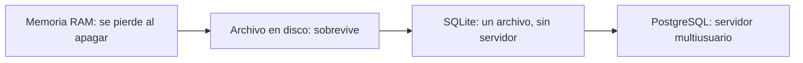

## Propósito

Cuando usas un agente, este puede recordar decisiones, guardar resultados o llevar el historial de un proyecto. Esa información no vive en el aire: se guarda en un lugar y con un formato concreto. Entender qué es un dato, qué es la persistencia y qué diferencia hay entre un archivo, una base de datos ligera y un servidor de base de datos te permite saber dónde está tu información, cómo respaldarla y por qué una herramienta elige un almacenamiento y no otro.

## Respuesta simple

Un **dato** es un valor individual, como un nombre, un número o una fecha. La **persistencia** es la capacidad de conservar esos datos entre sesiones, para que no se pierdan al cerrar un programa o apagar la computadora. Una **base de datos** es un sistema que guarda datos de forma organizada y permite recuperarlos con rapidez. No toda la información necesita una base de datos: a veces un archivo es suficiente y más simple.

## Analogía

Imagina una biblioteca. Los datos son los libros: cada uno tiene un título, un autor, un año y un género. La biblioteca es la base de datos: tiene estantes (las tablas), un catálogo (los índices) y un bibliotecario (el sistema de base de datos) que encuentra cualquier libro en segundos. Guardar todos los papeles en una caja sin orden es como no tener base de datos: la información existe, pero encontrarla es lento e inseguro.

La analogía tiene un límite: en una base de datos, las reglas de orden y de búsqueda están definidas con precisión matemática, y el sistema garantiza que los datos no se corrompan aunque varios programas accedan a la vez.

## Ejemplo continuo

Diego trabaja como analista y usa agentes en OpenCode o Codex para revisar tablas de métricas. Pide al agente que guarde un resumen de cada análisis para comparar resultados después. Esa instrucción activa la persistencia: el agente guarda el resumen en su memoria persistente, que está implementada con una base de datos SQLite en la computadora de Diego. Cuando Diego vuelve a abrir el agente al día siguiente, los resúmenes siguen ahí, porque se guardaron en disco y no solo en la memoria temporal del programa.

## Persistencia: la progresión desde la memoria hasta la base de datos

Para entender dónde vive la información, piensa en una progresión de tres niveles:

1. **Memoria RAM**: rápida, pero se pierde al cerrar el programa o apagar la computadora. Sirve para lo que está en uso ahora.
2. **Archivo en disco**: sobrevive al apagado. Sirve para configuraciones, notas o listas simples que un solo programa lee.
3. **Base de datos**: organiza muchos datos, permite buscarlos rápido y permite que varios programas accedan a la vez.

La diferencia clave entre la memoria y las demás es la duración: lo que está solo en la RAM desaparece; lo que se escribe en disco o en una base de datos persiste. Esta progresión aparece en todas las aplicaciones, desde el navegador (que guarda preferencias en localStorage) hasta los agentes (que guardan memoria en una base de datos local).


```mermaid
flowchart LR
    RAM["Memoria RAM: se pierde al apagar"] --> Archivo["Archivo en disco: sobrevive"]
    Archivo --> SQLite["SQLite: un archivo, sin servidor"]
    SQLite --> Postgres["PostgreSQL: servidor multiusuario"]
```

## La teoría: tablas, filas y columnas

Una base de datos relacional organiza los datos en **tablas**. Una tabla es una estructura de filas y columnas: las **filas** son los registros completos, y las **columnas** son los atributos de cada registro.

Una tabla de resúmenes de análisis podría verse así:

| id | cliente | periodo | resumen | creado |
|----|---------|---------|---------|--------|
| 1 | Mercado Libre | 2026-07 | Crecimiento del 12 % en ventas | 2026-08-01 |
| 2 | Tienda Azul | 2026-07 | Caída en conversión del 5 % | 2026-08-02 |

Una **columna** es un atributo con un tipo definido: texto, número o fecha. La columna `cliente` guarda texto, la columna `id` guarda números enteros y la columna `creado` guarda fechas. Ese tipo le dice a la base de datos cómo interpretar y comparar cada valor.

La **clave primaria** es el atributo elegido para identificar de forma única cada fila. En la tabla anterior, la columna `id` es la clave primaria: cada fila tiene un valor distinto y ese valor identifica al registro sin ambigüedad. Elegir la clave primaria es una decisión de diseño: se elige según qué dato sea estable, único y nunca cambie. El índice acelera las búsquedas: es la estructura que la base de datos usa para encontrar filas sin revisar la tabla completa.

## El software: SQLite, PostgreSQL y SQL

Hay dos tipos de sistemas de base de datos que verás con frecuencia:

**SQLite** es una base de datos ligera que guarda todo en un solo archivo y no necesita un servidor. El programa que la usa lee y escribe ese archivo directamente. Es ideal para aplicaciones locales, herramientas de terminal y memoria de agentes: no hay nada que instalar ni iniciar, y respaldarla es tan simple como copiar un archivo.

**PostgreSQL** (o Postgres) es una base de datos cliente-servidor: corre como un proceso separado al que los programas se conectan a través de la red. Ofrece funciones avanzadas y soporta muchos usuarios escribiendo a la vez. Se usa cuando la información debe compartirse entre varias computadoras o cuando la aplicación crece más allá de un solo usuario local.

**SQL** es el lenguaje para comunicarse con bases de datos relacionales. Con SQL se lee, se agrega, se modifica y se elimina información. Un ejemplo de lectura:

```sql
SELECT cliente, resumen FROM resumenes WHERE periodo = '2026-07';
```

Esa consulta pide las columnas `cliente` y `resumen` de las filas cuyo periodo es julio de 2026. No hace falta memorizar SQL: alcanza con reconocer que existe y que es el idioma común de las bases de datos relacionales.

## El uso: cuándo elegir cada opción

| Situación | Opción recomendada | Motivo |
|-----------|--------------------|--------|
| Pocos datos, un solo programa, configuración simple | Archivo | Simple y suficiente |
| Datos organizados, un solo usuario local, herramienta de terminal | SQLite | Rápida, sin servidor, un archivo |
| Varios usuarios o varias computadoras comparten datos | PostgreSQL | Soporta acceso concurrente |
| Copias de seguridad | Archivo o SQLite | Copiar un archivo es suficiente |
| Información crítica compartida | PostgreSQL | Transacciones y funciones avanzadas |

Una **transacción** es un conjunto de operaciones que se ejecutan como una sola unidad: todas se aplican o ninguna. Si una operación falla a mitad de camino, la base de datos vuelve al estado anterior, como si nada hubiera pasado. Eso protege la información en casos donde importa que los datos queden completos.

La **nube** aparece cuando el almacenamiento se traslada a servidores remotos accesibles por internet. Guardar datos en la nube no cambia las reglas de las bases de datos: lo que cambia es quién administra el servidor y desde dónde se accede.

Un **backup** es una copia de seguridad de los datos que permite restaurarlos si el original se pierde o se daña. Con SQLite, el backup es copiar el archivo de la base de datos. Con PostgreSQL, el respaldo requiere herramientas específicas del servidor.

## Errores frecuentes

### ¿Por qué la base de datos dice que está ocupada?

**Qué observas:** un error que indica que la base de datos está ocupada o bloqueada.

**Qué suele significar:** otro proceso está escribiendo en la base de datos en ese momento. Algunas bases de datos locales permiten un escritor a la vez.

**Cómo comprobarlo:** revisa qué programas están accediendo a esa base de datos y si quedó un proceso abierto.

**Cómo resolverlo:** espera a que termine la escritura o cierra el programa que esté usando la base de datos, y reintenta la operación.

**Cómo confirmar la solución:** vuelve a ejecutar la operación y verifica que se complete sin errores.

### ¿Por qué no encuentro una fila que sé que existe?

**Qué observas:** una búsqueda no devuelve un registro que debería estar en la tabla.

**Qué suele significar:** la consulta filtra por un valor distinto al guardado (un formato de fecha, un espacio de más o una mayúscula) o la información se guardó en otra tabla.

**Cómo comprobarlo:** revisa la consulta que estás usando y compara el valor exacto que filtra con el valor guardado en la base de datos.

**Cómo resolverlo:** corrige el valor de la consulta o consulta la tabla correcta.

**Cómo confirmar la solución:** ejecuta la consulta corregida y verifica que la fila aparezca.

## Resumen

| Concepto | ¿Qué es? | Ejemplo |
|----------|----------|---------|
| Dato | Un valor individual | Un nombre, un número, una fecha |
| Persistencia | Conservar datos entre sesiones | Guardar en disco o en base de datos |
| Base de datos | Sistema organizado para guardar y buscar datos | SQLite, PostgreSQL |
| Tabla | Estructura de filas y columnas | `resumenes` |
| Fila | Un registro completo | Un resumen de análisis |
| Columna | Un atributo con un tipo definido | `cliente` (texto) |
| Clave primaria | Atributo elegido para identificar cada fila | `id` |
| Índice | Estructura que acelera las búsquedas | Índice sobre la columna `periodo` |
| SQL | Lenguaje para consultar bases de datos | `SELECT ... WHERE ...` |
| SQLite | Base de datos ligera, de un solo archivo | Memoria local de un agente |
| PostgreSQL | Base de datos cliente-servidor multiusuario | Datos compartidos por varios usuarios |
| Transacción | Operaciones que se aplican todas o ninguna | Transferencia entre cuentas |
| Nube | Servidores remotos de cómputo y almacenamiento | Acceso por internet a datos |
| Backup | Copia de seguridad de los datos | Copiar el archivo de la base de datos |

## Términos de esta lección

Dato, Persistencia, Base de datos, Tabla, Fila, Columna, Clave primaria, Índice, SQL (Structured Query Language), SQLite, PostgreSQL, Transacción, Nube y Backup. Todos están definidos en el [glosario](../../20-referencia/02-glosario/).

## Para seguir aprendiendo

- [SQLite Documentation](https://sqlite.org/docs.html): documentación oficial de SQLite con tutoriales de introducción a SQL.
- [freeCodeCamp](https://www.freecodecamp.org/espanol/): cursos gratuitos con secciones de bases de datos.
- La siguiente lección, [Elegir un stack tecnológico](../06-elegir-stack/), te ayuda a decidir qué tecnologías usar según el problema a resolver.
