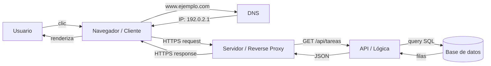

# Cómo funciona una aplicación moderna

## Resultado de aprendizaje

Trazar el recorrido completo de una solicitud desde el usuario hasta la base de datos, identificando el rol de cada capa (cliente, DNS, red, servidor, API, base de datos, caché).

## Respuesta simple

Cada vez que usás una aplicación web —Gmail, Twitter, una app de tareas— tu computadora (el **cliente**) envía un pedido a otra computadora (el **servidor**) que procesa el pedido, consulta datos y devuelve una respuesta. Ese viaje atraviesa varias capas: el **navegador**, la red, el **DNS** (que traduce el nombre del sitio a una dirección numérica), el protocolo **HTTPS** (que protege la comunicación), el servidor, la **API** (que organiza los pedidos), y la **base de datos** (que guarda la información).

## Modelo mental

Imaginá que estás en un hotel y querés pedir comida a la habitación.

- Tu **teléfono** es el navegador o la app cliente.
- El **número de habitación** es la dirección del servidor.
- La **centralita del hotel** es el DNS: sabés que querés "room service" pero necesitás que la centralita te diga el número exacto para llamar.
- La **línea telefónica** es la conexión HTTPS: los datos viajan cifrados para que nadie escuche tu pedido.
- Quien **atiende el teléfono en cocina** es el servidor.
- El **chef que cocina** es la API: procesa el pedido y decide qué hacer.
- La **despensa donde están los ingredientes** es la base de datos.
- Si el chef ya preparó tu plato favorito antes y lo recuerda sin mirar la receta, está usando **caché**.

**Límite del modelo**: El hotel es centralizado y simple. Una aplicación moderna puede tener varios servidores, cachés distribuidas y bases de datos replicadas. El modelo no cubre balanceadores, CDNs, ni escalado horizontal.

## Mapa o recorrido



**Recorrido**: Usuario → Navegador → DNS → Servidor → API → Base de datos → API → Servidor → Navegador → Usuario.

## Ejemplo continuo

Vamos a ver cómo viaja una solicitud en una aplicación web de tareas pendientes (como Todoist o Trello). El ejemplo evoluciona en 5 etapas.

### Paso 1: solo el navegador (sin servidor)

Al principio tenés una página HTML guardada en tu computadora. Abrís el archivo y ves una lista de tareas. Las tareas están escritas directamente en el HTML.

- **No hay servidor**: el navegador lee el archivo local.
- **No hay red**: todo está en tu máquina.
- **Limitación**: no podés compartir tareas con nadie, ni sincronizar entre dispositivos.

### Paso 2: cliente + servidor

Agregás un servidor. Ahora el navegador (cliente) le pide las tareas al servidor por la red.

```
Navegador → (HTTP) → Servidor → (HTTP) → Navegador
```

El servidor tiene las tareas en memoria. Si lo apagás, las tareas se pierden. El navegador ya no necesita tener las tareas en el HTML, solo las pide cuando las necesita.

### Paso 3: API (Application Programming Interface)

El servidor organiza los pedidos usando una **API**. Cuando el navegador pide las tareas, hace un pedido específico:

```
GET /api/tareas
```

El servidor entiende "el cliente quiere la lista de tareas" y responde con un formato estructurado (JSON):

```json
[
  { "id": 1, "titulo": "Comprar leche", "completada": false },
  { "id": 2, "titulo": "Estudiar System Design", "completada": false }
]
```

Si el usuario agrega una tarea:

```
POST /api/tareas
{"titulo": "Pasear al perro"}
```

La API procesa el pedido, valida los datos, y los guarda. La organización del código en el servidor se vuelve manejable gracias a esta separación.

### Paso 4: base de datos

El servidor ahora guarda las tareas en una **base de datos** (como SQLite o Postgres). Cuando apagás el servidor y lo volvés a prender, las tareas siguen ahí.

```
Navegador → Servidor → API → Base de datos
```

Cada vez que el usuario pide la lista, la API consulta la base de datos:

```sql
SELECT * FROM tareas WHERE usuario_id = 1;
```

Y devuelve los resultados al navegador.

### Paso 5: caché (cuando hay necesidad real)

Un usuario consulta sus tareas 20 veces en 5 minutos. Cada consulta viaja al servidor, ejecuta una query SQL, y devuelve los datos. La base de datos hace el mismo trabajo una y otra vez.

Cuando medís y ves que las consultas a la BD son el cuello de botella, agregás una **caché**:

```
Navegador → Servidor → API → Caché → (si no está) → Base de datos
```

La primera vez que el usuario pide las tareas, la API las busca en la BD y las guarda en la caché. Las siguientes 19 veces, la API las lee de la caché, que es mucho más rápida.

**Riesgo**: si el usuario agrega una tarea, la caché tiene datos viejos. Hay que actualizarla o invalidarla.

## Recorrido práctico: una tarea nueva

Seguí paso a paso qué pasa cuando el usuario escribe "Pasear al perro" y apreta Enter.

1. **Clic en "Agregar"** → el navegador captura el texto del input.
2. **Validación local** → el navegador verifica que el texto no esté vacío.
3. **Petición HTTPS** → el navegador arma un POST a `https://miapp.com/api/tareas` con el cuerpo `{"titulo": "Pasear al perro"}`.
4. **DNS lookup** → el navegador consulta al DNS qué IP corresponde a `miapp.com`.
5. **Conexión TCP** → el navegador establece una conexión con el servidor en la IP obtenida (puerto 443 para HTTPS).
6. **Handshake TLS** → navegador y servidor acuerdan cifrado. A partir de acá, todo viaja cifrado.
7. **Llega al servidor** → el servidor (o un reverse proxy como Nginx) recibe la petición y la envía al proceso que maneja la API.
8. **La API procesa** → valida los datos, asigna un ID, marca la fecha de creación.
9. **Guarda en BD** → `INSERT INTO tareas (usuario_id, titulo, creada_en) VALUES (1, 'Pasear al perro', '2026-07-22');`
10. **Invalida caché** → si hay caché, la marca como desactualizada para que la próxima consulta traiga datos frescos.
11. **Responde** → la API devuelve `{"id": 3, "titulo": "Pasear al perro", "completada": false}` con código HTTP 201 (Created).
12. **El navegador renderiza** → JavaScript toma la respuesta y agrega la nueva tarea a la lista visible.

El usuario ve la tarea nueva en la lista. Todo esto, en menos de un segundo.

## Cómo funciona internamente

### DNS lookup

El **DNS** (Domain Name System) traduce nombres humanos (`www.ejemplo.com`) a direcciones IP numéricas (`192.0.2.1`).

Cuando escribís una URL en el navegador:

1. El navegador revisa su **caché DNS local**.
2. Si no está, pregunta al **sistema operativo**.
3. Si no está, pregunta al **resolver DNS** configurado (generalmente el de tu ISP o uno público como 8.8.8.8).
4. El resolver pregunta a los servidores DNS autoritativos del dominio.
5. La respuesta vuelve por la misma cadena.

Sin DNS, tendrías que recordar direcciones IP como `192.0.2.1` en lugar de `google.com`.

### TCP handshake

Antes de enviar datos, el cliente y el servidor negocian la conexión con un **three-way handshake** (SYN, SYN-ACK, ACK). Es como decir:

- Cliente: "¿Podemos hablar?" (SYN)
- Servidor: "Sí, ¿escuchás?" (SYN-ACK)
- Cliente: "Sí, escucho" (ACK)

A partir de ahí, los datos viajan segmentados en paquetes TCP. Si un paquete se pierde, TCP lo retransmite automáticamente.

### HTTPS

**HTTPS** (HTTP + TLS) es HTTP sobre una capa de cifrado. Garantiza:

- **Confidencialidad**: nadie en el medio puede leer los datos.
- **Integridad**: los datos no pueden modificarse en tránsito.
- **Autenticación**: el servidor demuestra su identidad con un certificado SSL/TLS.

Sin HTTPS, cualquiera en la misma red WiFi podría leer las tareas que enviás (ataque man-in-the-middle).

### Internet ≠ Web

- **Internet**: la red física y lógica que conecta computadoras. Incluye cables, routers, protocolos como TCP/IP, DNS, etc.
- **Web**: un servicio que corre *sobre* Internet, basado en HTTP/HTTPS. La web es solo una parte de Internet. También hay correo electrónico (SMTP), transferencia de archivos (FTP), mensajerías propias, etc.

**Dominio ≠ IP**:
- Un **dominio** (`ejemplo.com`) es un nombre legible.
- Una **IP** (`192.0.2.1`) es la dirección numérica real.
- Un dominio puede tener varias IPs (balanceo), y una IP puede alojar varios dominios (virtual hosting).

## Cuándo usarlo y cuándo evitarlo

### Cuándo es apropiado entender este flujo

- Estás diagnosticando por qué una página no carga.
- Estás decidiendo dónde poner lógica en tu aplicación.
- Estás aprendiendo System Design: este es el modelo basal.
- Estás comunicando arquitectura a un equipo.

### Cuándo no hace falta (System Design vs over-engineering)

- Una aplicación de un solo archivo no necesita servidor ni API separada. Un script local con SQLite alcanza.
- Una landing page estática no necesita base de datos ni caché. Un CDN es suficiente.
- Un MVP para validar idea no necesita capas complejas. Una sola máquina con todo integrado alcanza.

El error de over-engineering es agregar capas antes de medir que hacen falta. No necesitás caché hasta que medís que la BD es lenta.

## Costos y trade-offs

| Componente | Agrega | Costo |
|-----------|--------|-------|
| Servidor separado | Aislamiento, escalabilidad | Operación, mantenimiento |
| API | Organización, reutilización | Código adicional, latencia |
| Base de datos | Persistencia, consultas | Complejidad, storage |
| Caché | Velocidad | Datos obsoletos, otra capa que mantener |
| HTTPS | Seguridad | CPU para cifrado, certificados |

Cada capa que agregás es un punto de fallo potencial. No las agregues sin medir primero.

## Errores frecuentes

### Error 1: "DNS no resuelve"

- **Síntoma**: el navegador dice "no se pudo resolver la dirección".
- **Causa probable**: el dominio no existe, el DNS está caído, o no hay conexión a Internet.
- **Diagnóstico**: ejecutá `nslookup ejemplo.com` o `Resolve-DnsName ejemplo.com` en PowerShell.
- **Corrección**: verificá que el dominio esté bien escrito. Si es un dominio local, revisá el archivo hosts.
- **Verificación**: el comando `nslookup` devuelve una IP válida.

### Error 2: error de certificado HTTPS

- **Síntoma**: el navegador muestra "certificado no válido" o "TU CONEXIÓN NO ES PRIVADA".
- **Causa probable**: el certificado SSL venció, no cubre el dominio, o es autofirmado.
- **Diagnóstico**: revisá la fecha de vencimiento del certificado. Usá `curl -vI https://ejemplo.com` para ver los detalles.
- **Corrección**: renová el certificado (Let's Encrypt ofrece gratuitos). Si es desarrollo local, aceptá la excepción temporal.
- **Verificación**: el navegador muestra el candado verde.

### Error 3: timeout

- **Síntoma**: "La conexión expiró".
- **Causa probable**: el servidor no responde (caído, sobrecargado, firewall bloquea).
- **Diagnóstico**: `ping` a la IP, `telnet` al puerto, revisá si el servidor está vivo.
- **Corrección**: reiniciá el servidor o aumentá el timeout.
- **Verificación**: la página carga antes de los 30 segundos.

### Error 4: HTTP 500

- **Síntoma**: "Error interno del servidor".
- **Causa probable**: un error en el código del backend o la base de datos.
- **Diagnóstico**: revisá los logs del servidor para ver el stack trace.
- **Corrección**: depende del error específico — base de datos caída, excepción no manejada, etc.
- **Verificación**: la respuesta HTTP devuelve 200 en vez de 500.

### Error 5: CORS (Cross-Origin Resource Sharing)

- **Síntoma**: "No se puede acceder a la API desde este origen".
- **Causa probable**: el frontend está en un dominio distinto al backend y el servidor no permite el origen.
- **Diagnóstico**: revisá los headers de respuesta del backend (`Access-Control-Allow-Origin`).
- **Corrección**: configurá el servidor para permitir el origen del frontend. En desarrollo, usá un proxy.
- **Verificación**: la solicitud desde el frontend recibe respuesta sin error CORS.

## Comprueba lo aprendido

1. **Ordená el flujo**: numerá del 1 al 8 los pasos de una solicitud:
   ( ) La API procesa y consulta la BD
   ( ) El navegador renderiza la respuesta
   ( ) El servidor recibe la petición HTTPS
   ( ) El usuario hace clic
   ( ) El DNS resuelve el dominio a IP
   ( ) La BD devuelve los resultados
   ( ) La API arma la respuesta JSON
   ( ) El navegador envía la petición HTTPS

2. **Identificá la capa de fallo**: si el usuario ve "certificado no válido", ¿qué capa falló? ¿Qué protocolo?

3. **Decisión**: tenés una app que anda bien pero es lenta al consultar datos que cambian una vez por hora. ¿Agregarías caché? ¿Qué riesgo tenés?

<details>
<summary>Respuestas</summary>

1. **Orden**: 4 (DNS), 5 (Navegador envía HTTPS), 6 (Servidor recibe), 7 (API procesa y consulta BD), 8 (BD devuelve), 9 (API arma respuesta), 10 (Navegador renderiza). — Notá que el usuario hace clic (1) antes de que empiece el flujo técnico.

2. **Capa de fallo**: HTTPS/TLS. El certificado es parte del handshake TLS. El DNS funcionó (llegó al servidor), pero el servidor no pudo demostrar su identidad.

3. **Caché**: Sí, una caché con TTL de 30 minutos mejoraría la velocidad. Riesgo: servir datos de hasta 30 minutos de antigüedad. Si el dato debe ser siempre fresco, la caché no sirve.
</details>

## Resumen

| Capa | Función | Ejemplo |
|------|---------|---------|
| **Cliente** | Inicia la solicitud, renderiza la respuesta | Navegador, app móvil |
| **DNS** | Traduce dominio a IP | `ejemplo.com` → `192.0.2.1` |
| **HTTPS** | Cifra la comunicación | HTTP + TLS |
| **Servidor** | Recibe y responde solicitudes | Nginx, servidor Node.js |
| **API** | Organiza la lógica de negocio | REST, GraphQL |
| **Base de datos** | Persiste y consulta datos | SQLite, Postgres |
| **Caché** | Acelera lecturas frecuentes | Redis, Memcached |

- **Internet** es la red; la **Web** es un servicio sobre Internet.
- **Dominio** ≠ **IP**: el DNS conecta ambos.
- Cada capa tiene un **trade-off**: agregarla resuelve un problema pero introduce complejidad.
- No agregues capas sin **medir** que hacen falta.

## Fuentes y alcance

- Fuente conceptual: The Gentleman Programming (2026) — Capítulo 3: "Cómo funciona una aplicación"
- Fuente técnica primaria: documentación de protocolos HTTP, DNS, TLS/HTTPS
- Hechos volátiles verificados: no contiene comandos ni rutas específicas
- Fecha de verificación: 2026-07-22
- Alcance de la comprobación: conceptos fundamentales de redes y aplicaciones web (no cubre microservicios, Kubernetes, sharding)
- La lección asume conceptos de 01-04 (frontend y backend) y 01-05 (bases de datos)
