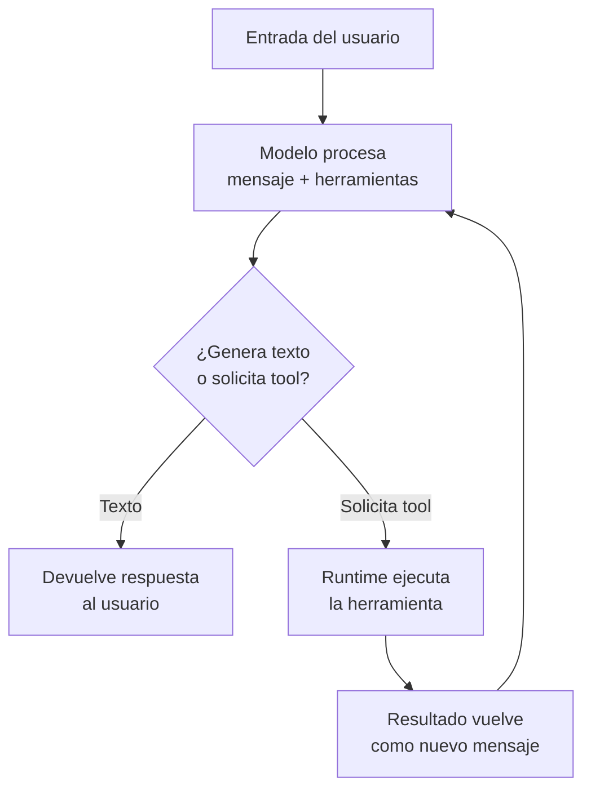

# De modelo a agente

## Resultado de aprendizaje

Explicar por qué un modelo solo no es un agente, describir el ciclo de agente con sus componentes (instrucciones, contexto, herramientas, condiciones de parada) y distinguir cuándo un sistema es un agente frente a un simple asistente de chat.

## Respuesta simple

Un **modelo** recibe tokens y genera tokens. No ejecuta código, no lee archivos, no toma decisiones más allá de predecir la siguiente palabra más probable.

Un **agente** es un sistema que envuelve al modelo en un ciclo: recibe una entrada, la procesa con el modelo, decide si responder o ejecutar una herramienta, y repite hasta cumplir su objetivo o alcanzar una condición de parada.

La diferencia no es el modelo. El modelo es el motor de razonamiento. El agente es el motor **más** instrucciones, contexto, herramientas, memoria y un bucle de control que orquesta cada paso.

## Modelo mental

Imaginá un auto de carreras y su piloto.

El **modelo** es el motor. Genera potencia (tokens) de forma continua. Si lo encendés sin piloto, el auto ruge en el mismo lugar pero no va a ningún lado. El motor no tiene dirección, no sabe cuándo frenar, no elige la ruta.

El **agente** es el piloto más el auto completo. El piloto recibe instrucciones (el reglamento de la carrera), tiene contexto (el mapa del circuito, la posición de los rivales), usa herramientas (volante, frenos, cambio de marchas) y opera en un ciclo constante: evaluar la curva que viene, decidir si frena o acelera, ejecutar la acción, evaluar el resultado, repetir.

El motor no decide. El piloto decide usando el motor.

**Límite de la analogía**: un piloto humano tiene intenciones, emociones y comprensión real del entorno. Un modelo no tiene nada de eso. El modelo genera la siguiente palabra basándose en probabilidades estadísticas. La "decisión" de usar una herramienta no es una decisión consciente: es el patrón más probable que el modelo aprendió durante su entrenamiento.

## Mapa o recorrido

El ciclo de un agente se representa así:



El flujo comienza con una entrada del usuario. El modelo procesa esa entrada junto con las definiciones de las herramientas disponibles. El modelo genera una respuesta que puede ser texto o una solicitud de tool. Si es texto, la conversación termina. Si es una solicitud de tool, el runtime ejecuta la herramienta (lee un archivo, ejecuta un comando, busca en internet) y devuelve el resultado al modelo, que vuelve a procesar. El ciclo se repite hasta que el modelo genera texto o se alcanza una condición de parada.

Cada pasada por este ciclo se llama un **turno** de ejecución. Una solicitud simple puede completarse en un turno. Una tarea compleja puede requerir decenas de turnos.

## Ejemplo continuo

Escenario: un usuario le pide al agente "revisá el archivo de configuración `app.config.json` y corregí el puerto si está mal".

### Nivel básico

El usuario envía el mensaje. El modelo tiene disponible la herramienta `read`. Decide que necesita leer el archivo primero. Genera una solicitud de tool `read` con la ruta del archivo. El runtime ejecuta `read`, obtiene el contenido, y se lo pasa al modelo. El modelo analiza el contenido, ve el puerto incorrecto, y ahora tiene dos opciones: puede pedir la herramienta `edit` para corregirlo, o puede informar al usuario que el puerto está mal. Si decide editar, genera otra solicitud de tool. Si decide informar, genera texto.

### Nivel operativo

El agente lee el archivo con `read("app.config.json")`. El contenido revela que el puerto dice `"port": 3000` pero debería ser `8080`. El modelo genera una solicitud `edit` para cambiar `"port": 3000` por `"port": 8080`. El runtime ejecuta el cambio. Luego el modelo lee el archivo de nuevo para verificar que el cambio se aplicó correctamente. Después de verificar, genera un mensaje de confirmación para el usuario: "Corregí el puerto de 3000 a 8080 en app.config.json".

Cada paso es observable: hubo tres tool calls (read, edit, read) y un mensaje final.

### Nivel avanzado

El usuario no especificó cuál es el puerto correcto. El agente necesita determinarlo. Podría buscar en otros archivos de configuración (`docker-compose.yml` o `.env`), o buscar en internet si es un servicio conocido, o consultar su memoria persistente (Engram) si ya resolvió esto antes. El agente decide el orden de las herramientas según el contexto disponible. Si encuentra el valor en `.env`, lo usa. Si no, pregunta al usuario. La autonomía del agente está acotada por sus instrucciones: algunas configuraciones permiten decidir por sí mismo, otras exigen confirmación humana antes de modificar archivos de producción.

## Recorrido práctico

Abrí OpenCode o cualquier agente basado en Gentle-AI y ejecutá un comando simple como "mostrame los archivos .go en este proyecto".

Lo que ocurre detrás:

1. **Recibir entrada**: el agente recibe tu mensaje como texto plano.
2. **Procesar con el modelo**: el runtime envía al modelo el mensaje más el system prompt (instrucciones del agente) y las definiciones de las tools disponibles (`glob`, `read`, `grep`, `bash`, etc.).
3. **El modelo analiza**: el modelo examina el mensaje predictivo. Reconoce que "mostrame los archivos .go" requiere buscar archivos. La opción más probable según su entrenamiento es usar la herramienta `glob`.
4. **El modelo responde con un tool call**: en vez de texto, el modelo genera un JSON estructurado que dice "ejecutá `glob` con el patrón `**/*.go`".
5. **El runtime ejecuta**: OpenCode recibe el JSON, valida los argumentos, ejecuta `glob("**/*.go")` contra el sistema de archivos real, y obtiene una lista de rutas.
6. **El runtime devuelve el resultado**: la lista de archivos se envía al modelo como un nuevo mensaje: "Resultado de tool glob: main.go, handler.go...".
7. **El modelo procesa el resultado**: ahora el modelo tiene la lista real. Genera texto: "Encontré 3 archivos .go: main.go, handler.go, utils.go".
8. **El runtime entrega la respuesta**: ves el mensaje del agente en tu terminal.

Este recorrido completo ocurrió en un solo turno: un tool call y una respuesta. Si hubieras pedido "contá las líneas de cada archivo .go", el agente habría necesitado dos turnos: primero `glob` para encontrar los archivos, luego `bash` con `wc -l` para contar las líneas de cada uno.

## Cómo funciona internamente

### El modelo como predictor de texto

El modelo no "sabe" usar herramientas. El modelo fue entrenado con millones de ejemplos de conversaciones donde un asistente usaba herramientas. Aprendió un patrón estadístico: "cuando un usuario pide leer un archivo, lo más probable es que la respuesta correcta incluya una solicitud de tool `read`".

Cuando el modelo "decide" usar una herramienta, está generando un token que corresponde a un carácter especial o una estructura JSON que el runtime interpreta como solicitud de tool. No hay una decisión consciente. Hay una predicción estadística: dado el contexto actual, el siguiente token más probable inicia la estructura de un tool call.

### El ciclo de agente en detalle

Cada turno del ciclo tiene cuatro fases:

1. **Inferencia**: el runtime envía al modelo el mensaje del usuario + historial + system prompt + definiciones de tools. El modelo procesa todo como tokens y genera una respuesta.

2. **Análisis de la respuesta**: el runtime examina lo que generó el modelo. Si contiene un tool call (una estructura JSON con `name` y `arguments`), el runtime extrae los datos.

3. **Ejecución**: el runtime valida los argumentos contra el esquema definido para la tool. Si son válidos, ejecuta la función real. Si no, devuelve un error al modelo.

4. **Retorno**: el runtime toma el resultado de la tool (o el error) y lo envía al modelo como un nuevo mensaje. El flujo vuelta a la fase 1.

Si el modelo genera texto sin tool calls, el ciclo termina y el runtime muestra la respuesta al usuario.

### Condiciones de parada

El ciclo no puede ejecutarse indefinidamente. Se define al menos una condición de parada. Las más comunes:

| Condición | Qué hace | Ejemplo |
|-----------|----------|---------|
| **Máximo de tokens de salida** | El modelo deja de generar cuando alcanza el límite | `max_output_tokens: 4096` |
| **Secuencias de parada** | El modelo deja de generar cuando encuentra una secuencia específica | `stop: ["\n---", "<\|end\|>"]` |
| **Límite de tool calls** | El runtime detiene el ciclo después de N tool calls | `max_tool_calls: 25` |
| **Timeout** | El runtime cancela si el ciclo supera un tiempo máximo | `timeout: 300s` |
| **Aprobación humana** | El runtime pausa y espera confirmación antes de ejecutar ciertas tools | Tool destructiva requiere `confirm: true` |
| **Auto-límite del modelo** | El modelo decide por sí mismo detenerse (genera un mensaje final) | "Listo, terminé" |

En Gentle-AI, el orquestador y los subagentes tienen condiciones de parada configuradas por rol. Un subagente de verificación (`sdd-verify`) tiene un límite de tool calls más bajo que uno de implementación (`sdd-apply`), porque verificar requiere menos iteraciones.

### Instrucciones y contexto

Las **instrucciones** (system prompt) definen el comportamiento del agente. Se envían una vez al inicio y permanecen fijas durante toda la sesión. Incluyen la personalidad, las reglas, los protocolos de memoria y skills.

El **contexto** incluye todo lo que el modelo procesa en cada turno: el mensaje del usuario, el historial de mensajes anteriores, los resultados de herramientas previas, los archivos cargados del proyecto, y los skills activados. El contexto cambia en cada turno porque cada tool call agrega nuevo contenido.

### Memoria

La **memoria** no es parte del ciclo de agente inmediato. Es información persistente que el agente guarda fuera del contexto conversacional. Cuando el agente usa Engram para guardar una decisión, esa información sobrevive a la compactación del contexto y a futuras sesiones.

Un agente sin memoria empieza cada sesión desde cero. Un agente con memoria recupera contexto de trabajo previo, pero siempre dentro del ciclo: primero busca en memoria (`mem_search`), recibe el resultado como un tool call más, y continúa el ciclo normalmente.

## Cuándo usarlo y cuándo evitarlo

### Usar un agente cuando

- La tarea requiere leer, escribir o modificar archivos del sistema real.
- La tarea necesita buscar información en internet o en bases de datos.
- La tarea tiene múltiples pasos donde cada paso depende del resultado anterior.
- El sistema debe mantener coherencia a través de varias interacciones.
- Se necesita ejecutar comandos, scripts o programas externos.

### NO usar un agente cuando

- Solo se necesita generar texto a partir de una entrada fija sin interacción con el entorno.
- La tarea puede resolverse con una sola pregunta sin necesidad de herramientas.
- El costo y la latencia del ciclo de tool calls no se justifican (una sola inferencia es más barata y rápida).
- No hay herramientas disponibles o el modelo no tiene acceso a ellas.
- Se necesita una respuesta determinista y predecible donde cada tool call introduce variabilidad.

### Autonomía del agente

No todos los agentes tienen el mismo nivel de autonomía. Se configura según el riesgo:

| Nivel de autonomía | El agente puede | Cuándo usarlo |
|--------------------|-----------------|---------------|
| **Baja** | Ejecutar solo herramientas de lectura. Para escribir o modificar, pide confirmación. | Producción, archivos críticos, datos sensibles |
| **Media** | Ejecutar herramientas de lectura y escritura no destructivas. Para eliminar o sobrescribir, pide confirmación. | Desarrollo, ramas feature, entornos de prueba |
| **Alta** | Ejecutar cualquier herramienta sin confirmación, dentro de los límites de parada configurados. | Entornos aislados, CI/CD, tareas automatizadas conocidas |

En Gentle-AI, cada subagente tiene su nivel de autonomía definido en sus instrucciones. El subagente `sdd-apply` puede escribir archivos sin confirmar porque trabaja sobre cambios ya especificados y diseñados. El subagente `sdd-verify` solo lee archivos y ejecuta comandos de verificación.

## Costos y trade-offs

### Costo de token por turno

Cada turno del ciclo de agente consume tokens de entrada y salida:

| Componente del turno | Tokens | Costo relativo |
|----------------------|--------|----------------|
| System prompt + definiciones de tools | 2K-5K input | Fijo por sesión |
| Mensaje del usuario | Variable (100-2K input) | Por interacción |
| Tool call generado por el modelo | 50-200 output | Por tool call |
| Ejecución de herramienta | 1K-10K input (el resultado vuelve al modelo) | Por tool call |
| Respuesta final | 200-2K output | Por respuesta |

Un agente que necesita 5 tool calls para completar una tarea consume aproximadamente 5 veces más tokens que una respuesta directa del mismo modelo sin herramientas.

### Latencia

Cada tool call agrega latencia:
- Tiempo de inferencia del modelo (1-5 segundos por llamada)
- Tiempo de ejecución de la herramienta (variable: 0.1s para leer un archivo, 5s+ para ejecutar un comando pesado)
- Tiempo de transmisión de datos (el resultado de la herramienta viaja de vuelta al modelo)

Una tarea con 5 tool calls puede tardar 20-60 segundos en completarse, frente a 2-5 segundos de una respuesta directa.

### Trade-off: capacidad vs velocidad

| Enfoque | Ventaja | Desventaja |
|---------|---------|------------|
| Un solo modelo grande sin tools | Respuesta rápida, menor costo | Limitado a texto, no puede actuar sobre el mundo real |
| Modelo grande + agente con tools | Puede interactuar con archivos, sistema, internet | Más lento, más caro, más complejo de depurar |
| Modelo chico + agente con tools | Más rápido que modelo grande con tools, más barato | Menor capacidad de razonamiento, puede cometer más errores |

### Complejidad operativa

Un agente introduce nuevos puntos de fallo:
- La definición de la tool puede ser incorrecta o ambigua y el modelo la usa mal.
- El resultado de una tool puede ser muy grande y agotar la ventana de contexto.
- El ciclo puede entrar en un bucle infinito si no hay condiciones de parada adecuadas.
- El comportamiento del agente depende de instrucciones que deben mantenerse actualizadas.

## Errores frecuentes

### 1. Error: el modelo genera un tool call con argumentos incorrectos

```text
sintoma: el modelo pide ejecutar read("C:/Users/archivo.txt") pero la ruta no existe.
→ causa probable: la definición de la tool no especifica que la ruta debe ser absoluta o el formato de rutas en Windows.
→ diagnóstico: revisar la descripción de la tool en el schema JSON.
→ corrección: mejorar la descripción de la tool: "Usá una ruta absoluta con barras normales (C:/ruta/archivo.txt)."
→ verificación: volver a preguntar al agente y verificar que ahora genera rutas correctas.
```

### 2. Error: el agente queda en un bucle de tool calls sin progreso

```text
sintoma: el agente ejecuta tool → recibe resultado → ejecuta la misma tool con argumentos similares → repite sin avanzar.
→ causa probable: el límite de tool calls es demasiado alto o no está configurado. El modelo no encuentra una salida del ciclo.
→ diagnóstico: revisar los logs de tool calls. Si ves el mismo patrón 5+ veces, hay un bucle.
→ corrección: configurar max_tool_calls (10-25 según la tarea) y definir secuencias de parada.
→ verificación: el agente ahora se detiene después del límite y devuelve lo que tiene hasta ese momento.
```

### 3. Error: el agente ejecuta una herramienta destructiva sin autorización

```text
sintoma: el agente sobrescribe un archivo importante sin preguntar al usuario.
→ causa probable: las instrucciones no definen qué herramientas requieren confirmación humana.
→ diagnóstico: revisar el system prompt. Buscar "confirmación", "aprobar", "permiso". Si no aparecen, el agente no sabe que debe preguntar.
→ corrección: agregar en las instrucciones: "Antes de sobrescribir o eliminar archivos, mostrá el cambio al usuario y esperá confirmación explícita."
→ verificación: pedir al agente que elimine un archivo de prueba. Debe detenerse y preguntar antes de hacerlo.
```

### 4. Error: confundir la respuesta del modelo con una acción ejecutada

```text
sintoma: el modelo dice "ya ejecuté el comando" pero el comando no se ejecutó realmente.
→ causa probable: el modelo generó texto describiendo una acción en lugar de generar un tool call. El modelo "imaginó" la ejecución.
→ diagnóstico: revisar el JSON de la respuesta del modelo. Si no hay un tool call real, la acción no ocurrió.
→ corrección: verificar que las herramientas estén correctamente definidas y que el modelo tenga acceso a ellas. Si el modelo no puede usar tools, solo puede hablar de ellas, no ejecutarlas.
→ verificación: el agente ahora genera tool calls reales (verificables en los logs) en lugar de texto describiendo acciones.
```

### 5. Error: saturar el contexto con resultados de herramientas

```text
sintoma: después de algunos tool calls, el agente se vuelve incoherente o "se olvida" de lo que estaba haciendo.
→ causa probable: los resultados de las herramientas son muy grandes y llenan la ventana de contexto.
→ diagnóstico: revisar el tamaño de los resultados devueltos por cada tool. Un archivo de 50K tokens puede consumir toda la ventana.
→ corrección: limitar la salida de las herramientas (leer solo las primeras 100 líneas, truncar resultados largos). Usar skills para filtrar información relevante antes de pasarla al modelo.
→ verificación: el agente mantiene coherencia después de múltiples tool calls.
```

## Comprueba lo aprendido

### Ejercicio 1: identificar modelo vs agente (principiante)

Para cada sistema, decidí si es un modelo solo o un agente:

1. Una API a la que enviás "resumí este texto" y recibís un resumen.
2. Un chatbot que puede buscar en Wikipedia y después responder sobre lo que encontró.
3. Un programa que recibe "ordená estos archivos por fecha" y ejecuta tools para leer metadatos y mover archivos.
4. Un modelo al que enviás un prompt y responde siempre con la misma estructura JSON.

### Ejercicio 2: trazar el ciclo (operador)

Dado este escenario: "buscá en el código dónde se define la función `ConnectDatabase`, leé el archivo, y decime qué base de datos usa."

Escribí la secuencia de tool calls que un agente debería generar para completar la tarea. Indicá qué devuelve cada tool y qué hace el modelo con ese resultado.

### Ejercicio 3: elegir condiciones de parada (arquitecto)

Un agente debe analizar 50 archivos de log, extraer errores, y generar un reporte. Cada archivo requiere un tool call de `read`. Teniendo en cuenta que:

- La ventana de contexto del modelo es de 200K tokens
- Cada archivo de log pesa aproximadamente 3K tokens
- El system prompt + definiciones de tools ocupan 4K tokens
- La respuesta final del reporte ocupará ~2K tokens

Respondé:

1. ¿Cuántos tool calls puede hacer el agente antes de llenar el contexto?
2. ¿Qué condiciones de parada configurarías?
3. ¿Cómo modificarías el diseño para que el agente pueda procesar los 50 archivos sin saturar el contexto?

### Ejercicio 4: práctica guiada

Abrí OpenCode y ejecutá: "creá un archivo test.txt con el texto 'hola agente'".

Observá el proceso:

1. ¿Cuántos tool calls generó el agente?
2. ¿Qué herramientas usó?
3. ¿Hubo un solo turno o múltiples turnos?
4. Verificá que el archivo se creó realmente (no solo que el modelo dijo que lo creó).

Guardá la observación en Engram con `mem_save` con tipo "discovery" y título "Mi primer ciclo de agente".

## Resumen

| Concepto | Definición |
|----------|------------|
| Modelo | Predictor de tokens. Recibe tokens de entrada, genera tokens de salida. No ejecuta acciones. |
| Agente | Sistema que envuelve al modelo en un ciclo con instrucciones, herramientas y contexto. |
| Ciclo de agente | Recibir entrada → procesar con modelo → decidir (texto vs tool) → ejecutar tool o responder → repetir. |
| Turno | Una pasada completa por el ciclo de agente (inferencia + posible tool call). |
| Tool call | Solicitud JSON que el modelo genera para que el runtime ejecute una función. |
| Instrucciones | System prompt: comportamiento, reglas, personalidad del agente. Fijo durante la sesión. |
| Contexto | Todo lo que el modelo procesa en cada turno: historial, resultados de tools, archivos cargados. |
| Memoria | Información persistente fuera del contexto (Engram). Sobrevive a compactación y sesiones. |
| Condición de parada | Regla que detiene el ciclo: max tokens, stop sequences, límite de tool calls, timeout, aprobación humana. |
| Autonomía | Nivel de libertad del agente para ejecutar herramientas sin confirmación. Se configura según riesgo. |

## Fuentes y alcance

- Fuente conceptual: The Gentleman Programming (Libro), capítulo "De modelo a agente" — define el agente como modelo + instrucciones + herramientas + bucle de control.
- Fuente técnica primaria: Documentación de OpenCode (opencode.ai) — system prompt, tools nativas, configuración de agente.
- Fuente técnica secundaria: OpenAI Function Calling, Anthropic Tool Use — documentación oficial de tool calling en modelos.
- Hechos volátiles verificados: Límites de tool calls, condiciones de parada, modelo de autonomía — corresponden a Gentle-AI 2.x.
- Fecha de verificación: 2026-07-27.
- Alcance de la comprobación: Conceptos fundamentales estables. Las capacidades específicas de cada proveedor pueden variar.

---

> **Siguiente capítulo**: [Contexto, herramientas y memoria](../05-contexto-herramientas-y-memoria/) — diferenciá los tipos de contexto, cómo las herramientas amplían capacidades, y qué es memoria persistente versus contexto efímero.
