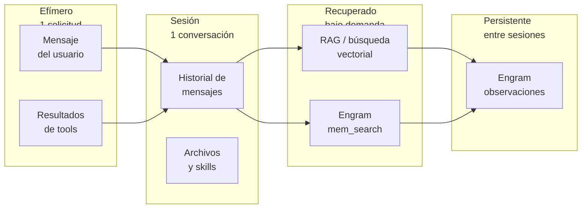

# Contexto, herramientas y memoria

## Resultado de aprendizaje

Distinguir los siete tipos de contexto que maneja un agente de IA, explicar la diferencia entre contexto efímero y memoria persistente, y decidir cuándo una herramienta, una búsqueda RAG o Engram es la solución adecuada para recuperar o almacenar información.

## Respuesta simple

Un agente de IA no tiene una sola "memoria". Cada mensaje que envías, cada archivo que adjuntas, cada herramienta que el agente ejecuta y cada búsqueda que realiza vive en un tipo de contexto distinto, con una duración y un propósito diferentes.

El contexto se organiza en cuatro niveles según su persistencia:

- **Efímero**: dura lo que dura una solicitud. Incluye el mensaje que escribes y los resultados de las herramientas que el agente ejecuta para responderlo.
- **Sesión**: dura toda la conversación. Incluye el historial de mensajes, los archivos que adjuntaste y los skills que se cargaron.
- **Recuperado**: no está presente hasta que el agente lo busca. Incluye resultados de RAG (búsqueda vectorial sobre documentos) y de `mem_search` en Engram.
- **Persistente**: sobrevive entre sesiones. Incluye las observaciones guardadas en Engram con `mem_save`.

El error más frecuente es asumir que "el agente se acuerda de todo". No se acuerda: cada vez que el contexto se compacta o la sesión termina, la información efímera y de sesión se pierde. Lo que persiste es lo que el agente guardó activamente en memoria persistente.

Las herramientas (read, write, bash, mem_save, websearch) extienden lo que el agente puede hacer, pero cada tool call tiene costo, latencia y riesgo. Más herramientas no significan mejor resultado automáticamente.

MCP (Model Context Protocol) es el estándar que conecta agentes con herramientas. Es un protocolo de integración, no inteligencia ni autonomía. El agente no "sabe" que usa MCP: solo ve definiciones de herramientas en su contexto y decide si invocarlas.

## Modelo mental

Imagina que trabajas en una oficina con un asistente. Tu asistente tiene:

1. Una **hoja en blanco** donde escribe lo que le dices en cada conversación (mensaje actual).
2. Un **cuaderno de la conversación** donde anota todo lo que se dijo en esa reunión (historial de sesión).
3. Un **archivador** donde busca documentos cuando se los pides (RAG, contexto recuperado).
4. Una **carpeta personal** donde guarda notas importantes que revisa en la próxima reunión (Engram, memoria persistente).

El asistente no recuerda automáticamente lo que escribió en la carpeta personal. Tiene que abrirla y leer. Y si la reunión se termina, el cuaderno de la conversación se guarda en un cajón y no se vuelve a abrir hasta la próxima reunión — pero la carpeta personal sigue ahí.

La limitación de la analogía: en software, el contexto efímero y el de sesión **se destruyen activamente** cuando se compactan o la sesión termina. No es que queden guardados en un cajón: la información se pierde a menos que alguien la haya copiado a la carpeta personal antes de que eso ocurra.

## Mapa o recorrido

El siguiente diagrama muestra los cuatro niveles de contexto ordenados por su persistencia, de menor a mayor duración:



Los recuadros de la izquierda contienen información que existe **solo mientras el agente procesa una solicitud**. Los del centro corresponden a **toda una sesión**. Los de la derecha se **recuperan bajo demanda** y viven fuera del contexto activo hasta que se necesitan. Los del extremo derecho **persisten entre sesiones**.

Las flechas indican el flujo típico: un mensaje y sus resultados de herramientas pasan a formar parte del historial de la conversación. Durante la sesión, el agente puede buscar en RAG o en Engram. Si encuentra algo relevante, puede decidir guardarlo como observación persistente.

## Ejemplo continuo

Un equipo de desarrollo usa un agente Gentle para mantener un proyecto. Han pasado tres meses desde que decidieron usar PostgreSQL en lugar de MongoDB. Hoy, un desarrollador recién incorporado pregunta:

> "¿Por qué elegimos PostgreSQL? ¿Hubo alguna discusión al respecto?"

El agente necesita responder usando múltiples tipos de contexto:

1. Interpreta la pregunta usando el **mensaje actual** (contexto efímero).
2. Busca en el **historial de la conversación** actual por si ya hablaron del tema en esta sesión (contexto de sesión).
3. Si no encuentra nada, ejecuta `mem_search` en **Engram** para buscar observaciones guardadas sobre la decisión (contexto recuperado).
4. Si Engram no tiene un registro directo, ejecuta **RAG** sobre la documentación del proyecto para encontrar el ADR (Architecture Decision Record) (contexto recuperado).
5. Cuando encuentra la información, genera la respuesta y puede guardar un resumen de lo que encontró como nueva **observación en Engram** (memoria persistente), para que la próxima vez la respuesta sea inmediata.

Cada paso involucra un tipo de contexto distinto. Si el agente solo usara el historial de la conversación, no podría responder porque la decisión se tomó en otra sesión hace tres meses.

## Recorrido práctico

A continuación se muestra la secuencia real de eventos cuando el agente procesa la pregunta del ejemplo anterior. No es necesario ejecutar estos comandos; el objetivo es comprender el flujo.

### Paso 1: el agente recibe el mensaje

El mensaje del usuario se coloca en la ventana de contexto como el mensaje más reciente. En este punto el contexto activo contiene: system prompt, historial de la sesión actual y el nuevo mensaje. Son aproximadamente 5K a 15K tokens según lo larga que sea la sesión.

### Paso 2: el agente decide buscar en Engram

El agente reconoce que la pregunta requiere información de una decisión pasada. Ejecuta:

```
tool call: mem_search
argumentos: query = "PostgreSQL MongoDB decision"
```

Este tool call viaja por MCP (protocolo, no inteligencia) al servidor Engram. Engram busca en su base SQLite y devuelve resultados. Si existe una observación guardada con `title: "Decision: PostgreSQL sobre MongoDB"`, Engram la devuelve.

### Paso 3: sin resultado en Engram, el agente prueba RAG

Si Engram no tiene la decisión, el agente ejecuta una búsqueda RAG sobre los documentos del proyecto:

```
tool call: websearch o query a base vectorial
argumentos: query = "ADR base de datos PostgreSQL MongoDB"
```

RAG convierte la query en un vector, busca los vectores más cercanos en el índice, recupera los chunks de texto correspondientes y los devuelve como contexto.

### Paso 4: el agente responde y guarda

Con la información recuperada (de Engram o de RAG), el agente genera la respuesta. Si la información vino de RAG, puede decidir guardar un resumen en Engram para acelerar futuras consultas:

```
tool call: mem_save
argumentos: title = "Decision: PostgreSQL sobre MongoDB",
            type = decision,
            content = "Se eligió PostgreSQL por..."
```

### Paso 5: la respuesta llega al usuario

El agente combina el resultado de las herramientas con su explicación y devuelve la respuesta completa.

## Cómo funciona internamente

### Los siete tipos de contexto

Un agente maneja siete tipos de contexto, cada uno con un mecanismo de almacenamiento, duración y costo diferente:

| Tipo | Duración | Dónde vive | Ejemplo |
|------|----------|------------|---------|
| Mensaje actual | 1 solicitud | Ventana de contexto (tokens) | "Por qué elegimos PostgreSQL?" |
| Historial de conversación | 1 sesión | Ventana de contexto, se compacta | Intercambios anteriores |
| Archivos adjuntos | 1 solicitud | Codificados en la solicitud (base64) | imagen.png, documento.pdf |
| Resultados de herramientas | 1 solicitud | Inyectados como mensaje de tool result | Salida de read, bash, mem_search |
| RAG / búsqueda vectorial | Se recupera bajo demanda | Índice vectorial externo | Chunks de documentación |
| Engram mem_search | Se recupera bajo demanda | Base SQLite de Engram | Observaciones guardadas |
| Engram observaciones | Persistente (entre sesiones) | Base SQLite de Engram | Decisiones, bugs, descubrimientos |

### Conversación vs. sesión vs. almacenamiento vs. memoria

Estos cuatro conceptos suelen confundirse. Son distintos:

- **Conversación**: la secuencia de mensajes que intercambias con el agente. Vive en la ventana de contexto. Se compacta cuando se acerca al límite.
- **Sesión**: el perímetro de una interacción continua. Cuando cierras la terminal o la ventana, la sesión termina. Todo el contexto de sesión se descarta.
- **Almacenamiento**: datos persistentes en disco (archivos, bases de datos, vectores). RAG lee de almacenamiento, pero el almacenamiento no es memoria del agente.
- **Memoria**: información que el agente puede recuperar y usar entre sesiones. Engram es memoria. No es automática: el agente debe guardar activamente.

La confusión más común es pensar que el almacenamiento (documentos, vectores) es memoria del agente. No lo es: el agente no "recuerda" lo que hay en un archivo hasta que lo lee.

### Cómo funciona Engram

Engram es un sistema de memoria persistente que almacena observaciones en una base SQLite local. Cada observación tiene:

- `id`: identificador único
- `title`: título descriptivo
- `type`: bugfix, decision, discovery, architecture, pattern, config, preference
- `content`: el contenido completo
- `scope`: project (default) o personal
- `topic_key`: clave para agrupar observaciones del mismo tema
- `created_at`: timestamp de creación

Cuando el agente ejecuta `mem_save`, Engram escribe en SQLite. Cuando ejecuta `mem_search`, Engram hace una búsqueda de texto completo sobre los campos title y content. No hay embedding ni vectorización: la búsqueda es textual.

Engram no es una base de datos vectorial. No es RAG. Es un almacenamiento clave-valor con búsqueda de texto completo, diseñado para decisiones, descubrimientos y convenciones del equipo de desarrollo.

### Cómo funciona RAG

RAG (Retrieval-Augmented Generation) sigue este pipeline:

1. **Indexación** (fuera de línea): los documentos se dividen en chunks, cada chunk se pasa por un modelo de embedding que produce un vector numérico, y los vectores se almacenan en una base vectorial.
2. **Búsqueda** (en línea): la consulta del usuario se convierte en vector con el mismo modelo de embedding, y la base vectorial devuelve los chunks más cercanos por similitud coseno.
3. **Aumento**: los chunks recuperados se agregan al contexto del modelo junto con la consulta original.

RAG es útil para documentación extensa, bases de conocimiento o manuales. No es útil para decisiones efímeras, datos privados que no deberían indexarse, ni información que cambia rápido.

### Herramientas: extienden capacidades, aumentan riesgos

Cada herramienta (tool) que el agente puede usar se define con un JSON Schema. Cuando el modelo decide que necesita ejecutar una herramienta, devuelve un JSON con el nombre y los argumentos. El runtime ejecuta la función real y devuelve el resultado.

Las herramientas:

- **Extienden** lo que el agente puede hacer: leer archivos, ejecutar comandos, buscar en internet, guardar memoria.
- **Aumentan el riesgo**: cada tool call puede fallar, devolver datos inesperados o, si no está bien acotada, causar efectos secundarios no deseados.
- **Consumen tokens**: la definición de la tool, la solicitud y el resultado ocupan espacio en la ventana de contexto.
- **Agregan latencia**: cada ciclo modelo → runtime → modelo toma tiempo.

MCP estandariza la conexión entre agentes y herramientas, pero MCP no es inteligencia. Un servidor MCP no "sabe" qué está haciendo el agente. Solo recibe solicitudes y devuelve respuestas. La decisión de usar o no una herramienta sigue siendo del modelo, guiada por el system prompt y el contexto.

## Cuándo usarlo y cuándo evitarlo

### Contexto efímero (mensaje actual, resultados de tools)

**Usar cuando**: la información solo es relevante para la respuesta inmediata. Por ejemplo, el resultado de `read` sobre un archivo que el usuario preguntó.

**Evitar cuando**: la información podría ser necesaria más adelante. Si el resultado de una herramienta contiene una decisión importante, el agente debería guardarla en Engram antes de que desaparezca.

### Contexto de sesión (historial, archivos adjuntos, skills)

**Usar cuando**: la conversación es continua y los mensajes anteriores son necesarios para entender el contexto.

**Evitar cuando**: la sesión se vuelve muy larga. El historial consume tokens y puede compactarse, perdiendo detalles. Las decisiones importantes no deberían vivir solo en el historial.

### RAG / búsqueda vectorial

**Usar cuando**: tienes una base de conocimiento extensa (documentación, manuales, ADRs) y necesitas recuperar fragmentos relevantes.

**Evitar cuando**: la información es confidencial y no debería indexarse en vectores, o cuando los chunks recuperables no tienen el contexto suficiente para ser útiles. RAG tampoco reemplaza a Engram para decisiones de desarrollo.

### Engram (memoria persistente)

**Usar cuando**: necesitas que una decisión, descubrimiento o convención sobreviva entre sesiones. Engram es ideal para ADRs, justificaciones técnicas, bugs recurrentes y preferencias del equipo.

**Evitar cuando**: la información es efímera, cambia constantemente o es demasiado voluminosa para justificar una observación. Engram no es un reemplazo de la documentación del proyecto ni un sistema de archivos.

### Herramientas en general

**Usar cuando**: necesitas que el agente haga algo que el modelo solo no puede: leer archivos, ejecutar comandos, buscar en internet, guardar memoria.

**Evitar cuando**: el mismo resultado se puede lograr con una pregunta directa al modelo. Cada tool call innecesaria suma costo, latencia y riesgo de fallo.

## Costos y trade-offs

| Enfoque | Costo por operación | Latencia | Riesgo | Persistencia |
|---------|---------------------|----------|--------|-------------|
| Preguntar al modelo (sin tools) | Solo tokens de input/output | Baja | Bajo | Ninguna |
| Leer un archivo (read) | 1 tool call + contenido en tokens | Media | Bajo (solo lectura) | Ninguna |
| Buscar en Engram (mem_search) | 1 tool call + resultados en tokens | Baja | Bajo (solo lectura) | Recupera persistente |
| Guardar en Engram (mem_save) | 1 tool call | Baja | Bajo | Si |
| RAG (búsqueda vectorial) | Embedding + búsqueda + chunks en tokens | Media-Alta | Medio (datos indexados) | No (datos en índice) |
| Ejecutar comando (bash) | 1 tool call + salida en tokens | Variable | Alto (efectos secundarios) | Ninguna |
| Web search | 1 tool call + resultados en tokens | Alta | Medio (calidad variable) | Ninguna |

Trade-offs clave:

- **Memoria persistente vs. RAG**: Engram es más barato y rápido para decisiones y descubrimientos del equipo. RAG es mejor para documentación extensa que no cambia seguido. Usar Engram para lo que el equipo decidió y RAG para lo que la documentación dice.
- **Mantener historial vs. compactar**: mantener más historial da mejor contexto pero consume tokens caros. Compactar ahorra tokens pero pierde detalles. Engram mitiga esta pérdida guardando lo importante antes de compactar.
- **Más herramientas vs. más riesgo**: cada tool disponible amplía lo que el agente puede hacer, pero también amplía la superficie de fallo. No configures tools que el agente no necesita.

## Errores frecuentes

### Error 1: asumir que el agente recuerda todo

**Síntoma**: el usuario dice "pero ya hablamos de esto ayer" y el agente no lo recuerda.

**Causa probable**: la sesión anterior terminó y el contexto de sesión se perdió. El agente no retiene información entre sesiones a menos que se haya guardado en Engram.

**Diagnóstico**: preguntar al agente "busca en Engram si tenemos algo sobre este tema". Si no encuentra nada, es que no se guardó.

**Corrección**: después de una decisión importante, pedir explícitamente "guarda esto en Engram" o configurar el agente para que lo haga automáticamente mediante reglas en el system prompt.

**Verificación**: ejecutar `mem_search` con las palabras clave de la decisión. Si aparece, la memoria funciona.

### Error 2: confundir RAG con memoria persistente

**Síntoma**: el agente no encuentra una decisión del equipo que está documentada en un ADR dentro de la base de conocimiento.

**Causa probable**: el ADR no se indexó en la base vectorial, o los chunks del ADR no contienen la frase exacta que el agente busca.

**Diagnóstico**: verificar si el documento existe en la fuente de RAG. Si existe pero no se encuentra, puede ser un problema de chunking o de embedding.

**Corrección**: las decisiones del equipo deberían guardarse en Engram, no solo en documentos indexados por RAG. Engram tiene búsqueda de texto completo directa.

**Verificación**: después de guardar en Engram, ejecutar `mem_search` con la misma consulta. Si aparece, el problema está resuelto.

### Error 3: pensar que MCP da autonomía al agente

**Síntoma**: "el agente es autónomo porque usa MCP".

**Causa probable**: confundir el protocolo de integración con la capacidad de decisión del agente.

**Diagnóstico**: MCP es solo el cable. El agente sigue necesitando instrucciones explícitas (system prompt, skills) para decidir cuándo y cómo usar cada herramienta.

**Corrección**: MCP no reemplaza el diseño del agente. Sigue siendo necesario definir qué herramientas están disponibles, con qué permisos, y qué instrucciones guían su uso.

**Verificación**: revisar la configuración MCP. Ningún server MCP decide por sí mismo ejecutarse. Solo responde cuando el host le envía una solicitud.

### Error 4: no planificar el costo de los tool calls

**Síntoma**: una sesión simple cuesta mucho más de lo esperado.

**Causa probable**: el agente ejecuta múltiples tool calls innecesarios. Cada tool call agrega tokens de definición de tool, solicitud y resultado.

**Diagnóstico**: revisar los logs de la sesión. Si hay tool calls que podrían haberse evitado con una pregunta directa al modelo, hay sobreuso.

**Corrección**: revisar qué tools están disponibles. Si una tool no es necesaria para la tarea, sacarla de la configuración. Ajustar el system prompt para priorizar respuestas directas cuando sea posible.

**Verificación**: comparar el costo de una sesión con y sin la tool problemática.

## Comprueba lo aprendido

### Preguntas de verificación

1. Un desarrollador adjunta un archivo `ADR-base-de-datos.md` a un mensaje. ¿En qué nivel de contexto vive ese archivo y qué pasa con él cuando la sesión termina?

2. La decisión de usar PostgreSQL se guardó en Engram hace tres meses. Cuando el agente ejecuta `mem_search("PostgreSQL")`, ¿dónde busca exactamente Engram y qué tipo de búsqueda realiza?

3. ¿Cuál es la diferencia entre el resultado de un tool call y una observación guardada en Engram?

4. Un equipo tiene toda su documentación indexada en RAG. ¿Por qué podría no ser suficiente para recordar decisiones técnicas del equipo?

5. ¿MCP hace que un agente sea autónomo? Justificar técnica por qué sí o por qué no.

### Ejercicio práctico

**Contexto**: trabajas en un proyecto con un agente Gentle. Durante una sesión, el equipo decide adoptar la convención de nombrar commits con conventional commits.

**Tarea**: sin ejecutar comandos, determina:

1. ¿En qué tipo de contexto vive esa decisión durante la conversación?
2. ¿Qué pasaría con esa información si la sesión termina sin guardarla?
3. ¿Qué tool de Engram usarías para preservarla?
4. ¿Qué tipo y título le asignarías a la observación?
5. ¿Cómo verificarías que la decisión está disponible en una sesión futura?

**Criterio de éxito**: poder explicar el recorrido completo de la información desde que se menciona en la conversación hasta que persiste entre sesiones, identificando cada tipo de contexto involucrado.

## Resumen

| Concepto | Definición | Persiste entre sesiones |
|----------|------------|------------------------|
| Mensaje actual | Texto que el usuario envía en una interacción | No |
| Historial de conversación | Secuencia de mensajes de la sesión actual | No (se compacta) |
| Archivos adjuntos | Archivos incluidos en un mensaje (imagen, PDF, código) | No |
| Resultados de herramientas | Salida de las tools que el agente ejecutó | No (solo en historial) |
| RAG / búsqueda vectorial | Chunks recuperados de una base vectorial | No (se busca cada vez) |
| Engram mem_search | Resultados de búsqueda en memoria persistente | Lee datos que sí persisten |
| Engram observaciones | Información guardada activamente por el agente | Si |
| MCP | Protocolo de integración entre agente y herramientas | No aplica |
| Tool calling | Mecanismo por el que el modelo solicita ejecutar una función | No aplica |

## Fuentes y alcance

- Fuente conceptual: arquitectura del ecosistema Gentle-AI, principios de diseño de agentes con memoria y herramientas.
- Fuente técnica primaria: documentación de OpenCode (opencode.ai), especificación MCP (modelcontextprotocol.io), documentación de Engram (proyecto Engram).
- Hechos volátiles verificados: el mecanismo de tool calling, el comportamiento de Engram (búsqueda de texto completo sobre SQLite), y la arquitectura MCP (host, client, server, primitives).
- Fecha de verificación: 2026-07-27.
- Alcance de la comprobación: conceptos estables del ecosistema Gentle-AI 2.x. Las implementaciones concretas de RAG, bases vectoriales y configuraciones de MCP pueden variar según el proveedor y la versión.

---

> **Siguiente capítulo**: Agentes y orquestadores — comprende cómo los agentes se organizan en sistemas multiagente con orquestación SDD.
