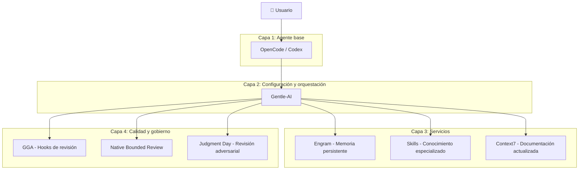
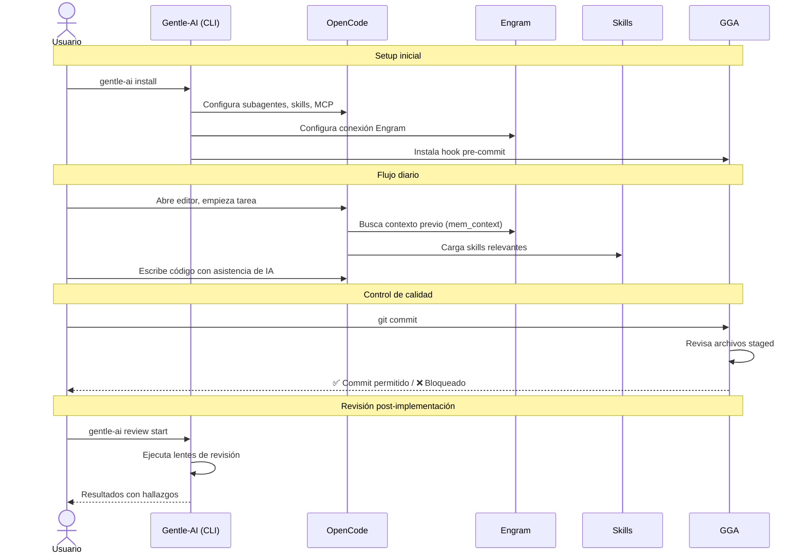
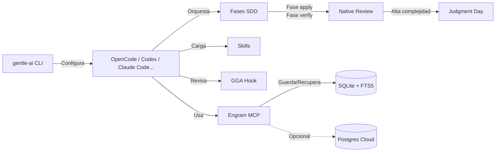

# Visión general del ecosistema

## Qué aprenderás

En este capítulo vas a entender el mapa completo del ecosistema **Gentleman Programming**. Vas a conocer cada pieza, qué problema resuelve, cómo se relaciona con las demás, y por qué existe cada una.

No vamos a profundizar en configuración o comandos todavía. Eso viene después. Acá vas a construir el mapa mental necesario para entender todo lo demás.

## Por qué importa

El ecosistema Gentle no es un solo programa. Es un conjunto de herramientas que trabajan juntas. Si no entendés cómo se relacionan, vas a usar cada una por separado sin aprovechar su potencial completo.

Imaginate tener un taller mecánico donde cada herramienta está en una caja cerrada y no sabés cuál usar para cada tarea. Este capítulo abre todas las cajas y te muestra el taller completo.

## La idea central

El ecosistema Gentle resuelve un problema fundamental: **los asistentes de código con IA son genéricos por defecto**. Te dan un modelo, un chat, y capacidad de leer archivos. Pero no saben cómo trabajar en equipo, no recuerdan lo que hiciste ayer, y no tienen estándares de calidad.

Gentle-AI transforma un asistente genérico en un **entorno estructurado de desarrollo con agentes**. Le agrega:

- **Planificación** (SDD): no empieces a codificar sin especificar primero
- **Memoria** (Engram): no pierdas el contexto entre sesiones
- **Conocimiento** (Skills): no inventes patrones que ya están documentados
- **Calidad** (GGA + Native Review + Judgment Day): no cometas errores que podrías haber detectado antes

## Las 4 capas del ecosistema

### Capa 1: Agente base

El punto de partida es un asistente de código con IA. Puede ser:

- **OpenCode**: entorno de desarrollo con agentes, MCP, skills y plugins. Código abierto, extensible.
- **Codex CLI**: el cliente oficial de OpenAI para terminal. Más simple, menos extensible.
- **Claude Code**, **Gemini CLI**, **Cursor**, etc.: cada uno con sus fortalezas.

Gentle-AI no reemplaza a estos agentes. Los **configura**. Les agrega componentes que no vienen incluidos.

### Capa 2: Configuración y orquestación

**Gentle-AI** es el corazón del ecosistema. Es un programa que:

1. **Instala y configura** los componentes del ecosistema sobre tu agente base
2. **Define agentes y subagentes** con instrucciones, herramientas y modelos específicos
3. **Orquesta flujos SDD**: coordina qué agente hace qué fase
4. **Provee presets y personas**: configuraciones reutilizables
5. **Administra skills**: las descubre, las instala y las mantiene
6. **Gestiona calidad**: conecta GGA, Native Review y Judgment Day

Todo esto sin que tengas que editar archivos de configuración complejos manualmente (aunque podés hacerlo si querés).

### Capa 3: Servicios

**Engram** es el sistema de memoria persistente. No es "una base de datos" cualquiera:

- Guarda **decisiones**, **bugs**, **descubrimientos** y **contexto** entre sesiones
- Usa **SQLite + FTS5** para búsqueda de texto completo
- Se conecta a los agentes vía **MCP** (Model Context Protocol)
- Opcionalmente sincroniza a la nube con **Postgres**
- Tiene **ciclo de vida de memoria**: las decisiones antiguas se marcan para revisión

**Skills** son archivos de conocimiento especializado que el agente carga cuando el contexto lo requiere. Por ejemplo:

- Cuando trabajás con React, se carga un skill de React 19
- Cuando trabajás con Angular, se carga otro skill de Angular
- Cuando creás un PR, se carga un skill de cómo escribir PRs

**Context7** provee documentación actualizada de librerías y frameworks.

### Capa 4: Calidad y gobierno

**GGA (Gentleman Guardian Angel)** es un hook de Git que revisa tu código antes de cada commit. Funciona como un revisor automático que:

- Lee los archivos staged
- Los envía a un modelo de IA
- Espera una respuesta `STATUS: PASSED` o `STATUS: FAILED`
- Bloquea el commit si algo está mal

**Native Bounded Review** es un sistema de revisión de código con:

- **Presupuesto**: número máximo de líneas a revisar
- **Lentes**: 4 perspectivas (riesgo, legibilidad, confiabilidad, resiliencia)
- **Linaje**: cadena criptográfica que conecta revisión, corrección y recibo
- **Receipt**: comprobante verificable de que la revisión se completó

**Judgment Day** es un protocolo de revisión adversarial donde dos jueces independientes (modelos diferentes) evalúan el mismo cambio sin comunicarse entre sí. Si ambos coinciden en que hay un problema, se genera una corrección quirúrgica.

## Relación entre las piezas

## Los 4 repositorios principales

| Repositorio | Versión | Lenguaje | Propósito |
|------------|---------|----------|-----------|
| [gentle-ai](https://github.com/Gentleman-Programming/gentle-ai) | v2.1.10 | Go | Orquestador, CLI, SDD, configuración |
| [engram](https://github.com/Gentleman-Programming/engram) | v1.20.0 | Go | Memoria persistente, MCP, cloud |
| [gentleman-guardian-angel](https://github.com/Gentleman-Programming/gentleman-guardian-angel) | v2.10.1 | Bash | Hooks Git de revisión |
| [Gentleman-Skills](https://github.com/Gentleman-Programming/Gentleman-Skills) | sin tag | Markdown | Biblioteca de skills curadas y comunitarias |

> **Verificado en**: gentle-ai commit `b0a88fa`, engram commit `763a6ba`, GGA commit `fbf1091`, Gentleman-Skills commit `c8036a37`. Fecha: 2026-07-20.

## Cómo se conectan

## Qué NO hace el ecosistema

Es igual de importante saber qué no hace:

- **No reemplaza a OpenCode o Codex**. Los configura y extiende, no los sustituye.
- **No es un modelo de IA**. Usa modelos existentes (OpenAI, Google, Anthropic).
- **No es un framework web**. No construye servidores ni APIs.
- **No es un lenguaje de programación**. Orquesta herramientas existentes.
- **No te obliga a usar SDD**. Si querés codificar directamente, podés. SDD es una opción estructurada.
- **No es mágico**. Si el modelo que elegís no funciona bien para una tarea, el resultado va a ser malo.

## Resumen

El ecosistema Gentle es una **capa de configuración, memoria, conocimiento y calidad** sobre los asistentes de código con IA. Sus 4 componentes principales trabajan juntos:

1. **Gentle-AI**: orquesta y configura todo
2. **Engram**: recuerda todo entre sesiones
3. **Skills**: saben cómo hacer cada cosa
4. **GGA + Review + Judgment Day**: revisan que todo esté bien

En el próximo capítulo vamos a instalar Gentle-AI y ver cómo se siente trabajar con el ecosistema en la práctica.

## Preguntas

1. ¿Cuál es la diferencia entre Gentle-AI y OpenCode?
2. ¿Qué capa del ecosistema se encarga de la memoria persistente?
3. ¿Qué hace GGA exactamente?
4. ¿Cuándo usarías Judgment Day en lugar de Native Bounded Review?
5. ¿Puedo usar Gentle-AI sin Engram?

## Fuentes verificadas

- Repositorio: gentle-ai, commit `b0a88faf1296ec4f524b8c9bbb90d39af9c42d0d`
- Repositorio: engram, commit `763a6ba432713725d6ce82a2416eec6cbd9ec94e`
- Repositorio: GGA, commit `fbf1091da170a33d42cb97577a9813e652e98a4a`
- Repositorio: Gentleman-Skills, commit `c8036a37893679dc5e942484975405d39689c63b`
- Archivos: `internal/app/`, `internal/agents/`, `internal/planner/`, `internal/pipeline/` en gentle-ai
- Archivos: `internal/mcp/`, `internal/store/` en engram
- Archivos: `bin/gga`, `lib/providers.sh` en GGA
- Fecha: 2026-07-20
- Estado: 🟢 Verificado
