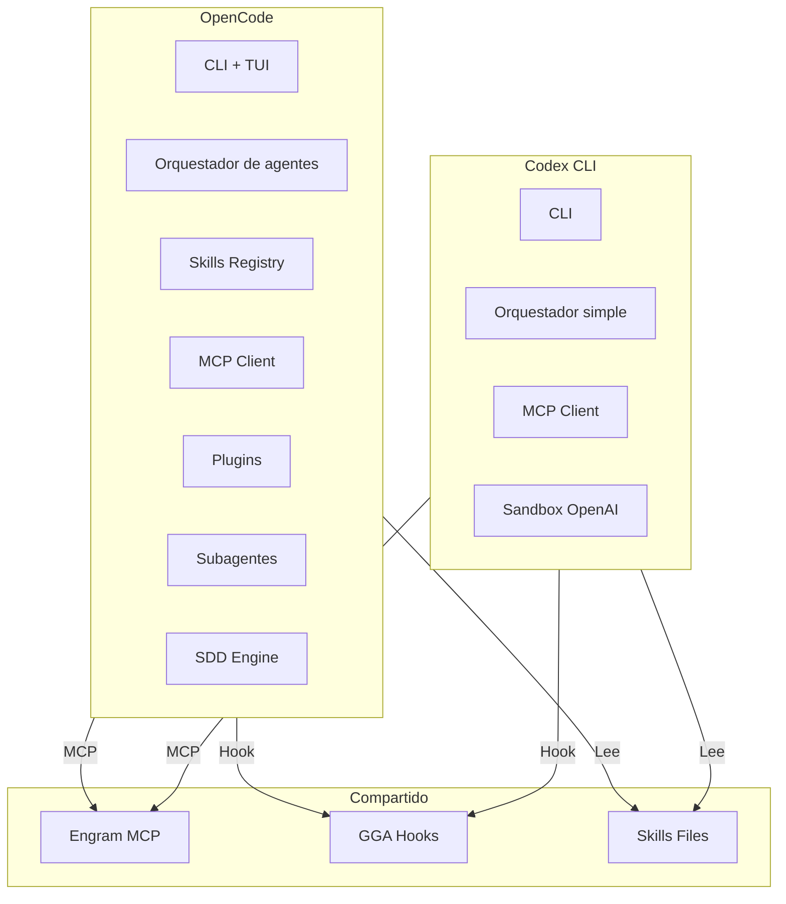

# OpenCode vs Codex

## Qué aprenderás

En el capítulo anterior viste que el ecosistema Gentle se apoya en un **agente base**. Los dos más importantes hoy son **OpenCode** y **Codex CLI**. Parecen herramientas similares —ambos son asistentes de código en terminal— pero tienen filosofías, arquitecturas y costos muy distintos.

Este capítulo te da una comparación objetiva en más de 15 dimensiones. No hay un ganador absoluto: la herramienta correcta depende de tu proyecto, tu equipo y tu flujo de trabajo.

## Por qué importa

Elegir el agente base incorrecto te va a costar tiempo y plata. Si elegís Codex para un proyecto que necesita skills personalizados, te vas a frustrar porque no podés extenderlo. Si elegís OpenCode para un script de una tarde, te vas a frenar con la configuración inicial.

Vas a aprender a diagnosticar cuál necesitás según el tipo de tarea, el tamaño del equipo y el nivel de control que querés.

## Visión simple

**OpenCode** y **Codex** son dos programas que hacen lo mismo en la superficie: te dan un asistente de IA en la terminal para escribir código. Pero se parecen como un destornillador manual se parece a un taladro eléctrico.

| | OpenCode | Codex CLI |
|---|---|---|
| **Filosofía** | Extensible, configurable, para equipos | Simple, liviano, para individuos |
| **Código** | Abierto (MIT) | Cerrado (OpenAI) |
| **Configuración** | Archivos YAML/JSON | Mínima, CLI flags |
| **Extensibilidad** | Plugins, skills, MCP, subagentes | Solo MCP |
| **Modelos** | Cualquier proveedor (OpenAI, Anthropic, Google, local) | Solo OpenAI |
| **Costo mensual típico** | $20–100 (variable según uso) | $200+ (solo OpenAI, uso intensivo) |

## Analogía

Imaginá que querés arreglar tu casa.

**OpenCode** es una caja de herramientas completa con taladro inalámbrico, sierra circular, nivel láser y un manual de instrucciones para cada reparación. Al principio tenés que aprender dónde está cada cosa y cómo se usa. Pero una vez que lo sabés, podés hacer cualquier trabajo, incluso cosas que el fabricante de la caja no imaginó.

**Codex** es un destornillador eléctrico de alta calidad. Lo sacás de la caja, apretás un botón y funciona. Para el 80% de los trabajos alcanza. Pero si necesitás hacer un agujero de 10 cm en un muro de hormigón, te vas a dar cuenta de que el destornillador no fue diseñado para eso.

El ecosistema Gentle te permite tener ambas herramientas y usarlas según el trabajo.

## Cómo funciona realmente

### Arquitectura



La diferencia fundamental está en el orquestador. OpenCode tiene un **router inteligente** que decide qué subagente, skill o herramienta ejecutar según la tarea. Codex tiene un orquestador simple que ejecuta todo con el mismo agente.

### Tabla comparativa detallada

| # | Dimensión | OpenCode | Codex CLI |
|---|-----------|----------|-----------|
| 1 | **Arquitectura** | Orquestador multi-agente con enrutamiento | Orquestador simple, un agente |
| 2 | **Configuración** | Archivos YAML/JSON en `.opencode/` y `opencode.json` | Flags CLI + archivo `rules.md` opcional |
| 3 | **Orquestador** | Sí: decide qué subagente ejecuta cada tarea | No: un solo agente ejecuta todo |
| 4 | **Subagentes** | Sí: podés definir agentes especializados con su propio modelo, instrucciones y herramientas | Experimental (multiAgent en 0.144.0) |
| 5 | **Modelos por fase** | Sí: cada subagente puede usar un modelo distinto (ej: Claude para diseño, GPT-4 para código, Gemini para revisión) | Solo OpenAI |
| 6 | **Skills** | Registry completo: carga skills por contexto (`.codex/skills/`) | Experimental: carga skills desde `~/.codex/skills/` (0.144.0) |
| 7 | **MCP** | Cliente MCP completo: conexión a Engram, Context7, servidores personalizados | Cliente MCP básico |
| 8 | **Engram** | Integración nativa con Engram vía MCP | Compatible vía MCP (configuración manual) |
| 9 | **Plugins** | Sistema de plugins JavaScript/TypeScript | No tiene plugins |
| 10 | **Comandos** | Propios (`/skill`, `/agent`, `/mcp`, `/sdd`, `/review`, `/judgment-day`) | Limitados (chat, bash, MCP básico) |
| 11 | **Enrutamiento** | Router inteligente: decide qué agente/skill/herramienta usar según la tarea | No tiene enrutamiento; todo lo hace el mismo agente |
| 12 | **Costos** | Variable: $20–100/mes (podés usar modelos baratos o locales para tareas simples) | Alto: solo OpenAI, uso intensivo puede superar $200–500/mes |
| 13 | **Debug** | Logs detallados por agente, fase y herramienta | Logs básicos de OpenAI |
| 14 | **Facilidad inicial** | Media: requiere configurar agentes, skills, MCP | Alta: `npx codex` y funciona |
| 15 | **Control** | Total: cada aspecto es configurable | Bajo: lo que OpenAI decide que tenga |
| 16 | **Casos de uso** | Proyectos complejos, equipos, SDD completo, revisión de calidad | Scripts rápidos, exploración, prototipos individuales |
| 17 | **Límites** | Curva de aprendizaje; sobre-ingeniería si se usa para todo | Imposibilidad de personalizar; vendor lock-in con OpenAI |

### Cuándo usar OpenCode

OpenCode es la mejor opción cuando:

1. **Trabajás en equipo**: los subagentes, skills y configuración compartida permiten estándares consistentes.
2. **Usás SDD completo**: el orquestador de OpenCode maneja las fases SDD (explore, propose, spec, design, tasks, apply, verify, archive).
3. **Necesitás múltiples modelos**: querés usar Claude para arquitectura, Gemini para revisión y un modelo local para tareas simples.
4. **El proyecto es complejo**: más de 10 archivos, múltiples módulos, dependencias cruzadas.
5. **Querés control total**: configurar cada aspecto del comportamiento del agente.
6. **Usás Engram intensivamente**: la integración nativa hace que guardar y recuperar memoria sea transparente.

### Cuándo usar Codex

Codex es la mejor opción cuando:

1. **Trabajás solo**: no necesitás coordinar agentes ni compartir configuración.
2. **El proyecto es pequeño**: un script, una función, un experimento rápido.
3. **Querés empezar ya**: `npx codex` y en 30 segundos estás codificando.
4. **Usás OpenAI exclusivamente**: no planeás cambiar de proveedor.
5. **Todo es exploración**: no necesitás memoria persistente ni skills especializados.
6. **El presupuesto no es limitante**: podés pagar el premium de OpenAI.

### Cuándo usar ambos

La estrategia más potente es usar **ambos**:

- **Codex** para el día a día: scripts rápidos, debugging, exploración, preguntas.
- **OpenCode** para tareas estructuradas: implementar features, SDD, revisiones de calidad, proyectos que requieren memoria.

El ecosistema Gentle lo soporta explícitamente: podés tener OpenCode configurado con Engram y skills, y usar Codex para tareas livianas. Ambos comparten:

- El mismo repositorio Engram (memoria unificada)
- Los mismos hooks GGA (calidad consistente)
- Los mismos archivos de proyecto

### Cómo compartir Engram entre OpenCode y Codex

Engram se conecta a cualquier agente vía MCP. Para compartir la misma base de memoria:

**En OpenCode** (automático si usaste `gentle-ai install`):

```json
// .opencode/mcp.json
{
  "mcpServers": {
    "engram": {
      "command": "engram",
      "args": ["mcp"],
      "env": {
        "ENGRAM_PROJECT": "mi-proyecto"
      }
    }
  }
}
```

**En Codex** (configuración manual):

```json
// .codex/mcp.json
{
  "mcpServers": {
    "engram": {
      "command": "engram",
      "args": ["mcp"],
      "env": {
        "ENGRAM_PROJECT": "mi-proyecto"
      }
    }
  }
}
```

Con ambos apuntando al mismo `ENGRAM_PROJECT`, las decisiones, bugs y descubrimientos que guardes desde OpenCode están disponibles cuando usás Codex, y viceversa.

### Costos en detalle

El costo no es solo el modelo. OpenCode puede ser **más barato** aunque tenga más funcionalidad:

| Escenario | OpenCode | Codex CLI |
|-----------|----------|-----------|
| Script simple (200 líneas) | ~$0.50 (modelo económico) | ~$2.00 (OpenAI gpt-4o) |
| Feature mediano (5 archivos) | ~$5 (mezcla Claude + Gemini) | ~$15 (todo OpenAI) |
| SDD completo (10 fases) | ~$20 (modelos por fase) | No aplica (no tiene SDD) |
| Mes de trabajo individual | ~$50–100 | ~$200–500 |
| Mes de equipo (3 personas) | ~$150–300 + caché compartido | ~$600–1500 |

OpenCode permite rutear las fases baratas (explore, propose) a modelos económicos, y solo las fases críticas (apply, verify) a modelos caros. Codex usa el mismo modelo para todo.

### Límites conocidos

**OpenCode**:
- Curva de aprendizaje inicial: ~2–3 horas para configurar bien los subagentes.
- Riesgo de sobre-ingeniería: podés configurar 10 agentes cuando uno solo alcanza.
- Documentación extensa: hay mucho que leer antes de dominarlo.

**Codex CLI**:
- Vendor lock-in con OpenAI: si mañana OpenAI cambia precios o políticas, estás atado.
- Sin skills: todo el conocimiento tiene que ir en `rules.md` o en el prompt.
- Sin subagentes: no podés especializar el comportamiento para distintas tareas.
- Sin control fino: no podés decidir qué modelo usa cada fase.
- Sin plugins: no podés extender la funcionalidad con código propio.

## Resumen

| Aspecto | OpenCode | Codex CLI |
|---------|----------|-----------|
| Filosofía | Extensible y configurable | Simple y listo para usar |
| Mejor para | Proyectos complejos, equipos | Scripts rápidos, individuales |
| Modelos | Cualquier proveedor | Solo OpenAI |
| Skills | Sí (registry completo) | No (solo rules.md) |
| Subagentes | Sí | No |
| Engram | Integración nativa | Vía MCP manual |
| Costo mensual | $50–100 (individual) | $200–500 (individual) |
| Control | Total | Bajo |
| Facilidad inicial | Media | Alta |

## Preguntas

1. Si tenés un proyecto grande con un equipo de 5 personas, ¿elegís OpenCode o Codex? ¿Por qué?
2. Si necesitás escribir un script para limpiar datos de un CSV, ¿cuál usás?
3. ¿Cómo harías para compartir memoria entre OpenCode y Codex?
4. ¿Por qué OpenCode puede ser más barato que Codex aunque tenga más funcionalidad?
5. ¿Qué es vendor lock-in y por qué es relevante al elegir entre OpenCode y Codex?

## Fuentes verificadas

- Repositorio: opencode, commit `4b648ef` (OpenCode 1.17.20)
- Repositorio: codex, tag `v0.144.0` (Codex CLI 0.144.0)
- Documentación: opencode.json schema en opencode repo
- Documentación: `gentle-ai install` en gentle-ai repo
- Archivos: `internal/orchestrator/`, `internal/agent/` en opencode
- Fecha: 2026-07-20
- Estado: 🟢 Verificado
