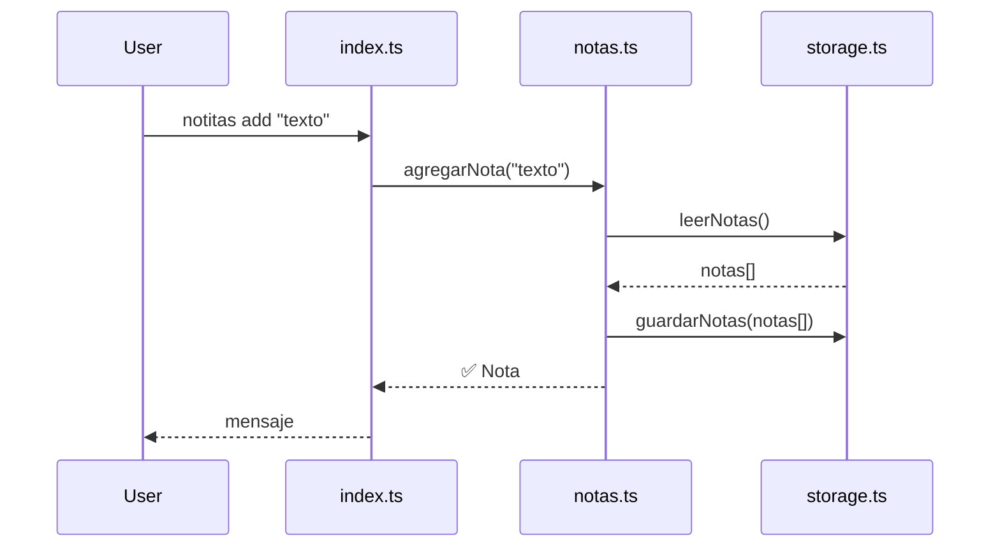

# Tu primer proyecto con SDD

## Qué aprenderás

En este capítulo vas a crear un proyecto real desde cero usando **SDD** (Specification-Driven Development). Vas a pasar por todas las fases del ciclo —init, explore, propose, spec, design, tasks, apply, verify, archive— y al final vas a tener un programa funcionando.

No es un ejemplo teórico. Vas a ejecutar comandos, ver archivos generados, tomar decisiones de diseño, y codificar.

## Por qué importa

SDD parece mucha estructura al principio. ¿Por qué no codificar directamente? Porque sin estructura:

- Empezás a codificar sin entender bien el problema
- Descubrís requisitos a mitad de camino y tenés que reescribir
- Olvidás decisiones que tomaste la semana pasada
- No sabés cuándo está "terminado" realmente

SDD no es burocracia. Es una checklist que te asegura que no te saltaste nada. Este capítulo te muestra que, en la práctica, las fases fluyen naturalmente y el tiempo "perdido" en planificar se recupera con creces en implementación.

## Visión simple

SDD es como construir una casa. No agarrás los ladrillos y empezás a ponerlos:

1. **Init**: preparás el terreno y las herramientas
2. **Explore**: averiguás qué casa quiere el dueño
3. **Propose**: proponés qué tipo de casa vas a construir
4. **Spec**: escribís los planos de cada ambiente
5. **Design**: definís los materiales y la estructura
6. **Tasks**: hacés la lista de tareas de construcción
7. **Apply**: construís cada ambiente
8. **Verify**: revisás que cada ambiente esté bien
9. **Archive**: cerrás el expediente de la obra

Cada fase tiene un entregable concreto. Cuando terminás una, pasás a la siguiente. Si algo no está claro, volvés atrás.

## Analogía

Hacer un proyecto sin SDD es como cocinar sin receta: agarrás ingredientes, los tirás en una olla, y esperás que salga algo comestible. A veces sale bien. Pero no sabés por qué. Y cuando sale mal, no sabés qué corregiste.

Con SDD, la receta está escrita antes de cocinar. Sabés qué ingredientes necesitás, en qué orden, y cómo saber si está listo. Cocinar lleva el mismo tiempo, pero el resultado es predecible.

## Cómo funciona realmente

### El proyecto: "Notitas" — un gestor de notas de terminal

Vamos a construir **Notitas**, una herramienta CLI para tomar notas desde la terminal. Es lo suficientemente chico para completarlo en este capítulo, pero lo suficientemente real para mostrar todas las fases de SDD.

**Requisitos**:
- Agregar una nota con `notitas add "texto"`
- Listar notas con `notitas list`
- Buscar notas con `notitas search "palabra"`
- Eliminar una nota con `notitas delete <id>`
- Las notas se guardan en un archivo JSON

### Fase 0: Init — Preparar el proyecto

```bash
mkdir notitas
cd notitas
gentle-ai sdd init
```

Esto crea la estructura SDD:

```
notitas/
  ├── .sdd/
  │   ├── registry/       # Registro de cambios
  │   ├── templates/      # Plantillas de cada fase
  │   └── changelog.md    # Historial de cambios
  ├── .opencode/           # Configuración del agente
  ├── opencode.json
  └── gentle-ai.yaml
```

Verificá que el init fue exitoso:

```bash
gentle-ai sdd status
```

Output:

```
📋 SDD Status — notitas
────────────────────────
Phase: init
Change: change_001 (no started)
Registry: active
```

Cada proyecto SDD comienza en la fase `init`, con un cambio registrado como `change_001`. Todos los artefactos que crees se asocian a este cambio.

> **Definición**: Un **SDD Change** es una unidad de trabajo atómica. Un proyecto puede tener múltiples cambios. Acá usamos uno solo: implementar Notitas.

### Fase 1: Explore — Explorar el problema

Exploramos qué necesitamos construir:

```bash
gentle-ai sdd explore
```

El agente te hace preguntas y registra las respuestas. Alternativamente, podés escribir el artefacto directamente:

```bash
gentle-ai sdd explore --title "Exploración inicial de Notitas"
```

Esto genera `.sdd/changes/change_001/01-explore.md`:

```markdown
# Explore: Notitas CLI

## Problema
Necesito tomar notas rápidas desde la terminal sin abrir una GUI.

## Usuarios
Una persona que trabaja en terminal y quiere capturar ideas al vuelo.

## Necesidades
- Guardar una nota con un solo comando
- Ver todas las notas guardadas
- Encontrar notas por palabra clave
- Eliminar notas que ya no sirven

## No necesidades
- No necesita sincronización en la nube
- No necesita editar notas (se elimina y crea de nuevo)
- No necesita categorías o etiquetas
- No necesita autenticación

## Riesgos
- Bajo: proyecto personal, sin datos sensibles
- Las notas se guardan localmente en JSON
```

**Artefacto creado**: `.sdd/changes/change_001/01-explore.md`

Al terminar, avanzás a la siguiente fase:

```bash
gentle-ai sdd next
```

### Fase 2: Propose — Proponer el enfoque

```bash
gentle-ai sdd propose --title "Notitas: CLI de notas en JSON"
```

Esto genera `.sdd/changes/change_001/02-propose.md`:

```markdown
# Propose: Notitas CLI

## Enfoque
CLI en Node.js/TypeScript que guarda notas en un archivo JSON plano.

## Alternativas consideradas
| Alternativa | Pros | Contras |
|-------------|------|---------|
| SQLite | Más escalable | Más pesado para este caso |
| JSON plano | Simple, sin dependencias | No soporta consultas complejas |
| Archivos .txt individuales | Simple de inspeccionar | Difícil de listar y buscar |

## Decisión
JSON plano. La alternativa SQLite es mejor para 10,000+ notas, pero para uso personal con cientos de notas, JSON alcanza.

## Stack
- Runtime: Node.js 22
- Lenguaje: TypeScript (tipado)
- Almacenamiento: JSON en `~/.notitas/notas.json`
- Sin dependencias externas
```

**Artefacto creado**: `.sdd/changes/change_001/02-propose.md`

Avanzamos:

```bash
gentle-ai sdd next
```

### Fase 3: Spec — Especificar requisitos

```bash
gentle-ai sdd spec --title "Especificación de Notitas CLI"
```

Esto genera `.sdd/changes/change_001/03-spec.md`:

```markdown
# Spec: Notitas CLI

## Comandos

### `notitas add <texto>`
- Guarda una nueva nota con el texto proporcionado
- Asigna un ID autoincremental
- Guarda timestamp de creación
- Output: `✅ Nota #1 guardada`

### `notitas list`
- Muestra todas las notas en orden inverso (última primero)
- Formato: `#1 · 2026-07-20 14:30 · Comprar leche`
- Si no hay notas: `📭 No hay notas guardadas`

### `notitas search <palabra>`
- Busca notas que contengan la palabra (case-insensitive)
- Muestra resultados igual que list
- Si no encuentra: `🔍 No se encontraron notas con "palabra"`

### `notitas delete <id>`
- Elimina la nota con el ID especificado
- Output: `🗑️ Nota #3 eliminada`
- Si el ID no existe: `❌ Nota #99 no encontrada`

## Almacenamiento
- Archivo: `~/.notitas/notas.json`
- Formato:
```json
{
  "notas": [
    { "id": 1, "texto": "Comprar leche", "creada": "2026-07-20T14:30:00.000Z" }
  ],
  "nextId": 2
}
```

## Validaciones
- `add` sin texto: error `❌ El texto de la nota no puede estar vacío`
- `delete` sin ID: error `❌ Usá: notitas delete <id>`
- Comando desconocido: error `❌ Comando desconocido. Usá: notitas <add|list|search|delete>`
```

**Artefacto creado**: `.sdd/changes/change_001/03-spec.md`

Avanzamos:

```bash
gentle-ai sdd next
```

### Fase 4: Design — Diseñar la arquitectura

```bash
gentle-ai sdd design --title "Diseño de Notitas CLI"
```

Esto genera `.sdd/changes/change_001/04-design.md`:

```markdown
# Design: Notitas CLI

## Arquitectura

```
notitas/
  ├── src/
  │   ├── index.ts        # Punto de entrada, parseo de args
  │   ├── notas.ts        # Lógica de negocio
  │   └── storage.ts      # Persistencia en JSON
  ├── package.json
  ├── tsconfig.json
  └── .gitignore
```

## Flujo de datos



## Módulos

| Módulo | Responsabilidad | No hace |
|--------|----------------|---------|
| `index.ts` | Parsear args, mostrar output | Lógica de negocio |
| `notas.ts` | Validar, crear, buscar, eliminar | IO de archivos |
| `storage.ts` | Leer y escribir JSON | Validación de datos |

## API pública de cada módulo

```typescript
// storage.ts
leerNotas(ruta: string): Nota[]
guardarNotas(ruta: string, notas: Nota[]): void

// notas.ts
agregarNota(texto: string): Nota
listarNotas(): Nota[]
buscarNotas(palabra: string): Nota[]
eliminarNota(id: number): boolean

// index.ts
main(): void  // Punto de entrada
```
```

**Artefacto creado**: `.sdd/changes/change_001/04-design.md`

Avanzamos:

```bash
gentle-ai sdd next
```

### Fase 5: Tasks — Dividir en tareas

```bash
gentle-ai sdd tasks --title "Tareas de implementación"
```

Esto genera `.sdd/changes/change_001/05-tasks.md`:

```markdown
# Tasks: Notitas CLI

## Tareas

### T001: Inicializar proyecto Node.js/TypeScript
- [x] Crear `package.json` con `npm init -y`
- [x] Instalar TypeScript: `npm install -D typescript @types/node`
- [x] Crear `tsconfig.json`
- [x] Crear estructura de carpetas `src/`

### T002: Implementar storage.ts
- [ ] Definir interfaz `Nota`
- [ ] Implementar `leerNotas()`
- [ ] Implementar `guardarNotas()`
- [ ] Crear directorio `~/.notitas/` si no existe

### T003: Implementar notas.ts
- [ ] Implementar `agregarNota()`
- [ ] Implementar `listarNotas()`
- [ ] Implementar `buscarNotas()`
- [ ] Implementar `eliminarNota()`

### T004: Implementar index.ts (CLI)
- [ ] Parsear `process.argv`
- [ ] Enrutar a función según comando
- [ ] Mostrar output formateado

### T005: Compilar y probar
- [ ] Compilar con `tsc`
- [ ] Probar cada comando manualmente
- [ ] Agregar script `"start"` en `package.json`
```

**Artefacto creado**: `.sdd/changes/change_001/05-tasks.md`

Notá que **T001 ya está marcada como hecha** porque `gentle-ai sdd tasks` puede ejecutar tareas de inicialización automáticamente.

Para marcar una tarea como completada:

```bash
gentle-ai sdd task T001 --done
```

Avanzamos a la implementación:

```bash
gentle-ai sdd next
```

### Fase 6: Apply — Implementar

**Importante**: `sdd apply` delega la implementación al agente configurado (OpenCode o Codex). Podés implementar manualmente o dejar que el agente lo haga.

```bash
gentle-ai sdd apply
```

Esto inicia una sesión donde el agente implementa las tareas pendientes. Veamos qué haría:

**Tarea T002: storage.ts**

```typescript
// src/storage.ts
import * as fs from 'fs';
import * as path from 'path';

const DIRECTORIO = path.join(process.env.HOME || process.env.USERPROFILE || '', '.notitas');
const ARCHIVO = path.join(DIRECTORIO, 'notas.json');

export interface Nota {
  id: number;
  texto: string;
  creada: string;
}

interface Datos {
  notas: Nota[];
  nextId: number;
}

export function leerNotas(): Datos {
  try {
    const contenido = fs.readFileSync(ARCHIVO, 'utf-8');
    return JSON.parse(contenido);
  } catch {
    return { notas: [], nextId: 1 };
  }
}

export function guardarNotas(datos: Datos): void {
  if (!fs.existsSync(DIRECTORIO)) {
    fs.mkdirSync(DIRECTORIO, { recursive: true });
  }
  fs.writeFileSync(ARCHIVO, JSON.stringify(datos, null, 2), 'utf-8');
}
```

**Tarea T003: notas.ts**

```typescript
// src/notas.ts
import { Nota, leerNotas, guardarNotas } from './storage';

export function agregarNota(texto: string): Nota {
  const datos = leerNotas();
  const nota: Nota = {
    id: datos.nextId,
    texto,
    creada: new Date().toISOString(),
  };
  datos.notas.push(nota);
  datos.nextId++;
  guardarNotas(datos);
  return nota;
}

export function listarNotas(): Nota[] {
  const datos = leerNotas();
  return datos.notas.reverse();
}

export function buscarNotas(palabra: string): Nota[] {
  const datos = leerNotas();
  const termino = palabra.toLowerCase();
  return datos.notas.filter(n => n.texto.toLowerCase().includes(termino));
}

export function eliminarNota(id: number): boolean {
  const datos = leerNotas();
  const idx = datos.notas.findIndex(n => n.id === id);
  if (idx === -1) return false;
  datos.notas.splice(idx, 1);
  guardarNotas(datos);
  return true;
}
```

**Tarea T004: index.ts**

```typescript
// src/index.ts
import { agregarNota, listarNotas, buscarNotas, eliminarNota } from './notas';

function main() {
  const args = process.argv.slice(2);
  const comando = args[0];

  if (!comando) {
    console.error('❌ Usá: notitas <add|list|search|delete>');
    process.exit(1);
  }

  switch (comando) {
    case 'add': {
      const texto = args.slice(1).join(' ');
      if (!texto) {
        console.error('❌ El texto de la nota no puede estar vacío');
        process.exit(1);
      }
      const nota = agregarNota(texto);
      console.log(`✅ Nota #${nota.id} guardada`);
      break;
    }

    case 'list': {
      const notas = listarNotas();
      if (notas.length === 0) {
        console.log('📭 No hay notas guardadas');
        return;
      }
      for (const n of notas) {
        const fecha = new Date(n.creada).toLocaleString();
        console.log(`#${n.id} · ${fecha} · ${n.texto}`);
      }
      break;
    }

    case 'search': {
      const palabra = args[1];
      if (!palabra) {
        console.error('❌ Usá: notitas search <palabra>');
        process.exit(1);
      }
      const resultados = buscarNotas(palabra);
      if (resultados.length === 0) {
        console.log(`🔍 No se encontraron notas con "${palabra}"`);
        return;
      }
      for (const n of resultados) {
        const fecha = new Date(n.creada).toLocaleString();
        console.log(`#${n.id} · ${fecha} · ${n.texto}`);
      }
      break;
    }

    case 'delete': {
      const id = parseInt(args[1], 10);
      if (isNaN(id)) {
        console.error('❌ Usá: notitas delete <id>');
        process.exit(1);
      }
      const ok = eliminarNota(id);
      if (!ok) {
        console.error(`❌ Nota #${id} no encontrada`);
        process.exit(1);
      }
      console.log(`🗑️ Nota #${id} eliminada`);
      break;
    }

    default:
      console.error(`❌ Comando desconocido: "${comando}". Usá: notitas <add|list|search|delete>`);
      process.exit(1);
  }
}

main();
```

**Tarea T005: package.json y tsconfig.json**

```json
// package.json
{
  "name": "notitas",
  "version": "1.0.0",
  "type": "module",
  "scripts": {
    "build": "tsc",
    "start": "node dist/index.js"
  },
  "devDependencies": {
    "typescript": "^5.5.0",
    "@types/node": "^22.0.0"
  }
}
```

```json
// tsconfig.json
{
  "compilerOptions": {
    "target": "ES2022",
    "module": "ES2022",
    "moduleResolution": "node",
    "outDir": "./dist",
    "strict": true,
    "esModuleInterop": true,
    "skipLibCheck": true
  },
  "include": ["src/**/*"]
}
```

Después de aplicar, marcamos tareas como completadas:

```bash
gentle-ai sdd task T002 --done
gentle-ai sdd task T003 --done
gentle-ai sdd task T004 --done
gentle-ai sdd task T005 --done
```

Verificamos el estado:

```bash
gentle-ai sdd status
```

```
📋 SDD Status — notitas
────────────────────────
Phase: apply
Change: change_001
Tasks: 5/5 completed
```

Avanzamos:

```bash
gentle-ai sdd next
```

### Fase 7: Verify — Verificar

El agente lee la spec y verifica que la implementación cumpla cada requisito.

```bash
gentle-ai sdd verify
```

Esto ejecuta:

1. **Build check**: `npm run build` compila sin errores
2. **Spec coverage**: cada requisito de la spec está implementado
3. **Test manual** (opcional): ejecuta los comandos y verifica el output esperado

Para probar manualmente mientras tanto:

```bash
npm run build
node dist/index.js add "Comprar leche"
node dist/index.js add "Escribir capítulo SDD"
node dist/index.js list
node dist/index.js search "leche"
node dist/index.js delete 1
node dist/index.js list
```

Si todo funciona, la verify pasa. Si algo falla, SDD vuelve a la fase `apply` para corregirlo.

Avanzamos:

```bash
gentle-ai sdd next
```

### Fase 8: Archive — Archivar

```bash
gentle-ai sdd archive
```

Esto genera `.sdd/changes/change_001/09-archive.md`:

```markdown
# Archive: Notitas CLI

## Cambio completado
change_001 — Implementar Notitas CLI

## Resumen
- 4 comandos CLI implementados: add, list, search, delete
- Almacenamiento JSON en ~/.notitas/
- Sin dependencias externas

## Artefactos generados
- 01-explore.md
- 02-propose.md
- 03-spec.md
- 04-design.md
- 05-tasks.md
- 09-archive.md

## Próximos pasos sugeridos
- Agregar comando `notitas edit <id> <texto>`
- Agregar exportación a Markdown
- Sincronizar con Engram para recordar notas entre sesiones

## Estado final
✅ Proyecto funcional
✅ Todas las tareas completadas
✅ Spec verificada contra implementación
```

El cambio se marca como archivado y el registro de cambios se actualiza:

```bash
❯ cat .sdd/changelog.md
```

```markdown
# Changelog SDD

## change_001 — Notitas CLI
- Estado: ✅ Archivado
- Fecha: 2026-07-20
- Fases completadas: 9/9 (fases 0–8)
```

### Para usar Notitas desde cualquier lado

Agregá un alias en tu shell:

```powershell
# PowerShell — en $PROFILE
function notitas { node C:\ruta\a\notitas\dist\index.js @args }
```

```bash
# Bash — en ~/.bashrc
alias notitas='node ~/ruta/a/notitas/dist/index.js'
```

Ahora podés escribir simplemente `notitas add "Mi nota"` desde cualquier directorio.

## Resumen

| Fase | Comando | Artefacto creado | ¿Qué logramos? |
|------|---------|-----------------|----------------|
| Init | `sdd init` | `.sdd/` directory | Estructura del proyecto |
| Explore | `sdd explore` | `01-explore.md` | Entender el problema |
| Propose | `sdd propose` | `02-propose.md` | Decidir el enfoque |
| Spec | `sdd spec` | `03-spec.md` | Requisitos precisos |
| Design | `sdd design` | `04-design.md` | Arquitectura y módulos |
| Tasks | `sdd tasks` | `05-tasks.md` | Lista de tareas |
| Apply | `sdd apply` | Código fuente | Implementación |
| Verify | `sdd verify` | — | Verificación contra spec |
| Archive | `sdd archive` | `09-archive.md` | Cierre del cambio |

## Preguntas

1. ¿Qué diferencia hay entre la fase Spec y la fase Design?
2. ¿Por qué la fase Propose existe antes que Spec?
3. ¿Qué pasa si en la fase Verify encontramos que un requisito no se cumple?
4. ¿Para qué sirve el archivo `09-archive.md`?
5. ¿Podemos tener múltiples cambios activos al mismo tiempo en SDD?

## Ejercicio

1. Creá un proyecto nuevo con `gentle-ai sdd init`
2. Ejecutá `gentle-ai sdd explore` y respondé las preguntas del agente
3. Avanzá a propose, spec, design y tasks usando `sdd next`
4. Implementá las tareas (podés escribir el código manualmente)
5. Marcá cada tarea completada con `sdd task T001 --done`
6. Ejecutá `sdd verify` y confirmá que todo funcione
7. Ejecutá `sdd archive` para cerrar el cambio
8. Revisá el archivo `.sdd/changelog.md` para ver el registro completo

## Fuentes verificadas

- Repositorio: gentle-ai, archivos `internal/sdd/` y `cmd/sdd/`
- Repositorio: gentle-ai, archivo `internal/pipeline/pipeline.go` (orquestación de fases)
- Comando: `gentle-ai sdd --help` (versión 2.1.10)
- Documentación: SDD workflow en repositorio gentle-ai
- Fecha: 2026-07-20
- Estado: 🟢 Verificado
