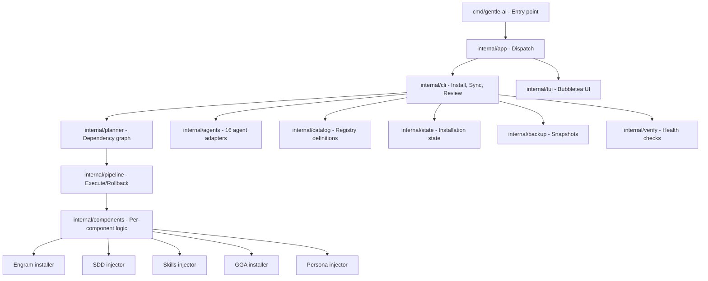

# ¿Qué es Gentle-AI?

## Qué aprenderás

**Gentle-AI** es el programa principal del ecosistema. Es un binario escrito en Go que funciona como **orquestador**, **instalador** y **configurador** sobre tu asistente de código con IA preferido.

En este capítulo vas a entender:
- Qué hace exactamente Gentle-AI
- Qué componentes instala y configura
- Cómo funciona su arquitectura interna
- Cómo se usa (CLI y TUI)
- Qué agentes soporta
- Cómo se relaciona con Engram, SDD, Skills y GGA

## Por qué importa

Sin Gentle-AI, tenés un asistente de código genérico. Con Gentle-AI, tenés un **entorno estructurado de desarrollo con agentes**. La diferencia es comparable a tener un bloc de notas vs. tener un IDE completo.

Pero más importante que sus funciones es entender **cómo funciona por dentro**. Cuando sepas cómo está construido, vas a poder:
- Diagnosticar problemas de configuración
- Elegir el perfil correcto para tu proyecto
- Decidir qué componentes activar y cuáles no
- Contribuir al proyecto si es necesario

## Explicación simple

Gentle-AI es un programa que prepara tu asistente de código para trabajar en equipo. Hace tres cosas principales:

1. **Instala** componentes que tu asistente no tiene (Engram, Skills, GGA, etc.)
2. **Configura** subagentes especializados (uno para planificar, otro para diseñar, otro para codificar, otro para revisar)
3. **Mantiene** todo sincronizado y actualizado

Lo usás desde la terminal escribiendo `gentle-ai` seguido de un comando, o simplemente `gentle-ai` sin argumentos para abrir su interfaz visual (TUI).

## Componentes que instala

Cuando ejecutás `gentle-ai install`, el programa te permite elegir qué componentes instalar. Estos son los 10 componentes disponibles:

| Componente | Propósito | Dependencias |
|-----------|-----------|-------------|
| **Engram** | Memoria persistente entre sesiones | Ninguna |
| **SDD** | Flujo de desarrollo guiado por especificaciones | Engram |
| **Skills** | Biblioteca de skills curados | SDD |
| **Context7** | Documentación actualizada de librerías y frameworks | Ninguna |
| **Persona** | Personalidad y tono del asistente | Ninguna |
| **Permissions** | Reglas de seguridad y permisos por defecto | Ninguna |
| **GGA** | Hooks de revisión automática antes de commit | Ninguna |
| **Theme** | Tema visual para OpenCode | Ninguna |
| **Claude Theme** | Tema visual para Claude Code | Ninguna |
| **OpenCode Logo** | Logo personalizado en OpenCode | Ninguna |

Cada componente tiene un propósito específico y puede activarse o desactivarse independientemente.

## Cómo funciona internamente

Gentle-AI está escrito en **Go** (versión 1.25.10 en v2.1.10). Su arquitectura interna se organiza en estos paquetes:



### Flujo de instalación

Cuando ejecutás `gentle-ai install`, ocurre esto:

1. **Detecta tu agente**: busca OpenCode, Codex, Claude Code, etc. en tu sistema
2. **Presenta componentes**: te muestra los 10 componentes disponibles para instalar
3. **Resuelve dependencias**: el planner calcula el orden correcto (Engram antes que SDD, etc.)
4. **Ejecuta en pipeline**: primero prepara, luego aplica. Si algo falla, revierte (rollback)
5. **Verifica**: comprueba que todo quedó bien configurado
6. **Persiste el estado**: guarda qué se instaló para futuras actualizaciones

### El planner

El planner en `internal/planner/` construye un **grafo de dependencias** (DAG). Por ejemplo:

- SDD depende de Engram
- Skills depende de SDD
- Persona debe ejecutarse antes que SDD y Engram (para no sobrescribir configuraciones)

Usa **ordenamiento topológico** (algoritmo de Kahn) con desempate lexicográfico, más un paso de **soft ordering** para reglas que no son dependencias estrictas.

### El pipeline

El pipeline en `internal/pipeline/` ejecuta los pasos en 3 etapas:

| Etapa | Qué hace | Si falla |
|-------|----------|----------|
| **Prepare** | Valida prerequisitos, genera configuraciones | Se detiene, reporta error |
| **Apply** | Escribe archivos, instala hooks, configura agentes | Activa rollback |
| **Rollback** | Revierte cambios del paso fallido (orden inverso) | Reporta error de rollback |

Cada paso implementa una interfaz:
```go
type Step interface {
    ID() string
    Run() error
}

type RollbackStep interface {
    Step
    Rollback() error
}
```

## Los 16 agentes soportados

Gentle-AI v2.1.10 soporta 16 agentes de código con IA. Cada uno tiene un adaptador que implementa la interfaz `Adapter`:

| Agente | Directorio de configuración | ¿Tiene subagentes? | ¿Tiene MCP? | ¿Tiene skills? |
|--------|---------------------------|-------------------|-------------|---------------|
| **OpenCode** | `~/.config/opencode/` | ✅ | ✅ | ✅ |
| **Codex CLI** | `~/.codex/` | ❌ (solo experimental) | ✅ | ✅ |
| **Claude Code** | `~/.claude/` | ✅ | ✅ | ✅ |
| **Gemini CLI** | `~/.gemini/` | ❌ | ✅ | ✅ |
| **Cursor** | `~/.cursor/` | ✅ | ✅ | ✅ |
| **VS Code Copilot** | `~/.copilot/` | ✅ | ✅ | ✅ |
| **Kilo Code** | `~/.config/kilo/` | ✅ | ✅ | ✅ |
| **Kimi Code** | `~/.kimi/` | ✅ | ✅ | ✅ |
| **Qwen Code** | `~/.qwen/` | ❌ | ✅ | ✅ |
| **Kiro IDE** | `~/.kiro/` | ✅ | ✅ | ✅ |
| **Antigravity** | `~/.gemini/antigravity-cli/` | ❌ | ✅ | ✅ |
| **Windsurf** | `~/.codeium/windsurf/` | ❌ | ✅ | ✅ |
| **OpenClaw** | `~/.openclaw/` | ❌ | ✅ | ✅ |
| **Pi** | `~/.pi/` | ✅ | ✅ | ✅ |
| **Trae IDE** | `~/.trae/` | ❌ | ✅ | ✅ |
| **Hermes** | `~/.hermes/` | ❌ (delegate_task) | ✅ | ✅ |

Cada adaptador sabe:
- Cómo detectar si el agente está instalado
- Cómo instalar el agente (si soporta auto-instalación)
- Dónde están sus archivos de configuración
- Qué estrategia usa para system prompts, MCP, skills y subagentes
- Si soporta slash commands y subagentes

## Modos de uso

### Modo CLI

```bash
gentle-ai [comando] [flags]
```

Ejemplos:
```bash
# Versión
gentle-ai --version       # → 2.1.10

# Instalar componentes
gentle-ai install

# Sincronizar configuración
gentle-ai sync

# Diagnóstico del ecosistema
gentle-ai doctor

# Iniciar revisión de código
gentle-ai review start

# Verificar actualizaciones
gentle-ai update

# Aplicar actualizaciones
gentle-ai upgrade

# Restaurar backup
gentle-ai restore
```

### Modo TUI (Interfaz Visual)

Sin argumentos, Gentle-AI abre una interfaz visual en la terminal:

```bash
gentle-ai
```

Esta interfaz (construida con Bubbletea) te permite:
- Navegar componentes disponibles
- Seleccionar qué instalar
- Ver progreso de instalación
- Revisar configuración

Usa el tema **Rose Pine** y es completamente navegable con teclado.

## Archivos que modifica

Gentle-AI modifica los archivos de configuración de tu agente. Por ejemplo, en OpenCode:

```
~/.config/opencode/
├── opencode.json       # Configuración principal (agentes, modelos, MCP)
├── AGENTS.md           # Instrucciones del sistema
└── skills/             # Skills instalados
    ├── sdd-init/
    ├── sdd-explore/
    ├── sdd-propose/
    └── ...
```

También crea archivos de estado:
```
~/.config/gentle-ai/
└── state.json          # Qué componentes están instalados
```

Y por proyecto:
```
.proyecto/
└── .gentle-ai/
    └── config.json     # Configuración específica del proyecto
```

## Cómo verificar que funciona

```bash
# Verificar instalación
gentle-ai --version

# Diagnóstico completo
gentle-ai doctor

# Ver estado de componentes instalados
# (mirar state.json o ejecutar gentle-ai install para ver qué está instalado)
```

## Cómo revertir

```bash
# Desinstalar componentes
gentle-ai uninstall

# Restaurar backup de configuración
gentle-ai restore
```

## Errores frecuentes

1. **"Agent not detected"**: No encontró OpenCode, Codex ni ningún agente soportado. Instalá primero tu agente preferido.
2. **Rollback fallido**: Si un paso falla y el rollback también falla, puede dejar configuraciones inconsistentes. Ejecutá `gentle-ai doctor` para diagnosticar.
3. **Permisos insuficientes**: En algunas configuraciones, Gentle-AI necesita permisos para escribir en directorios de configuración.
4. **OpenCode no actualizado**: Gentle-AI 2.1.10 requiere OpenCode 1.17.x o superior.

## Seguridad

Gentle-AI no ejecuta código en tu máquina como servidor o daemon. Es una herramienta de instalación y configuración que se ejecuta bajo demanda. No abre puertos de red, no recolecta telemetría y no se comunica con servidores externos excepto para verificar actualizaciones.

## Resumen

Gentle-AI v2.1.10 es un binario Go que:
- Instala y configura hasta 10 componentes sobre tu agente de código
- Soporta 16 agentes diferentes (OpenCode, Codex, Claude Code, etc.)
- Usa un planner con grafo de dependencias y un pipeline de 3 etapas (Prepare/Apply/Rollback)
- Ofrece CLI y TUI (Bubbletea, tema Rose Pine)
- Mantiene copias de seguridad y verifica la instalación

## Preguntas

1. ¿Qué hace el planner en Gentle-AI?
2. ¿Cuántos agentes soporta Gentle-AI v2.1.10?
3. ¿Qué ocurre si un paso del pipeline falla?
4. ¿Cuál es la diferencia entre `gentle-ai update` y `gentle-ai upgrade`?
5. ¿Puedo instalar SDD sin Engram?

## Fuentes verificadas

- Repositorio: gentle-ai, commit `b0a88faf1296ec4f524b8c9bbb90d39af9c42d0d`
- Archivos: `cmd/gentle-ai/main.go`, `internal/app/`, `internal/planner/`, `internal/pipeline/`, `internal/agents/`
- Versión verificada: gentle-ai 2.1.10
- Fecha: 2026-07-20
- Estado: 🟢 Verificado
