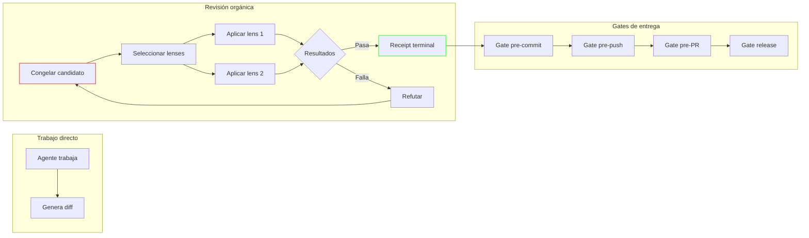

# Flujo orgánico y RDD

## Qué aprenderás

El sistema de revisión nativa de Gentle-AI (Organic RDD) reemplazó el modelo anterior de control-plane work-routing con un enfoque basado en candidatos congelados, autoridad de revisión y receipts verificables. Es el mecanismo que decide si un cambio puede avanzar o no.

En este capítulo vas a entender:
- Qué es un candidato y cómo se congela
- El concepto de bytes exactos y proyección
- Los tiers de revisión: full, fast, skip, no-review
- Qué son los lenses y el refuter
- La autoridad de revisión: lineage, receipt, gate
- El review mode y su kill switch
- Cómo funciona el consentimiento por candidato
- Recovery, reconciliación y deferencia

## Por qué importa

Vas a encontrarte con el sistema de revisión nativa cada vez que un agente intente entregar un cambio y el sistema lo frene con un mensaje como "Review required" o "Gate blocked". Si no entendés el modelo, no vas a saber por qué se bloqueó, cómo desbloquearlo o si es seguro saltarte la revisión.

Entender Organic RDD te permite:
- Diagnosticar por qué un cambio no avanza
- Configurar el nivel de revisión adecuado para tu proyecto
- Decidir cuándo habilitar o deshabilitar review mode
- Distinguir entre un bloqueo real y uno configurado

## Explicación simple

Organic RDD es el sistema que revisa los cambios antes de que se entreguen. Funciona así:

1. Alguien (un agente o humano) produce un cambio
2. El sistema **congela** ese cambio: lo convierte en un snapshot inmutable (el "candidato congelado")
3. Aplica uno o más **lenses** de revisión (seguridad, legibilidad, riesgo)
4. Cada lens produce un resultado y un **receipt** (recibo verificable)
5. Si todos los lenses pasan, el sistema emite un **receipt terminal** que autoriza el avance
6. El receipt terminal se puede validar en **gates** posteriores (pre-commit, pre-push, pre-PR, release)

Si en cualquier punto la revisión descubre un problema, el cambio se bloquea hasta que se corrija y se vuelva a congelar.

La diferencia con el modelo anterior (v1) es que la revisión ocurre **después de que el candidato existe**, no antes de que empiece el trabajo.

## Modelo mental

Imaginá un **control de calidad en una fábrica de piezas**:

1. Un operario fabrica una pieza (el **candidato**)
2. La pieza se coloca en una estación de inspección y se **congela** (nadie puede tocarla mientras se revisa)
3. El inspector mide la pieza con distintos instrumentos (los **lenses**): un calibre para el diámetro, un durómetro para la dureza, un microscopio para acabado superficial
4. Cada instrumento produce un **reporte** (resultado del lens)
5. Si todas las mediciones están dentro de tolerancia, se emite un **certificado de calidad** (receipt terminal)
6. La pieza pasa al siguiente **gate**: empaque, almacén, despacho
7. Si en algún gate se detecta una anomalía, la pieza **vuelve a inspección**

El límite de esta analogía: en una fábrica las piezas son físicas y la inspección es manual. En Organic RDD, el candidato es un diff de código y la inspección es automatizada con agentes.

## Recorrido



## Ejemplo continuo

### Escenario

Un agente debe corregir un typo en un archivo de configuración y agregar una validación de seguridad.

### Paso a paso

1. El agente trabaja en el cambio. Genera un diff de 15 líneas en dos archivos.
2. El desarrollador ejecuta `gentle-ai review start`. El sistema **congela el candidato**: toma el diff en su estado actual, calcula los **bytes exactos**, y lo guarda como immutable.
3. El sistema determina que el cambio toca configuración sensible → riesgo alto → requiere **revisión 4R** completa.
4. Cada lens se ejecuta sobre el **diff congelado**, no sobre el workspace actual. Si el agente sigue trabajando mientras se revisa, el diff original no cambia.
5. El lens `security` detecta que la validación nueva tiene un escape de permisos. **Refuta** el cambio.
6. El desarrollador corrige la validación y vuelve a ejecutar `review start`. Se congela un **nuevo candidato** con el diff corregido.
7. Todos los lenses pasan. El sistema emite un **receipt terminal** con un `lineage` que conecta la revisión, la corrección y el receipt.
8. El receipt se valida en el gate `pre-commit`: Git no permite el commit sin un receipt válido.
9. Luego en `pre-push`: valida que el receipt sigue vigente para el HEAD actual.
10. Finalmente en `pre-PR`: valida que el receipt y el diff coinciden antes de abrir el PR.

## Cómo funciona internamente

### Candidato congelado

Un **candidato congelado** es un snapshot inmutable del cambio en el momento exacto de la revisión. Se compone de:

- **Bytes exactos**: el contenido del diff en un momento dado, identificado por su hash SHA
- **Manifest de archivos cambiados**: lista de archivos modificados con sus rutas
- **Proyección**: qué se incluye en la revisión (staged, workspace o ambos)

Congelar evita que el agente siga modificando el workspace mientras la revisión está en curso, y garantiza que la revisión evalúe el cambio exacto que se pretende entregar.

### Proyección

Hay dos tipos de **proyección**:

| Proyección | ¿Qué incluye? | Cuándo usarla |
|-----------|---------------|---------------|
| `staged` | Solo los archivos en staging (git add) | Cuando querés revisar cambios preparados |
| `workspace` | Staging + cambios sin staging | Cuando querés revisar todo el trabajo pendiente |

La proyección se elige al iniciar la revisión con `--projection staged|workspace`.

### Tiers de revisión

Cada candidato se clasifica en un **tier** que determina la profundidad de la revisión. El tier lo decide la **evidencia**, no la cantidad de líneas:

| Tier | Lentes aplicados | Cuándo se usa |
|------|-----------------|---------------|
| **Ninguno** (trivial) | 0 lentes | Solo cambios en documentación, comentarios, formato o tipeos — cero cambios en código o configuración |
| **Un lente** (estándar) | 1 lente según el riesgo dominante | La mayoría de cambios: features, refactors, bug fixes, configuraciones |
| **4R** (riesgo alto) | 4 lentes: risk, resilience, readability, reliability | Cambios en rutas sensibles (auth, seguridad, pagos). Cambios grandes suelen implicar riesgo alto |

El tier no se decide por la cantidad de líneas. Un cambio de mil líneas en documentación recibe 0 lentes. Dos líneas en autenticación reciben los 4. El clasificador nombra su propia razón, por lo que el costo nunca es inexplicado.

### Lenses

Un **lens** (lente de revisión) es una perspectiva especializada que examina el candidato desde un ángulo particular. Cada lens:

1. Recibe el candidato congelado (bytes exactos + manifest)
2. Aplica su criterio de revisión (reglas, heurísticas, checks)
3. Produce un **resultado**: approve, reject, o abstain
4. Si rechaza, produce una **refutación** con evidencia

Los cuatro lentes del set 4R son:

| Lente | ¿Qué revisa? | Señal de riesgo |
|-------|-------------|-----------------|
| `review-risk` | Seguridad, permisos, exposición de datos, riesgos de dependencias | Cambios que tocan auth, datos sensibles, pagos |
| `review-resilience` | Fallbacks, reintentos, degradación graceful, observabilidad | Integraciones con shell, procesos externos, dependencias degradadas |
| `review-readability` | Nombres, estructura, mantenibilidad, intención clara | Refactors, organización de código, naming |
| `review-reliability` | Comportamiento, tests, determinismo, regresiones | Lógica de negocio, estado, tests |

### Refuter

El **refuter** es el resultado adversario de un lens. Cuando un lens detecta un problema:

1. Emite una refutación: "El archivo X en línea Y tiene un escape de permisos"
2. El candidato actual queda rechazado
3. Se necesita un nuevo candidato con el problema corregido

No es un "bug" del sistema: es el mecanismo que garantiza que los problemas se detecten antes de entregar.

### Autoridad de revisión

La **autoridad de revisión** es el conjunto completo de artefactos que documentan una revisión:

| Componente | Descripción |
|-----------|-------------|
| **Lineage** | Cadena de identidad criptográfica que conecta revisiones, correcciones y receipts |
| **Receipt** | Registro verificable de que la revisión se completó para un candidato específico |
| **Gate** | Punto de control donde se valida el receipt antes de avanzar |

#### Lineage

El **lineage** es una cadena que vincula todos los eventos de una revisión:

```
revision-1 → refutación → revision-2 → receipt terminal → gate pre-commit → gate pre-push
```

Cada eslabón tiene un identificador criptográfico que lo conecta con el anterior. Esto permite auditar toda la historia de revisión de un cambio.

#### Receipt ligado al contenido

Un **receipt** está ligado al contenido porque su hash incluye el SHA del candidato congelado. Si el contenido cambia (aunque sea un byte), el receipt se invalida automáticamente. Esto garantiza que no se pueda reutilizar un receipt de un cambio anterior para un cambio distinto.

#### Gates de entrega

Hay exactamente **5 gates** donde se puede validar un receipt:

1. `post-apply`: después de aplicar el cambio en el workspace
2. `pre-commit`: antes de crear el commit
3. `pre-push`: antes de hacer push
4. `pre-PR`: antes de abrir un Pull Request
5. `release`: antes de liberar una versión

Cada gate se valida con `gentle-ai review validate --gate <gate>`.

### Review mode y kill switch

El **review mode** controla si el sistema de revisión nativa está activo o no. Es un **kill switch**: puede deshabilitar todo el sistema de revisión desde una sola fuente.

```bash
# Ver estado del review mode
gentle-ai review mode status --cwd REPO

# Deshabilitar review mode (global)
gentle-ai review mode disable --cwd REPO

# Deshabilitar solo para este clon
gentle-ai review mode disable --cwd REPO --scope clone

# Rehabilitar
gentle-ai review mode enable --cwd REPO
```

Cuando el review mode está **deshabilitado**:
- Nada se bloquea
- Nada gatea
- La entrega cae a la política ordinaria del repositorio
- `sdd-status` reporta `disabled/unmanaged` con exit 0
- El sistema no fabrica aprobación: mantiene `allowed: false` y exit 0

Un clon puede optar por no participar (`--scope clone`), pero no puede forzar review mode si la fuente global está deshabilitada.

### Consentimiento por candidato

El **consentimiento por candidato** es el mecanismo por el cual el desarrollador acepta explícitamente que un candidato sea revisado. Se expresa con la flag `--consent`:

| Valor | Significado |
|-------|------------|
| `relay` | El desarrollador acepta que el candidato se revise (defecto) |
| `granted` | Consentimiento explícito otorgado |
| `declined` | El desarrollador declina la revisión (el sistema no avanza) |

El consentimiento se registra en el lineage de la autoridad de revisión.

### Recovery, reconciliación y deferencia

**Recovery**: si una revisión falla por un error de infraestructura (no del contenido), se puede usar `gentle-ai review retry-final-verification` como reintento one-shot. Si vuelve a fallar, escala permanentemente.

**Reconciliación**: proceso de alinear el estado de la autoridad de revisión con el estado real del repositorio. Ocurre automáticamente cuando se rehabilita review mode.

**Deferencia**: mecanismo por el cual un lens puede abstenerse de evaluar si no tiene suficiente información. El resultado del lens es `abstain` y no bloquea ni aprueba.

## Errores frecuentes

1. **El cambio se bloquea y no sabés por qué**: ejecutá `gentle-ai review status` para ver el estado de la autoridad. Muestra qué lenses fallaron y por qué.
2. **Review mode deshabilitado y esperás que revise**: si el review mode está off, no hay revisión. Verificá con `gentle-ai review mode status`.
3. **Receipt inválido después de cambiar el workspace**: el receipt está ligado al contenido. Si modificás los archivos después de congelar, el receipt se invalida. Volvé a congelar con `review start`.
4. **Usar `--result` en finalize**: el flag fue retirado. Usá `--result-artifact` o `--captured-results`.
5. **Confundir gate pre-commit con pre-push**: `pre-commit` valida antes del commit local; `pre-push` valida antes de enviar al remoto. No son intercambiables.

## Resumen

| Concepto | Definición |
|----------|-----------|
| **Candidato congelado** | Snapshot inmutable del cambio en el momento de la revisión |
| **Bytes exactos** | Hash SHA del contenido del diff |
| **Proyección** | Qué se incluye en la revisión: staged o workspace |
| **Lens** | Perspectiva especializada de revisión (risk, resilience, readability, reliability) |
| **Refuter** | Resultado adversario: el lens detectó un problema |
| **Lineage** | Cadena criptográfica que conecta eventos de revisión |
| **Receipt** | Registro verificable ligado al contenido del candidato |
| **Gate** | Punto de control: post-apply, pre-commit, pre-push, pre-PR, release |
| **Kill switch** | Review mode: disable/enable para todo el sistema de revisión |
| **Consentimiento** | Aceptación explícita del desarrollador para que el candidato se revise |

## Preguntas

1. ¿Qué diferencia hay entre un candidato congelado y el workspace actual?
2. ¿Qué tiers de revisión existen y cuándo se usa cada uno?
3. ¿Por qué un receipt está "ligado al contenido"?
4. ¿Qué ocurre cuando un lens refuta un candidato?
5. ¿Cuál es la diferencia entre deshabilitar review mode global vs por clon?
6. ¿Cuántos gates de entrega existen y cuáles son?
7. ¿Qué significa `consent: declined` y qué efecto tiene?

## Fuentes verificadas

- Repositorio: gentle-ai, commit `ee83e83d56f0d149c52f93fd13b3296858f5147f`
- Archivos: `docs/architecture/organic-rdd.md`, `docs/review-integration.md`, `docs/trigger-rules.md`
- Versión verificada: Gentle-AI 2.2.0
- Fuente: `data/evidence/gentle-command-catalog.yml`
- Fecha: 2026-07-28
- Estado: 🟢 Verificado
