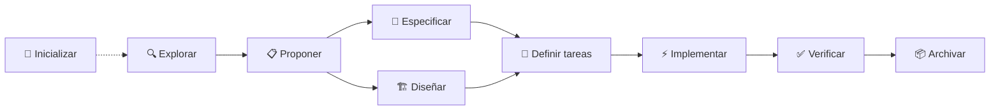
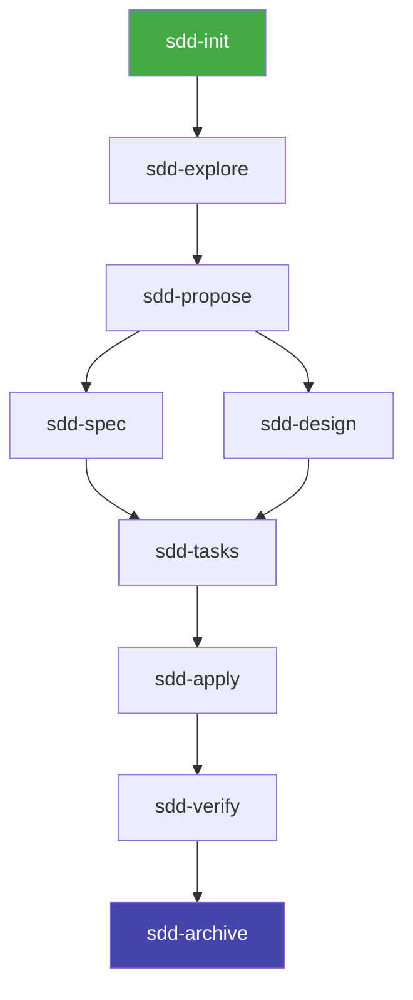
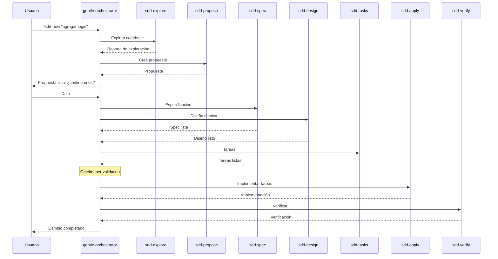

# SDD — Spec-Driven Development

## Qué aprenderás

**SDD (Spec-Driven Development)** es el corazón metodológico del ecosistema Gentle. Es un flujo estructurado de desarrollo que va desde la idea hasta el código verificado, pasando por especificación, diseño, tareas e implementación.

No es "otra metodología ágil". Es una forma de **reducir incertidumbre** antes de codificar, usando agentes de IA especializados para cada fase.

## Por qué importa

El problema más grande del desarrollo asistido por IA es que los asistentes tienden a **codificar demasiado rápido**. Reciben una instrucción vaga y empiezan a generar código sin entender el contexto completo. El resultado es código que:

- No resuelve el problema real
- Omite casos borde
- Introduce deudas técnicas
- Requiere múltiples iteraciones de corrección

SDD resuelve esto invirtiendo el orden: primero entendé, después especificá, después diseñá, después tareas, **después** código.

## Explicación simple

SDD divide el desarrollo en **fases**. Cada fase produce un artefacto que la siguiente fase consume:



Cada fase corre en un **subagente especializado** con instrucciones, herramientas y (potencialmente) un modelo diferente.

## Las 10 fases

### Fase 0: Init (`sdd-init`)

Inicializa el contexto SDD para el proyecto. Detecta el stack tecnológico, capacidades de testing, y configura la persistencia (OpenSpec, Engram o híbrido).

**¿Qué produce?**: Contexto de proyecto con configuración de testing y persistencia.
**¿Quién lo ejecuta?**: Subagente `sdd-init`.
**Razonamiento recomendado**: Bajo (tarea mecánica de detección).

### Fase 1: Explore (`sdd-explore`)

Investiga una idea antes de comprometerse a un cambio. Lee el codebase, compara enfoques, identifica riesgos.

**¿Qué produce?**: Reporte de exploración con alternativas y riesgos.
**¿Quién lo ejecuta?**: Subagente `sdd-explore`.
**Razonamiento recomendado**: Medio.

### Fase 2: Propose (`sdd-propose`)

Define el alcance, objetivo y enfoque de un cambio. Es el equivalente a un PRD (Product Requirements Document) técnico.

**¿Qué produce?**: Propuesta de cambio con alcance, objetivos, criterios de éxito.
**¿Quién lo ejecuta?**: Subagente `sdd-propose`.
**Razonamiento recomendado**: Alto.

### Fase 3: Spec (`sdd-spec`)

Escribe los requisitos detallados y escenarios. Define comportamientos esperados, casos borde, y criterios de aceptación.

**¿Qué produce?**: Especificación delta con requisitos y escenarios.
**¿Quién lo ejecuta?**: Subagente `sdd-spec`.
**Razonamiento recomendado**: Medio-Alto.

### Fase 4: Design (`sdd-design`)

Define la arquitectura técnica de la solución. Componentes, interfaces, flujos, decisiones arquitectónicas.

**¿Qué produce?**: Diseño técnico con arquitectura y decisiones.
**¿Quién lo ejecuta?**: Subagente `sdd-design`.
**Razonamiento recomendado**: Alto — es la fase más crítica.

### Fase 5: Tasks (`sdd-tasks`)

Desglosa el diseño y la especificación en tareas concretas de implementación. Cada tarea debe ser atómica y verificable.

**¿Qué produce?**: Lista de tareas con dependencias y estimaciones.
**¿Quién lo ejecuta?**: Subagente `sdd-tasks`.
**Razonamiento recomendado**: Medio.

### Fase 6: Apply (`sdd-apply`)

Implementa las tareas en código. Es la fase más larga, donde realmente se escribe el código.

**¿Qué produce?**: Código implementado, pruebas, documentación.
**¿Quién lo ejecuta?**: Subagente `sdd-apply`.
**Razonamiento recomendado**: Medio-Alto.
**Modo Strict TDD**: Si el proyecto soporta testing, se activa RED → GREEN → REFACTOR.

### Fase 7: Verify (`sdd-verify`)

Valida que la implementación cumple las especificaciones. Ejecuta pruebas y revisa que todos los requisitos estén cubiertos.

**¿Qué produce?**: Reporte de verificación con hallazgos (CRITICAL / WARNING / SUGGESTION).
**¿Quién lo ejecuta?**: Subagente `sdd-verify`.
**Razonamiento recomendado**: Alto.

### Fase 8: Archive (`sdd-archive`)

Cierra el cambio y persiste el estado final en el almacén de artefactos.

**¿Qué produce?**: Reporte de archivo con delta de especificaciones.
**¿Quién lo ejecuta?**: Subagente `sdd-archive`.
**Razonamiento recomendado**: Bajo.

### Fase extra: Onboard (`sdd-onboard`)

Guía al usuario a través de un ciclo SDD completo en su propio código base. Es un tutorial interactivo.

**¿Quién lo ejecuta?**: Subagente `sdd-onboard`.

## Dependencias entre fases



Este orden no es arbitrario. Cada fase produce un artefacto que la siguiente necesita. Si intentás saltar una fase, estás asumiendo riesgos que la fase evitaba.

## Artefactos

Cada fase produce un artefacto que se persiste en el almacén configurado. Hay 3 modos de persistencia:

| Modo | Dónde se guarda | Ventajas |
|------|----------------|---------|
| **Engram** | Memoria persistente (SQLite) | Rápido, sin archivos, disponible entre sesiones |
| **OpenSpec** | Archivos en `openspec/` | Compartible en GitHub, visible en PRs |
| **Híbrido** | Ambos | Lo mejor de ambos mundos |
| **Ninguno** | Solo en la conversación | Para experimentos rápidos |

Los nombres de artefactos son estándar:

| Fase | Topic Key (Engram) | Archivo (OpenSpec) |
|------|-------------------|-------------------|
| Init | `sdd-init/{proyecto}` | `openspec/changes/` |
| Explore | `sdd/{cambio}/explore` | `openspec/changes/{cambio}/explore.md` |
| Propose | `sdd/{cambio}/proposal` | `openspec/changes/{cambio}/proposal.md` |
| Spec | `sdd/{cambio}/spec` | `openspec/changes/{cambio}/spec.md` |
| Design | `sdd/{cambio}/design` | `openspec/changes/{cambio}/design.md` |
| Tasks | `sdd/{cambio}/tasks` | `openspec/changes/{cambio}/tasks.md` |
| Apply | `sdd/{cambio}/apply-progress` | `openspec/changes/{cambio}/tasks/` |
| Verify | `sdd/{cambio}/verify-report` | `openspec/changes/{cambio}/verify.md` |
| Archive | `sdd/{cambio}/archive-report` | `openspec/changes/{cambio}/archive.md` |

## Strict TDD Mode

Cuando un proyecto tiene capacidades de testing detectadas, SDD puede activar **Strict TDD Mode**:

```
RED: Escribir test que falla → Falla (esperado)
GREEN: Escribir código mínimo para pasar → Pasa
REFACTOR: Mejorar código manteniendo tests verdes → Sigue pasando
```

Esto se detecta en `sdd-init` y se pasa a `sdd-apply` y `sdd-verify` como instrucción obligatoria.

## Cuándo usar SDD

| Situación | ¿SDD? |
|-----------|-------|
| Feature compleja con múltiples archivos | ✅ Recomendado |
| Bugfix simple (1 archivo, 5 líneas) | ❌ Mejor sin SDD |
| Refactor con efectos secundarios | ✅ Recomendado |
| Cambio de configuración | ❌ Directo |
| Primer proyecto desde cero | ✅ Recomendado |
| Investigación técnica (spike) | ❌ Mejor `sdd-explore` solo |

## Cómo se invoca

SDD se usa desde el asistente mediante **slash commands** y **meta-commands**:

| Comando | Tipo | Qué hace |
|---------|------|----------|
| `/sdd-init` | Slash command | Inicializa SDD en el proyecto |
| `/sdd-explore <tema>` | Slash command | Explora una idea |
| `/sdd-new <cambio>` | Meta-command | Inicia un cambio nuevo (explora + propone) |
| `/sdd-ff <nombre>` | Meta-command | Fast-forward planning completo |
| `/sdd-continue [cambio]` | Meta-command | Continúa la siguiente fase disponible |
| `/sdd-status [cambio]` | Slash command | Muestra estado del cambio actual |
| `/sdd-apply [cambio]` | Slash command | Implementa tareas del cambio |
| `/sdd-verify [cambio]` | Slash command | Verifica implementación |
| `/sdd-archive [cambio]` | Slash command | Archiva cambio completado |
| `/sdd-onboard` | Slash command | Tutorial guiado |

Los meta-commands (`/sdd-new`, `/sdd-ff`, `/sdd-continue`) los maneja el orquestador (`gentle-orchestrator`). Los slash commands los manejan los skills correspondientes.

## El orquestador

El **gentle-orchestrator** es el agente que coordina las fases SDD. No ejecuta las fases directamente — delega a subagentes especializados:



## Resultado esperado

Después de un ciclo SDD completo, tenés:

1. **Propuesta** clara de lo que se hizo y por qué
2. **Especificación** con requisitos y escenarios
3. **Diseño** con decisiones arquitectónicas documentadas
4. **Tareas** desglosadas y verificables
5. **Código** implementado y probado
6. **Verificación** que confirma que cumple la spec
7. **Archivo** con el estado final persistido

## Errores frecuentes

1. **Saltar fases**: ir directo a `sdd-apply` sin specc ni diseño. El orquestador debería bloquear esto.
2. **Cambios demasiado grandes**: SDD funciona mejor con cambios acotados (<400 líneas). Para cambios grandes, se recomiendan PRs encadenados.
3. **No verificar**: aplicar sin verificar. El orquestador tiene un gatekeeper pero no es infalible.
4. **Modo automático sin supervisión**: `auto` mode ejecuta todo de corrido. Si algo sale mal en una fase temprana, se arrastra.

## Preguntas

1. ¿Cuál es la diferencia entre SDD y TDD?
2. ¿Qué fase produce el diseño técnico?
3. ¿Cuándo NO deberías usar SDD?
4. ¿Cuál es la diferencia entre un slash command y un meta-command en SDD?
5. ¿Qué hace el gatekeeper en modo automático?

## Fuentes verificadas

- Repositorio: gentle-ai, commit `b0a88faf1296ec4f524b8c9bbb90d39af9c42d0d`
- Archivos: `internal/assets/skills/_shared/sdd-status-contract.md`, `internal/assets/skills/_shared/persistence-contract.md`
- Archivos skills: `internal/assets/skills/sdd-*/SKILL.md`
- Versión verificada: gentle-ai 2.1.10
- Fecha: 2026-07-20
- Estado: 🟢 Verificado
