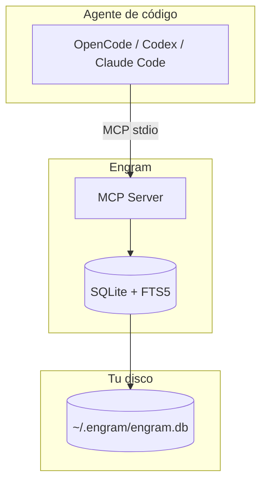

Engram guarda la memoria de tu agente en una base de datos SQLite dentro de tu computadora. No es una nube. Es un archivo organizado.

## El problema

Sin memoria, cada sesión de agente empieza desde cero. Le explicás tu proyecto, tus decisiones, tus convenciones... y cuando cerrás la terminal, todo se pierde.

Engram hace que el agente recuerde decisiones, bugs, descubrimientos y convenciones entre sesiones. No es magia: es un archivo `.db` en tu disco.

## Dónde vive físicamente

| Sistema | Ruta |
|---------|------|
| Windows | `C:\Users\TU_USUARIO\.engram\engram.db` |
| macOS/Linux | `~/.engram/engram.db` |

NO es un servidor. NO es una nube. Es un archivo `.db` en tu disco. Si querés compartir memoria entre máquinas, necesitás configurar el modo cloud explícitamente con Postgres. Por defecto, todo queda en tu máquina.

## Capas de Engram

| Concepto | ¿Qué es? |
|----------|----------|
| **A. Datos locales** (`~/.engram/engram.db`) | La memoria real — el archivo SQLite en tu máquina. `ENGRAM_DATA_DIR` puede cambiar el directorio. |
| **B. Config del proyecto** (`<proyecto>/.engram/config.json`) | Ajustes por proyecto (nombre, tema, preferencias). Se versiona con el repo. |
| **C. Git sync** (`<proyecto>/.engram/manifest.json`, `<proyecto>/.engram/chunks/`) | Sincronización opcional de configuración vía Git. `engram sync` activa el modo. |
| **D. Nube** (Postgres) | Replicación opcional, requiere configuración explícita. NO es el default. |

## Cómo fluye la memoria



El agente se conecta a Engram vía MCP (estándar de comunicación entre IA y herramientas). Engram lee y escribe en el archivo SQLite. Fin.


*Diagrama conceptual del flujo de memoria entre agente, MCP y base de datos local.*

## Recorrido práctico

```text
# 1. Al iniciar sesión, el agente pide contexto
mem_context(project: "mi-proyecto")
# → Devuelve decisiones y descubrimientos de sesiones anteriores

# 2. Cuando tomás una decisión, se guarda automáticamente
mem_save(
  title: "Usamos SQLite en lugar de Postgres para el MVP",
  type: decision,
  scope: project,
  topic_key: "architecture/database-choice"
)

# 3. Al cerrar, se guarda un resumen
mem_session_summary(
  goal: "Implementar autenticación",
  accomplished: ["Login funcionando", "Tests de auth"],
  discoveries: ["El middleware de Express no puede ser async"]
)
```

No tenés que aprender estos comandos. El asistente los invoca solo. Solo tenés que saber que existen y qué hacen.

## Cómo funciona por dentro

Engram es un binario escrito en **Go**. Usa **SQLite** como base de datos local con **FTS5** (Full-Text Search 5), una extensión de SQLite que permite búsqueda de texto completo con el algoritmo BM25.

El archivo `engram.db` tiene tres tablas principales:

| Tabla | Guarda |
|-------|--------|
| `sessions` | Cada sesión de trabajo (proyecto, fechas, resumen) |
| `observations` | Decisiones, bugs, descubrimientos — el corazón del sistema |
| `user_prompts` | Los prompts que enviaste al asistente |

Cada observación tiene un **tipo** que define su propósito y ciclo de vida:

| Tipo | ¿Qué guarda? | ¿Requiere revisión? |
|------|-------------|-------------------|
| `decision` | Decisiones de arquitectura | A los 6 meses |
| `bugfix` | Bug con causa raíz | Nunca |
| `discovery` | Algo no obvio aprendido | Nunca |
| `pattern` | Convención o patrón establecido | A los 6 meses |
| `preference` | Preferencia del usuario | A los 3 meses |
| `config` | Configuración importante | A los 12 meses |

## Errores frecuentes

| Error | Realidad |
|-------|----------|
| "Engram es una nube" | No. Es SQLite local. La nube es opcional y hay que configurarla. |
| "No hace falta guardar después de decisiones" | Sí hace falta. El agente guarda automáticamente, pero si algo falla, la decisión se pierde. |
| "Es lo mismo que un backup de Git" | No. Engram guarda el *por qué*, Git guarda el *qué*. |
| "Scope personal y project son lo mismo" | No. `project` lo ve el equipo, `personal` solo vos. |

## Cómo verificar que funciona

```bash
# Versión instalada
engram --version

# Diagnóstico de salud
engram doctor

# Estadísticas del proyecto
engram mcp --tools admin   # luego mem_stats()

# El archivo físico existe
# Windows: dir %USERPROFILE%\.engram\engram.db
# Linux/macOS: ls -la ~/.engram/engram.db
```

## Fuentes

- Repositorio: [github.com/Gentleman-Programming/engram](https://github.com/Gentleman-Programming/engram)
- Documentación oficial: [engram.gentle.ai](https://engram.gentle.ai)
- Archivos clave: `internal/mcp/`, `internal/store/`, `internal/project/detect.go`
