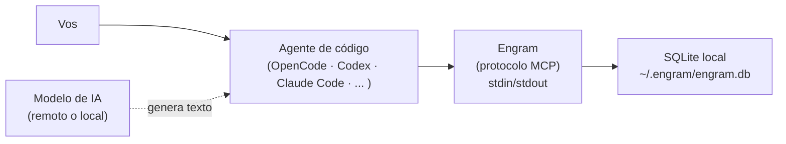

Engram guarda la memoria de tu agente en una base de datos SQLite local. No es una nube. No es automático en todo contexto. Es un archivo organizado que el agente consulta cuando está configurado para hacerlo.

## Resultado de aprendizaje

Al terminar esta lección podrás:

- Explicar qué es Engram y qué problema resuelve.
- Distinguir entre almacenamiento local de memoria y ejecución del modelo.
- Identificar qué información guarda Engram y qué NO debe guardarse.
- Decidir cuándo usar Engram y cuándo es preferible otra herramienta.

## Respuesta simple

Engram es la **libreta de apuntes de tu agente de IA**. Cada vez que empezás una sesión nueva, el agente no recuerda nada de la sesión anterior. Engram le da un lugar donde guardar lo importante: decisiones, bugs, descubrimientos. Al empezar la siguiente sesión, el agente revisa su libreta y retoma el contexto.

Engram no es inteligente. No decide qué guardar ni cuándo. Es un archivo. Quien decide qué guardar es el agente, según sus instrucciones.

> **Analogía**: Es como una libreta de apuntes al lado de tu computadora. La libreta no piensa, no organiza, no prioriza. Solo guarda lo que escribís. Después, cuando necesitás acordarte de algo, la abrís y buscás. Engram es esa libreta, pero para tu agente de IA.

## Modelo mental

Pensá en tres niveles:

| Nivel | Descripción |
|-------|-------------|
| **Tu trabajo** | Escribís código, tomás decisiones, encontrás bugs. |
| **Tu agente** | Ejecuta instrucciones, usa herramientas, conversa con el modelo. |
| **Engram** | Un archivo `.db` en tu disco donde el agente guarda apuntes. |

El flujo es siempre el mismo:

```text
Vos trabajás → el agente detecta algo importante
→ el agente lo guarda en Engram (según sus instrucciones)
→ en otra sesión, el agente abre Engram y recuerda
→ vos no hacés nada, el agente hace todo
```

**Importante**: Este flujo solo funciona si el agente está configurado para usar Engram e incluye las instrucciones de memoria adecuadas (el Memory Protocol). Sin esas instrucciones, el agente tiene las herramientas pero no sabe cuándo usarlas.

## Mapa o recorrido



El agente habla con el modelo de IA para generar respuestas. Por separado, habla con Engram para guardar y recuperar memoria. Engram no tiene nada que ver con el modelo. El modelo puede estar en la nube (remoto) o en tu máquina (local). Engram siempre está en tu máquina.

Este diagrama muestra tres componentes separados:

1. **Vos** — el ser humano que toma decisiones.
2. **El agente de código** — un programa (OpenCode, Codex, Claude Code, etc.) que ejecuta el modelo y usa herramientas como Engram. Actúa como puente entre vos, el modelo y la memoria.
3. **Engram** — un binario Go que expone herramientas de memoria a través del protocolo MCP. No genera texto, no ejecuta código, no toma decisiones. Solo persiste información que el agente le pide guardar.
4. **La base SQLite** — el archivo físico en tu disco donde Engram escribe.
5. **El modelo de IA** — corre en un proveedor remoto (Anthropic, OpenAI, Google) o local (Ollama, LM Studio). Engram no depende del modelo ni viceversa.

## Ejemplo continuo

**Escenario**: Un equipo decide usar SQLite para el MVP de una aplicación de tareas.

1. **Decisión tomada**: Durante la conversación, el equipo acuerda: "usamos SQLite, no Postgres, porque el MVP no necesita escalar todavía". El agente tiene instrucciones de guardar decisiones de arquitectura.

2. **El agente guarda**: Internamente, el agente invoca `mem_save` con el título "Usamos SQLite para el MVP de tareas" y el tipo `decision`. Engram escribe la observación en `~/.engram/engram.db`.

3. **Cierre de sesión**: Al terminar el día, el agente llama a `mem_session_summary` con un resumen de lo logrado. Engram lo guarda.

4. **Días después**: Otro miembro del equipo abre el proyecto. El agente detecta que pertenece al mismo proyecto, llama a `mem_context`, y recupera la decisión de SQLite. No hace falta repetir la discusión.

5. **¿Y Git?**: El código del MVP está en Git. La decisión *"por qué SQLite"* está en Engram. Son dos cosas distintas. Git guarda el *qué* (el código). Engram guarda el *por qué* (el contexto).

6. **Límite del automatismo**: Si el agente no tiene las instrucciones de memoria en su configuración, o si el modelo no invoca las herramientas en el momento adecuado, la decisión se pierde. Engram no "captura" nada por sí solo. Espera a que el agente le pida guardar.

## Recorrido práctico

Cuando Engram está configurado con las instrucciones de memoria adecuadas, el flujo es transparente:

```text
# Al iniciar el proyecto (automático, el agente lo hace solo)
→ el agente llama a mem_current_project()
→ detecta el proyecto por el directorio actual
→ llama a mem_context() y recupera la historia del proyecto
→ vos ves que el agente "recuerda" lo que pasó antes

# Durante el trabajo (el agente decide cuándo guardar)
→ detecta algo importante (decisión, bugfix, descubrimiento)
→ llama a mem_save() con título, tipo y contenido
→ Engram escribe en la base SQLite

# Al cerrar la sesión (el agente lo hace automáticamente)
→ llama a mem_session_summary()
→ guarda el goal, lo accomplished y discoveries
→ la próxima sesión empieza con ese contexto
```

No tenés que aprender estos comandos. No tenés que ejecutarlos. Si el agente está bien configurado, los invoca solo.

**Prerrequisito**: Que el agente tenga configurado Engram como servidor MCP y tenga las instrucciones de memoria (Memory Protocol) en su prompt de sistema.

**Acción para verificar**: Abrí tu agente y preguntale "¿Tenés memoria persistente configurada?". Si responde que sí y menciona Engram, está funcionando.

## Cómo funciona internamente

Engram es un binario escrito en **Go**. Expone herramientas de memoria a través de MCP (Model Context Protocol), un estándar de comunicación entre IAs y herramientas externas.

```text
Agente ←→ MCP stdio (stdin/stdout) ←→ Engram ←→ SQLite (~/.engram/engram.db)
```

La comunicación es bidireccional sobre **stdin/stdout**, sin red. No necesitás abrir puertos ni configurar conexiones. Engram se lanza como subproceso del agente y se comunica por tuberías estándar.

### Datos que guarda

Engram organiza la información en observaciones. Cada observación tiene un tipo que define su propósito:

| Tipo | ¿Qué guarda? |
|------|-------------|
| `decision` | Decisiones de arquitectura o diseño |
| `bugfix` | Bug corregido con causa raíz |
| `discovery` | Algo no obvio aprendido |
| `pattern` | Convención o patrón establecido |
| `preference` | Preferencia del usuario |
| `config` | Configuración importante |

### Datos que NO guarda

| Dato | ¿Está en Engram? | ¿Dónde está? |
|------|------------------|--------------|
| Código fuente | No | Git |
| Issues / tareas | No | GitHub Issues, Jira, etc. |
| Conversaciones enteras | No | Se compactan (solo guarda resúmenes) |
| Prompt completo del usuario | Sí | En `user_prompts` para reconstruir contexto post-compactación |
| Información sensible (API keys, passwords) | **No debe estar** | Archivos `.env`, secretos, vault |

### Guardado automático: depende de la configuración

Engram **no** decide qué guardar. El agente decide qué guardar según las instrucciones que tenga en su configuración (el Memory Protocol). Si el agente no tiene esas instrucciones:

- Puede tener las herramientas MCP de Engram disponibles.
- Pero **no sabe** cuándo debe invocarlas.
- Las decisiones importantes pueden perderse.

Con las instrucciones adecuadas, el agente guarda automáticamente después de decisiones, bugs, descubrimientos y cambios de configuración. Sin ellas, guarda solo cuando se lo pedís explícitamente.

## Cuándo usarlo y cuándo evitarlo

### Usá Engram cuando

- Trabajás con agentes de IA y querés que recuerden contexto entre sesiones.
- Necesitás que las decisiones de arquitectura queden registradas sin文档 extra.
- Trabajás en equipo y querés compartir contexto de decisiones a través del repo (vía Git sync).

### Evitá Engram cuando

- Usás agentes de IA sin soporte MCP (no van a poder conectarse).
- Necesitás compartir memoria en tiempo real entre máquinas sin infraestructura cloud.
- Tus decisiones no necesitan persistencia entre sesiones.
- Trabajás con información sensible que no debe quedar en el disco local.

### Engram NO reemplaza

| Herramienta | Engram NO es |
|-------------|-------------|
| Git | Engram guarda el *por qué*, Git guarda el *qué* y el *cuándo*. Se complementan. |
| Backup | Engram no es un sistema de backup. Necesitás `engram export` (ver [Inspeccionar y respaldar](../04-inspeccionar-y-respaldar/)). |
| Nube (Google Drive, Dropbox, etc.) | Engram es local por defecto. El modo cloud es opt-in y requiere Postgres explícito. |
| Documentación formal | Engram guarda contexto operativo, no reemplaza docs/ README/ wikis. |

## Costos y trade-offs

### Ventajas

- **Cero configuración de red**: MCP stdio no necesita puertos ni servidores.
- **Privacidad total por defecto**: Todo queda en tu máquina.
- **Rápido**: SQLite local es instantáneo comparado con llamadas a una API remota.
- **Portable**: Un solo binario Go, sin dependencias (Node, Python, Docker).

### Desventajas

- **No sincroniza entre máquinas** (sin modo cloud): si trabajás en dos computadoras, la memoria no viaja sola.
- **Depende del agente**: si el agente no tiene las instrucciones correctas, no guarda automáticamente.
- **Espacio en disco**: la base puede crecer con el tiempo, aunque SQLite es muy eficiente.
- **No es colaborativo en tiempo real**: cada persona tiene su propia copia local (sin cloud).

### Privacidad

Engram es **100 % local por defecto**. El archivo `~/.engram/engram.db` está en tu máquina. Nadie más puede leerlo.

Si activás el modo cloud con Postgres, los datos viajan a un servidor. En ese caso, podés usar `scope: personal` para evitar que observaciones personales se sincronicen.

El modelo de IA con el que conversás (Anthropic, OpenAI, Google, etc.) **no tiene acceso a Engram**. Engram y el modelo son canales separados. El agente lee de Engram y se lo muestra al modelo como parte del contexto. El modelo nunca escribe directamente en Engram.

## Errores frecuentes

**"Engram guarda todo automáticamente"**
→ Depende de la configuración del agente. Engram expone herramientas, pero el agente necesita instrucciones explícitas (el Memory Protocol) para saber cuándo usarlas. Sin esas instrucciones, solo guarda cuando se lo pedís.

**"Engram es una nube"**
→ No. Engram es SQLite local. El modo cloud existe pero es opt-in y requiere configuración explícita con Postgres.

**"Engram reemplaza a Git"**
→ No. Git guarda el código (el *qué*). Engram guarda el contexto (el *por qué*). Ambos se complementan. Una decisión de arquitectura sin código no sirve. Código sin contexto se vuelve inmantenible.

**"Engram funciona sin internet en todo sentido"**
→ El almacenamiento local de Engram no necesita internet. Pero el **modelo de IA** con el que habla tu agente puede ser remoto (Anthropic, OpenAI, Google). Engram no depende del modelo, pero tu agente sí. La afirmación correcta es: "Engram almacena sin internet. El agente puede necesitar internet para hablar con el modelo."

**"Si instalé Engram, ya está guardando todo"**
→ Instalar Engram solo configura las herramientas MCP. Para que el agente guarde automáticamente, necesita las instrucciones de memoria (incluidas en gentle-ai, en los plugins de OpenCode/Claude Code, o en el Memory Protocol manual).

**"Puedo poner API keys en Engram"**
→ No. Engram no cifra secretos. Las API keys, tokens y contraseñas van en `.env` o en un vault, no en la memoria del agente.

## Comprueba lo aprendido

**Pregunta**: ¿Engram reemplaza a Git?

Respondé antes de leer la respuesta.

<details>
<summary>Ver respuesta</summary>

**No. Engram no reemplaza a Git.** Cada uno guarda información distinta:

| Dimensión | Git | Engram |
|-----------|-----|--------|
| Guarda | Código fuente, cambios, versiones. | Decisiones, bugs, descubrimientos, contexto. |
| Pregunta que responde | *¿Qué cambió y cuándo?* | *¿Por qué se cambió?* |
| Se versiona | Cada commit es una versión. | Las observaciones se acumulan, no se versionan. |
| Se comparte | Vía `git push` / pull request. | Vía Git sync (config, no `.db`) o cloud. |
| Información sensible | No debe contener secretos. | Tampoco. Engram no cifra. |
| Sirve para | Revisar, deployar, colaborar. | Recordar contexto, decisions pasadas. |

**Se complementan**: Podés tener el código en Git y el contexto en Engram. Un equipo saludable usa ambos.

**Qué no debe guardarse en Engram**: API keys, tokens, contraseñas, datos personales, información financiera sensible.
</details>

## Resumen

- **Engram** es un binario Go que expone herramientas de memoria persistente a través de MCP.
- Guarda en **SQLite local** (`~/.engram/engram.db`, configurable con `ENGRAM_DATA_DIR`).
- **No necesita internet** para almacenar. El modelo de IA puede ser remoto, pero Engram es local.
- **No decide qué guardar**. El agente decide según sus instrucciones (Memory Protocol).
- **No reemplaza a Git**, ni al backup, ni a la nube. Se complementa con ellos.
- Es **privado por defecto** (100 % local). El modo cloud es opt-in.
- Funciona con **cualquier agente que soporte MCP** (OpenCode, Codex, Claude Code, Gemini CLI, Cursor, VS Code Copilot, Windsurf, etc.).

Si Engram está bien configurado, no vas a notar que existe. Y esa es la señal de que funciona.

## Fuentes y alcance

- Fuente conceptual: repositorio oficial de Engram, README e Intended Usage.
- Fuente técnica primaria: [github.com/Gentleman-Programming/engram](https://github.com/Gentleman-Programming/engram) — README.md, docs/AGENT-SETUP.md, docs/intended-usage.md.
- Hechos volátiles verificados:
  - Ruta por defecto: `~/.engram/engram.db` — fuente: README.md.
  - Variable de entorno: `ENGRAM_DATA_DIR` — fuente: README.md.
  - Transporte MCP: stdio (stdin/stdout) — fuente: README.md, ARCHITECTURE.md.
  - Lenguaje: Go — fuente: README.md.
  - Base de datos: SQLite + FTS5 — fuente: README.md.
  - 20 herramientas MCP — fuente: README.md.
  - Agentes soportados: OpenCode, Codex, Claude Code, Gemini CLI, Cursor, VS Code Copilot, Windsurf, Antigravity, Pi, Qwen Code, Kiro, Kilo Code — fuente: AGENT-SETUP.md.
- Fecha de verificación: 2026-07-22.
- Alcance de la comprobación: README.md y AGENT-SETUP.md del repositorio en `main`.

Conceptos enlazados (no desarrollados aquí):
- Herramientas MCP detalladas y cadena de llamadas → [Memoria y MCP](../02-memoria-y-mcp/).
- Arquitectura interna (SQLite, FTS5, BM25, transportes, Git sync, cloud) → [Arquitectura de Engram](../03-arquitectura-engram/).
- Comandos de verificación, exportación, importación, TUI → [Inspeccionar y respaldar](../04-inspeccionar-y-respaldar/).
- Protocolo MCP general → [MCP y tool calling](/gentle-ai-manual/03-fundamentos-de-ia/03-mcp-y-tool-calling/).
