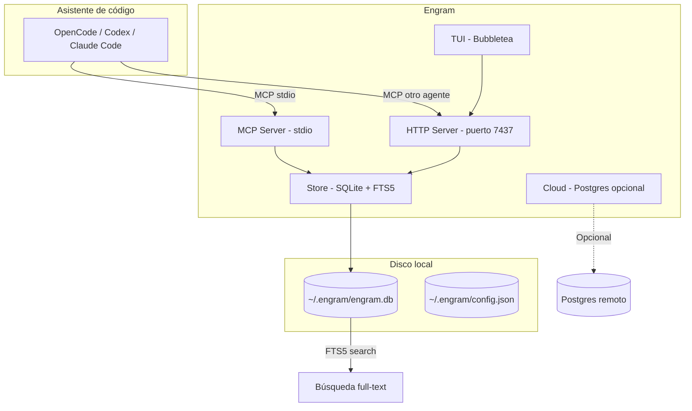
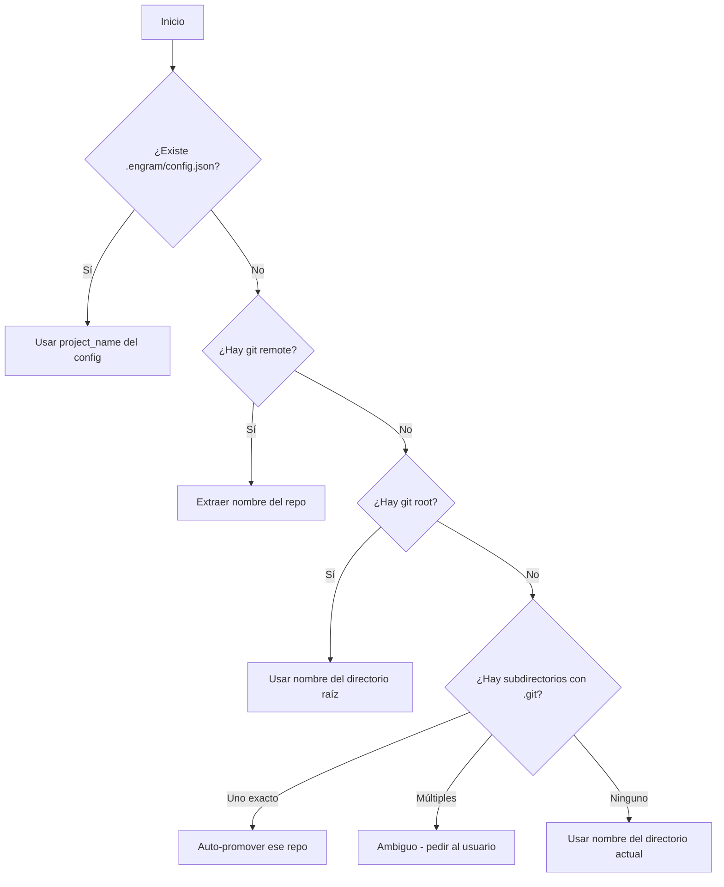
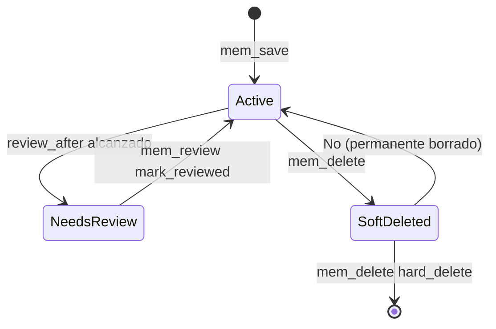
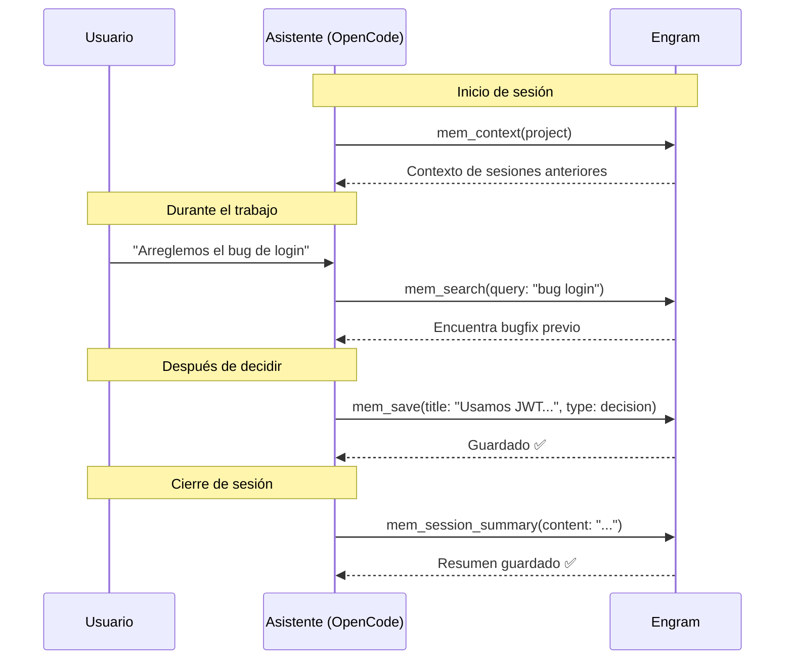

# Engram — Memoria persistente

## Qué aprenderás

**Engram** es el sistema de memoria persistente del ecosistema Gentle. Es un binario escrito en Go que guarda y recupera información entre sesiones de desarrollo: decisiones, bugs, descubrimientos, configuraciones, y cualquier cosa que no quieras tener que explicarle dos veces a tu asistente de IA.

En este capítulo vas a entender:
- Qué problema resuelve la memoria persistente
- Cómo funciona Engram por dentro (SQLite, FTS5, MCP)
- Las 20 herramientas MCP y cuáles son las 7 core
- Cómo se detecta el proyecto automáticamente
- Ciclo de vida de las observaciones
- Cómo guardar y buscar información
- Diferencia entre `engram mcp` y `engram serve`

## Por qué importa

Los asistentes de IA no tienen memoria nativa entre sesiones. Cada vez que abrís una nueva conversación, el asistente no sabe lo que hiciste ayer, las decisiones que tomaste, los bugs que encontraste, o cómo configuraste el proyecto.

Sin Engram, terminás repitiendo instrucciones, reexplicando contexto, y perdiendo descubrimientos importantes.

Con Engram, las decisiones importantes quedan guardadas automática o manualmente, y están disponibles en la próxima sesión mediante búsqueda de texto completo.

## Explicación simple

Imaginate que trabajás con un asistente que:

- **Recuerda** la decisión de arquitectura que tomaste la semana pasada
- **Sabe** que el lunes encontraste un bug en tal archivo
- **Entiende** por qué elegiste SQLite en lugar de Postgres
- **No necesita** que le expliques todo de nuevo cada vez que abrís el editor

Eso es Engram. Un sistema que tu asistente consulta automáticamente al inicio de cada sesión para traer el contexto relevante.

## Cómo funciona realmente

Engram es un **servidor MCP** que se conecta a tu asistente de código. Cuando el asistente arranca:

1. Se conecta a Engram vía **MCP stdio** (o HTTP)
2. Llama a `mem_context` para obtener el contexto de la sesión anterior
3. Durante la sesión, llama a `mem_save` automáticamente cuando toma decisiones
4. Al cerrar la sesión, llama a `mem_session_summary` para guardar un resumen

Todo esto se persiste en una base de datos **SQLite** con búsqueda de texto completo (**FTS5**).



## Modelo de datos

Engram tiene 3 tablas principales en SQLite:

### Sessions (sesiones)

Cada vez que trabajás, Engram crea una sesión. Una sesión tiene:

| Campo | Tipo | Descripción |
|-------|------|-------------|
| `id` | TEXT | Identificador único |
| `project` | TEXT | Proyecto al que pertenece |
| `directory` | TEXT | Directorio de trabajo |
| `started_at` | TEXT | Cuándo empezó |
| `ended_at` | TEXT | Cuándo terminó (nullable) |
| `summary` | TEXT | Resumen de la sesión (nullable) |

### Observations (observaciones)

Son los datos que realmente importan: decisiones, bugs, descubrimientos. Cada observación tiene:

| Campo | Tipo | Descripción |
|-------|------|-------------|
| `id` | INTEGER | Auto-incremental |
| `sync_id` | TEXT | ID portable entre máquinas |
| `session_id` | TEXT | Sesión donde se creó |
| `type` | TEXT | decision, architecture, bugfix, pattern, config, discovery... |
| `title` | TEXT | Título corto |
| `content` | TEXT | Contenido completo |
| `project` | TEXT | Proyecto normalizado |
| `scope` | TEXT | `project` (default) o `personal` |
| `topic_key` | TEXT | Clave para upserts (`familia/subject`) |
| `revision_count` | INTEGER | Versionado por topic_key |
| `duplicate_count` | INTEGER | Veces que se detectó duplicado |
| `pinned` | BOOLEAN | Si debe aparecer primero en contexto |
| `created_at` | TEXT | Fecha de creación |
| `deleted_at` | TEXT | Soft delete (nullable) |
| `review_after` | TEXT | Cuándo revisar si sigue vigente |

### Tipos de observación

| Tipo | ¿Qué guarda? | Review after |
|------|-------------|-------------|
| `decision` | Decisiones técnicas y de arquitectura | +6 meses |
| `architecture` | Decisiones de diseño de sistema | +6 meses |
| `bugfix` | Bug encontrado, causa raíz y solución | Nunca |
| `discovery` | Algo no obvio aprendido | Nunca |
| `pattern` | Patrón reusable establecido | +6 meses |
| `config` | Configuración relevante | +12 meses |
| `preference` | Preferencia del usuario | +3 meses |
| `session_summary` | Resumen de sesión (generado automáticamente) | Nunca |
| `manual` | Sin categoría específica | Nunca |

### User Prompts (prompts del usuario)

Engram guarda los prompts que el usuario envía al asistente, para poder buscar contexto después.

## Las 7 herramientas MCP core

Engram expone **20 herramientas MCP** en total, pero solo **7 están siempre disponibles** (core). Las otras 13 se cargan bajo demanda.

### Herramientas core (siempre disponibles)

| Herramienta | ¿Qué hace? | ¿Cuándo se usa? |
|------------|-----------|-----------------|
| `mem_save` | Guarda una observación | Después de una decisión, bugfix o descubrimiento |
| `mem_search` | Busca observaciones por texto | Cuando necesitás contexto de sesiones anteriores |
| `mem_context` | Devuelve el contexto reciente del proyecto | Al iniciar una sesión |
| `mem_session_summary` | Guarda el resumen de cierre de sesión | Antes de terminar la sesión |
| `mem_get_observation` | Obtiene el contenido completo de una observación | Cuando encontraste un resultado de búsqueda |
| `mem_save_prompt` | Guarda el prompt del usuario (para contexto futuro) | En cada interacción del usuario |
| `mem_current_project` | Devuelve el proyecto actual | En cualquier momento |

### Cómo se usan (ejemplos)

```text
# Guardar una decisión (lo hace el asistente automáticamente)
mem_save(
  title: "Usamos SQLite en lugar de Postgres para el MVP",
  type: decision,
  content: "Decidimos usar SQLite porque...",
  scope: project,
  topic_key: "architecture/database-choice"
)

# Buscar contexto de sesiones anteriores
mem_search(query: "decisión base de datos", project: "mi-proyecto")

# Obtener contexto reciente
mem_context(project: "mi-proyecto")

# Cerrar sesión con resumen
mem_session_summary(
  content: "## Goal\nImplementar autenticación...\n## Accomplished\n- Login funcionando..."
)

# Saber en qué proyecto estamos
mem_current_project()
```

### Herramientas deferred (bajo demanda)

| Herramienta | ¿Qué hace? |
|------------|-----------|
| `mem_update` | Actualiza una observación existente |
| `mem_review` | Lista o marca observaciones como revisadas |
| `mem_pin` / `mem_unpin` | Fija una observación para que aparezca siempre en contexto |
| `mem_suggest_topic_key` | Sugiere un topic_key antes de guardar |
| `mem_session_start` / `mem_session_end` | Control manual de sesiones |
| `mem_judge` | Resuelve conflictos entre observaciones |
| `mem_compare` | Compara dos observaciones y determina relación |
| `mem_doctor` | Diagnóstico de salud de la base de datos |
| `mem_delete` | Borrado lógico o físico |
| `mem_stats` | Estadísticas del proyecto |
| `mem_timeline` | Historial de cambios de una observación |
| `mem_merge_projects` | Fusiona proyectos |

## Detección de proyecto

Una de las funcionalidades más importantes de Engram es **saber en qué proyecto estás trabajando automáticamente**.

Usa un algoritmo de 6 pasos:



Esto significa que Engram funciona sin configuración manual en la mayoría de los proyectos: detecta automáticamente el nombre del proyecto desde Git.

Si trabajás en un monorepo con múltiples proyectos, podés crear un archivo `.engram/config.json` con:
```json
{
  "project_name": "mi-servicio"
}
```

O pasar el proyecto explícitamente:
```bash
engram mcp --project mi-servicio
```

## Ciclo de vida de las observaciones



Las observaciones tienen un ciclo de vida:

1. **Active**: recién guardada, se incluye en búsquedas y contexto
2. **NeedsReview**: alcanzó su fecha de revisión (decisiones a los 6 meses, preferencias a los 3)
3. **SoftDeleted**: borrada lógicamente (sigue existiendo pero no aparece en búsquedas)
4. **Purged**: borrada físicamente (solo con `hard_delete=true`)

Además, Engram detecta **duplicados**: si guardás la misma información dos veces, incrementa `duplicate_count` y actualiza `last_seen_at` en lugar de crear una fila nueva.

## Conflictos entre observaciones (nuevo en v1.19+)

Cuando guardás una observación que parece contradecir una existente, Engram activa el sistema de conflictos:

1. Después de `mem_save`, Engram ejecuta `FindCandidates()` con BM25 (un algoritmo de similitud)
2. Si encuentra candidatos potencialmente conflictivos, devuelve `judgment_required: true`
3. El asistente llama a `mem_judge` para resolver el conflicto

Relaciones posibles:
- `related`: están relacionadas
- `compatible`: no se contradicen
- `scoped`: una es más específica que la otra
- `conflicts_with`: se contradicen
- `supersedes`: una reemplaza a la otra (la anterior queda obsoleta)
- `not_conflict`: son independientes

## Cloud (opcional)

Engram tiene un modo cloud opcional que usa **Postgres** como backend. Esto permite:

- Sincronizar memoria entre múltiples máquinas
- Compartir contexto en equipos
- Dashboard web HTMX para revisar memoria

No es obligatorio. Engram funciona perfectamente solo con SQLite local.

## Diferencia entre engram mcp y engram serve

Un punto de confusión común:

| Comando | Transporte | Puerto | ¿Para qué? |
|---------|-----------|--------|-----------|
| `engram mcp` | MCP stdio (entrada/salida estándar) | Ninguno (pipe) | Conexión directa con el asistente |
| `engram serve` | HTTP REST | 7437 | TUI, herramientas externas, cloud |

**`engram mcp`** es el modo principal. El asistente de código (OpenCode, Codex, Claude Code) lo ejecuta como un subproceso y se comunica con él a través de entrada y salida estándar usando el protocolo MCP.

**`engram serve`** inicia un servidor HTTP en el puerto 7437 (ENGR en teclado telefónico). Sirve para:
- La interfaz TUI de Engram
- Herramientas externas que quieran acceder a la memoria vía REST
- El dashboard cloud

## Cómo usar Engram en tu flujo diario

No necesitás aprender comandos complejos. Engram funciona automáticamente a través del asistente:



## Cómo verificar que Engram funciona

```bash
# Verificar versión
engram --version

# Verificar conexión MCP (desde el asistente)
# El asistente debe poder llamar a mem_current_project()

# Diagnóstico de salud
engram doctor

# Ver estadísticas
engram mcp --tools admin  # Después, mem_stats()

# Explorar base de datos (no recomendado, pero posible)
# ls ~/.engram/engram.db
```

## Errores frecuentes

1. **`"engram: command not found"`**: Engram no está instalado o no está en el PATH. Verificá `~/.local/bin/engram` o `%LOCALAPPDATA%\engram\bin\engram.exe`.
2. **`"Error: database is locked"`**: Otro proceso abrió la base de datos. Engram usa WAL mode, pero `MaxOpenConns=1`.
3. **`"Project not detected"`**: Engram no pudo determinar el proyecto. Usá `--project NAME` o creá `.engram/config.json`.
4. **Actualización disponible**: `engram` muestra "Update available: 1.19.0 -> 1.20.0". Ejecutá `go install github.com/Gentleman-Programming/engram/cmd/engram@latest`.

## Seguridad

Engram guarda datos localmente en `~/.engram/`. No envía nada a internet a menos que configures el modo cloud explícitamente. Si activás cloud, los datos viajan cifrados (HTTPS) y se almacenan en Postgres con autenticación por token.

## Resumen

Engram v1.19.0 (1.20.0 disponible) es un sistema de memoria persistente que:
- Se conecta a tu asistente de código vía MCP
- Guarda decisiones, bugs, descubrimientos y contexto
- Usa SQLite + FTS5 para almacenamiento y búsqueda
- Detecta automáticamente el proyecto en el que trabajás
- Tiene 20 herramientas MCP (7 core siempre disponibles)
- Ofrece ciclo de vida de observaciones (active → needs_review → deleted)
- Detecta duplicados y conflictos entre observaciones
- Modo cloud opcional con Postgres
- Interfaz TUI (Bubbletea) y API HTTP REST

## Preguntas

1. ¿Cuál es la diferencia entre `engram mcp` y `engram serve`?
2. ¿Qué tipos de observación existen y cuál tiene revisión automática a los 6 meses?
3. ¿Cómo detecta Engram el proyecto automáticamente?
4. ¿Qué son las 7 herramientas core de Engram?
5. ¿Qué ocurre cuando guardás una observación que contradice una existente?

## Ejercicio

1. Ejecutá `engram --version` para verificar tu versión instalada
2. Ejecutá `engram doctor` para verificar la salud de la base de datos
3. Desde tu asistente, preguntá "¿cuál es el proyecto actual?" para verificar que Engram detecta el proyecto correctamente
4. Buscá una decisión anterior: "¿qué decisiones hay sobre la arquitectura?"

## Fuentes verificadas

- Repositorio: engram, commit `763a6ba432713725d6ce82a2416eec6cbd9ec94e`
- Archivos: `internal/mcp/`, `internal/store/`, `internal/project/detect.go`, `cmd/engram/main.go`
- Versión verificada: engram 1.19.0 (binario local), revisado código de v1.20.0
- Fecha: 2026-07-20
- Estado: 🟢 Verificado
