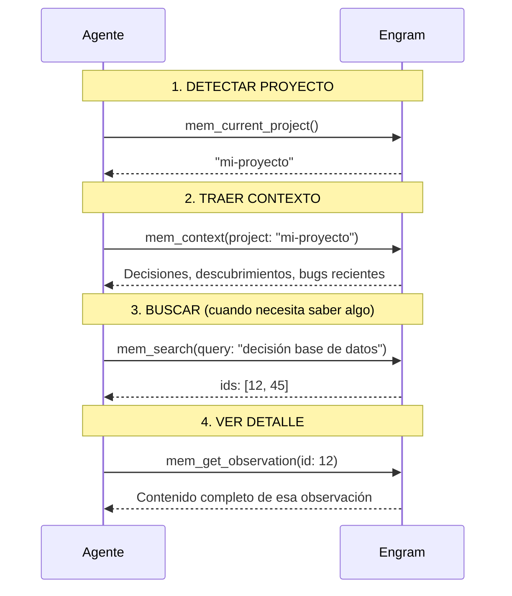

El agente no accede al archivo SQLite directamente. Habla con Engram a través de **MCP** (Model Context Protocol), un estándar que permite a las IAs usar herramientas externas.

Engram expone herramientas MCP. El agente las invoca. Engram las ejecuta contra la base de datos.

## La cadena básica

Cada sesión sigue siempre esta secuencia:



No son pasos que ejecutés manualmente. El agente los corre automáticamente cuando detecta que necesita contexto.

## Herramientas core (siempre disponibles)

| Herramienta | ¿Qué hace? | ¿Cuándo se usa? |
|------------|-----------|-----------------|
| `mem_current_project` | Detecta el proyecto desde el directorio actual | Al inicio de cada sesión |
| `mem_context` | Devuelve contexto reciente del proyecto | Al inicio de sesión |
| `mem_search` | Busca texto completo en las observaciones | Cuando el agente necesita saber algo del pasado |
| `mem_get_observation` | Obtiene el contenido completo de una observación por ID | Cuando un resultado de búsqueda necesita expandirse |
| `mem_save` | Guarda una observación nueva | Después de una decisión, bugfix o descubrimiento |
| `mem_save_prompt` | Guarda el prompt del usuario para contexto futuro | En cada interacción |
| `mem_session_summary` | Guarda el resumen de cierre de sesión | Antes de terminar la sesión |

## Cuándo se guarda (proactivo, no espera a que pidas)

El agente guarda automáticamente después de:

| Evento | Tipo de observación |
|--------|-------------------|
| Decisión de arquitectura | `decision` |
| Bug corregido con causa raíz | `bugfix` |
| Convención establecida | `pattern` |
| Preferencia del usuario | `preference` |
| Descubrimiento no obvio | `discovery` |
| Cambio de configuración crítica | `config` |

No guarda ruido: información obvia ("usamos JavaScript"), tareas pendientes, código completo, o conversaciones triviales.

## Conflictos (qué pasa cuando dos observaciones se contradicen)

Cuando guardás algo que parece contradecir una observación existente, Engram lo detecta con BM25 y pide resolverlo:

```text
Después de mem_save:
  judgment_required: true
  → el agente llama a mem_judge() para resolver
```

Relaciones posibles: `related`, `compatible`, `scoped`, `conflicts_with`, `supersedes`, `not_conflict`.

El agente resuelve automáticamente cuando la confianza es alta y no es un conflicto grave. Si es una decisión de arquitectura contradictoria, te pregunta.

## Ejemplo práctico completo

```text
# Inicio de sesión
> mem_current_project()
"gentle-ai-manual"

> mem_context(project: "gentle-ai-manual")
"🟢 Última sesión: Implementar autenticación JWT.
   - Decisión: JWT expira en 1h con refresh token rotation
   - Bug: El middleware de Express no puede ser async
   - Patrón: Tests en __tests__/ con describe/it"

# Durante el trabajo — el agente busca cuando necesita
> mem_search(query: "JWT refresh token")
"id: 12 — JWT expira en 1h con refresh token rotation (type: decision)"

# Después de una decisión — el agente guarda automáticamente
> mem_save(topic_key: "auth/jwt-expiry", type: decision,
    title: "JWT expira en 30min (cambio)",
    content: "Redujimos la expiración de 1h a 30min por seguridad...")
"Guardado ✅"

# Al cerrar
> mem_session_summary(goal: "Ajustar expiración JWT",
    accomplished: ["Configurar expiry en 30min", "Tests actualizados"])
"Resumen guardado ✅"
```

## Resumen

| Paso | Herramienta | ¿Quién lo ejecuta? |
|------|------------|-------------------|
| 1. Detectar proyecto | `mem_current_project` | Agente, automático |
| 2. Cargar contexto | `mem_context` | Agente, automático |
| 3. Buscar historia | `mem_search` | Agente, bajo demanda |
| 4. Ver detalle | `mem_get_observation` | Agente, bajo demanda |
| 5. Guardar decisión | `mem_save` | Agente, proactivo |
| 6. Resolver conflicto | `mem_judge` | Agente, cuando Engram lo pide |
| 7. Cerrar sesión | `mem_session_summary` | Agente, obligatorio |
