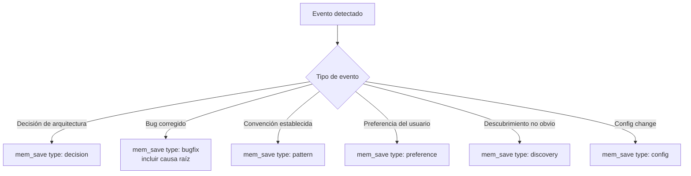
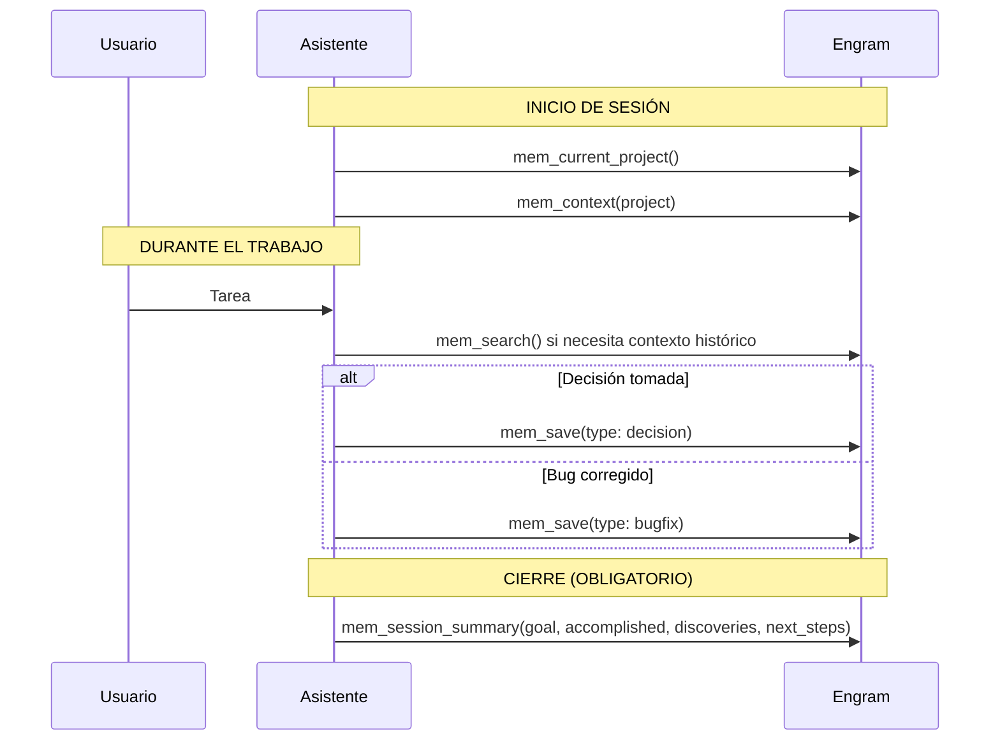
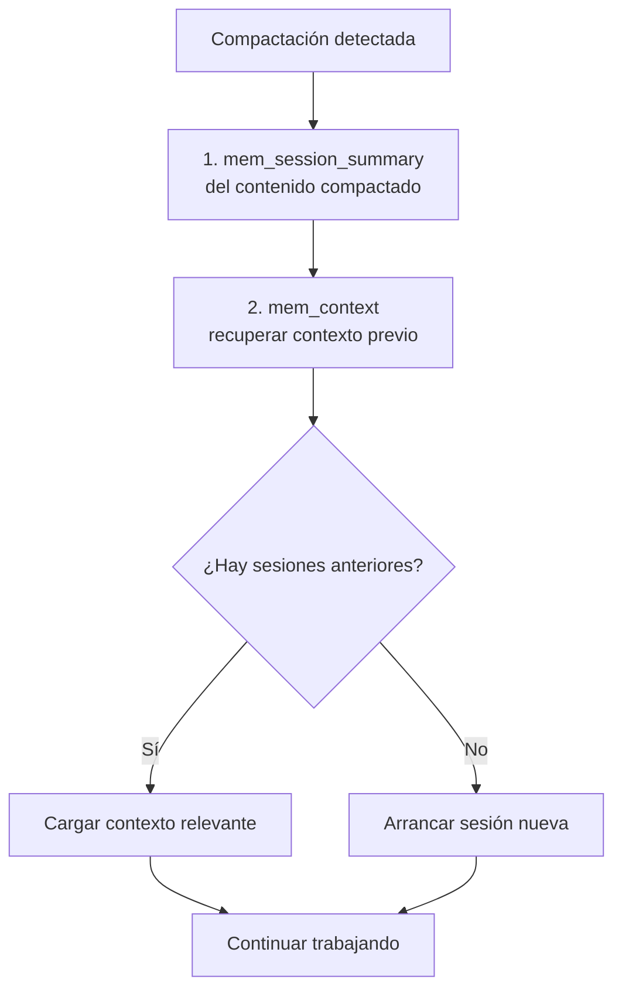
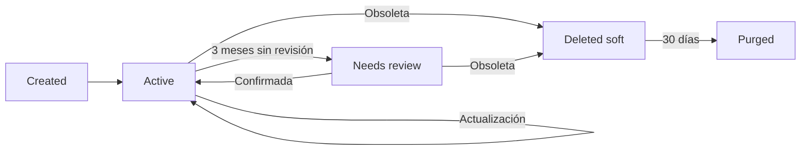

# Cómo usar la memoria con Engram

## Qué aprenderás

El capítulo anterior explicó **qué es Engram** y su modelo de datos. Este capítulo es práctico: vas a aprender a usar las **20 herramientas MCP**, entender cuándo guardar y cuándo no, resolver conflictos con `mem_judge`, cerrar sesiones correctamente, recuperarte de una compactación, y aplicar las mejores prácticas del protocolo de memoria persistente.

## Por qué importa

Engram solo es útil si se usa correctamente. Guardar todo satura la memoria y vuelve lentas las búsquedas. No guardar nada hace que Engram no sirva. Saber **qué** guardar, **cómo** guardarlo y **cuándo** actualizarlo marca la diferencia entre un sistema de memoria útil y ruido que ignorás.

Además, el protocolo de memoria es **obligatorio**: los agentes de Gentle-AI ejecutan `mem_session_summary` al cerrar sesión automáticamente, pero si algo falla y no se guarda, la próxima sesión arranca sin contexto.

## Visión simple

Imaginá que Engram es un cuaderno de notas compartido entre vos y tu asistente:

- **`mem_save`**: escribís una nota
- **`mem_search`**: buscás en el cuaderno
- **`mem_context`**: hojeás las últimas páginas
- **`mem_session_summary`**: cerrás el cuaderno con un resumen del día
- **`mem_judge`**: cuando dos notas se contradicen, decidís cuál es correcta

Cada herramienta MCP es una acción concreta sobre ese cuaderno. No necesitás recordar 20 comandos de memoria — el asistente los invoca solo.

## Cómo funciona realmente

### El protocolo de memoria en la práctica

El protocolo de memoria no es un documento académico. Es una serie de reglas que el asistente sigue automáticamente:

1. **Guardar proactivamente** después de eventos clave (sin esperar a que el usuario lo pida)
2. **No guardar ruido** (información obvia, transitoria o incompleta)
3. **Usar topic keys** para evitar duplicados y permitir actualizaciones
4. **Cerrar la sesión** con `mem_session_summary` antes de terminar
5. **Resolver conflictos** cuando Engram detecta contradicciones
6. **Recuperarse después de compactación** para no perder contexto entre reinicios del modelo

### Las 20 herramientas MCP

Engram expone **20 herramientas** a través de MCP. Siete son **core** (siempre disponibles) y 13 son **deferred** (bajo demanda).

#### Core (siempre disponibles)

| Herramienta | Firma | ¿Qué hace? |
|------------|-------|-----------|
| `mem_save` | `(title, type, content, scope?, topic_key?, project?)` | Guarda una observación |
| `mem_search` | `(query, project?, type?, limit?)` | Busca texto completo con BM25 |
| `mem_context` | `(project?)` | Devuelve contexto reciente del proyecto |
| `mem_session_summary` | `(goal?, instructions?, discoveries?, accomplished?, next_steps?, relevant_files?)` | Guarda resumen de cierre de sesión |
| `mem_get_observation` | `(id)` | Obtiene contenido completo por ID |
| `mem_save_prompt` | `(content, project?)` | Guarda el prompt del usuario |
| `mem_current_project` | `()` | Detecta el proyecto actual desde el directorio de trabajo |

#### Deferred (bajo demanda)

| Herramienta | ¿Cuándo se usa? |
|------------|----------------|
| `mem_update` | Corregir o ampliar una observación existente |
| `mem_review` | Listar observaciones que necesitan revisión |
| `mem_pin` / `mem_unpin` | Fijar o sacar observaciones del inicio del contexto |
| `mem_suggest_topic_key` | Saber qué topic_key usar antes de guardar |
| `mem_session_start` / `mem_session_end` | Iniciar o cerrar sesión manualmente |
| `mem_judge` | Resolver conflictos entre observaciones |
| `mem_compare` | Comparar dos observaciones y sugerir una relación |
| `mem_doctor` | Diagnosticar la salud de la base de datos |
| `mem_delete` | Borrado lógico o físico de observaciones |
| `mem_stats` | Estadísticas del proyecto (cantidad, tipos, sesiones) |
| `mem_timeline` | Historial de cambios de una observación |
| `mem_merge_projects` | Fusionar dos proyectos en uno |

### Cuándo guardar y cuándo no

La regla de oro: **cada `mem_save` debe responder una pregunta que alguien se hará en el futuro**.

#### Guardar SIEMPRE

- **Decisiones de arquitectura**: por qué elegiste SQLite, por qué separaste un monolito, qué alternativas consideraste y por qué las descartaste
- **Bugs con causa raíz**: el error, qué lo causó exactamente, cómo lo solucionaste, y cómo prevenirlo
- **Descubrimientos no obvios**: "el driver X tiene un bug en Windows con rutas largas", "la API Y devuelve 401 aunque el token sea válido"
- **Configuraciones importantes**: `OPENCODE_LLM_PROVIDER=anthropic` por tal motivo
- **Patrones establecidos**: "los tests unitarios van en `__tests__/`", "usamos `describe`/`it`"
- **Preferencias del usuario**: "usar comillas simples siempre", "prefiero yarn sobre npm"

#### NO guardar

- **Información obvia**: "usamos JavaScript" (está en el `package.json`)
- **Tareas pendientes**: para eso están los issues o el TODO en código
- **Contexto transitorio**: "estoy mirando el archivo X" (cambia cada 5 minutos)
- **Código completo**: guardá la decisión, no el código (para eso está Git)
- **Síntomas sin causa**: "el build falló" sin saber por qué
- **Conversaciones triviales**: "hola", "gracias", "probando"

#### Heurística de 3 meses

Si dentro de 3 meses leer esto te ahorra 5 minutos de investigación, guardalo. Si no, no.

### Proactive save triggers

Los agentes de Gentle-AI están programados para guardar automáticamente después de ciertos eventos, **sin que el usuario lo pida**. El asistente hace una autoevaluación después de cada tarea:



El flujo interno del asistente:

```text
Después de completar una tarea:
  1. ¿Tomé una decisión de arquitectura? → mem_save(type: decision)
  2. ¿Corregí un bug con causa raíz clara? → mem_save(type: bugfix)
  3. ¿Establecí una convención nueva? → mem_save(type: pattern)
  4. ¿Aprendí algo no obvio? → mem_save(type: discovery)
  5. ¿Cambié configuración crítica? → mem_save(type: config)
  6. Si nada aplica → no guardar
```

### Conflictos (judgment_required)

Cuando Engram detecta que una observación nueva podría contradecir una existente, activa el sistema de conflictos. Esto es fundamental para mantener la memoria confiable.

Después de cada `mem_save`, Engram ejecuta `FindCandidates()` con **BM25**. Si encuentra candidatos potencialmente conflictivos, devuelve:

```json
{
  "judgment_required": true,
  "candidates": [
    {
      "id": 42,
      "title": "Usamos SQLite para el MVP",
      "similarity": 0.85
    }
  ]
}
```

Cuando el asistente recibe `judgment_required: true`, **debe** llamar a `mem_judge` para resolver cada candidato. Ignorar un conflicto hace que la memoria pierda confiabilidad.

#### Cómo resolver con mem_judge

`mem_judge` recibe tres parámetros:

| Parámetro | Descripción |
|-----------|-------------|
| `judgment_id` | ID del candidato en conflicto |
| `relation` | Tipo de relación (ver tabla abajo) |
| `reason` | Explicación de por qué elegiste esa relación |

Ejemplo:

```text
# Conflicto entre:
# "Usamos SQLite para el MVP" (id: 42)
# y la nueva: "Migramos a Postgres para producción"

mem_judge(
  judgment_id: 42,
  relation: supersedes,
  reason: "La decisión anterior era temporal para el MVP.
           Escalamos a Postgres porque necesitábamos concurrencia."
)
```

Relaciones posibles:

| Relación | Significado | ¿Cuándo usarla? |
|----------|------------|-----------------|
| `related` | Conectadas temáticamente | Son distintas pero del mismo tema |
| `compatible` | No se contradicen | Ambas pueden coexistir |
| `scoped` | Una es más específica | "React" y "React Server Components" |
| `conflicts_with` | Se contradicen | Una dice A, la otra dice no-A |
| `supersedes` | Una reemplaza a la otra | La vieja queda obsoleta |
| `not_conflict` | Son independientes | Falso positivo del detector |

#### Heurística de resolución automática

El asistente resuelve **sin preguntar** cuando:

- Confianza >= 0.7 **Y** la relación no es `supersedes` ni `conflicts_with`
- La relación es `related`, `compatible`, `scoped` o `not_conflict`

Debe **preguntar al usuario** cuando:

- Confianza < 0.7
- Relación es `supersedes` o `conflicts_with` **Y** el tipo es `architecture`, `policy` o `decision`

### Sesiones: ciclo completo

Cada sesión de trabajo sigue este protocolo obligatorio:



El paso de cierre es **obligatorio** — no opcional. Sin él, la próxima sesión arranca sin saber lo que pasó.

#### Formato completo de mem_session_summary

```text
mem_session_summary(
  goal: "Implementar autenticación con JWT",
  discoveries: [
    "El middleware de Express no puede ser async por defecto"
  ],
  accomplished: [
    "Login funcionando con JWT",
    "Middleware de autenticación implementado",
    "Tests de integración"
  ],
  next_steps: [
    "Implementar refresh token rotation",
    "Agregar tests de seguridad"
  ],
  relevant_files: [
    "src/middleware/auth.ts",
    "src/routes/auth.ts",
    "tests/auth.test.ts"
  ]
)
```

### Después de una compactación

La **compactación** ocurre cuando el modelo (DeepSeek, Claude, GPT) reinicia su ventana de contexto. Cuando el asistente se "despierta" después de una compactación:

1. **Perdió el contexto de la conversación en curso**
2. **NO perdió la memoria persistente** (Engram está en SQLite)

Protocolo post-compactación:



El asistente DEBE: (1) llamar a `mem_session_summary` con el resumen compactado, (2) llamar a `mem_context` para recuperar lo anterior, (3) seguir trabajando.

### Topic keys

Un **topic_key** es un identificador jerárquico (`familia/subtema`) que permite upserts. Sin topic key, cada `mem_save` crea una observación nueva. Con topic key, Engram **incrementa la revisión** en lugar de duplicar.

| Topic key | Agrupa |
|-----------|--------|
| `architecture/database-choice` | Decisiones sobre base de datos |
| `auth/jwt-config` | Configuración de JWT |
| `testing/strategy` | Estrategia de testing |
| `bugfix/login-race-condition` | Bug específico |

```text
# Primera vez
mem_save(topic_key: "auth/jwt-expiry", title: "JWT expira en 1h")
# → id: 10, revision_count: 1

# Segunda vez (cambio a 30 min)
mem_save(topic_key: "auth/jwt-expiry", title: "JWT expira en 30min")
# → id: 10, revision_count: 2 — NO crea duplicado
```

#### Cómo elegir un buen topic_key

1. **Familia amplia pero no genérica**: `auth` está bien, `code` no sirve
2. **Subtema específico**: `auth/jwt-expiry` mejor que `auth/thing`
3. **Consistencia**: si existe `architecture/db`, no crees `database/choice`
4. **Usá `mem_suggest_topic_key`** si no sabés cuál usar

### Scope: project vs personal

| Scope | ¿Quién lo ve? | ¿Cuándo usarlo? |
|-------|--------------|-----------------|
| `project` (default) | Todo el equipo | Decisiones, patrones, bugs del proyecto |
| `personal` | Solo vos | Preferencias, config del editor, atajos personales |

### Tipos de observación

| Tipo | ¿Qué guarda? |
|------|-------------|
| `decision` | Decisiones de arquitectura o diseño |
| `bugfix` | Bug corregido con causa raíz |
| `discovery` | Hallazgo no obvio |
| `pattern` | Convención o patrón establecido |
| `preference` | Preferencia del usuario |
| `config` | Configuración importante |
| `architecture` | Documentación de arquitectura |

### Pinned observations

`mem_pin` fija una observación para que aparezca siempre al inicio del contexto. Útil para reglas activas, convenciones críticas, decisiones vigentes.

```text
mem_pin(id: 10)   # Fijar
mem_unpin(id: 10) # Sacar
```

Recomendación: máximo 3-5 pins. Si todo está pinneado, nada lo está.

### Lifecycle de una observación



### Errores frecuentes

1. **No cerrar la sesión**: sin `mem_session_summary`, la próxima sesión arranca sin contexto. Verificá con `mem_doctor` si hay sesiones huérfanas.
2. **Topic keys inconsistentes**: a veces `auth/jwt`, a veces `jwt-config`. Usá `mem_suggest_topic_key`.
3. **Guardar sin contexto**: `"Cambiamos la BD"` sin decir por qué. Incluí el razonamiento completo.
4. **Ignorar conflictos**: si `judgment_required` es true y no llamás a `mem_judge`, la memoria pierde confiabilidad.
5. **Abusar de pinned**: si todo está pinneado, nada lo está. Máximo 3-5.
6. **Scope incorrecto**: preferencias personales como `project` saturan al equipo con ruido.

### Resumen rápido

| Concepto | Regla |
|----------|-------|
| ¿Guardo? | Sí: decisiones, bugs, patrones. No: obviedades, tareas, código |
| Topic key | Siempre que sea reusable. Formato `familia/subtema` |
| Scope | `project` por default, `personal` para lo tuyo |
| Conflictos | Resolver con `mem_judge`, nunca ignorar |
| Cierre de sesión | Obligatorio con `mem_session_summary` |
| Compactación | 1. Summary, 2. Context, 3. Continuar |
| Pins | Máximo 3-5 |

### Preguntas

1. ¿Cuándo deberías NO guardar algo en Engram?
2. ¿Qué pasa si `mem_session_summary` no se ejecuta al cerrar la sesión?
3. ¿Cuál es la diferencia entre `scope: project` y `scope: personal`?
4. ¿Qué hace el asistente cuando recibe `judgment_required: true`?
5. ¿Para qué sirve un `topic_key`? ¿Qué pasa si no lo usás?
6. ¿Cuál es el protocolo después de una compactación?

### Ejercicio

1. Revisá las observaciones con `mem_search(query: "", project: "tu-proyecto")`
2. Identificá topic keys inconsistentes y proponé una convención
3. Ejecutá `mem_doctor` para verificar la salud de la base de datos
4. Practicá el cierre de sesión con `mem_session_summary`

## Fuentes verificadas

- Repositorio: engram, commit `763a6ba432713725d6ce82a2416eec6cbd9ec94e`
- Archivos: `internal/mcp/handlers.go`, `internal/mcp/tools.go`, `internal/judge/judge.go`, `internal/session/session.go`
- Versiones verificadas: engram 1.19.0, engram 1.20.0 (revisado)
- Fecha: 2026-07-20
- Estado: Verificado
