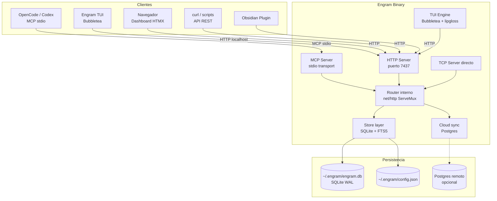
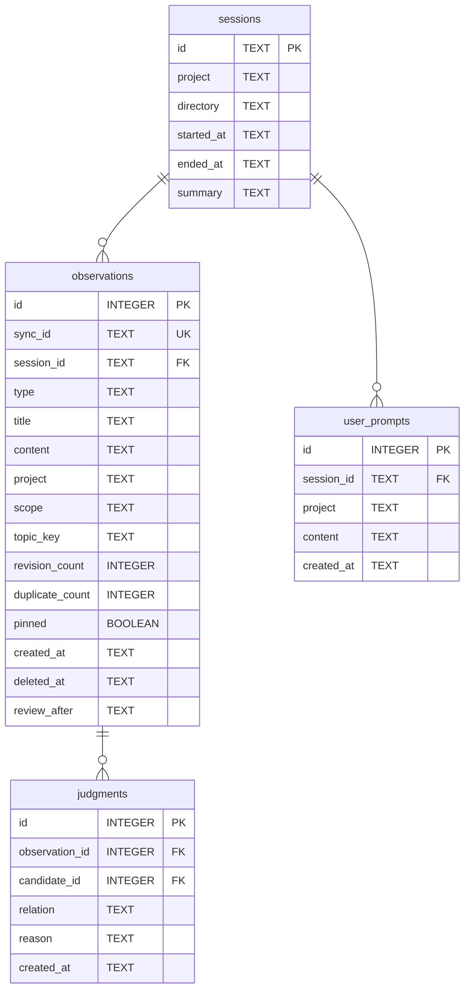
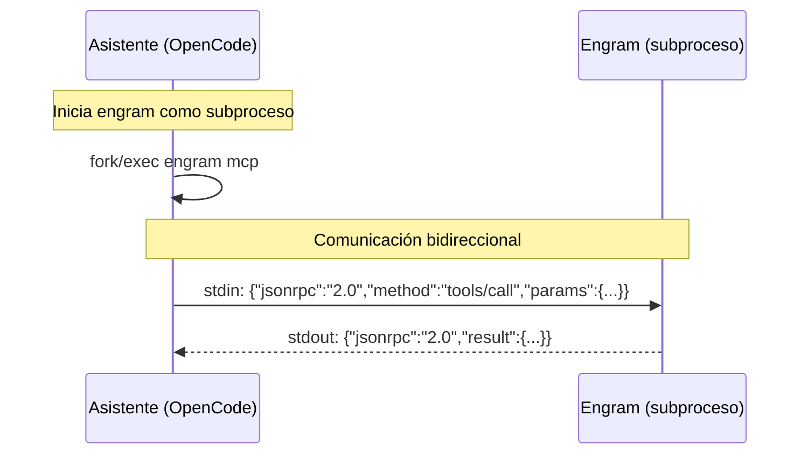
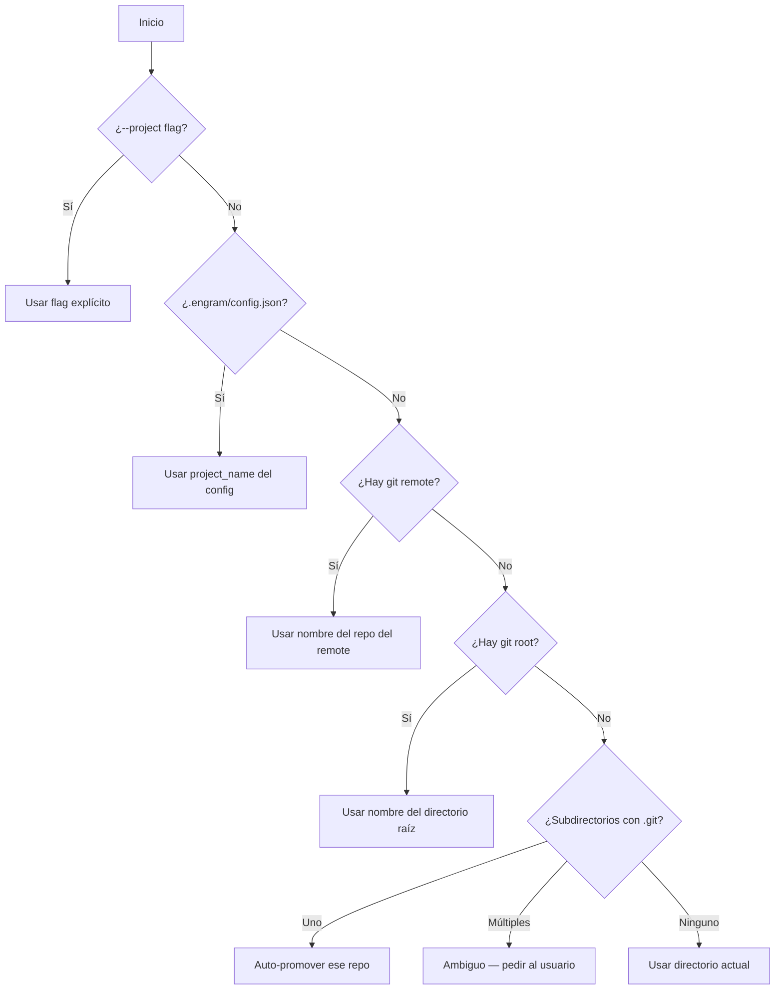
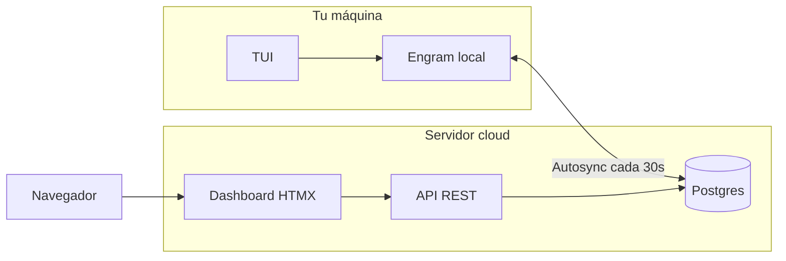
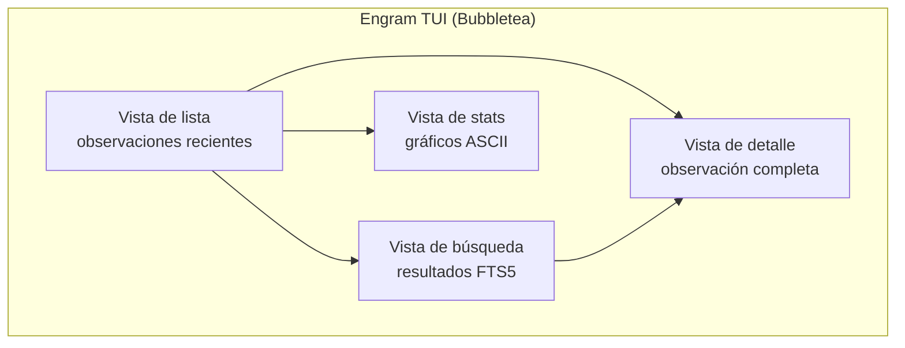
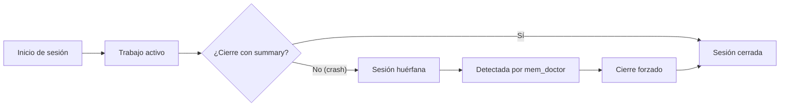

# Arquitectura de Engram

## Qué aprenderás

Engram no es una caja mágica. Es un binario escrito en **Go** con una arquitectura en capas bien definida. Este capítulo profundiza en cómo está construido: su base de datos **SQLite + FTS5**, los **tres transportes** (MCP stdio, HTTP REST y TCP directo), el sistema de detección de proyectos, el modo cloud opcional con Postgres, la TUI, el plugin de Obsidian, y cómo todas las piezas encajan.

## Por qué importa

Cuando algo falla — una búsqueda lenta, un conflicto que no se resuelve, un proyecto que no se detecta — entender la arquitectura te permite diagnosticar el problema sin depender de nadie. Además, si querés contribuir a Engram o extenderlo, necesitás entender su estructura interna.

## Visión simple

Engram tiene tres capas:

1. **Transporte**: MCP stdio para agentes, HTTP REST para humanos y herramientas, TCP directo para conexiones persistentes con eventos en tiempo real
2. **Lógica**: maneja sesiones, observaciones, prompts, búsqueda y conflictos
3. **Almacenamiento**: SQLite local con FTS5, más Postgres remoto opcional en modo cloud

Podés pensar en Engram como un servidor web minimalista, pero en lugar de servir páginas HTML, sirve memoria a asistentes de IA.

## Analogía

Imaginá una biblioteca:

- **MCP stdio** es el mostrador de atención directa para bibliotecarios (agentes). Hablan por un tubo, sin intermediarios, sin red.
- **HTTP REST** es la entrada pública. Cualquier persona (TUI, script, dashboard) puede entrar y consultar.
- **TCP directo** es un canal privado para suscripciones a eventos en tiempo real.
- **SQLite** es el depósito de libros, organizado con un índice de búsqueda (FTS5) para encontrar cualquier libro por palabra clave.
- **Postgres cloud** es una sucursal remota de la biblioteca, sincronizada con la local, para acceder desde cualquier lugar.

## Cómo funciona realmente

### Arquitectura en capas



### Go — por qué Go

Engram está escrito en **Go** por varias razones:

| Característica | Por qué importa para Engram |
|---------------|----------------------------|
| **Binario único** | Un solo `.exe` sin dependencias. No necesitás Node.js, Python ni JVM. |
| **Goroutines livianas** | Maneja múltiples conexiones MCP y HTTP en paralelo sin threads pesados |
| **stdlib potente** | `net/http`, `database/sql`, `encoding/json` — cero dependencias externas para lo básico |
| **Cross-compilation** | Compilá en Linux, macOS y Windows desde una misma máquina |
| **Tipado estático** | Menos bugs en runtime, mejor documentación en el código fuente |

### SQLite + FTS5

Engram usa **SQLite** como base de datos local, no Postgres ni MySQL. La razón es simple: Engram **no necesita un servidor de base de datos**. Es una herramienta de un solo usuario (o equipo pequeño en modo cloud).

#### WAL mode

SQLite puede tener problemas de concurrencia cuando varios procesos escriben al mismo tiempo. Engram lo resuelve con **WAL mode** (Write-Ahead Logging):

- Las lecturas no bloquean a las escrituras y viceversa
- **Una sola conexión de escritura** (`MaxOpenConns=1`) para evitar locks
- `busy_timeout=5000` para esperar hasta 5 segundos si hay contención

```go
db, _ := sql.Open("sqlite3", path)
db.SetMaxOpenConns(1)
db.Exec("PRAGMA journal_mode=WAL")
db.Exec("PRAGMA busy_timeout=5000")
```

Sin WAL mode, SQLite bloquea todo el archivo durante una escritura. Con WAL mode, los lectores siguen funcionando mientras se escribe.

#### FTS5 — Búsqueda de texto completo

**FTS5** (Full-Text Search 5) es una extensión de SQLite que permite:

- **BM25**: algoritmo probabilístico que ordena resultados por relevancia
- **Stemming**: busca "correr" cuando buscás "corrió"
- **Tokens**: busca frases, palabras parciales, excluye términos

Engram crea una tabla virtual FTS5 para observaciones:

```sql
CREATE VIRTUAL TABLE observations_fts USING fts5(
    title, content, project,
    content='observations',
    content_rowid='id'
);
```

Cuando ejecutás `mem_search(query: "decisión base de datos")`, Engram hace:

```sql
SELECT o.id, o.title, o.content, o.type, o.created_at,
       rank
FROM observations_fts
JOIN observations o ON o.id = observations_fts.rowid
WHERE observations_fts MATCH 'decisión OR base OR datos'
  AND o.deleted_at IS NULL
  AND o.project = 'mi-proyecto'
ORDER BY rank DESC
LIMIT 10;
```

#### Estructura de tablas

Engram tiene **4 tablas principales** en SQLite:



**sessions**: agrupa observaciones por sesión de trabajo. Cada sesión tiene UUID, proyecto, directorio, y timestamps.

**observations**: el corazón del sistema. Almacena título, contenido, tipo, scope, topic_key, revisiones, y estado de borrado lógico (`deleted_at`).

**user_prompts**: guarda los prompts del usuario para reconstruir contexto post-compactación.

**judgments**: registra las relaciones entre observaciones resueltas con `mem_judge`. Fundamental para el sistema de conflictos.

### MCP stdio transport

El **transporte MCP stdio** es el canal principal de comunicación entre Engram y los asistentes de código.

El asistente inicia Engram como un **subproceso** y se comunican por `stdin`/`stdout` con JSON-RPC:



Ventajas: latencia cero, seguro (no expone puertos), simple (sin configuración de red), portable (funciona igual en los 3 sistemas operativos).

### HTTP REST (puerto 7437)

Además de MCP stdio, Engram expone una **API HTTP REST** en el puerto **7437** (E-N-G-R en teclado telefónico).

Endpoints principales:

| Ruta | Método | ¿Qué hace? |
|------|--------|-----------|
| `/api/observations` | GET/POST | Lista/crea observaciones |
| `/api/observations/:id` | GET/PUT/DELETE | CRUD de una observación |
| `/api/search` | GET | Búsqueda texto completo |
| `/api/sessions` | GET/POST | Lista/crea sesiones |
| `/api/context` | GET | Contexto reciente del proyecto |
| `/api/stats` | GET | Estadísticas del proyecto |
| `/api/doctor` | GET | Diagnóstico de salud |
| `/ui/` | GET | Dashboard web (HTMX) |

Usos: la TUI de Engram se conecta por HTTP, el dashboard cloud se sirve por HTTP, scripts externos (`curl` o cualquier lenguaje), y el plugin de Obsidian.

### TCP directo

El **tercer transporte** es TCP directo, útil para conexiones persistentes que necesitan notificaciones en tiempo real. Se activa con `--tcp-addr`:

```bash
engram serve --tcp-addr :7438
```

Casos de uso:

- **Notificaciones en vivo**: cuando un agente guarda una observación, los clientes TCP conectados reciben un evento instantáneo
- **Streaming de búsquedas**: los resultados llegan a medida que se evalúan, sin esperar la consulta completa
- **Integraciones custom**: cuando HTTP request/response no es suficiente y necesitás un canal bidireccional permanente

### Detección de proyecto

Engram necesita saber **en qué proyecto estás trabajando** para aislar la memoria entre proyectos. Usa un algoritmo de 6 pasos:



#### Monorepo

Si trabajás en un **monorepo** con múltiples proyectos, la detección automática puede fallar. Soluciones:

1. **`.engram/config.json`** en la raíz de cada subproyecto:
```json
{ "project_name": "servicio-auth" }
```

2. **Flag explícito** al iniciar:
```bash
engram mcp --project servicio-auth
```

3. **Variable de entorno**:
```bash
OPENCODE_PROJECT=servicio-auth engram mcp
```

### Modo cloud (Postgres + HTMX + autosync)

Engram puede usar **Postgres** como backend remoto, habilitando sincronización entre máquinas y un dashboard web:



Cada observación tiene un **sync_id** único. Un worker en background envía los cambios a Postgres en intervalos configurables (default: 30 segundos). También existe `/api/sync` para forzar sincronización inmediata.

#### Cuándo usar cloud

| Situación | SQLite local | Postgres cloud |
|-----------|-------------|----------------|
| Trabajás solo en una máquina | Ideal | Sobra |
| Múltiples máquinas | No sincroniza | Ideal |
| Equipo pequeño (2-5 personas) | No compartido | Ideal |
| Querés dashboard web | No tiene | HTMX dashboard |
| Privacidad de datos | 100% local | Datos en servidor |

### Engram TUI

Engram tiene una interfaz de terminal (TUI) construida con **Bubbletea** (framework Go para TUI) y **lipgloss** (estilos). No necesita navegador ni servidor gráfico.



Para usar: terminal 1 con `engram serve`, terminal 2 con `engram tui`. La TUI se conecta al servidor HTTP en `localhost:7437`.

### Obsidian plugin

El plugin de **Obsidian** conecta la memoria de Engram con tus notas personales. Se conecta al servidor HTTP en `localhost:7437`.

Funcionalidades:

- **Panel lateral**: muestra observaciones recientes de Engram dentro de Obsidian
- **Búsqueda integrada**: buscá en la memoria de Engram desde la barra de búsqueda
- **Vinculación**: relacioná notas de Obsidian con observaciones por ID
- **Importación**: convertí notas en observaciones con un clic
- **Auto-sync**: notas etiquetadas con `#engram` se sincronizan automáticamente

### El binario: engram mcp vs engram serve

Engram produce un solo binario con múltiples subcomandos:

```bash
engram
├── engram mcp        # Servidor MCP stdio (para asistentes IA)
├── engram serve      # Servidor HTTP + TCP (TUI, REST, cloud)
├── engram tui        # Interfaz de terminal (Bubbletea)
├── engram doctor     # Diagnóstico de salud
└── engram version    # Versión
```

| Subcomando | Transporte | Para | Persistencia |
|-----------|-----------|------|-------------|
| `engram mcp` | MCP stdio | Asistentes IA | SQLite directo |
| `engram serve` | HTTP REST + TCP | TUI, scripts, dashboard | SQLite + Postgres |
| `engram tui` | N/A (Bubbletea) | Vos, desde la terminal | Se conecta a serve |
| `engram doctor` | N/A (CLI) | Diagnóstico | Solo lectura SQLite |

`engram mcp` y `engram serve` pueden correr simultáneamente: ambos acceden al mismo `.db` con WAL mode.

### Lifecycle de sesiones



### Backup y recuperación

Engram usa SQLite estándar, así que cualquier herramienta SQLite sirve:

```bash
# Backup en caliente (mientras Engram corre)
sqlite3 ~/.engram/engram.db ".backup ~/.engram/backup.db"

# Restaurar
cp ~/.engram/backup.db ~/.engram/engram.db
```

En modo cloud, Postgres provee backup automático si está configurado.

### Errores frecuentes

1. **"database is locked"**: WAL mode minimiza esto, pero si dos procesos escriben simultáneo, uno espera hasta `busy_timeout` (5s). Si el timeout se excede, aparece el error. Solución: aumentá `busy_timeout` o asegurate de que solo un proceso escribe.

2. **Proyecto no detectado en monorepo**: la detección encuentra múltiples repos y no sabe cuál elegir. Solución: creá `.engram/config.json` o usá `--project`.

3. **TUI no conecta**: la TUI necesita que `engram serve` esté corriendo. Primero `engram serve`, después `engram tui`.

4. **Obsidian plugin no encuentra Engram**: verificá que `engram serve` esté activo y que el plugin apunte a `http://localhost:7437`. Probá con `curl http://localhost:7437/api/doctor`.

5. **Cloud sync lento**: el intervalo default es 30s. Usá `/api/sync` para forzar sincronización inmediata.

6. **MCP timeout**: si el asistente deja de responder, el subproceso de Engram sigue vivo. Verificá con `engram doctor` y reiniciá si es necesario.

### Preguntas

1. ¿Por qué Engram usa SQLite en lugar de Postgres como base principal?
2. ¿Cuál es la diferencia entre MCP stdio, HTTP REST y TCP directo?
3. ¿Cómo maneja SQLite la concurrencia con WAL mode?
4. ¿Qué es FTS5 y por qué es importante para la búsqueda?
5. ¿Cómo se resuelve la detección de proyectos en un monorepo?
6. ¿En qué casos conviene usar el modo cloud con Postgres?

### Ejercicio

1. Ejecutá `engram serve` y verificá con `curl http://localhost:7437/api/stats`
2. Explorá la BD con `sqlite3 ~/.engram/engram.db ".tables"`
3. Ejecutá `engram doctor` para verificar la salud de la base
4. Si tenés un monorepo, creá `.engram/config.json` en un subproyecto
5. Probá la TUI: terminal 1 `engram serve`, terminal 2 `engram tui`

## Fuentes verificadas

- Repositorio: engram, commit `763a6ba432713725d6ce82a2416eec6cbd9ec94e`
- Archivos: `internal/store/sqlite.go`, `internal/project/detect.go`, `internal/mcp/server.go`, `internal/server/http.go`, `internal/tcp/server.go`, `cmd/engram/main.go`
- Versiones verificadas: engram 1.19.0, engram 1.20.0 (revisado)
- Fecha: 2026-07-20
- Estado: Verificado
