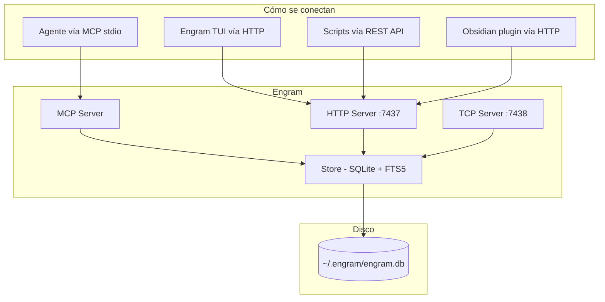

Engram es un binario Go con tres capas: transporte (cómo se conecta), lógica (qué hace) y almacenamiento (dónde guarda).

## El archivo SQLite

Engram usa **SQLite**, no Postgres ni MySQL. No necesita un servidor de base de datos porque es una herramienta de un solo usuario (o equipo pequeño en modo cloud).

| Característica | Detalle |
|---------------|---------|
| Archivo | `~/.engram/engram.db` |
| Modo | WAL (Write-Ahead Logging) — lecturas no bloquean escrituras |
| Concurrencia | Una sola conexión de escritura (`MaxOpenConns=1`) |
| Timeout | `busy_timeout=5000` (espera hasta 5s si hay contención) |
| Búsqueda | **FTS5** — extensión de SQLite para full-text search con BM25 |

### Tablas

| Tabla | Propósito |
|-------|-----------|
| `sessions` | Agrupa observaciones por sesión de trabajo (UUID, proyecto, fechas) |
| `observations` | El corazón: título, contenido, tipo, scope, topic_key, revisiones, soft delete |
| `user_prompts` | Prompts del usuario para reconstruir contexto post-compactación |
| `judgments` | Relaciones entre observaciones resueltas con `mem_judge` |

```sql
-- La tabla FTS5 que permite búsqueda de texto completo
CREATE VIRTUAL TABLE observations_fts USING fts5(
    title, content, project,
    content='observations',
    content_rowid='id'
);
```

Cuando ejecutás `mem_search(query: "decisión base de datos")`, Engram busca en esta tabla virtual con BM25 y devuelve resultados ordenados por relevancia.

## Formas de acceder a Engram

Engram tiene tres transportes, cada uno para un caso de uso:

| Transporte | Puerto | ¿Para qué? |
|-----------|--------|-----------|
| **MCP stdio** | Pipe (stdin/stdout) | Comunicación directa agente ↔ Engram. El asistente ejecuta Engram como subproceso. Latencia cero, seguro, sin configuración de red. |
| **HTTP REST** | 7437 | TUI, scripts externos, dashboard web, plugin de Obsidian |
| **TCP directo** | 7438 (configurable) | Conexiones persistentes con eventos en tiempo real (notificaciones, streaming) |



`engram mcp` y `engram serve` pueden correr simultáneamente: ambos acceden al mismo `.db` con WAL mode.

## Git sync

Podés incluir la configuración de Engram en tu repo. Engram busca `.engram/config.json` en la raíz del proyecto:

```json
{
  "project_name": "mi-servicio"
}
```

Esto es útil en monorepos donde la detección automática no puede elegir entre múltiples proyectos. Engram también detecta el proyecto desde Git remoto, Git root, o el nombre del directorio, en ese orden de prioridad.

El archivo `.db` NO debe ir en Git. Solo va la configuración.

Para sincronizar la configuración del proyecto vía Git:

```bash
# Activar sync para el proyecto actual
engram sync

# Importar configuración desde Git (al clonar)
engram sync --import

# Ver estado de sync
engram sync --status
```

## Modo cloud (opcional)

Engram puede usar **Postgres** como backend remoto. Esto habilita sincronización entre máquinas y un dashboard web. No es obligatorio. Engram funciona perfectamente solo con SQLite local.

| Situación | SQLite local | Postgres cloud |
|-----------|-------------|----------------|
| Una máquina | Ideal | Sobra |
| Varias máquinas | No sincroniza | Ideal |
| Equipo (2-5 personas) | No compartido | Ideal |
| Privacidad | 100% local | Datos en servidor |

Cada observación tiene un `sync_id` único. En modo cloud, un worker sincroniza los cambios cada 30 segundos (configurable).

## Exportación e importación

Engram tiene comandos nativos para exportar e importar:

```bash
# Exportar a JSON portable
engram export ~/engram-respaldo.json

# Importar desde JSON
engram import ~/engram-respaldo.json
```

Si necesitás acceso directo a la base SQLite (uso avanzado):

```bash
# Exportar (mientras Engram corre)
sqlite3 ~/.engram/engram.db ".backup ~/.engram/respaldo.db"

# Verificar integridad
sqlite3 ~/.engram/respaldo.db "SELECT count(*) FROM observations;"
```

## Scope y privacidad

| Scope | Alcance |
|-------|---------|
| `project` (default) | Visible para cualquiera que trabaje en el proyecto |
| `personal` | Solo visible para vos |

Las observaciones con `scope: personal` no se comparten aunque uses modo cloud. Es la forma de guardar preferencias de editor, atajos personales, o configuraciones locales sin saturar al equipo.

## Fuentes

- Repositorio: [github.com/Gentleman-Programming/engram](https://github.com/Gentleman-Programming/engram)
- Archivos clave: `internal/store/sqlite.go`, `internal/project/detect.go`, `internal/mcp/server.go`, `internal/server/http.go`, `internal/tcp/server.go`
