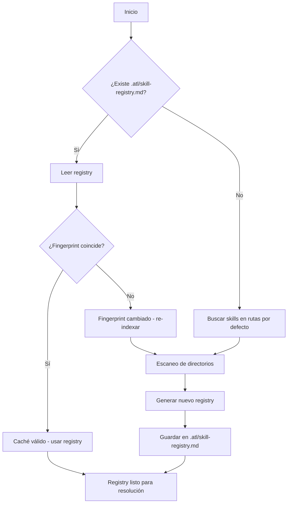
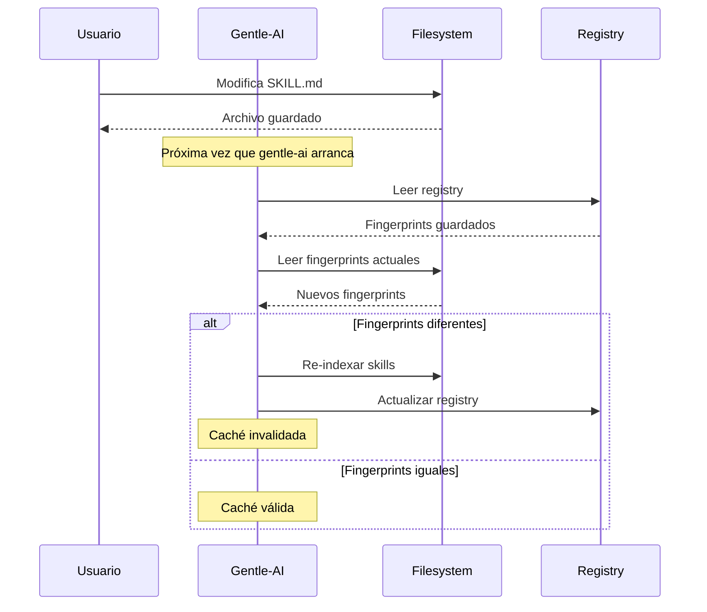
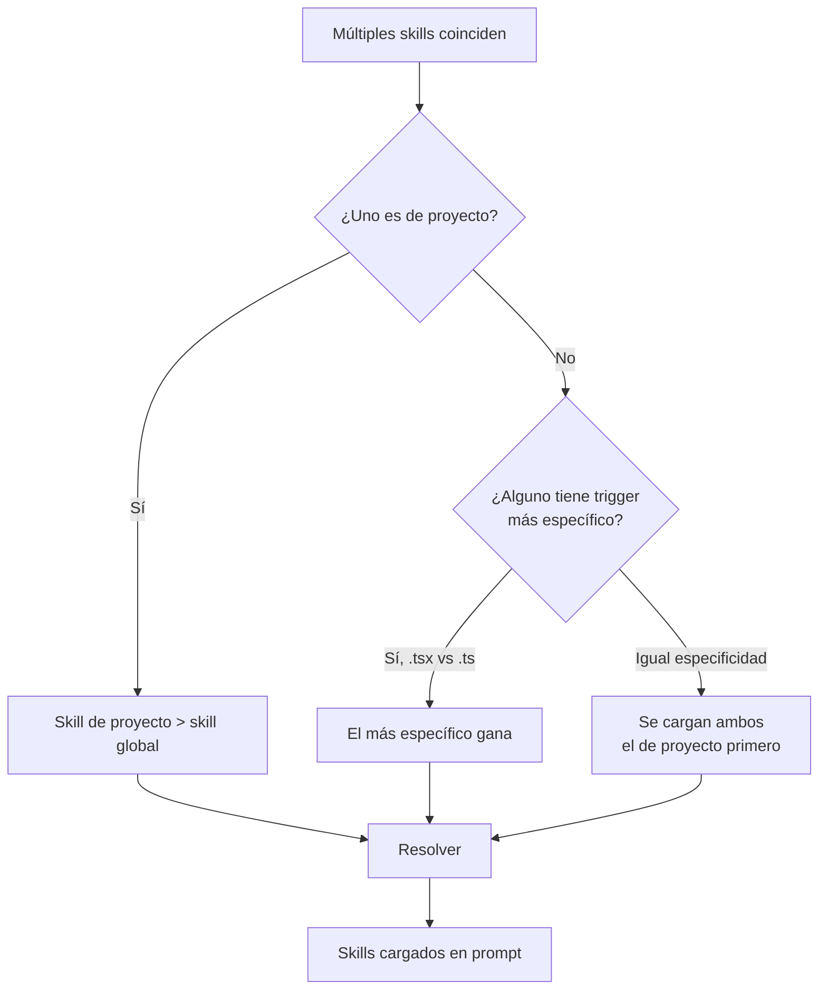
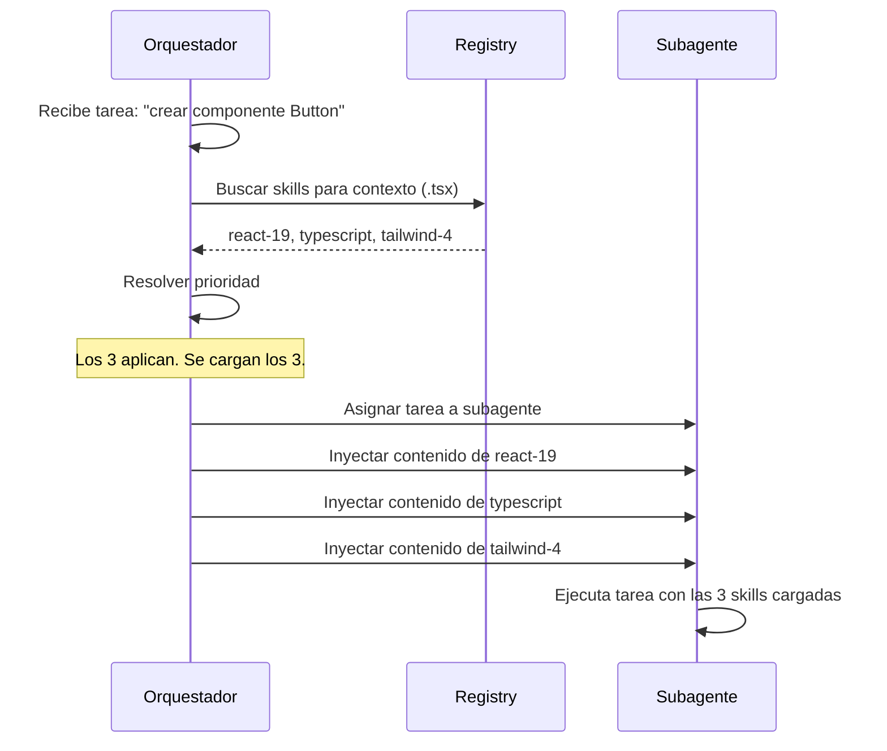
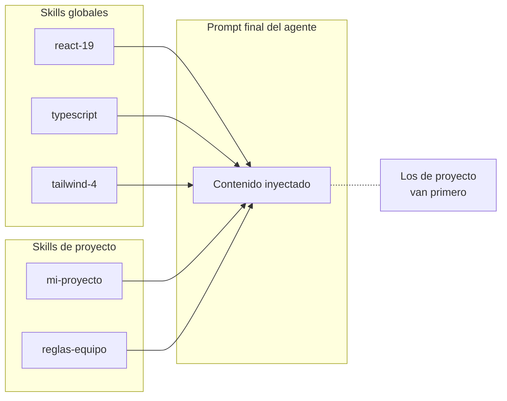

# Skill Registry y descubrimiento

## Qué aprenderás

Cuando creaste skills en el capítulo anterior, los guardaste en una carpeta y el agente los encontró por **convención de directorios**. Gentle-AI va un paso más allá: tiene un **skill registry** formal que indexa todos los skills disponibles, calcula su **fingerprint** (huella digital) para detectar cambios, y resuelve cuál cargar cuando múltiples skills coinciden.

Este capítulo explica cómo funciona ese proceso: desde que guardás un skill hasta que el agente lo carga en su prompt.

## Por qué importa

Si los skills no se cargan, es frustrante. Si se cargan los incorrectos, es peor. Entender cómo gentle-ai descubre y resuelve skills te permite diagnosticar por qué un skill no se activa, por qué se activa el equivocado, o por qué los cambios que hiciste no tienen efecto.

## Visión simple

El **skill registry** es un índice de todos los skills disponibles. Cuando gentle-ai necesita delegar una tarea:

1. Busca en el registry qué skills coinciden con el contexto actual
2. Elige el mejor (o los mejores)
3. Inyecta las instrucciones en el prompt del agente

Es como el índice de un libro: no leés el libro entero cada vez — buscás en el índice la página que necesitás.

## Analogía

Imaginá un **directorio telefónico de servicios**: cada skill es una entrada con su especialidad ("fontanero", "electricista", "carpintero"). Cuando tenés un problema (una tarea), buscás en el directorio quién puede resolverlo. Si hay varios que pueden, elegís al más especializado.

El registry es ese directorio. El **fingerprint** es una forma de saber si el directorio cambió sin tener que leerlo entero otra vez.

## Cómo funciona realmente

### Qué es el skill registry

El **skill registry** es un archivo que gentle-ai genera automáticamente. Lista todos los skills disponibles, sus triggers, y un fingerprint de cada uno.

Ubicación del archivo:

```
<proyecto>/.atl/skill-registry.md
```

No lo crees a mano — gentle-ai lo genera cuando ejecutás `gentle-ai init` o cuando actualiza la caché después de un cambio.

### Formato del registry

```markdown
# Skill Registry

## Global Skills
- path: C:\Users\tu-usuario\.config\opencode\skills\react-19\SKILL.md
  name: react-19
  trigger: "archivos .tsx, .jsx, mención React 19"
  fingerprint: a1b2c3d4e5f6...
- path: C:\Users\tu-usuario\.config\opencode\skills\typescript\SKILL.md
  name: typescript
  trigger: "archivos .ts, .tsx"
  fingerprint: b2c3d4e5f6a7...

## Local Skills (proyecto)
- path: C:\proyecto\.opencode\skills\mi-skill\SKILL.md
  name: mi-skill
  trigger: "archivos en src/features/"
  fingerprint: c3d4e5f6a7b8...

## Fallback Registry
- path: ~\.config\opencode\skills
  status: exists
```

### Descubrimiento de skills

Cuando gentle-ai arranca, sigue este proceso:



#### Fingerprint

El **fingerprint** es un hash (SHA256) del contenido del archivo `SKILL.md`. Cuando el contenido cambia, el fingerprint cambia. Gentle-AI usa esto para saber si necesita re-indexar o si la caché está vigente.



### Resolución: qué skill se carga cuando múltiples coinciden

Cuando múltiples skills coinciden con el contexto actual, gentle-ai aplica estas reglas de prioridad:



| Prioridad | Gana... | Ejemplo |
|-----------|---------|---------|
| 1 | Skill de proyecto | `.opencode/skills/react-19` > `.config/opencode/skills/react-19` |
| 2 | Trigger más específico | "archivos `.tsx`" > "archivos `.ts`" |
| 3 | Orden alfabético (desempate) | Si ambos son igualmente específicos |

### Carga diferida: cómo el orquestador resuelve skills

Cuando gentle-ai recibe una tarea, el **orquestador** (el componente que decide cómo delegar) ejecuta este proceso:

1. **Analiza la tarea**: ¿qué tipo de tarea es? (código, documentación, revisión)
2. **Consulta el registry**: ¿qué skills coinciden?
3. **Evalúa triggers**: ¿el contexto actual (archivos abiertos, extensiones, palabras clave) activa algún trigger?
4. **Resuelve**: elige el skill (o skills) aplicables
5. **Inyecta**: agrega el contenido del skill al prompt del subagente



### Caché de registry

El registry tiene un sistema de caché para evitar re-indexar en cada ejecución:

- **Ubicación**: `.atl/skill-registry.md`
- **Caché de fingerprints**: gentle-ai guarda los fingerprints de cada skill
- **Invalidación**: cuando un fingerprint cambia (el skill se modificó) o aparece un skill nuevo
- **Expiración manual**: si querés forzar la recarga sin esperar a que el fingerprint cambie

### Cómo forzar la recarga después de cambios

Si modificaste un skill y querés que gentle-ai lo detecte inmediatamente:

```bash
# Forzar re-indexación del registry
gentle-ai skills sync

# O borrar el caché manualmente
rm -rf .atl/skill-registry.md
# En Windows:
Remove-Item -Recurse -Force .atl/skill-registry.md
```

La próxima vez que gentle-ai arranque, va a detectar que no hay registry y va a re-indexar todo.

### Feedback de resolución

Cuando gentle-ai resuelve skills, devuelve información sobre cómo se resolvieron:

| Estado | Significado |
|--------|-------------|
| `paths-injected` | Skills encontrados e inyectados correctamente |
| `fallback-registry` | No se encontró `.atl/skill-registry.md`, se usó el registry por defecto |
| `fallback-path` | No se encontró ningún skill, se usó la ruta por defecto |
| `none` | No se encontraron skills para este contexto |

Podés ver este feedback en los logs de gentle-ai:

```text
[SKILL RESOLUTION] status=paths-injected skills=[react-19, typescript]
[SKILL RESOLUTION] status=fallback-path path=~/.config/opencode/skills
```

### Global vs local: orden de carga



1. **Primero**: skills del proyecto (`<proyecto>/.opencode/skills/`)
2. **Después**: skills globales (`~/.config/opencode/skills/`)
3. **Si hay conflicto**: gana el de proyecto

### Errores frecuentes

1. **El registry no se actualiza**: si modificaste un skill y gentle-ai sigue cargando la versión vieja, ejecutá `gentle-ai skills sync` o borrá `.atl/skill-registry.md`.
2. **Dos skills con el mismo nombre**: si tenés un skill global y uno local con el mismo `name`, gana el local. Pero es confuso. Usá nombres distintos.
3. **El skill no aparece en el registry**: puede ser un problema de ruta. Verificá que el skill esté en una de las rutas que gentle-ai escanea.
4. **Fingerprints corruptos**: si el registry tiene fingerprints que no coinciden con los archivos, gentle-ai re-indexa automáticamente. Pero si el registry está dañado, borralo y dejá que gentle-ai lo regenere.
5. **Confundir paths de skills**: en Windows, las rutas usan backslashes (`\`). En Linux/macOS, forward slashes (`/`). El registry normaliza las rutas al formato del sistema operativo.

### Preguntas

1. ¿Qué es un fingerprint en el contexto del skill registry?
2. ¿Cómo decide gentle-ai qué skill cargar cuando dos skills coinciden con el mismo contexto?
3. ¿Dónde se guarda el archivo del skill registry?
4. ¿Qué comando fuerza la re-indexación del registry?
5. ¿Qué significa el feedback `fallback-path` en la resolución de skills?

### Ejercicio

1. Buscá el archivo `.atl/skill-registry.md` en tu proyecto y abrílo
2. Identificá los fingerprints de cada skill listado
3. Modificá un skill existente y ejecutá `gentle-ai skills sync`
4. Verificá que el fingerprint cambió en el registry
5. Ejecutá una tarea y observá el feedback de resolución de skills

## Fuentes verificadas

- Repositorio: gentle-ai, commit `b0a88faf1296ec4f524b8c9bbb90d39af9c42d0d`
- Archivos: `internal/skills/registry.go`, `internal/skills/resolver.go`, `internal/skills/discovery.go`
- Archivos: `internal/skills/skill-manager.go`
- Versión verificada: gentle-ai 2.1.10
- Fecha: 2026-07-20
- Estado: 🟢 Verificado
