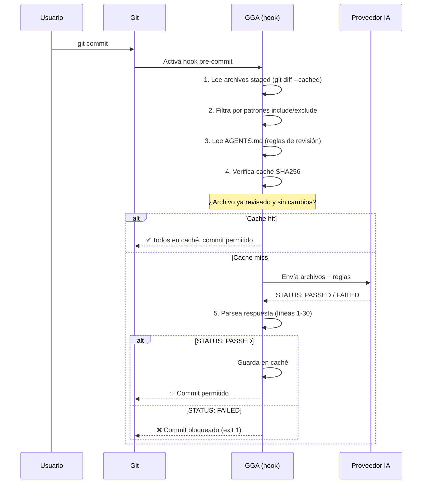
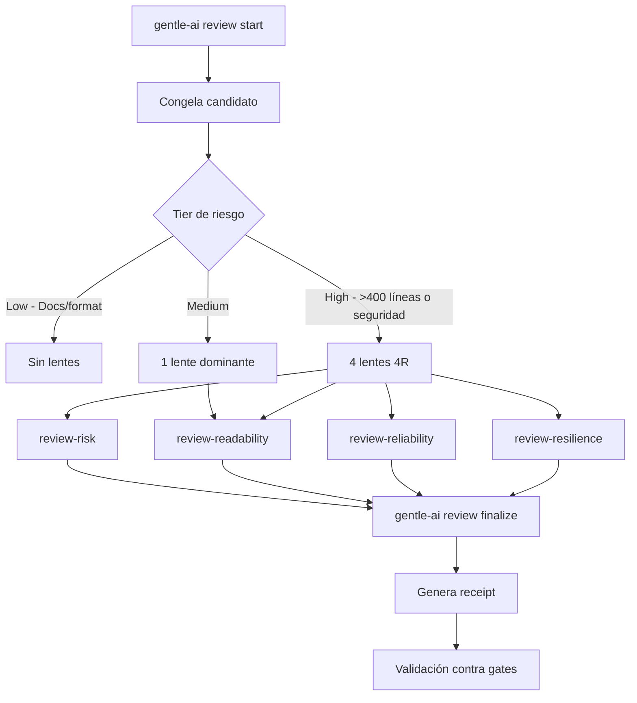
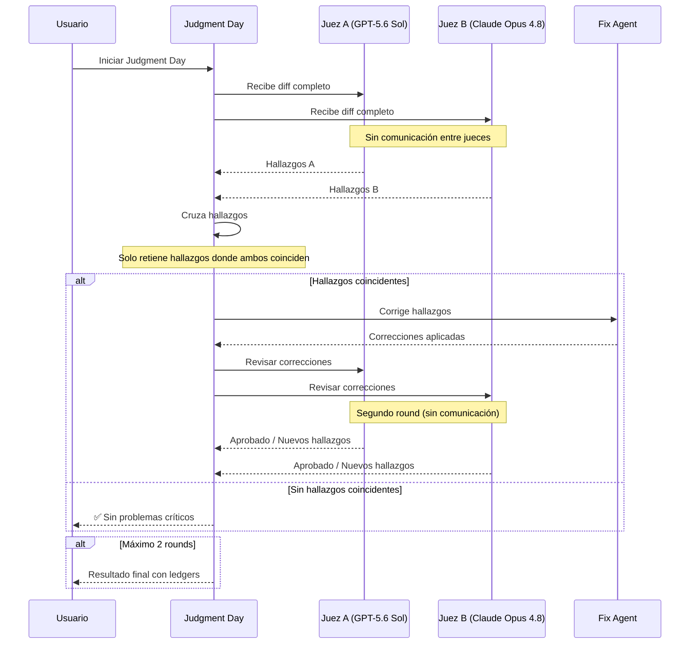
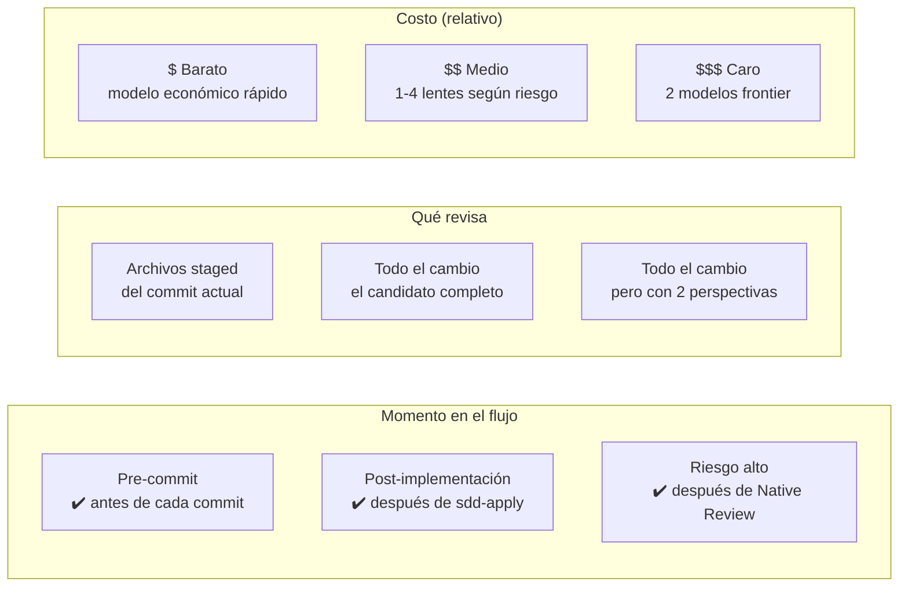

# Calidad y revisión de código

## Qué aprenderás

El ecosistema Gentle tiene **tres sistemas independientes** para revisión de código. Mucha gente los confunde porque los tres revisan código, pero cada uno opera en un momento diferente, con un propósito diferente y una arquitectura diferente.

En este capítulo:
- **GGA**: revisión instantánea antes de cada commit (hook pre-commit)
- **Native Bounded Review**: revisión determinística post-implementación con lentes especializados
- **Judgment Day**: revisión adversarial ciega con dos jueces independientes

## Por qué importa

Usar el sistema incorrecto para cada momento es ineficiente. GGA antes del commit es rápido y barato. Judgment Day después de una implementación grande es costoso pero exhaustivo. Si los invertís, perdés tiempo y dinero.

## GGA — Gentleman Guardian Angel

### Visión simple

GGA es un **hook de Git** que revisa tu código automáticamente antes de cada commit. Cuando ejecutás `git commit`, GGA se activa, revisa los archivos staged, y decide si el commit puede proceder.

**Estado**: No pasa el commit hasta que el código esté correcto.

### Cómo funciona

GGA está escrito en **Bash puro** (v2.10.1, 266+ tests). No necesita Go ni Node.js.



### Soporte de proveedores

GGA soporta **11 proveedores** de IA:

| Proveedor | Config value | Tipo |
|-----------|-------------|------|
| Claude Code | `claude` | CLI |
| Gemini CLI | `gemini` | CLI |
| Codex | `codex` | CLI |
| OpenCode | `opencode[:model]` | CLI |
| Cursor | `cursor[:model]` | CLI |
| Kilo | `kilo[:model]` | CLI |
| Kiro | `kiro` | CLI |
| Ollama | `ollama:model` | API (local) |
| LM Studio | `lmstudio[:model]` | API (local) |
| GitHub Models | `github:model` | API (vía GitHub CLI) |
| MiniMax | `minimax[:model]` | API (requiere API key) |

### Configuración

La configuración vive en un archivo **`.gga`** (con punto, sin extensión) en la raíz del proyecto:

```bash
PROVIDER=opencode:opencode-go/kimi-k3
FILE_PATTERNS=*.go,*.ts,*.tsx
EXCLUDE_PATTERNS=*.test.go,*.generated.ts
RULES_FILE=AGENTS.md
STRICT_MODE=true
TIMEOUT=300
```

También se puede configurar globalmente en `~/.config/gga/config` y sobreescribir por variables de entorno (`GGA_PROVIDER`, `GGA_TIMEOUT`, etc.).

### Caché

GGA usa un sistema de caché basado en **SHA256**:

```
~/.cache/gga/
  <sha256-del-git-root>/
    metadata     # hash de (AGENTS.md + .gga)
    files/
      <sha256-del-archivo>  # contiene "PASSED" o "FAILED"
```

Si TODOS los archivos staged están en caché como PASSED, GGA salta la revisión. La caché se invalida cuando cambian los archivos, AGENTS.md o .gga.

### Instalación

```bash
# Desde el repositorio
git clone https://github.com/Gentleman-Programming/gentleman-guardian-angel.git
cd gentleman-guardian-angel
./install.sh

# O via Homebrew (macOS/Linux)
brew install gentleman-programming/tap/gga

# Instalar hook pre-commit
gga install

# Verificar
gga --version
```

### Casos de uso

| Modo | Comando | Cuándo |
|------|---------|--------|
| Local (pre-commit) | `gga run` | En cada commit local |
| CI | `gga run --ci` | En CI, revisa el último commit |
| PR | `gga run --pr-mode` | En PR, revisa todos los cambios contra la base |

### Códigos de salida

| Código | Significado |
|--------|-------------|
| 0 | ✅ PASSED — todos los archivos cumplen |
| 1 | ❌ FAILED — violaciones encontradas o error de proveedor |
| 124 | ⏱️ Timeout (en STRICT_MODE=false se permite el commit) |
| 130 | Interrupción (Ctrl+C) |
| 143 | Terminación (SIGTERM) |

---

## Native Bounded Review

### Visión simple

Mientras que GGA revisa **cada commit individual**, Native Bounded Review revisa **un conjunto completo de cambios** después de la implementación. No es un hook de Git — es un comando de Gentle-AI que ejecuta lentes de revisión especializados.

### Cómo funciona

Cuando terminás una implementación (por ejemplo, después de `sdd-apply`), ejecutás:

```bash
gentle-ai review start
```

Esto crea un **snapshot** inmutable del cambio y ejecuta lentes según el nivel de riesgo:



### Lentes de revisión (4R)

| Lente | Subagente | Qué revisa | Riesgo |
|-------|-----------|------------|--------|
| **Risk** | `review-risk` | Seguridad, permisos, exposición de datos, dependencias | Alto |
| **Readability** | `review-readability` | Nombres, estructura, mantenibilidad, claridad | Bajo |
| **Reliability** | `review-reliability` | Tests, determinismo, regresiones, casos borde | Alto |
| **Resilience** | `review-resilience` | Fallas parciales, recuperación, timeouts, dependencias | Alto |

### Linaje y Receipt

Cada revisión genera un **linaje** (identidad criptográfica) y un **receipt** (comprobante verificable):

```
Linaje: SHA256(snapshot + lente + resultado)
Receipt: linaje + hallazgos + correcciones + puerta validada
```

El receipt permite verificar en cualquier momento que una revisión se completó para un conjunto específico de cambios:

```bash
gentle-ai review validate --gate pre-commit  # Valida receipt antes del commit
gentle-ai review validate --gate pre-push    # Valida antes del push
gentle-ai review validate --gate pre-pr      # Valida antes del PR
```

### Presupuesto de revisión

Cada revisión tiene un **presupuesto** de líneas: `min(200, ceil(original_changed_lines / 2))`. Si el cambio excede el presupuesto, se detiene y pide aprobación para continuar.

### Corrección

Después de la revisión, podés aplicar una corrección limitada al presupuesto de líneas. Esto no abre una nueva revisión — corrige dentro del mismo receipt.

---

## Judgment Day

### Visión simple

**Judgment Day** es una revisión adversarial donde **dos jueces independientes** evalúan el mismo cambio sin comunicarse entre sí. Es como tener dos code reviewers humanos que no saben lo que el otro está revisando.

### Propósito

Judgment Day existe para detectar **errores correlacionados**. Si un modelo de IA tiene un sesgo o una debilidad específica, un segundo modelo diferente puede detectarlo.

**Regla fundamental**: los dos jueces NO deben usar el mismo modelo, proveedor ni prompt.

### Cómo funciona



### Componentes

| Componente | Subagente | Propósito |
|-----------|-----------|-----------|
| Juez A | `jd-judge-a` | Primer revisor independiente |
| Juez B | `jd-judge-b` | Segundo revisor independiente |
| Fix Agent | `jd-fix-agent` | Aplica correcciones quirúrgicas |

### Independencia de modelos

Ejemplo recomendado de configuración:

```
Juez A: openai/gpt-5.6-sol, razonamiento alto
Juez B: openrouter/anthropic/claude-opus-4.8, razonamiento alto
Fix Agent: openai/gpt-5.6-terra o claude-sonnet-5
```

La diversidad de modelos reduce errores correlacionados pero no reemplaza:
- La revisión manual humana
- Las pruebas automatizadas (tests)
- La autoridad determinística del receipt

---

## Comparación: ¿cuándo usar cada uno?



| Situación | Sistema recomendado | Por qué |
|-----------|-------------------|---------|
| Commit rápido, cambio trivial | GGA (o ninguno) | No vale la pena revisión completa |
| Feature implementada con SDD | Native Bounded Review | Presupuesto, lentes, receipt |
| Cambio de seguridad o datos sensibles | Judgment Day | Dos perspectivas independientes |
| Antes de release | Native Review + JD | Primero 4R, después JD si hay hallazgos |
| En CI, cada PR | GGA --pr-mode | Rápido, integrado en pipeline |
| Bugfix urgente de 1 línea | GGA o ninguno | No justifica revisión completa |

## Errores frecuentes

1. **Usar Judgment Day para TODO**: es caro y lento. Usalo solo para cambios de alto riesgo.
2. **Mismo modelo para ambos jueces**: no sirve. Si el modelo tiene un sesgo, ambos jueces lo tienen.
3. **Ignorar el receipt**: el receipt prueba que la revisión se hizo. Sin receipt, no hay trazabilidad.
4. **Confundir GGA con Native Review**: GGA es un hook pre-commit que revisa archivos staged. Native Review es un comando post-implementación que revisa el candidato completo.

## Preguntas

1. ¿Cuál es la diferencia fundamental entre GGA y Native Bounded Review?
2. ¿Qué hace GGA cuando STATUS es FAILED?
3. ¿Cuántos lentes se ejecutan en una revisión de alto riesgo?
4. ¿Por qué Judgment Day usa dos jueces con modelos diferentes?
5. ¿Qué es el receipt de una revisión?

## Fuentes verificadas

- Repositorio: GGA, commit `fbf1091da170a33d42cb97577a9813e652e98a4a`
- Archivos GGA: `bin/gga`, `lib/providers.sh`, `lib/cache.sh`, `lib/pr_mode.sh`
- Repositorio: gentle-ai, commit `b0a88faf1296ec4f524b8c9bbb90d39af9c42d0d`
- Archivos: `internal/assets/skills/_shared/review-ledger-contract.md`, `internal/assets/skills/judgment-day/*`
- Versiones verificadas: GGA 2.10.1, gentle-ai 2.1.10
- Fecha: 2026-07-20
- Estado: 🟢 Verificado
