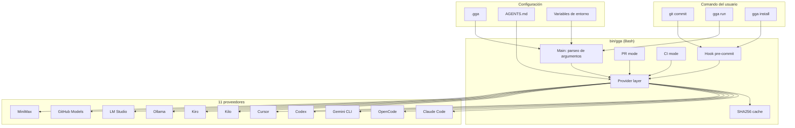
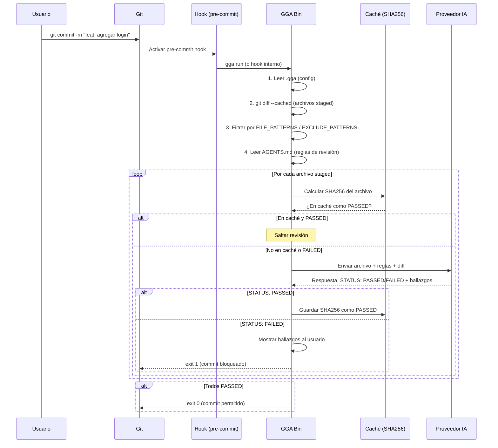

# GGA — Gentleman Guardian Angel

## Qué aprenderás

**GGA** (Gentleman Guardian Angel) es un hook de Git escrito en **Bash puro** (v2.10.1, 1372 líneas, 266+ tests) que revisa tu código antes de cada commit. No necesita Go, Node.js ni nada más que Bash y un proveedor de IA.

En este capítulo vas a entender cómo funciona, cómo instalarlo, cómo configurarlo con cualquiera de los 11 proveedores soportados, y cuándo usarlo en lugar de otros sistemas de revisión.

## Por qué importa

GGA opera en el momento más temprano posible: **antes del commit**. Detectar un problema ahí es increíblemente barato. Si esperás a que llegue a CI o a code review humano, el costo de corregirlo se multiplica.

GGA no reemplaza la revisión humana ni las pruebas automatizadas — es una **capa de protección inicial** que filtra problemas obvios antes de que lleguen a quienes deberían estar revisando cosas más importantes.

## Visión simple

Cuando ejecutás `git commit`, GGA:

1. Toma los archivos que estás por committear (staged)
2. Los envía a un modelo de IA junto con tus reglas de revisión
3. Si el modelo dice PASSED, el commit procede
4. Si dice FAILED, el commit se bloquea y ves los problemas

No revisa TODO tu código — solo los archivos que cambiaron en este commit.

## Cómo funciona realmente

### Bash puro — por qué Bash

GGA está escrito completamente en **Bash** (v2.10.1, 1372 líneas). No Go, no Node.js.

| Razón | Explicación |
|-------|-------------|
| **Cero dependencias** | Solo necesita Bash (v3.2+, disponible en Linux, macOS, Windows Git Bash) |
| **Hook nativo de Git** | Los hooks de Git son scripts de shell. GGA se integra naturalmente. |
| **Portabilidad** | Funciona sin compilar, sin instalar runtimes, sin npm install |
| **Liviano** | 1372 líneas y 266 tests. Arranca en milisegundos. |

### Arquitectura



### Flujo de revisión



### El archivo .gga

La configuración de GGA vive en un archivo llamado **`.gga`** (con punto, sin extensión) en la raíz del proyecto:

```bash
# Proveedor de IA
PROVIDER=opencode:opencode-go/kimi-k3

# Patrones de archivos a revisar
FILE_PATTERNS=*.go,*.ts,*.tsx,*.js

# Patrones a excluir
EXCLUDE_PATTERNS=*.test.go,*.generated.ts,*.min.js

# Archivo con reglas de revisión
RULES_FILE=AGENTS.md

# Modo estricto: si falla el proveedor, bloquea el commit
STRICT_MODE=true

# Timeout por archivo (segundos)
TIMEOUT=300

# Modelo específico (para proveedores que lo soportan)
MODEL=opencode-go/kimi-k3
```

#### Configuración global

Además del `.gga` local, podés tener una configuración global en:

```bash
# Linux/macOS
~/.config/gga/config

# Windows (Git Bash)
%USERPROFILE%\.config\gga\config
```

Las variables de entorno sobreescriben cualquier configuración:

```bash
# Temporal: sobreescribe el provider para este commit
GGA_PROVIDER=claude gga run

# Para siempre en la sesión actual
export GGA_TIMEOUT=600
```

### Los 11 proveedores

GGA soporta 11 proveedores de IA:

| Proveedor | Config value | Autenticación |
|-----------|-------------|---------------|
| **Claude Code** | `claude` | CLI instalado (`claude`) |
| **Gemini CLI** | `gemini` | CLI instalado (`gemini`) |
| **Codex** | `codex` | CLI instalado (`codex`) |
| **OpenCode** | `opencode[:model]` | CLI instalado (`opencode`) |
| **Cursor** | `cursor[:model]` | CLI instalado (`cursor`) |
| **Kilo** | `kilo[:model]` | CLI instalado (`kilo`) |
| **Kiro** | `kiro` | CLI instalado (`kiro`) |
| **Ollama** | `ollama:model` | Servidor local (sin API key) |
| **LM Studio** | `lmstudio[:model]` | Servidor local |
| **GitHub Models** | `github:model` | GitHub CLI autenticado (`gh`) |
| **MiniMax** | `minimax[:model]` | API key (`MINIMAX_API_KEY`) |

#### Proveedores locales vs cloud

| Tipo | Proveedores | Ventaja | Desventaja |
|------|------------|---------|------------|
| **Local** | Ollama, LM Studio | Sin costo por uso, privacidad total | Modelos más pequeños, más lentos |
| **CLI** | Claude, OpenCode, Gemini, Codex | Modelos frontier, rápidos | Requieren CLI instalado y autenticado |
| **API** | GitHub Models, MiniMax | Flexibilidad | Requieren API key |

La sintaxis `proveedor:modelo` permite elegir el modelo específico:

```bash
PROVIDER=opencode:opencode-go/kimi-k3     # OpenCode con Kimi K3
PROVIDER=ollama:codellama                  # Ollama con CodeLlama
PROVIDER=github:gpt-4o                     # GitHub Models con GPT-4o
PROVIDER=cursor:claude-sonnet-4            # Cursor con Claude Sonnet
```

### Caché SHA256

GGA tiene un sistema de caché para no revisar archivos que ya fueron aprobados y no cambiaron:

```text
~/.cache/gga/
  <sha256-del-git-root>/
    metadata           # Hash de (AGENTS.md + .gga)
    files/
      <sha256-del-archivo>    # Contenido: "PASSED" o metadata de revisión
```

#### Cómo funciona

1. GGA calcula el SHA256 de cada archivo staged
2. Busca ese hash en la caché
3. Si encuentra "PASSED", salta la revisión de ese archivo
4. Cuando un archivo cambia, su SHA256 cambia, y la caché se invalida automáticamente
5. Si cambiás AGENTS.md o .gga, el metadata hash cambia, y TODO el caché se invalida

**Importante**: si TODOS los archivos staged están en caché como PASSED, GGA salta la revisión por completo — ni siquiera contacta al proveedor de IA. Esto hace que los commits sean instantáneos cuando no hay cambios reales.

### Modos de ejecución

| Modo | Comando | ¿Cuándo se usa? |
|------|---------|-----------------|
| **Pre-commit (hook)** | `git commit` (automático) | En cada commit local |
| **Manual** | `gga run` | Para revisar antes de stagear |
| **CI** | `gga run --ci` | Revisa el último commit en CI |
| **PR** | `gga run --pr-mode` | Revisa toda la diff contra la base branch |

#### CI mode

```bash
# En GitHub Actions, GitLab CI, etc.
gga run --ci
```

En modo CI, GGA:
- Revisa solo el último commit (no todos los archivos)
- No usa caché
- Devuelve exit code 1 si algo falla

#### PR mode

```bash
# Revisar todos los cambios contra main
gga run --pr-mode --base main
```

En modo PR:
- Revisa toda la diff entre la branch actual y la base
- Útil como check obligatorio en PRs
- Más exhaustivo que pre-commit, menos que Native Review

### Códigos de salida

| Código | Significado | ¿Commit permitido? |
|--------|-------------|-------------------|
| 0 | ✅ PASSED — todos los archivos cumplen | Sí |
| 1 | ❌ FAILED — violaciones encontradas | No (exit 1) |
| 124 | ⏱️ Timeout (STRICT_MODE=false permite el commit) | Depende de STRICT_MODE |
| 130 | Interrupción (Ctrl+C) | No |
| 143 | Terminación (SIGTERM) | No |

### GGA vs gentle-ai review

| Aspecto | GGA | gentle-ai review |
|---------|-----|------------------|
| **Momento** | Pre-commit | Post-implementación |
| **Alcance** | Archivos staged de un commit | Todo el cambio (candidato completo) |
| **Costo** | Barato (modelo rápido) | Medio a caro (según lentes) |
| **Formato** | Bash independiente | Comando de gentle-ai |
| **Integración** | Hook de Git nativo | SDD Apply pipeline |
| **Receipt** | No genera | Sí, genera receipt verificable |
| **Lentes** | No (revisión general) | Sí (4R: Risk, Readability, Reliability, Resilience) |

**Cuándo usar uno, cuándo el otro**:

- **GGA**: para revisión rápida en cada commit. Detecta problemas obvios.
- **gentle-ai review**: después de implementar una feature completa. Análisis profundo con lentes.
- **Ambos**: GGA atrapa lo obvio temprano. gentle-ai review atrapa lo sutil después.

### GGA en Windows

GGA usa Git Bash. En Windows:

```bash
# Instalación
git clone https://github.com/Gentleman-Programming/gentleman-guardian-angel.git
cd gentleman-guardian-angel
# En Git Bash:
./install.sh

# Verificar
gga --version
```

**Limitaciones en Windows**:
- Git Bash es necesario (PowerShell no es compatible directamente)
- La caché usa `~/.cache/gga/` que en Git Bash es `C:\Users\tu-usuario\.cache\gga\`
- Algunos proveedores CLI pueden tener problemas de PATH

### Errores frecuentes

1. **GGA no se activa al hacer commit**: el hook no está instalado. Ejecutá `gga install` en la raíz del proyecto.
2. **"PROVIDER not set"**: falta la variable `PROVIDER` en `.gga` o en la configuración global.
3. **Timeout**: el modelo tarda mucho. Aumentá `TIMEOUT` en `.gga` o usá un modelo más rápido.
4. **Cache no funciona**: si cambiás AGENTS.md o .gga, el caché se invalida automáticamente. Pero si el problema persiste, borrá `~/.cache/gga/`.
5. **Falsos positivos**: el modelo rechaza código correcto. Revisá las reglas en AGENTS.md o cambiá de modelo.
6. **GGA en CI no encuentra el hook**: en CI, GGA se ejecuta como `gga run --ci`, no como hook. No necesita instalación.

### Preguntas

1. ¿Qué diferencia hay entre GGA en modo pre-commit, CI y PR?
2. ¿Cómo decide GGA si un archivo necesita revisión o puede usar la caché?
3. ¿Qué significa STRICT_MODE=true y qué pasa si está en false?
4. ¿Por qué GGA está escrito en Bash en lugar de Go o Node.js?
5. ¿Cuándo deberías usar GGA y cuándo gentle-ai review?

### Ejercicio

1. Instalá GGA en un proyecto con `gga install`
2. Configurá `.gga` con tu proveedor favorito
3. Hacé un commit y observá cómo GGA revisa los archivos
4. Modificá un archivo sin cambiar su contenido y verificá que la caché lo detecta
5. Probá `gga run --ci` para ver el modo CI

## Fuentes verificadas

- Repositorio: GGA, commit `fbf1091da170a33d42cb97577a9813e652e98a4a`
- Archivos: `bin/gga`, `lib/providers.sh`, `lib/cache.sh`, `lib/pr_mode.sh`, `install.sh`
- Versión verificada: GGA 2.10.1
- Fecha: 2026-07-20
- Estado: 🟢 Verificado
