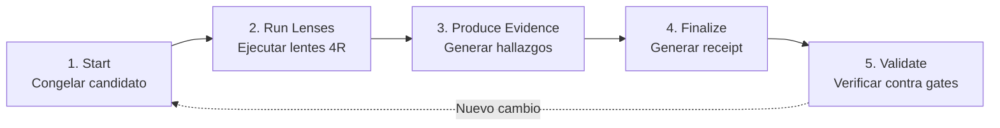
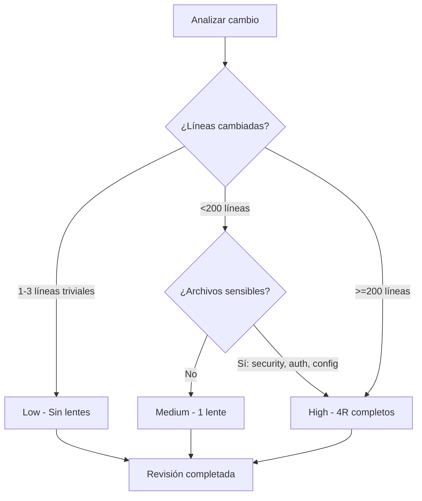
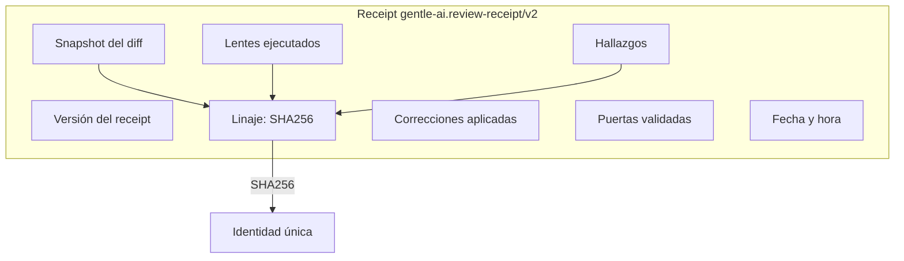

# Native Bounded Review

## Qué aprenderás

**Native Bounded Review** es el sistema de revisión post-implementación de Gentle-AI. No es un hook de Git como GGA — es un comando que ejecutás **después** de implementar un cambio completo. Usa lentes especializados (**4R**), tiene un **presupuesto de líneas** para evitar revisiones infinitas, y genera un **receipt** verificable que prueba que la revisión ocurrió.

## Por qué importa

GGA revisa cada commit individual, pero un commit no es un cambio completo. Una feature puede tener 10 commits. La revisión post-implementación revisa **todo el cambio como una unidad**, con lentes que ven aspectos que GGA no ve: riesgo de seguridad, resiliencia ante fallos, mantenibilidad a largo plazo, y confiabilidad de los tests.

Además, Native Bounded Review es **determinística**: genera un receipt que podés validar en cualquier momento. Sin receipt, no hay trazabilidad. Sin trazabilidad, no podés probar que se hizo la revisión.

## Visión simple

Native Bounded Review funciona así:

1. **Congelás** el cambio (snapshot inmutable)
2. Ejectuás **lentes** de revisión según el nivel de riesgo
3. Los lentes producen **evidencia** (hallazgos, sugerencias)
4. **Finalizás** la revisión, que genera un **receipt**
5. **Validás** el receipt contra los gates (pre-commit, pre-push, pre-pr, release)

No es mágico. No es una revisión humana. Es una revisión **determinística y acotada** que garantiza que ciertos aspectos se evaluaron antes de que el código avance.

## Analogía

Imaginá una **inspección técnica vehicular**:

- GGA sería el control visual rápido antes de arrancar el auto cada día (luces, espejos, cinturón)
- **Native Bounded Review** sería la revisión completa antes de renovar el registro: frenos, emisiones, suspensión, dirección

La revisión vehicular tiene **lentes** específicos: un mecánico revisa frenos, otro revisa emisiones, otro revisa luces. Cada uno sabe lo que busca. Al final, recibís un **comprobante** (receipt) que dice que pasaste la inspección. Ese comprobante lo necesitás para renovar el registro (el gate).

## Cómo funciona realmente

### El camino de 5 acciones

Native Bounded Review sigue exactamente 5 acciones en orden:



#### 1. Start — congelar el candidato

```bash
gentle-ai review start
```

Este comando crea un **snapshot** inmutable del cambio actual (el diff completo contra la base). No importa si después modificás archivos — la revisión opera sobre el snapshot, no sobre el código vivo. Esto garantiza que la revisión es reproducible.

#### 2. Run Lenses — ejecutar según riesgo

```bash
# Ejecutar un lente específico
gentle-ai review run --lens risk

# Ejecutar múltiples lentes
gentle-ai review run --lens readability,reliability
```

Los lentes se ejecutan según el **tier de riesgo** del cambio. El risk tier lo determina Gentle-AI automáticamente basado en:

- **Líneas cambiadas**: más líneas = más riesgo
- **Archivos tocados**: archivos de seguridad, config, o datos sensibles aumentan el riesgo
- **Tipo de cambio**: refactor > bugfix > docs

#### 3. Produce Evidence — hallazgos estructurados

Cada lente produce **evidencia** en formato estructurado:

```text
Lente: review-risk
Hallazgos:
  - ALTO: Se exponen datos de usuario en el log (auth.ts:45)
  - MEDIO: No hay rate limiting en el endpoint POST /api/login
  - BAJO: Variable de entorno sin validación (config.ts:12)
```

La evidencia incluye: severidad, ubicación exacta (archivo:línea), descripción del problema, y sugerencia de corrección.

#### 4. Finalize — generar receipt

```bash
gentle-ai review finalize
```

Esto genera el **receipt** — un comprobante verificable de que la revisión ocurrió:

```text
Receipt: gentle-ai.review-receipt/v2
Linaje: a1b2c3d4e5f6...
Snapshot: <hash del diff>
Lentes ejecutados: risk, readability, reliability
Resultado: PASSED con 2 hallazgos MEDIOS
Gate: pre-pr
Fecha: 2026-07-20
```

#### 5. Validate — verificar contra gates

```bash
# Validar que el receipt pasa el gate pre-pr
gentle-ai review validate --gate pre-pr

# Validar que el receipt pasa el gate pre-push
gentle-ai review validate --gate pre-push
```

### Los 4 lentes 4R

Cada **lente** es un subagente especializado que revisa un aspecto específico del código:

| Lente | Subagente | ¿Qué revisa? | Nivel de riesgo |
|-------|-----------|-------------|-----------------|
| **Risk** | `review-risk` | Seguridad, permisos, exposición de datos, dependencias vulnerables, secretos en código | Alto |
| **Readability** | `review-readability` | Nombres de variables, estructura del código, comentarios, mantenibilidad, claridad | Bajo |
| **Reliability** | `review-reliability` | Tests, cobertura, determinismo, manejo de errores, casos borde, regresiones | Alto |
| **Resilience** | `review-resilience` | Fallas parciales, timeouts, reintentos, degradación graceful, dependencias externas | Alto |

Cada lente tiene su propio **subagente** con su propio skill, su propio modelo (configurable) y sus propias reglas de revisión.

### Risk Tiers

Gentle-AI asigna un **tier de riesgo** a cada cambio automáticamente:

| Tier | ¿Cuándo? | Lentes ejecutados | Costo |
|------|----------|-------------------|-------|
| **Low** | Documentación, comentarios, formatting, cambios de 1-3 líneas triviales | Ninguno | $0 |
| **Medium** | Features pequeñas, bugfixes no críticos, <200 líneas | 1 lente dominante (readability) | $ |
| **High** | Features >200 líneas, cambios en seguridad, datos sensibles, refactors grandes | 4R completos (risk, readability, reliability, resilience) | $$$ |
| **Full 4R** | Releases, cambios en infraestructura, auth, datos de usuarios | 4R completos + corrección obligatoria | $$$$ |



### Presupuesto de revisión

Cada revisión tiene un **presupuesto** de líneas que puede revisar. Esto evita revisiones infinitas en cambios gigantescos.

**Fórmula**: `min(200, ceil(changed_lines / 2))`

| Líneas cambiadas | Presupuesto |
|-----------------|-------------|
| 10 | 5 |
| 50 | 25 |
| 200 | 100 |
| 400 | 200 |
| 1000 | 200 (tope) |

Si el cambio excede el presupuesto, la revisión se detiene y pide aprobación para continuar o para aumentar el presupuesto.

**Corrección**: después de la revisión, podés aplicar una corrección sin abrir una nueva revisión. La corrección también está limitada al presupuesto de líneas. Esto permite arreglar hallazgos sin reiniciar el proceso.

### Receipt y Linaje

El **receipt** (gentle-ai.review-receipt/v2) es la salida principal de Native Bounded Review. Es un comprobante verificable que incluye:



El **linaje** es un hash SHA256 que identifica unívocamente esta revisión:
```
Linaje = SHA256(snapshot + lentes + hallazgos + correcciones)
```

Cualquier cambio en el snapshot, en los lentes o en los hallazgos produce un linaje diferente. Esto garantiza que el receipt no puede ser falsificado.

### Gate contexts

Un **gate** es un punto en el flujo donde se valida que la revisión ocurrió:

| Gate | ¿Cuándo se valida? | ¿Qué pasa si falla? |
|------|-------------------|-------------------|
| `pre-commit` | Antes de cada commit | El commit se bloquea (similar a GGA) |
| `pre-push` | Antes de hacer push | El push se bloquea |
| `pre-pr` | Antes de abrir un PR | El PR no se puede abrir sin receipt válido |
| `release` | Antes de hacer un release | El release se bloquea |

No todos los proyectos necesitan todos los gates. La configuración típica:

- **Proyecto pequeño** (< 3 desarrolladores): `pre-pr` solamente
- **Proyecto mediano** (3-10 desarrolladores): `pre-push` y `pre-pr`
- **Proyecto grande** (10+ desarrolladores): todos los gates

### Causal admission y Correction transactions

**Causal admission** es el mecanismo que permite que una corrección se aplique dentro de la misma revisión sin generar un nuevo receipt:

1. Native Review encuentra hallazgos
2. Aplicás una corrección (dentro del presupuesto de líneas)
3. El receipt actualizado refleja la corrección
4. No se genera un receipt nuevo — el mismo receipt se actualiza

Esto es útil para correcciones quirúrgicas (cambiar un nombre de variable, agregar un test faltante, corregir un error de seguridad simple).

**Correction transaction**: cada corrección queda registrada en el receipt como una transacción:

```text
Correction 1:
  Hallazgo: ALTO - Secreto en código (config.ts:12)
  Corrección: Reemplazar API_KEY hardcodeada por variable de entorno
  Estado: APLICADA
```

Si la corrección excede el presupuesto, se rechaza y se pide iniciar una nueva revisión.

### Threat model y Trust model

#### Threat model (¿contra qué protegemos?)

| Amenaza | Mitigación |
|---------|-----------|
| Código con vulnerabilidades de seguridad | Lente Risk |
| Código ilegible o imposible de mantener | Lente Readability |
| Código que falla en producción | Lente Reliability |
| Código que no tolera fallos externos | Lente Resilience |
| Revisión que no ocurrió realmente | Receipt con linaje criptográfico |
| Revisión sobre código incorrecto | Snapshot inmutable |

#### Trust model (¿en quién confiamos?)

| Componente | Confianza | Razón |
|-----------|-----------|-------|
| **Snapshot** | Total | Es el diff real del repositorio |
| **Lentes** | Parcial | Cada lente es un subagente con su propio skill |
| **Receipt** | Total | Linaje SHA256 verifiable |
| **Gates** | Total | Validan contra el receipt |
| **Modelo de IA** | Parcial | Puede tener falsos positivos o negativos |

### Go ownership y Models judge

La implementación de Native Bounded Review vive en **Go**. El archivo principal `internal/review/native_bounded_review.go` define la estructura `NativeBoundedReview` que orquesta todo el flujo.

El **Models judge** es el componente que decide:
- Qué tier de riesgo asignar
- Qué lentes ejecutar
- Si un hallazgo es válido o falso positivo
- Si una corrección es suficiente o necesita una nueva revisión

No es un modelo separado — es el mismo gentle-ai usando sus skills de revisión para juzgar la calidad de la revisión misma.

### Errores frecuentes

1. **Confundir GGA con Native Bounded Review**: GGA es pre-commit, nativo de Git, Bash. Native Review es post-implementación, comando de gentle-ai, en Go. No son intercambiables.
2. **No generar receipt**: si la revisión termina sin receipt, no hay trazabilidad. No importa si los lentes pasaron — sin receipt, no pasó.
3. **Saltar lentes por costo**: los lentes de alto riesgo (risk, reliability) son los que más valor aportan. Saltarlos por ahorrar créditos invalida el propósito de la revisión.
4. **Presupuesto muy bajo**: el presupuesto mínimo es 200 líneas. Si el cambio es grande, aceptá aumentar el presupuesto o dividí el cambio en partes más chicas.
5. **Ignorar el linaje**: si el linaje cambia (porque el snapshot cambió), el receipt anterior deja de ser válido. Es normal — significa que el código cambió y necesita una nueva revisión.

### Preguntas

1. ¿Cuál es la diferencia fundamental entre GGA y Native Bounded Review?
2. ¿Cuántos lentes se ejecutan en un cambio de riesgo High?
3. ¿Cómo se calcula el presupuesto de revisión?
4. ¿Qué es el linaje de un receipt y cómo se genera?
5. ¿Qué gate deberías usar si querés que ningún PR se abra sin revisión previa?

### Ejercicio

1. Ejecutá `gentle-ai review start` en un proyecto que tenga cambios sin committear
2. Ejecutá `gentle-ai review run --lens readability` para revisar legibilidad
3. Finalizá con `gentle-ai review finalize` y observá el receipt
4. Validá el receipt contra el gate `pre-pr`: `gentle-ai review validate --gate pre-pr`
5. Modificá un archivo y verificá que el snapshot anterior ya no es válido

## Fuentes verificadas

- Repositorio: gentle-ai, commit `b0a88faf1296ec4f524b8c9bbb90d39af9c42d0d`
- Archivos: `internal/review/native_bounded_review.go`, `internal/assets/skills/_shared/review-ledger-contract.md`
- Archivos: `internal/assets/skills/_shared/`
- Versión verificada: gentle-ai 2.1.10
- Fecha: 2026-07-20
- Estado: 🟢 Verificado
