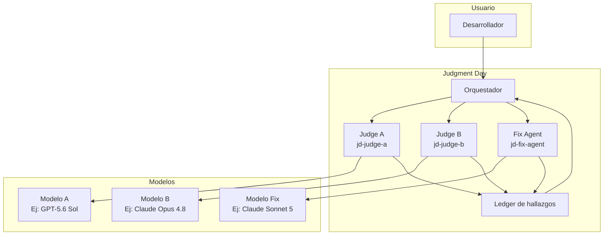
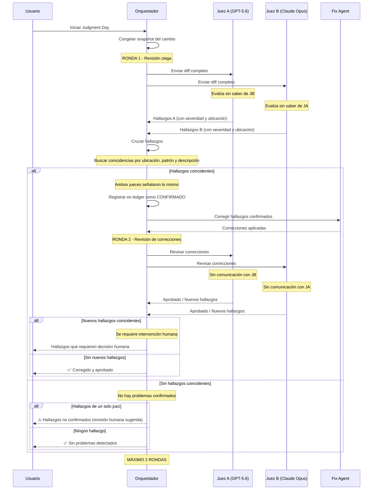
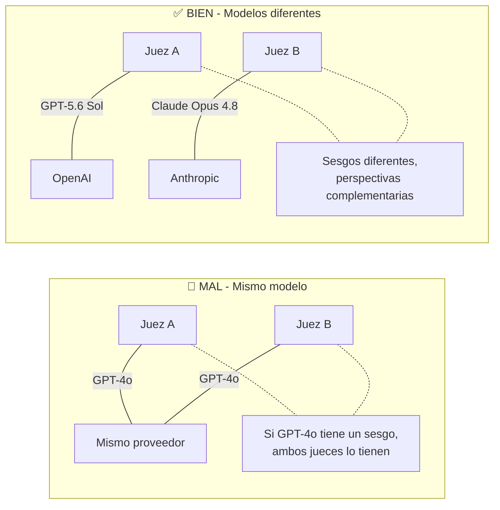

# Judgment Day

## Qué aprenderás

**Judgment Day** es el sistema de revisión más exigente del ecosistema Gentle. No es un hook pre-commit (GGA) ni una revisión con lentes (Native Bounded Review). Es una **revisión adversarial ciega** donde dos jueces independientes evalúan el mismo cambio sin saber lo que el otro está viendo.

Su propósito es detectar **errores correlacionados** — esos problemas que un modelo de IA no ve porque tiene un sesgo o una debilidad específica.

## Por qué importa

Los modelos de IA no son perfectos. Cada modelo tiene fortalezas y debilidades. Claude puede ser excelente detectando problemas de seguridad pero tener puntos ciegos en ciertos patrones de código. GPT puede ser genial con lógica de negocio pero fallar en convenciones de estilo.

Si revisás el código con un solo modelo, los errores que ese modelo no ve **nunca se detectan**. Judgment Day resuelve esto usando **dos modelos diferentes** que se complementan. Si los dos coinciden en un hallazgo, es casi seguro que es real. Si solo uno lo ve, merece atención pero no es concluyente.

## Visión simple

Judgment Day funciona como tener **dos code reviewers senior** en habitaciones separadas. Cada uno recibe el mismo diff y escribe sus hallazgos sin saber lo que el otro está escribiendo. Después, un moderador cruza los hallazgos:

- Si **ambos detectaron el mismo problema**: es grave, hay que corregirlo
- Si **solo uno lo detectó**: puede ser un falso positivo o algo que el otro no vio
- Si **ninguno detectó nada**: probablemente el código está bien

Después de corregir los hallazgos comunes, se hace una **segunda ronda** para verificar las correcciones. Como máximo dos rondas.

## Analogía

Imaginá un **juicio con dos fiscales independientes**. Ambos reciben el mismo expediente (el diff de código) y preparan su acusación (los hallazgos) sin comunicarse. Después, el juez (el orquestador) compara ambas acusaciones:

- Si los dos fiscales señalaron la misma prueba, es evidencia sólida
- Si solo uno la señaló, puede ser relevante o no
- Si ninguno señaló nada, el acusado es inocente (por ahora)

Los fiscales no usan la misma lupa (el mismo modelo) porque si la lupa tiene un rayón, ambos van a perderse lo mismo.

## Cómo funciona realmente

### Arquitectura



### Componentes

| Componente | Subagente | Propósito |
|-----------|-----------|-----------|
| **Juez A** | `jd-judge-a` | Primer revisor independiente |
| **Juez B** | `jd-judge-b` | Segundo revisor independiente |
| **Fix Agent** | `jd-fix-agent` | Aplica correcciones quirúrgicas a los hallazgos |
| **Orquestador** | Judgment Day skill | Cruza hallazgos, decide rondas, genera ledger |

Cada juez tiene su propio **skill** de revisión. Los skills son idénticos en contenido pero se cargan en agentes (y modelos) diferentes. Esto garantiza que ambos jueces aplican los mismos criterios pero con perspectivas de IA distintas.

### Flujo completo



### El cruce de hallazgos

El paso más importante de Judgment Day es el **cruce** de hallazgos entre ambos jueces. El orquestador compara:

1. **Ubicación**: mismo archivo y línea (o cercana)
2. **Patrón**: tipo de problema similar (seguridad, naming, performance, etc.)
3. **Descripción**: semántica similar (no textual, porque cada juez escribe diferente)

```text
Hallazgo Juez A: "Variable 'x' no es descriptiva" (auth.ts:45)
Hallazgo Juez B: "Usar nombre significativo en lugar de 'x'" (auth.ts:45)
→ COINCIDENCIA: ambos detectaron el mal nombre de variable

Hallazgo Juez A: "Falta validación de email" (register.ts:23)
Hallazgo Juez B: (no menciona)
→ NO COINCIDENCIA: solo lo vio el Juez A
```

### Independencia de modelos

La **regla más importante** de Judgment Day: los dos jueces NO deben usar el mismo modelo, proveedor ni prompt.



#### Combinaciones recomendadas

| Juez A | Juez B | Fix Agent | Riesgo de correlación |
|--------|--------|-----------|----------------------|
| GPT-5.6 Sol | Claude Opus 4.8 | Claude Sonnet 5 | Muy bajo |
| GPT-5.6 Terra | Claude Sonnet 5 | GPT-5.6 Sol | Bajo |
| Claude Opus 4.8 | Gemini 2.5 Pro | GPT-5.6 Terra | Muy bajo |
| OpenCode Kimi K3 | Codex GPT-4o | Claude Haiku | Bajo |

**Lo que NO funciona**:

- Mismo modelo con diferente temperatura: el sesgo es el mismo
- Mismo proveedor con diferente modelo: si los modelos comparten training data, los sesgos pueden solaparse
- Mismo prompt: si el prompt tiene un error de framing, ambos jueces lo heredan

### Ledger de hallazgos

El **ledger** es el registro inmutable de todo lo que ocurrió durante el Judgment Day:

```text
Judgment Day Ledger
═══════════════════
Snapshot: a1b2c3d4...
Juez A: openai/gpt-5.6-sol (temperatura 0.1)
Juez B: openrouter/anthropic/claude-opus-4.8 (temperatura 0.1)
Fix Agent: anthropic/claude-sonnet-5

Ronda 1
──────
Hallazgo A-01: [ALTO] SQL injection potencial en users.ts:67
Hallazgo B-03: [ALTO] Query sin parametrizar en users.ts:67
→ CONFIRMADO (coincidencia)

Hallazgo A-02: [MEDIO] Variable no usada en utils.ts:12
Hallazgo B-07: [BAJO] Código muerto en utils.ts:12
→ CONFIRMADO (coincidencia parcial)

Hallazgo A-03: [BAJO] Falta comentario en types.ts
→ NO CONFIRMADO (solo Juez A)

Correcciones
────────────
Fix-01: Parametrizar query en users.ts:67 (APLICADO)
Fix-02: Eliminar variable no usada en utils.ts:12 (APLICADO)

Ronda 2
──────
Juez A: ✅ Correcciones aprobadas
Juez B: ✅ Correcciones aprobadas

Resultado: ✅ PASSED con 2 correcciones aplicadas
```

### Máximo 2 rounds

Judgment Day tiene un límite estricto: **máximo 2 rondas** de revisión.

| Ronda | ¿Qué ocurre? |
|-------|-------------|
| **Ronda 1** | Jueces A y B revisan el diff original |
| **Corrección** | Fix Agent aplica correcciones a hallazgos confirmados |
| **Ronda 2** | Jueces A y B revisan las correcciones (sin ver el diff original otra vez) |
| **Fin** | Sea que los jueces aprueben o no, Judgment Day termina |

Si después de la Ronda 2 quedan hallazgos sin resolver, se requiere **intervención humana**. Judgment Day no fuerza una tercera ronda automática.

### Cuándo usar Judgment Day

| Situación | Sistema | Por qué |
|-----------|---------|---------|
| Commit diario, cambio pequeño | GGA | Rápido, barato, buena cobertura básica |
| Feature completa post-implementación | Native Bounded Review | Lentes 4R, receipt, gates |
| Cambio de seguridad o datos sensibles | Judgment Day | Dos perspectivas independientes |
| Refactor grande (>500 líneas) | Native Review + JD | Primero 4R, después JD si hay dudas |
| Release a producción | Judgment Day | Última capa antes de release |
| Bugfix urgente de 1 línea | GGA o ninguno | No justifica el costo |

#### Riesgos de usar Judgment Day incorrectamente

| Mal uso | Riesgo |
|---------|--------|
| Usarlo para todo | Costo excesivo sin beneficio proporcional |
| Mismo modelo para ambos jueces | Errores correlacionados no se detectan |
| Saltar la Ronda 2 | Correcciones no verificadas |
| Ignorar el ledger | Sin trazabilidad de lo que se encontró |
| Usarlo sin haber pasado por Native Review | Perder los beneficios de los lentes 4R |

### Judgment Day vs Native Bounded Review vs GGA

| Aspecto | GGA | Native Review | Judgment Day |
|---------|-----|--------------|--------------|
| **Momento** | Pre-commit | Post-implementación | Post-Native Review |
| **Modelos** | 1 (configurable) | 1 por lente | 2 diferentes (exigido) |
| **Cobertura** | Archivos staged | Todo el cambio | Todo el cambio × 2 |
| **Costo** | $ | $$ | $$$$ |
| **Errores correlacionados** | No los detecta | No los detecta | Los detecta (por diseño) |
| **Receipt** | No | Sí (v2) | Sí (ledger) |
| **Máximo rounds** | No aplica | 1 (con corrección) | 2 rounds exactos |
| **Cuándo usarlo** | Siempre | Features completas | Seguridad, datos sensibles, releases |

### Errores frecuentes

1. **Mismo modelo para ambos jueces**: el error más común. Si ambos usan GPT-5.6, los sesgos son los mismos. No hay beneficio real.
2. **Ignorar hallazgos de un solo juez**: si solo un juez detectó algo, puede ser falso positivo... o puede ser que el otro juez tenga un punto ciego ahí. Revisalo antes de descartarlo.
3. **No revisar el ledger**: el ledger es el registro de todo. Si no lo leés, no sabés qué se encontró ni qué se corrigió.
4. **Usar Judgment Day sin Native Review primero**: Native Review es más barato y cubre los 4R. Judgment Day es el último filtro, no el primero.
5. **Exceder las 2 rondas**: el límite de 2 rondas es deliberado. Si después de 2 rondas hay problemas sin resolver, necesitás intervención humana, no una tercera ronda automática.
6. **Fix Agent con modelo diferente a ambos jueces**: el Fix Agent debería ser un tercer modelo, no el mismo que uno de los jueces.

### Preguntas

1. ¿Cuál es la diferencia fundamental entre Judgment Day y Native Bounded Review?
2. ¿Por qué los dos jueces DEBEN usar modelos diferentes?
3. ¿Qué es un "error correlacionado" y por qué Judgment Day lo detecta mejor?
4. ¿Cuántas rondas de revisión permite Judgment Day como máximo?
5. ¿Qué pasa si después de la Ronda 2 quedan hallazgos sin resolver?

### Ejercicio

1. Configurá Judgment Day con dos modelos diferentes (ej: GPT y Claude)
2. Ejecutá una revisión sobre un cambio existente: `gentle-ai review judgment-day`
3. Observá el ledger y notá qué hallazgos coincidieron entre ambos jueces
4. Identificá si hubo hallazgos que solo un juez detectó
5. Verificá qué correcciones aplicó el Fix Agent

## Fuentes verificadas

- Repositorio: gentle-ai, commit `b0a88faf1296ec4f524b8c9bbb90d39af9c42d0d`
- Archivos: `internal/assets/skills/judgment-day/`, `internal/review/judgment_day.go`
- Archivos: `internal/assets/skills/_shared/review-ledger-contract.md`
- Versión verificada: gentle-ai 2.1.10
- Fecha: 2026-07-20
- Estado: 🟢 Verificado
