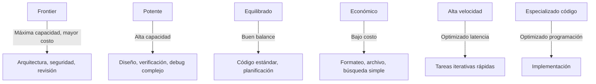
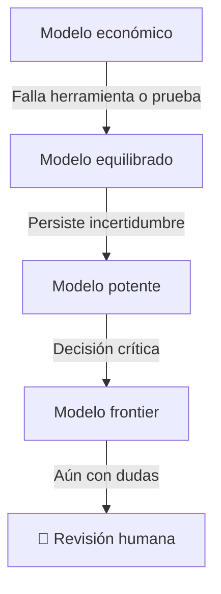

# Modelos y enrutamiento

## Qué aprenderás

No existe un modelo universalmente mejor para todo. El modelo que usás para explorar ideas no debería ser el mismo que usás para diseñar arquitectura, y ninguno de los dos debería ser el mismo que usás para tareas mecánicas.

Este capítulo te enseña a **elegir modelos según el contexto**, considerando:

- Tipo de tarea (explorar, diseñar, codificar, revisar, archivar)
- Complejidad y riesgo
- Capacidad de razonamiento y tool calling
- Costo y latencia
- Disponibilidad y estabilidad del proveedor

## Por qué importa

Usar un modelo frontier para tareas mecánicas es como usar un bisturí para abrir una caja de pizza: funciona, pero es caro y desafilado para el propósito real.

Usar un modelo económico para diseñar arquitectura es como pedirle a un estudiante de primer año que diseñe un puente: puede intentarlo, pero no deberías cruzarlo.

El enrutamiento inteligente de modelos ahorra dinero, mejora resultados y reduce latencia.

## Categorías de modelo



## Taxonomía de razonamiento

Diferentes proveedores llaman a los niveles de razonamiento de distintas formas. Esta tabla normaliza los nombres:

| Nivel canónico | Uso | OpenAI | Google | Anthropic | OpenCode Go |
|---------------|-----|--------|--------|-----------|-------------|
| `minimal` | Formato, clasificación, búsqueda simple | `low` o default | `minimal` | esfuerzo mínimo | default |
| `low` | Tareas claras, resúmenes, cambios mecánicos | `low` | `low` | bajo | default o variante |
| `medium` | Código estándar, planificación, documentación | `medium` | `medium` | medio | opción específica |
| `high` | Arquitectura, debugging difícil, verificación | `high` | `high` | alto | modelo o variante superior |
| `xhigh` | Riesgo alto, seguridad, decisiones críticas | `high` o `xhigh` | `high` (sin xhigh directo) | extra/max | escalar a modelo superior |

> **Importante**: No todos los modelos permiten controlar el razonamiento. Si un modelo no expone `reasoningEffort`, el proveedor decide el nivel. En ese caso, controlás la complejidad mediante selección de modelo.

## Modelos verificados

Verificado en `opencode models` el 2026-07-20 con OpenCode 1.17.20:

### OpenAI

| Modelo | ID | Clase | Razonamiento | Uso recomendado |
|--------|-----|-------|-------------|-----------------|
| Sol | `openai/gpt-5.6-sol` | Frontier | high/xhigh | Arquitectura, diseño crítico, revisión |
| Terra | `openai/gpt-5.6-terra` | Equilibrado | medium | Implementación, especificación |
| Luna | `openai/gpt-5.6-luna` | Económico | low | Init, archive, tareas mecánicas |

### Anthropic (vía OpenRouter)

| Modelo | ID | Clase | Razonamiento | Uso recomendado |
|--------|-----|-------|-------------|-----------------|
| Opus 4.8 | `openrouter/anthropic/claude-opus-4.8` | Frontier | xhigh | Revisión crítica, seguridad |
| Sonnet 5 | `openrouter/anthropic/claude-sonnet-5` | Potente | high | Diseño, implementación |
| Haiku 4.5 | `openrouter/anthropic/claude-haiku-4.5` | Económico | low | Tareas rápidas |

### Google (vía OpenRouter)

| Modelo | ID | Clase | Razonamiento | Uso recomendado |
|--------|-----|-------|-------------|-----------------|
| Gemini 3.5 Flash | `openrouter/google/gemini-3.5-flash` | Equilibrado | medium | Balance general |
| Gemini 3.1 Pro | `openrouter/google/gemini-3.1-pro-preview` | Potente | high | Diseño (preview) |

### OpenCode Go

| Modelo | ID | Clase | Razonamiento | Uso recomendado |
|--------|-----|-------|-------------|-----------------|
| Kimi K3 | `opencode-go/kimi-k3` | Potente | high | Código complejo, diseño |
| DeepSeek V4 Pro | `opencode-go/deepseek-v4-pro` | Equilibrado | medium | Implementación general |
| DeepSeek V4 Flash | `opencode-go/deepseek-v4-flash` | Económico | low | Tareas rápidas |
| GLM 5.2 | `opencode-go/glm-5.2` | Potente | high | Verificación, análisis |
| Qwen 3.7 Max | `opencode-go/qwen3.7-max` | Potente | high | Tareas complejas |

## Enrutamiento por subagente Gentle-AI

| Subagente | Riesgo | Razonamiento | Modelo recomendado | Alternativa económica |
|-----------|--------|-------------|-------------------|---------------------|
| `gentle-orchestrator` | Alto | Alto | Sol / Sonnet 5 | Terra / deepseek-v4-pro |
| `sdd-init` | Bajo | Bajo | Luna / Haiku 4.5 | deepseek-v4-flash |
| `sdd-explore` | Medio | Medio | Terra / Gemini 3.5 Flash | deepseek-v4-pro |
| `sdd-propose` | Alto | Alto | Sol / Sonnet 5 | Terra |
| `sdd-spec` | Medio | Medio-Alto | Terra / Sonnet 5 | deepseek-v4-pro |
| `sdd-design` | Alto | Alto | Sol / Opus 4.8 | Sonnet 5 |
| `sdd-tasks` | Medio | Medio | Terra / Sonnet 5 | deepseek-v4-pro |
| `sdd-apply` | Medio | Medio-Alto | Terra / Sonnet 5 | deepseek-v4-pro o kimi-k2.7-code |
| `sdd-verify` | Alto | Alto | Sol / Opus 4.8 | Sonnet 5 |
| `sdd-archive` | Bajo | Bajo | Luna / Haiku 4.5 | deepseek-v4-flash |
| `jd-judge-a` | Alto | Alto | Sol / Opus 4.8 | (usar modelo diferente a juez B) |
| `jd-judge-b` | Alto | Alto | Opus 4.8 / Sol | (usar modelo diferente a juez A) |
| `jd-fix-agent` | Alto | Alto | Terra / Sonnet 5 | deepseek-v4-pro |

## Perfiles de enrutamiento

### Perfil Económico

```yaml
# Objetivo: reducir consumo al mínimo
# Escalar solo cuando exista dificultad

sdd-init:     luna / haiku-4.5 / deepseek-v4-flash
sdd-explore:  terra / gemini-3.5-flash / deepseek-v4-pro
sdd-propose:  terra / sonnet-5 / deepseek-v4-pro
sdd-spec:     terra / sonnet-5 / deepseek-v4-pro
sdd-design:   sol / opus-4.8 / kimi-k3        # Escalar aquí
sdd-tasks:    terra / sonnet-5 / deepseek-v4-pro
sdd-apply:    terra / sonnet-5 / deepseek-v4-pro
sdd-verify:   terra / sonnet-5 / deepseek-v4-pro
sdd-archive:  luna / haiku-4.5 / deepseek-v4-flash
```

### Perfil Equilibrado

```yaml
# Calidad consistente con costos controlados
# Un modelo fuerte solo en fases de alta decisión

sdd-design:   sol / opus-4.8 / kimi-k3          # Modelo frontier aquí
sdd-verify:   sol / opus-4.8 / glm-5.2          # Y aquí
resto:        terra / sonnet-5 / deepseek-v4-pro # Modelos equilibrados
```

### Perfil Potente

```yaml
# Máxima calidad
# Modelos frontier en todas las fases de decisión
# Tareas mecánicas en modelos económicos

sdd-archive:  luna / haiku-4.5 / deepseek-v4-flash # Barato
sdd-init:     luna / haiku-4.5 / deepseek-v4-flash # Barato
resto:        sol / opus-4.8 / kimi-k3             # Frontier
```

## Fallbacks y escalamiento

Cada agente debe tener una cadena de fallback:



### Condiciones de escalamiento

| Señal | Acción |
|-------|--------|
| Tool calling falla repetidamente | Escalar al siguiente nivel |
| No comprende el repositorio | Escalar a modelo más capaz |
| Genera cambios fuera de alcance | Escalar y verificar |
| Tests siguen fallando | Escalar al modelo superior |
| Contradicciones en el output | Escalar |
| Incertidumbre alta | Escalar |
| Seguridad / datos sensibles | Escalar a frontier directo |
| Migraciones / release | Escalar a frontier directo |
| Error destructivo | Escalar y detener |
| Dos intentos fallidos consecutivos | Escalar automáticamente |

NO escales solo porque la respuesta sea lenta. La latencia no es un indicador de calidad.

## Evaluación de modelos

No uses benchmarks públicos como única evidencia. Creá evaluaciones locales para tus casos de uso:

```text
Para cada agente, medir:
- Correctitud: ¿la respuesta es correcta?
- Tests aprobados: ¿el código generado pasa las pruebas?
- Tool calls válidas: ¿las llamadas a herramientas son correctas?
- Instrucciones seguidas: ¿respeta el prompt?
- Latencia: ¿cuánto tarda en responder?
- Tokens consumidos: ¿es eficiente?
- Costo: ¿el resultado justifica el gasto?
- Calidad del diff: ¿los cambios son limpios?
- Errores inventados: ¿alucina?
- Completitud: ¿termina la tarea o se detiene a medio camino?
```

## Configuración en OpenCode

```json
{
  "agents": {
    "gentle-orchestrator": {
      "model": "openai/gpt-5.6-sol",
      "reasoningEffort": "high"
    },
    "sdd-apply": {
      "model": "openai/gpt-5.6-terra",
      "reasoningEffort": "medium"
    },
    "sdd-archive": {
      "model": "openai/gpt-5.6-luna",
      "reasoningEffort": "low"
    }
  }
}
```

## Errores frecuentes

1. **Mismo modelo para todos los agentes**: estás pagando de más o rindiendo de menos.
2. **Modelo sin tool calling para agente que requiere herramientas**: el agente no va a poder ejecutar herramientas.
3. **Fallback al mismo proveedor**: si OpenAI cae, tu fallback a OpenAI no sirve. Usá proveedores diferentes.
4. **No verificar disponibilidad**: los modelos cambian, se deprecan, aparecen nuevos. Revalidá el catálogo periódicamente.

## Preguntas

1. ¿Cuál es la diferencia entre frontier, potente, equilibrado y económico?
2. ¿Qué nivel de razonamiento usarías para `sdd-design`? ¿Por qué?
3. ¿Por qué es importante que los jueces de Judgment Day usen modelos diferentes?
4. ¿Cuándo NO deberías escapar al siguiente nivel de modelo?
5. ¿Cómo evaluarías si un modelo funciona bien para un agente específico?

## Fuentes verificadas

- Fuente: `opencode models` ejecutado el 2026-07-20, OpenCode 1.17.20
- Repositorio: gentle-ai, commit `b0a88faf1296ec4f524b8c9bbb90d39af9c42d0d`
- Archivos: `internal/opencode/` para parsing de modelos
- Archivos: `data/models/catalog.yml`, `data/models/routing.yml`
- Modelos: OpenAI, Anthropic, Google vía OpenRouter, OpenCode Go
- Fecha: 2026-07-20
- Estado: 🟢 Verificado
