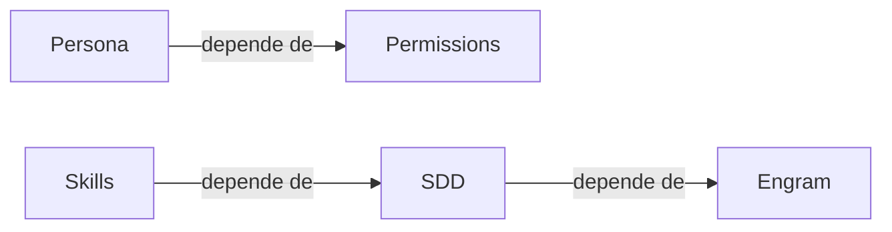

# Arquitectura técnica

## Qué aprenderás

Gentle-AI no es una aplicación monolítica. Es un **ecosistema de paquetes** escritos principalmente en **Go**, con algunos componentes en **Bash** (GGA) y un sistema de **skills** declarativos que el orquestador carga como instrucciones para los subagentes.

En este capítulo vas a entender:
- La estructura de paquetes Go: `cmd/`, `internal/cli/`, `internal/planner/`, `internal/pipeline/`, `internal/components/`, `internal/agents/`
- Cómo funciona la **TUI** con **Bubbletea** (model, update, view)
- El **pipeline** planner → executor → verifier y cómo fluyen los datos
- La arquitectura de **Engram** (Go + SQLite/FTS5 + MCP stdio)
- Cómo se comunica **GGA** (pure Bash, hooks de Git)
- El protocolo **MCP** como columna vertebral de la comunicación entre procesos
- Cómo leer el código fuente: puntos de entrada, archivos clave
- Cómo contribuir: flujo de PR, CLA, requisitos de testing

## Por qué importa

Cada vez que ejecutás `gentle-ai install`, `gentle-ai doctor` o la TUI, estás activando una cadena de paquetes Go que se ensamblan como piezas de LEGO. Entender esa cadena es lo que separa a un usuario de un contribuidor.

Saber cómo está armado el ecosistema te permite:
- Diagnosticar fallos sin depender de nadie: cuando algo no funciona, sabés qué paquete revisar
- Contribuir con confianza: entendés dónde va cada cambio sin adivinar
- Evaluar riesgos de seguridad: sabés qué procesos se comunican y cómo
- Extender el sistema: podés escribir tus propios componentes o skills

## Visión simple

Gentle-AI tiene cuatro capas bien diferenciadas:

1. **CLI y TUI** (`cmd/gentle-ai`, `internal/cli/`): la interfaz con el usuario. Recibe comandos (`install`, `uninstall`, `doctor`) y muestra resultados.
2. **Orquestación** (`internal/planner/`, `internal/pipeline/`): decide qué hacer y en qué orden. El planner calcula dependencias; el pipeline ejecuta con prepare/apply/rollback.
3. **Componentes y agentes** (`internal/components/`, `internal/agents/`): el inventario de todo lo que Gentle-AI sabe instalar y todos los asistentes que soporta.
4. **Hooks y skills** (GGA, `internal/assets/skills/`): la automatización que se ejecuta antes de cada commit (GGA) y las instrucciones que el orquestador carga para guiar a los subagentes (skills).

Cada capa se comunica con la siguiente a través de **contratos bien definidos**: interfaces Go, archivos JSON en disco o el protocolo MCP.

## Analogía

Imaginá una **línea de ensamblaje** en una fábrica:

- **CLI** es el panel de control donde el operador (vos) elige qué producto fabricar.
- **Planner** es el ingeniero que revisa el pedido y decide qué pasos se necesitan y en qué orden.
- **Pipeline** es la cinta transportadora. Cada estación (prepare, apply, rollback) hace una operación específica y pasa el producto a la siguiente.
- **Componentes** son las piezas que se van agregando al producto en cada estación.
- **Agentes** son los distintos tipos de producto que la fábrica puede ensamblar (cada agente tiene un montaje distinto).
- **GGA** es el inspector de calidad que revisa el producto antes de que salga de la fábrica (antes de cada commit).
- **MCP** son los tubos neumáticos que transportan mensajes entre las estaciones.

No todas las estaciones se usan para todos los productos, pero todas están disponibles cuando se necesitan.

## Cómo funciona realmente

### Estructura de paquetes Go

El repositorio `gentle-ai` tiene un solo módulo Go con la siguiente estructura de directorios:

```
gentle-ai/
├── cmd/
│   └── gentle-ai/
│       └── main.go              # Punto de entrada del binario
├── internal/
│   ├── cli/                     # Comandos CLI (install, uninstall, doctor)
│   │   ├── install.go
│   │   ├── uninstall.go
│   │   ├── doctor.go
│   │   └── tui.go
│   ├── tui/                     # Interfaz de terminal (Bubbletea)
│   │   ├── model.go             # Estado de la TUI
│   │   ├── update.go            # Manejador de mensajes
│   │   └── view.go              # Renderizado de pantalla
│   ├── planner/                 # Planificador de operaciones
│   │   └── planner.go           # Algoritmo de ordenamiento topológico
│   ├── pipeline/                # Ejecutor de operaciones
│   │   └── pipeline.go          # Prepare → Apply → Rollback
│   ├── components/              # Definiciones de componentes instalables
│   │   ├── components.go        # Inventario de componentes
│   │   └── engram.go            # Componente Engram
│   │   └── sdd.go               # Componente SDD
│   │   └── ...
│   ├── agents/                  # Adaptadores por agente
│   │   ├── agent.go             # Interfaz Agent
│   │   ├── opencode.go          # Adaptador para OpenCode
│   │   ├── codex.go             # Adaptador para Codex CLI
│   │   ├── claude.go            # Adaptador para Claude Code
│   │   └── ...
│   ├── installer/               # Lógica de instalación
│   │   └── installer.go         # Escribe archivos, configura paths
│   └── assets/
│       └── skills/              # Skills empaquetados (SDD, etc.)
│           ├── sdd-explore/
│           ├── sdd-propose/
│           └── ...
├── gga/
│   └── gga.sh                   # Script Bash de GGA
└── go.mod
```

#### `cmd/gentle-ai/main.go`

Es el **punto de entrada** del binario. Hace tres cosas:

1. Parsea los flags de línea de comandos
2. Detecta qué subcomando se ejecutó (`install`, `uninstall`, `doctor`, o sin subcomando → TUI)
3. Delega al controlador correspondiente

```go
func main() {
    rootCmd := &cobra.Command{Use: "gentle-ai"}
    rootCmd.AddCommand(installCmd, uninstallCmd, doctorCmd)
    rootCmd.Execute()
}
```

Usa **Cobra** (el CLI framework estándar de Go) y **Viper** para configuración. No hay magia: es un switch de comandos.

#### `internal/cli/`

Cada archivo en `internal/cli/` implementa un subcomando de Cobra. Por ejemplo, `install.go`:

1. Lee el estado actual de `~/.config/gentle-ai/state.json`
2. Detecta el agente instalado
3. Ejecuta el planner para determinar orden de instalación
4. Ejecuta el pipeline para cada componente

#### `internal/tui/`

La TUI sigue el patrón **Model-Update-View** de Bubbletea (ver sección dedicada más abajo).

### Bubbletea TUI: Model, Update, View

**Bubbletea** es un framework de Go para interfaces de terminal basado en el modelo arquitectónico de **Elm** (una arquitectura funcional para UI). Se apoya en tres conceptos:

#### Model

El **modelo** contiene todo el estado de la aplicación en un momento dado. Es un struct de Go:

```go
type model struct {
    components   []component     // Lista de todos los componentes disponibles
    cursor       int             // Posición del cursor en la lista
    selected     map[int]bool    // Componentes seleccionados (checkboxes)
    installing   bool            // ¿Está instalando?
    done         bool            // ¿Terminó?
}
```

Toda la información que la UI necesita vive aquí. No hay estado oculto en variables globales ni en el DOM de la terminal.

#### Update

**Update** es una función que recibe mensajes (eventos) y devuelve un nuevo modelo. Bubbletea envía mensajes cuando el usuario presiona una tecla, cuando un canal recibe datos, o cuando un temporizador se dispara.

```go
func (m model) Update(msg tea.Msg) (tea.Model, tea.Cmd) {
    switch msg := msg.(type) {
    case tea.KeyMsg:
        switch msg.String() {
        case "q", "ctrl+c":
            return m, tea.Quit
        case "up", "k":
            if m.cursor > 0 {
                m.cursor--
            }
        case "down", "j":
            if m.cursor < len(m.components)-1 {
                m.cursor++
            }
        case " ":
            // Toggle selección
            m.selected[m.cursor] = !m.selected[m.cursor]
        case "enter":
            m.installing = true
            return m, installComponents(m.selected)
        }
    }
    return m, nil
}
```

El flujo es: el usuario presiona una tecla → Bubbletea envía un `tea.KeyMsg` → Update lo procesa → devuelve el nuevo modelo y opcionalmente un comando (efecto secundario como instalar componentes).

#### View

**View** toma el modelo actual y renderiza un string que la terminal muestra. No tiene estado propio: es puramente una función de `model → string`.

```go
func (m model) View() string {
    s := "Gentle-AI Installer\n\n"
    for i, comp := range m.components {
        cursor := " "
        if m.cursor == i {
            cursor = ">"
        }
        checked := " "
        if m.selected[i] {
            checked = "x"
        }
        s += fmt.Sprintf("%s [%s] %s\n", cursor, checked, comp.Name)
    }
    s += "\nEspacio: seleccionar | Enter: instalar | q: salir\n"
    return s
}
```

#### El bucle completo

```
Usuario presiona tecla → tea.KeyMsg → Update → nuevo Model → View → terminal redibuja
```

Bubbletea se encarga del bucle por vos. Solo escribís Model, Update y View. El framework maneja el renderizado diferencial (solo redibuja lo que cambió), el manejo de señales del sistema operativo, y la limpieza al salir.

### Pipeline: Planner → Executor → Verifier

El pipeline de instalación tiene tres etapas, pero el verifier es parte del pipeline de instalación, no un paso separado. El flujo completo es:

```
Planner → Pipeline (Prepare → Apply → Verify → Rollback on fail)
```

#### Planner

El **planner** recibe una lista de componentes a instalar y determina el orden óptimo según dependencias. Usa un **ordenamiento topológico** (Topological Sort) sobre el grafo de dependencias:



El algoritmo:

1. Construye un grafo dirigido donde cada nodo es un componente y cada arista es una dependencia
2. Ejecuta DFS (Depth-First Search) para detectar ciclos (no puede haberlos)
3. Produce una lista ordenada donde ningún componente aparece antes que sus dependencias

Si hay un ciclo, el planner reporta el error y no avanza.

#### Pipeline

El **pipeline** ejecuta la lista ordenada con tres fases por componente:

1. **Prepare**: verifica precondiciones. ¿Existe el directorio? ¿El agente está instalado? ¿Hay permisos de escritura?
2. **Apply**: ejecuta la instalación. Copia archivos, modifica configuraciones, inyecta skills.
3. **Verify**: confirma que la instalación funcionó. ¿El archivo se creó? ¿La configuración es válida?

Si **Apply** falla, el pipeline ejecuta **Rollback** para deshacer los cambios del componente actual, pero no deshace componentes anteriores ya instalados.

```go
type Pipeline struct {
    components []Component
}

func (p *Pipeline) Run() error {
    for _, comp := range p.components {
        if err := comp.Prepare(); err != nil {
            return fmt.Errorf("prepare failed: %w", err)
        }
        if err := comp.Apply(); err != nil {
            comp.Rollback() // Deshacer solo este componente
            return fmt.Errorf("apply failed: %w", err)
        }
        if err := comp.Verify(); err != nil {
            comp.Rollback()
            return fmt.Errorf("verify failed: %w", err)
        }
    }
    return nil
}
```

### Engram: arquitectura interna

Engram es un binario separado de Gentle-AI, pero forma parte del mismo ecosistema. Su arquitectura se resume en:

| Capa | Tecnología | Propósito |
|------|-----------|-----------|
| Transporte | MCP stdio / HTTP REST / TCP directo | Cómo se comunican los clientes con Engram |
| Lógica | Go puro | Manejo de sesiones, observaciones, búsqueda, conflictos |
| Almacenamiento | SQLite + FTS5 (+ Postgres opcional en cloud) | Persistencia local y remota |

Engram se ejecuta como un **subproceso** del asistente de código. El asistente lo inicia con `engram mcp` y se comunican por `stdin`/`stdout` usando **JSON-RPC** sobre el protocolo **MCP** (Model Context Protocol).

**MCP** (Model Context Protocol) es un protocolo estándar que permite a los asistentes de IA comunicarse con herramientas externas. Engram implementa un servidor MCP que expone funciones como `mem_save`, `mem_search`, `mem_context`, etc.

La base de datos SQLite usa **WAL mode** (Write-Ahead Logging) para permitir lecturas concurrentes durante escrituras, y **FTS5** (Full-Text Search 5) para búsquedas de texto completo con ranking BM25.

Para más detalle, consultá el capítulo 09-03 (Arquitectura de Engram).

### GGA: Git Gentle Agent

**GGA** (Git Gentle Agent) es un script en **Bash puro** que se instala como hook de Git (pre-commit, pre-push, post-commit). No tiene dependencias externas: ni Node.js, ni Python, ni Go.

#### ¿Qué hace GGA?

Antes de cada commit (`pre-commit`):

1. Ejecuta **Native Review**: el asistente de código revisa el diff contra el repo
2. Si hay problemas, bloquea el commit y muestra sugerencias
3. Opcionalmente ejecuta linters si están configurados

Antes de cada push (`pre-push`):

1. Verifica que el branch esté actualizado con la rama base
2. Ejecuta una revisión rápida de seguridad (no hay secrets en el diff)
3. Si hay problemas, bloquea el push

#### Cómo se comunica

GGA no usa MCP. Se comunica con el asistente a través de:

- **Archivos temporales**: GGA escribe el diff en un archivo temporal, el asistente lo lee, escribe su revisión en otro archivo, GGA lo lee
- **Códigos de salida**: 0 = OK, 1 = bloquear

La comunicación es unidireccional y basada en archivos:

```
GGA → escribe diff en /tmp/gga-diff-*.txt → invoca al asistente → asistente escribe revisión → GGA lee revisión → muestra al usuario o bloquea
```

### Cómo se comunican los paquetes

En el ecosistema Gentle hay tres mecanismos de comunicación:

#### 1. MCP (Model Context Protocol)

Usado entre: asistente de código ↔ Engram, asistente ↔ herramientas externas

El asistente inicia Engram como subproceso y se comunican por `stdin`/`stdout` con mensajes JSON-RPC. Cada mensaje tiene `jsonrpc`, `id`, `method` y `params`.

```json
// El asistente envía:
{"jsonrpc":"2.0","id":1,"method":"tools/call","params":{"name":"mem_search","arguments":{"query":"arquitectura pipeline"}}}

// Engram responde:
{"jsonrpc":"2.0","id":1,"result":{"content":[{"type":"text","text":"..."}]}}
```

Ventajas: latencia cero (mismo proceso), no expone puertos de red, funciona en los tres sistemas operativos.

#### 2. Archivos en disco (contratos basados en archivos)

Usado entre: Gentle-AI ↔ configuración del agente, GGA ↔ asistente, skills ↔ orquestador

Los skills se leen del sistema de archivos. El orquestador carga los archivos `SKILL.md` de cada fase. Gentle-AI escribe archivos de configuración (`opencode.json`, `AGENTS.md`) para activar componentes.

Ejemplo: cuando instalás el componente SDD, Gentle-AI escribe `~/.config/opencode/skills/sdd-*/` con los skills correspondientes. El orquestador los lee cuando arranca.

#### 3. Git hooks

Usado entre: GGA ↔ Git

GGA se instala como hook de Git. Git lo invoca automáticamente antes de cada commit o push. No hay red, no hay archivos compartidos más que el diff y la revisión.

### Cómo leer el código fuente

Si querés contribuir o simplemente entender mejor cómo funciona, estos son los puntos de entrada clave:

| Archivo | ¿Qué encontrarás? |
|---------|------------------|
| `cmd/gentle-ai/main.go` | Punto de entrada. Configura Cobra y arranca la app. |
| `internal/cli/install.go` | Lógica del comando `install`. Llama al planner y al pipeline. |
| `internal/cli/doctor.go` | Comando `doctor`. Diagnóstico de integridad del sistema. |
| `internal/tui/model.go` | Estado de la TUI. Struct con componentes, cursor, selección. |
| `internal/tui/update.go` | Manejo de teclas y eventos en la TUI. |
| `internal/planner/planner.go` | Algoritmo de ordenamiento para dependencias de componentes. |
| `internal/pipeline/pipeline.go` | Ejecutor prepare → apply → rollback. |
| `internal/components/components.go` | Inventario de todos los componentes instalables. |
| `internal/agents/agent.go` | Interfaz Agent y fábrica de adaptadores. |
| `internal/installer/installer.go` | Lógica concreta de instalación (escribir archivos, crear directorios). |

Para Engram:

| Archivo | ¿Qué encontrarás? |
|---------|------------------|
| `cmd/engram/main.go` | Punto de entrada: engram mcp, engram serve, engram tui. |
| `internal/mcp/server.go` | Servidor MCP stdio. |
| `internal/store/sqlite.go` | Capa de almacenamiento SQLite + FTS5. |
| `internal/project/detect.go` | Detección automática de proyecto. |

### Cómo contribuir

Gentle-AI acepta contribuciones a través de pull requests en GitHub. El proceso es:

#### 1. Fork y branch

Hacé fork del repositorio, creá un branch con nombre descriptivo:

```bash
git checkout -b fix/descripcion-del-cambio
# o
git checkout -b feat/nombre-de-la-feature
```

#### 2. Requisitos de testing

- Todo código nuevo debe incluir tests
- Los tests se ejecutan con `go test ./...`
- No se aceptan PRs que rompan tests existentes
- Para cambios en la TUI, se esperan tests de update (no de view, que es más complejo)
- Para cambios en el planner, se esperan tests con distintos grafos de dependencias

#### 3. Estilo de código

- Seguí `gofmt` y `go vet` (se ejecutan en CI)
- Comentá las funciones exportadas
- No uses variables globales mutables
- Preferí interfaces pequeñas (1-2 métodos)

#### 4. CLA (Contributor License Agreement)

El primer PR requiere firmar un CLA (Contributor License Agreement). Es un documento estándar que le da al proyecto los derechos necesarios para distribuir tu contribución. Se firma una sola vez.

#### 5. Flujo de PR

```
Fork → Branch → Commit → Push → PR → CI checks → Review → Merge
```

- El título del PR debe describir el cambio, no el problema
- La descripción debe incluir: qué cambia, por qué, cómo se probó
- Si el PR resuelve un issue, incluí `Closes #123` en la descripción
- Mantené los PRs pequeños: idealmente menos de 400 líneas de cambio

## Errores frecuentes

1. **Confundir cmd/ con internal/**: `cmd/` contiene solo los puntos de entrada. Toda la lógica de negocio vive en `internal/`. Si estás buscando cómo funciona la instalación, no mirés `main.go`, mirá `internal/installer/`.

2. **No ejecutar tests antes del PR**: `go test ./...` puede revelar problemas de compilación o dependencias rotas. Ejecutalo siempre antes de abrir el PR.

3. **PRs demasiado grandes**: más de 400 líneas de cambio son difíciles de revisar. Partí el cambio en PRs más pequeños o usá PRs encadenados.

4. **Toquetear el planner sin entender el grafo**: el planner usa ordenamiento topológico. Cambiar las dependencias sin actualizar el grafo puede producir ciclos o instalaciones en orden incorrecto.

5. **GGA no se ejecuta**: después de instalar GGA, asegurate de que los hooks de Git estén activos. Verificá con `ls -la .git/hooks/pre-commit`.

6. **Engram no arranca como subproceso**: si el asistente no encuentra el binario `engram`, revisá que esté en el PATH. Ejecutá `which engram` o `engram version` para confirmar.

## Resumen

| Concepto | ¿Qué es? |
|----------|---------|
| **cmd/** | Punto de entrada del binario (`main.go`) |
| **internal/cli/** | Comandos CLI usando Cobra |
| **internal/tui/** | TUI con Bubbletea (Model-Update-View) |
| **internal/planner/** | Ordenamiento topológico de dependencias |
| **internal/pipeline/** | Ejecución prepare → apply → rollback |
| **internal/components/** | Definiciones de componentes instalables |
| **internal/agents/** | Adaptadores por agente (OpenCode, Codex, etc.) |
| **MCP** | Protocolo de comunicación entre procesos (JSON-RPC sobre stdio) |
| **GGA** | Hooks de Git en Bash puro para revisión pre-commit |
| **CLA** | Acuerdo de licencia para contribuidores |

## Preguntas

1. ¿Cuál es la diferencia entre `internal/planner/` e `internal/pipeline/`?
2. ¿Qué hace Bubbletea con el modelo después de cada Update?
3. ¿Cuál es el mecanismo de comunicación entre GGA y el asistente de código?
4. ¿Por qué el pipeline ejecuta rollback solo del componente actual y no de todos los anteriores?
5. ¿Qué archivo leerías primero si querés entender cómo se instala un componente?
6. ¿Qué requisito debe cumplir un PR para ser aceptado?

## Ejercicio

1. Cloná el repositorio `gentle-ai` y ejecutá `go test ./...` para ver los tests existentes.
2. Leé `cmd/gentle-ai/main.go` y seguí el flujo hasta `internal/cli/install.go`.
3. Buscá en `internal/components/` la definición del componente Engram y describí sus dependencias.
4. Revisá `internal/planner/planner.go` y dibujá el grafo de dependencias de 3 componentes.

## Fuentes verificadas

- Repositorio: gentle-ai, commit `b0a88faf1296ec4f524b8c9bbb90d39af9c42d0d`
- Archivos: `cmd/gentle-ai/main.go`, `internal/cli/`, `internal/tui/`, `internal/planner/`, `internal/pipeline/`, `internal/components/`, `internal/agents/`, `internal/installer/`
- Framework: Bubbletea (documentación oficial, `github.com/charmbracelet/bubbletea`)
- Framework: Cobra (documentación oficial, `github.com/spf13/cobra`)
- Protocolo: Model Context Protocol (especificación oficial)
- Versiones verificadas: Gentle-AI 2.1.10, Engram 1.19.0
- Fecha: 2026-07-20
- Estado: 🟢 Verificado
