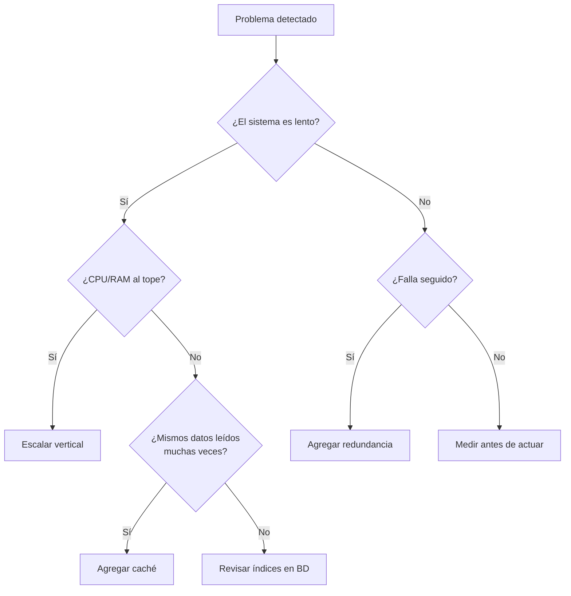
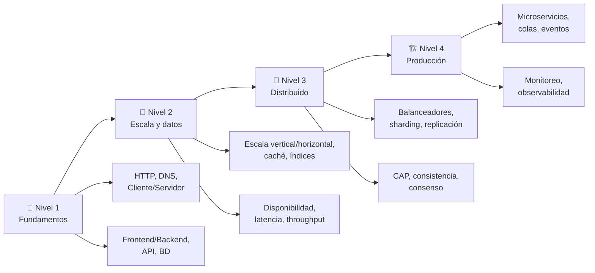

# Datos, escala y resiliencia

## Resultado de aprendizaje

Justificar cuándo agregar escalabilidad, caché o resiliencia según el problema real, identificando señales medibles, costos y alternativas simples antes de complejizar.

## Respuesta simple

Toda aplicación empieza simple: un servidor, una base de datos, cero complicaciones. Con el tiempo, llegan más usuarios, los datos crecen, y el sistema se vuelve lento o falla.

Cuando eso pasa, tenés tres familias de técnicas para responder:

- **Escalabilidad**: darle al sistema más capacidad para manejar carga.
- **Caché**: evitar trabajo repetido guardando resultados temporales.
- **Resiliencia**: asegurar que el sistema no se caiga entero cuando algo falla.

Ninguna se aplica "por si acaso". Cada una tiene una señal clara que la justifica, un costo, y una alternativa más simple.

## Modelo mental

Imaginá un kiosco.

**Escalabilidad** es poner más empleados (horizontal) o darle al empleado actual una calculadora más rápida (vertical).

**Caché** es que el empleado recuerde el precio del café sin ir a la caja cada vez — rápido, pero si el precio cambió, da info vieja.

**Resiliencia** es tener un segundo empleado que pueda atender si el primero se enferma, más un generador eléctrico si se corta la luz.

**Límite del modelo**: En software los "empleados" (servidores) pueden fallar simultáneamente por bugs, no por cansancio. La "memoria del empleado" (caché) tiene un tamaño fijo y necesita políticas de descarte. El "generador" (redundancia) puede estar en otra región geográfica.

## Mapa o recorrido

## Ejemplo continuo

### Escenario inicial

Tenés una API que devuelve perfiles de usuario. Funciona con 100 usuarios. Respuesta en 50 ms. Sin problemas.

### Escenario 1: 10 000 usuarios — latencia sube a 2 segundos

**Señal**: la CPU del servidor está al 30 %, pero la base de datos está al 90 % de uso.

**Problema real**: la base de datos es el cuello de botella.

**Opción simple**: revisar índices. Las consultas pueden estar escaneando tablas enteras. Un índice bien puesto puede reducir la latencia de 2 segundos a 10 ms.

**Opción compleja (si los índices no alcanzan)**: agregar una caché para los perfiles más consultados, o escalar la base de datos verticalmente (más RAM).

### Escenario 2: la API se cae un viernes a las 18:00

**Señal**: el servidor dejó de responder. El log muestra "out of memory".

**Problema real**: un proceso consumió toda la RAM.

**Opción simple**: límite de memoria por proceso (ulimit, systemd limits), reinicio automático.

**Opción compleja**: dos servidores con balanceador. Si uno falla, el otro sigue atendiendo.

### Escenario 3: picos de tráfico los lunes

**Señal**: los lunes a las 10:00 la latencia se triplica, pero el resto de la semana sobra capacidad.

**Problema real**: capacidad ociosa 6 días, insuficiente 1 día.

**Opción simple**: escalado vertical (más RAM/CPU al servidor existente).

**Opción compleja**: escalado horizontal (agregar servidores y un balanceador). El escalado horizontal permite además tolerancia a fallos.

## Cómo funciona internamente

### Escalabilidad vertical

Agregar más recursos a una máquina existente: más CPU, más RAM, disco más rápido (SSD → NVMe).

**Problema que resuelve**: la máquina actual no da abasto.

**Señal que la justifica**: CPU o memoria sostenidamente por encima del 80 %.

**Costo**: la máquina más grande es más cara. Llega un punto donde la siguiente máquina no existe o cuesta el doble por poca ganancia.

**Alternativa simple**: optimizar el código antes de escalar. Un bucle ineficiente en una máquina grande es un bucle ineficiente caro.

**Cómo verificar**: monitorear CPU, RAM, y latencia antes y después del cambio. Si la métrica no mejora, el cuello de botella no era el recurso que escalaste.

**Cuándo NO usarla**: cuando el cuello de botella es la base de datos y el problema son consultas lentas. Un índice bien puesto rinde más que más RAM.

### Escalabilidad horizontal

Agregar más máquinas y distribuir la carga con un balanceador.

**Problema que resuelve**: una sola máquina no puede manejar la carga, o necesitás tolerancia a fallos.

**Señal que la justifica**: la máquina actual está al límite y ya escalaste verticalmente al máximo (o el costo marginal es muy alto).

**Costo**: más máquinas = más complejidad operativa, monitoreo, redes, bases de datos distribuidas.

**Alternativa simple**: escalado vertical. Preguntate: ¿realmente necesito más de una máquina o la actual es suficiente con optimización?

**Cómo verificar**: el balanceador distribuye tráfico, la latencia se mantiene estable al agregar un nodo.

**Cuándo NO usarla**: para aplicaciones con estado (sesiones de usuario en memoria local). Necesitás una sesión compartida (Redis, base de datos) antes de escalar horizontalmente.

**Advertencia**: el escalado horizontal no es infinito. Coordinar N servidores introduce overhead de comunicación. Llega un punto donde agregar servidores empeora la performance (rendimiento decreciente).

### Disponibilidad

La disponibilidad mide el porcentaje de tiempo que el sistema responde correctamente.

| Disponibilidad | Tiempo muerto por año | Ejemplo de uso |
|---------------|----------------------|----------------|
| 99 % (dos nueves) | 3,65 días | Blog personal |
| 99,9 % (tres nueves) | 8,76 horas | SaaS pequeño |
| 99,99 % (cuatro nueves) | 52,56 minutos | API de pagos |
| 99,999 % (cinco nueves) | 5,26 minutos | Sistemas críticos |

Más nueves cuestan exponencialmente más. No necesitás cinco nueves para una app de tareas.

**Problema que resuelve**: garantizar que el sistema responda cuando los usuarios lo necesitan.

**Señal que la justifica**: pérdida de ingresos o confianza cuando el sistema está caído.

**Alternativa simple**: reinicio automático del servicio (systemd restart, supervisor). Sin servidores redundantes, pero sin intervención manual.

### Latencia vs throughput

- **Latencia**: cuánto tarda **una** solicitud. Se mide en milisegundos.
- **Throughput**: cuántas solicitudes procesa el sistema por segundo.

Son diferentes: podés tener baja latencia (10 ms por request) pero bajo throughput (100 req/s) si solo tenés un servidor. O alta latencia (200 ms por request) pero alto throughput (10 000 req/s) si tenés 20 servidores manejando 100 conexiones concurrentes cada uno (20 servidores × 100 conexiones × 5 req/s por conexión).

**Señal de problema de latencia**: los usuarios perciben lentitud. El percentil 99 (P99) está muy por encima del promedio.

**Señal de problema de throughput**: el sistema rechaza conexiones o las colas de requests crecen sin parar.

### Fallos y resiliencia

**Resiliencia** es la capacidad del sistema de seguir funcionando (quizás degradado) cuando algo falla.

**Single point of failure**: un componente cuya caída detiene todo el sistema. Ejemplos: una sola base de datos, un solo servidor, un solo balanceador.

**Redundancia**: tener múltiples copias de un componente crítico. Si uno falla, otro toma su lugar.

**Señal que justifica redundancia**: el sistema ya tuvo caídas por fallo de un componente específico, o el costo de la caída supera el costo de la redundancia.

**Alternativa simple**: backup y restore manual. Si el sistema se cae una vez al año y restaurarlo lleva una hora, capaz es aceptable.

**Cuándo NO usarla**: cuando el sistema es pequeño y las caídas son tolerables. Una base de datos con failover automático para una app de 10 usuarios es sobreingeniería.

### CDN (Content Delivery Network)

Una CDN es una red de servidores distribuidos geográficamente que almacenan contenido estático (imágenes, CSS, JavaScript, videos) y lo entregan desde el servidor más cercano al usuario.

**Problema que resuelve**: reducir la latencia para contenido estático y disminuir la carga en el servidor principal.

**Señal que la justifica**: usuarios en distintas regiones geográficas reportan lentitud para cargar recursos estáticos, o el servidor principal dedica recursos significativos a servir archivos estáticos.

**Alternativa simple**: servir archivos desde el mismo servidor si la audiencia es local o el contenido estático es mínimo. Para sitios pequeños, un solo servidor con disco rápido alcanza.

**Cómo verificar**: medí el tiempo de carga de recursos estáticos (imágenes, CSS, JS) antes y después de incorporar la CDN. La diferencia debería ser notable para usuarios en regiones alejadas del servidor principal.

**Cuándo NO usarla**: cuando la audiencia es local, el tráfico es bajo, o el contenido cambia constantemente y necesita invalidación frecuente.

### Blob storage

El blob storage (object storage) guarda archivos binarios grandes: imágenes, videos, backups, archivos. A diferencia de una base de datos, no está optimizado para consultas complejas sino para almacenamiento masivo y acceso por clave (como una URL).

**Problema que resuelve**: almacenar archivos que no caben o no pertenecen en una base de datos relacional.

**Señal que la justifica**: tenés que guardar imágenes de perfil, archivos subidos por usuarios, o logs que ocupan gigabytes.

**Alternativa simple**: el sistema de archivos del servidor. Para pocos archivos y un solo servidor, el disco local alcanza sin necesidad de blob storage externo.

**Cómo verificar**: los archivos se sirven correctamente desde la URL del blob storage, y el almacenamiento escala sin afectar la base de datos ni el servidor de aplicaciones.

**Cuándo NO usarla**: cuando los archivos son pequeños y pocos, o cuando necesitás consultas complejas sobre el contenido (ahí sigue siendo mejor una base de datos).

### Caché

Una caché guarda datos temporales para evitar consultas costosas.

**Problema que resuelve**: reducir latencia y carga en la base de datos para datos que se leen mucho y se escriben poco.

**Señal que la justifica**: mediciones muestran que la misma consulta se ejecuta cientos de veces y la base de datos es el cuello de botella.

**Costo**: la caché puede servir datos obsoletos. Necesita una política de expiración (TTL) y posiblemente invalidación manual.

**Alternativa simple**: índices en la base de datos (ver 01-fundamentos-tecnologicos/05-bases-de-datos). Un índice bien diseñado a veces elimina la necesidad de caché.

**Cómo verificar**: medí la latencia antes y después. Si la caché no reduce la latencia significativamente, no está resolviendo el cuello de botella correcto.

**Cuándo NO usarla**: para datos que cambian constantemente y deben ser siempre frescos (saldos de cuenta, stock en tiempo real). Para datos con baja frecuencia de lectura. Sin medir primero.

### Índices (referencia)

Los índices ya están cubiertos en detalle en [Bases de datos](/gentle-ai-manual/01-fundamentos-tecnologicos/05-bases-de-datos/#índice). Acá solo recordamos:

- Aceleran búsquedas en la base de datos.
- Son la alternativa más simple antes de agregar caché.
- No resuelven todos los problemas de performance.

**Texto alternativo del diagrama**: Si el sistema es lento, revisá si CPU/RAM está al tope (→ escalar vertical) o si los mismos datos se leen muchas veces (→ agregar caché). Si el sistema falla seguido (→ agregar redundancia). Si no hay señal clara (→ medir primero).

## Límites, costos y trade-offs

| Técnica | Señal de uso | Costo | Alternativa simple |
|---------|-------------|-------|--------------------|
| Escalado vertical | CPU/RAM sostenido > 80 % | $$ - hardware más caro | Optimizar código |
| Escalado horizontal | Una máquina no alcanza | $$$ - ops, redes | Escalado vertical |
| Caché | Misma consulta N veces | Datos obsoletos, TTL | Índices en BD |
| Redundancia | Caídas repetidas por fallo único | $$ - duplicar infra | Restart automático |
| Más disponibilidad | Pérdida por caída > costo | $$$ - exponencial | Aceptar downtime |

## Cuándo usarlo y cuándo evitarlo

Las técnicas de este capítulo tienen un lugar y un momento. Usarlas antes de tiempo es sobreingeniería. No usarlas cuando hacen falta es deuda técnica.

### Usar estas técnicas cuando

- **Mediste** un cuello de botella y sabés dónde está.
- El **costo de la caída** supera el costo de la redundancia.
- Los **usuarios perciben lentitud** o el sistema rechaza conexiones.
- El **crecimiento es sostenido** y proyectable.

### Evitar estas técnicas cuando

- No hay **datos objetivos** que justifiquen la decisión. Si no mediste, no sabés si el problema existe.
- El sistema tiene **pocos usuarios** (< 100) y no hay proyección de crecimiento inmediato.
- Una **alternativa más simple** (índice, optimización de código, restart automático) resuelve el síntoma.
- El **costo operativo** de la técnica supera el beneficio esperado.

### Señales de alerta (probable sobreingeniería)

- Estás agregando una **caché** sin haber medido que la base de datos es el cuello de botella.
- Estás diseñando **microservicios** para una aplicación de 3 funcionalidades.
- Estás planeando **sharding** porque "en el futuro puede que necesitemos escalar".
- Estás configurando **failover automático** para un servicio que no genera ingresos.
- Estás discutiendo **teoremas de consistencia** para un MVP que aún no tiene usuarios.

## Errores frecuentes

### Error 1: CAP significa "elegir dos"

**Problema**: el Teorema CAP (Consistency, Availability, Partition Tolerance) dice que en un sistema distribuido no se pueden garantizar las tres simultáneamente. Pero mucha gente lo simplifica como "elegí dos de tres".

**Corrección**: la tolerancia a partición (P) no es opcional. Las particiones de red ocurren. Siempre hay que tolerarlas. La decisión real es entre consistencia fuerte (CP) y disponibilidad (AP) cuando hay una partición.

**Ejemplo**: un sistema de pagos elige CP: si la red falla, prefiere no procesar pagos a procesarlos sin consistencia. Una red social elige AP: si la red falla, muestra datos viejos pero sigue funcionando.

### Error 2: PostgreSQL es universalmente CP

**Problema**: mucha gente dice "Postgres es CP, MongoDB es AP" como si fuera una verdad absoluta.

**Corrección**: Postgres puede configurarse para priorizar disponibilidad (AP) en configuraciones de replicación asincrónica. Depende de la configuración, no solo de la base de datos. La clasificación categórica de bases de datos como "CP" o "AP" es engañosa.

### Error 3: la caché siempre resuelve la lentitud

**Problema**: asumir que agregar caché siempre acelera el sistema.

**Corrección**: si el cuello de botella no son las lecturas repetidas, la caché no ayuda. Si el cuello de botella es la CPU del servidor, la caché no mueve la aguja. Medí primero.

**Riesgo adicional**: la caché puede servir datos obsoletos. Si tu aplicación necesita datos siempre frescos (ej.: stock de producto con inventario en tiempo real), la caché puede causar errores visibles al usuario.

### Error 4: necesito microservicios para escalar

**Problema**: pensar que la única forma de escalar es dividir la aplicación en microservicios.

**Corrección**: la mayoría de las aplicaciones nunca necesita microservicios. Un monolito bien diseñado, con una base de datos optimizada, escala hasta cientos de miles de usuarios. Los microservicios resuelven problemas organizacionales (equipos independientes), no solo técnicos. Agregarlos por "escalabilidad" te da escalabilidad con 10 veces más complejidad operativa.

### Error 5: sharding es el primer paso para escalar la BD

**Problema**: pensar que en el momento que la BD se llena, hay que shardear (particionar).

**Corrección**: el sharding (particionar los datos entre varias bases) es el último recurso. Antes: optimizá consultas, agregá índices, aumentá RAM, caché, réplicas de lectura. El sharding introduce complejidad en las consultas, joins imposibles entre shards, rebalanceo manual y operación compleja. No es el primer paso.

## Mapa progresivo de aprendizaje de System Design

**Qué estudiar después**:

1. **Fundamentos**: 01-fundamentos-tecnologicos/07-como-funciona-una-aplicacion-moderna (prerrequisito).
2. **Esta lección**: conceptos de escala, caché y resiliencia.
3. **Libro**: "Designing Data-Intensive Applications" (Kleppmann) — capítulos 1 al 5.
4. **Patrones distribuidos**: Raft, Gossip, Consistent Hashing.
5. **Casos reales**: cómo escala YouTube, Netflix, Twitter.

## Comprueba lo aprendido

1. **Escenario**: tu app responde en 10 ms para 100 usuarios. Cuando llegan 1000 usuarios, baja a 2000 ms. La CPU del servidor está al 20 %. La BD tiene CPU al 85 %. ¿Qué hacés?

2. **Verdadero o falso**: "CAP theorem dice que siempre hay que elegir dos de tres — consistencia, disponibilidad y tolerancia a partición."

3. **Decisión**: tu app de tareas tiene una lista que los usuarios consultan 50 veces por día. Los datos cambian cuando el usuario los modifica. ¿Agregarías caché? ¿Por qué?

Respuestas

1. **Análisis**: el cuello de botella es la BD. La CPU del servidor sobra. No necesitás escalar el servidor. Primero: revisá índices y optimizá consultas. Si no alcanza: aumentá RAM de la BD (vertical) o agregá caché para consultas frecuentes. No shardees todavía.

2. **Falso**. La tolerancia a partición (P) no es opcional. La decisión real es entre consistencia fuerte (CP) y disponibilidad (AP) cuando hay una partición de red.

3. **Depende**. Si la medición muestra que la BD es el cuello de botella y la lista se lee mucho más de lo que se escribe, la caché puede ayudar. Riesgo: si el usuario modifica una tarea y la caché no se invalida, va a ver datos viejos hasta que expire el TTL. Una alternativa más simple: asegurate de que la consulta tenga un índice eficiente.

## Resumen

| Principio | En una frase |
|-----------|-------------|
| Escalar vertical | Agregá más recursos a la máquina actual |
| Escalar horizontal | Agregá más máquinas |
| Disponibilidad | Medí el tiempo que el sistema está operativo |
| Latencia | Cuánto tarda una solicitud |
| Throughput | Cuántas solicitudes por segundo |
| Resiliencia | Seguí funcionando cuando algo falla |
| Redundancia | Tené copias de componentes críticos |
| Caché | Guardá resultados temporales para lecturas repetidas |
| Medir primero | Nunca agregues una técnica sin datos que la justifiquen |

**Correcciones a simplificaciones peligrosas**:
- CAP no significa "elegir dos". La partición es inevitable; elegís entre consistencia y disponibilidad.
- Postgres no es universalmente CP. Depende de la configuración.
- La caché sirve datos obsoletos. No siempre es la solución.
- Microservicios no son requisito para escalar. Un monolito alcanza para la mayoría de los casos.
- Sharding no es el primer paso para escalar la BD. Optimizá, indexá, cacheá, replicá antes.

## Fuentes y alcance

- Fuente conceptual: The Gentleman Programming (2026) — Capítulo sobre escalabilidad y resiliencia
- Fuente técnica primaria: "Designing Data-Intensive Applications" (Kleppmann, 2017)
- Hechos volátiles verificados: no contiene comandos, versiones ni rutas específicas
- Fecha de verificación: 2026-07-22
- Alcance de la comprobación: conceptos fundamentales de escalabilidad, disponibilidad y resiliencia en aplicaciones web. No cubre implementaciones específicas en cloud (AWS, GCP, Azure) ni patrones de sistemas distribuidos avanzados.
- Prerrequisitos: 01-fundamentos-tecnologicos/07-como-funciona-una-aplicacion-moderna (vocabulario de red y componentes), 01-fundamentos-tecnologicos/05-bases-de-datos (persistencia e índices)
