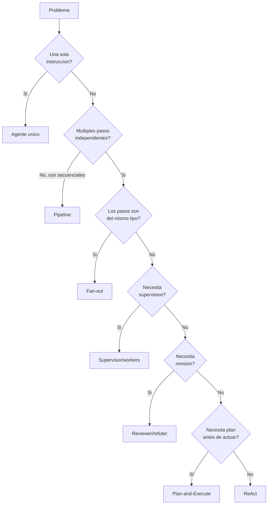
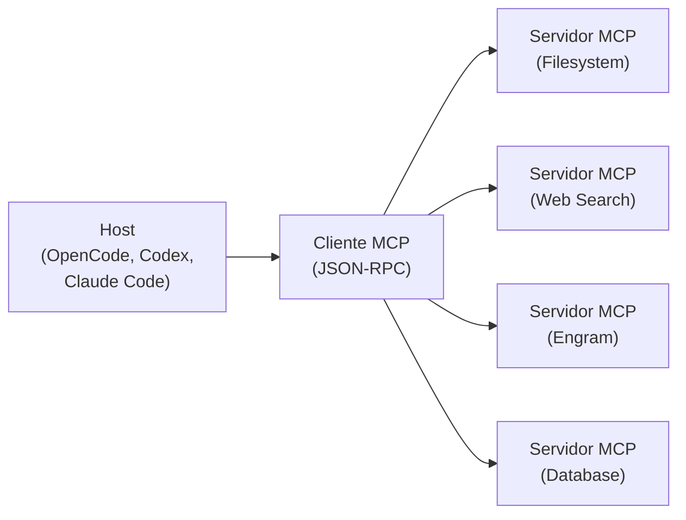

## Resultado de aprendizaje

Identificar y comparar siete patrones de orquestacion de agentes, decidir cual aplicar segun el problema, y explicar la arquitectura MCP como protocolo de integracion entre hosts y servidores.

## Respuesta simple

Un patron de agente es una forma estructurada de organizar las interacciones entre un modelo de lenguaje, codigo y herramientas. No todos los problemas necesitan el mismo patron: elegir el equivocado agrega complejidad sin beneficio.

MCP (Model Context Protocol) no es un patron de agente. Es un protocolo de integracion que permite que un host (como OpenCode o Codex) se conecte con servidores de herramientas (como filesystem, base de datos o web search) a traves de un cliente MCP. MCP no anade inteligencia ni autonomia: solo transporta mensajes JSON-RPC entre procesos.

## Modelo mental

Imagina una cocina.

- **Agente unico**: un solo cocinero prepara todo el plato de principio a fin.
- **Supervisor/workers**: un jefe de cocina asigna tareas a varios ayudantes y revisa el resultado.
- **Pipeline**: una linea de ensamblaje donde cada estacion hace una transformacion y pasa el resultado a la siguiente.
- **Fan-out**: envias la misma receta a cinco cocineros para probar cinco variaciones en paralelo.
- **Reviewer/refuter**: un cocinero prepara, otro prueba y aprueba o rechaza.
- **ReAct**: el cocinero piensa en voz alta ("me falta sal"), busca la sal, la agrega, y sigue.
- **Plan-and-Execute**: el jefe escribe el menu completo antes de que nadie cocine, y luego cada cocinero ejecuta su parte.

**Limite del modelo**: en software los "cocineros" no se cansan, pero pueden alucinar, repetir el mismo error o divergir sin coordinacion. Los patrones existen exactamente para poner limites predecibles a esas interacciones.

## Mapa o recorrido

El siguiente diagrama muestra como se relacionan los patrones segun la complejidad del problema:



## Ejemplo continuo

### El escenario

Trabajas en una plataforma de documentacion tecnica. Los equipos de producto escriben guias en markdown, y necesitas un sistema que las revise, corrija y publique.

### Patron 1: agente unico

Un solo agente recibe la guia, la revisa, la corrige, genera el HTML y la publica. Funciona para guias de una pagina.

### Patron 2: supervisor/workers

Un supervisor asigna cada seccion de una guia grande a un worker distinto. Los workers devuelven sus secciones revisadas; el supervisor las ensambla y decide si el conjunto es coherente.

### Patron 3: pipeline

La guia pasa por cinco etapas en orden: validar frontmatter, corregir ortografia, verificar enlaces, convertir a HTML, publicar. Cada etapa recibe el output de la anterior.

### Patron 4: fan-out

La misma guia se envia a cinco evaluadores en paralelo para obtener cinco revisiones independientes. Luego se consolidan los resultados.

### Patron 5: reviewer/refuter

Un agente escribe la guia. Otro la revisa. Si la rechaza, el primero la corrige y el segundo vuelve a revisar. El ciclo termina cuando el revisor aprueba o cuando se alcanza un maximo de iteraciones.

### Patron 6: ReAct

El agente recibe la instruccion "actualiza la guia de despliegue". En lugar de ejecutar ciegamente, razona: "primero necesito leer el archivo actual, luego consultar la documentacion de la herramienta, luego escribir los cambios, luego verificar que los enlaces funcionan". Ejecuta cada paso, observa el resultado, y decide el siguiente.

### Patron 7: Plan-and-Execute

El agente recibe "reestructura toda la seccion de instalacion". Primero genera un plan: (1) leer todas las guias actuales, (2) identificar solapamientos, (3) proponer nueva estructura, (4) obtener aprobacion del equipo, (5) ejecutar los cambios. Solo cuando el plan esta completo y aprobado comienza la ejecucion.

## Recorrido práctico

### Diagnosticar que patron usa tu sistema

1. Abre la configuracion de tu agente OpenCode o Codex.
2. Busca la seccion de skills o herramientas.
3. Identifica cuantos agentes o modos estan definidos.
4. Revisa el flujo: los skills se cargan en orden secuencial (pipeline), se ejecutan en paralelo (fan-out), o hay uno que orquesta a otros (supervisor).

Ejemplo con OpenCode:

```json
{
  "agent": {
    "mode": "plan",
    "skills": ["sdd-explore", "sdd-design", "sdd-apply", "sdd-verify"]
  }
}
```

Esto es un pipeline: los skills se ejecutan en orden secuencial, cada uno alimenta al siguiente.

### Verificacion

Para confirmar el patron activo:

1. Ejecuta un cambio y observa el log: los mensajes muestran pasos secuenciales o paralelos.
2. Si hay un paso de "plan" antes de "apply", estas viendo Plan-and-Execute o ReAct.
3. Si ves "revisando cambios" seguido de "corrigiendo", es Reviewer/refuter.
4. Si todo ocurre en un solo paso sin logs intermedios, es agente unico.

## Cómo funciona internamente

### Agente unico

Un solo modelo recibe la instruccion completa y ejecuta todas las herramientas necesarias.

**Caso de uso**: tareas aisladas sin dependencias externas, como formatear un archivo o responder una pregunta puntual.

**Cuando usarlo**: tareas pequenas, bien definidas, sin estado que preservar entre pasos.

**Cuando evitarlo**: tareas que requieren multiples herramientas, persistencia de estado, o supervision humana.

**Fallo tipico**: el agente se desvia del objetivo porque no hay verificacion intermedia. El costo del fallo es bajo porque solo se pierde una ejecucion corta.

**Evidencia de funcionamiento**: el output esperado se produce en una sola invocacion. Se verifica comparando el resultado contra una especificacion o test.

### Supervisor/workers

Un agente supervisor descompone el problema en subtareas y las asigna a workers especializados. Cada worker devuelve un resultado parcial. El supervisor consolida y decide si el resultado es aceptable o si debe reasignar.

**Caso de uso**: tareas grandes con partes independientes, como generar documentacion de multiples modulos.

**Cuando usarlo**: el problema se divide naturalmente en subtareas que no comparten estado.

**Cuando evitarlo**: las subtareas dependen unas de otras, o el costo de coordinacion supera el costo de un solo agente.

**Fallo tipico**: un worker produce un resultado incorrecto que el supervisor no detecta. El error se propaga al resultado final. La supervision necesita verificacion, no solo consolidacion.

**Evidencia de funcionamiento**: cada worker produce su entrega correctamente, y el supervisor ensambla sin perdida de informacion. Se verifica que el resultado consolidado contiene todas las partes requeridas.

### Pipeline (secuencial)

Cada etapa recibe el output de la anterior, lo transforma, y lo pasa a la siguiente. No hay retroalimentacion entre etapas.

**Caso de uso**: transformaciones de datos con orden estricto, como ETL, validacion en cadena, o procesamiento de documentos.

**Cuando usarlo**: cada paso depende del resultado del anterior y el orden es inamovible.

**Cuando evitarlo**: cuando las etapas podrian ejecutarse en paralelo (usa fan-out) o cuando una etapa necesita retroalimentacion de una etapa posterior (necesitas otro patron).

**Fallo tipico**: una etapa intermedia falla silenciosamente y produce output vacio o corrupto. Las etapas siguientes procesan basura y el error solo se detecta al final. Cada etapa debe validar su entrada.

**Evidencia de funcionamiento**: cada etapa produce el output esperado dado su input conocido. Se verifica etapa por etapa con casos de prueba.

### Fan-out (paralelo)

Una misma entrada se distribuye a multiples agentes que ejecutan en paralelo. Los resultados se consolidan al final.

**Caso de uso**: evaluacion multiple, generacion de variantes, o cualquier tarea donde necesites N perspectivas independientes.

**Cuando usarlo**: necesitas variedad de resultados, la tarea es puramente paralelizable, y el costo de N ejecuciones es aceptable.

**Cuando evitarlo**: cuando los resultados deben ser consistentes entre si (el paralelismo introduce divergencia), o cuando el consolidado final requiere acuerdo entre las partes.

**Fallo tipico**: los N resultados son inconsistentes y no hay forma automatica de consolidarlos. El patron necesita una funcion de consolidacion robusta que maneje la divergencia.

**Evidencia de funcionamiento**: los N resultados se producen en tiempo equivalente al mas lento. La consolidacion produce un resultado coherente. Se verifica que cada resultado individual es valido y que la consolidacion no pierde informacion.

### Reviewer/refuter

Un agente (generador) produce un resultado. Otro agente (revisor) lo evalua contra un criterio. Si lo rechaza, el generador produce una nueva version. El ciclo se repite hasta que el revisor acepta o se alcanza un maximo de iteraciones.

**Caso de uso**: tareas donde la calidad es critica y necesita doble verificacion, como generacion de codigo con revision de seguridad, o textos que deben cumplir un estilo estricto.

**Cuando usarlo**: el costo de un error es alto y el criterio de calidad es verificable por otro agente.

**Cuando evitarlo**: cuando el revisor no tiene un criterio objetivo (los dos agentes pueden entrar en un ciclo infinito de desacuerdo), o cuando el costo de cada iteracion es alto.

**Fallo tipico**: el generador y el revisor entran en un bucle: el generador produce X, el revisor lo rechaza con una critica generica, el generador produce X con cambios cosmeticos, el revisor lo acepta. No hay mejora real. Se necesita un limite de iteraciones y un criterio de aceptacion explicito.

**Evidencia de funcionamiento**: el resultado final supera los criterios del revisor. Se verifica que el numero de iteraciones esta dentro del limite y que cada iteracion introduce cambios sustanciales.

### ReAct (Reasoning + Acting)

El agente alterna entre razonar (generar texto interno) y actuar (ejecutar herramientas). El resultado de cada accion realimenta el siguiente ciclo de razonamiento.

**Fundamento**: propuesto por Yao et al. (2022), ReAct combina cadenas de pensamiento (reasoning traces) con acciones sobre el entorno (tool calls). El agente no ejecuta un plan fijo: decide el siguiente paso segun lo que observa.

**Caso de uso**: tareas que requieren exploracion, como debugging, investigacion, o navegacion de APIs.

**Cuando usarlo**: no sabes de antemano los pasos exactos; el agente debe descubrirlos interactuando con el entorno.

**Cuando evitarlo**: cuando los pasos son conocidos y fijos (usa pipeline o plan-and-execute), o cuando el costo de cada ciclo de razonamiento es alto y el beneficio es marginal.

**Fallo tipico**: el agente entra en un bucle de razonamiento sin progreso. Por ejemplo, "necesito leer el archivo" -> lo lee -> "necesito entender el contenido" -> genera resumen -> "necesito leer el archivo otra vez" -> reinicia. Se necesita un limite de iteraciones y un detector de bucles.

**Evidencia de funcionamiento**: el agente completa la tarea en un numero finito de pasos, y cada paso se puede rastrear: razonamiento -> accion -> observacion -> siguiente razonamiento. Se verifica que cada accion contribuye al progreso.

### Plan-and-Execute

Primero se genera un plan completo (sequencia de pasos). Luego se ejecuta cada paso, opcionalmente con verificacion intermedia. El plan no cambia durante la ejecucion a menos que un paso falle.

**Diferencias con ReAct**: en Plan-and-Execute el plan se genera _antes_ de ejecutar, y solo se revisa si hay fallos. En ReAct no hay plan previo: cada paso se decide en el momento segun la observacion.

**Caso de uso**: tareas complejas con multiples pasos predecibles, como migraciones de datos, deploys, o reestructuraciones de codigo.

**Cuando usarlo**: conoces la estructura general de la solucion pero necesitas verificar antes de ejecutar.

**Cuando evitarlo**: cuando la tarea es impredecible y el plan inicial cambiaria constantemente (mejor ReAct), o cuando generar el plan cuesta tanto como ejecutar directamente.

**Fallo tipico**: el plan es incorrecto o incompleto, pero se ejecuta igual porque el patron no contempla revision del plan durante la ejecucion. Cada paso debe validar su resultado contra lo esperado por el plan, no solo ejecutar ciegamente.

**Evidencia de funcionamiento**: el plan generado cubre todos los pasos necesarios, y la ejecucion sigue el plan sin desviaciones. Se verifica que cada paso del plan produce el resultado esperado antes de avanzar al siguiente.

### MCP: Model Context Protocol

MCP es un **protocolo de integracion**, no un patron de agente. No anade inteligencia, razonamiento ni autonomia. Conecta un host (aplicacion que ejecuta el agente) con servidores (herramientas externas) a traves de un cliente MCP.

**Arquitectura**:



**Explicacion del diagrama**: el host contiene un cliente MCP que se comunica con multiples servidores MCP usando JSON-RPC sobre stdio o HTTP. Cada servidor expone herramientas (tools), recursos (resources) y reglas (prompts). El host no habla directamente con los servidores; siempre lo hace a traves del cliente MCP.

**Tres roles en el protocolo**:

1. **Host**: la aplicacion que el usuario opera. Ejemplos: OpenCode, Codex CLI, Claude Code. El host inicia la conexion, envia solicitudes y recibe respuestas. No hay agencia: el host solo enruta peticiones.

2. **Cliente MCP**: el componente dentro del host que implementa el protocolo. Establece la conexion con el servidor, formatea los mensajes JSON-RPC y maneja la autenticacion. Un host puede tener un cliente por servidor.

3. **Servidor MCP**: un proceso independiente que expone capacidades. Ejemplos: servidor de filesystem (leer/escribir archivos), servidor de web search (consultar la web), servidor de base de datos (ejecutar consultas SQL). Cada servidor es un programa separado que el host inicia como subproceso o al que se conecta por red.

**Como funciona la comunicacion**:

1. El host inicia el servidor MCP como subproceso (stdio) o se conecta a el por HTTP.
2. El cliente MCP envia un mensaje JSON-RPC: `{"jsonrpc":"2.0","id":1,"method":"tools/call","params":{"name":"read_file","arguments":{"path":"/tmp/doc.md"}}}`.
3. El servidor procesa la solicitud y devuelve una respuesta JSON-RPC.
4. El cliente recibe la respuesta y la entrega al host.
5. El host puede usar la respuesta para su siguiente paso (dependiendo del patron de agente que implemente).

**MCP no es**:

- Un motor de inteligencia artificial.
- Un orquestador de agentes.
- Un sistema de memoria.
- Una capa de autonomia.

MCP es solo el tubo por el que viajan los mensajes. La inteligencia, si existe, esta en el modelo que el host invoca, no en MCP.

**Cuando usarlo**: cuando necesitas que un agente acceda a herramientas externas de forma estandarizada y segura, sin acoplar el agente a la implementacion de cada herramienta.

**Cuando evitarlo**: para comunicacion interna dentro del mismo proceso (una llamada a funcion basta), o cuando la latencia de un subproceso separado es inaceptable.

**Fallo tipico**: se piensa que MCP "hace magia" o "le da inteligencia al agente". En realidad si el servidor MCP falla (archivo no encontrado, red caida), el agente se queda sin herramienta. MCP no provee fallback, caching ni reintentos: cada implementacion debe manejarlos.

**Evidencia de funcionamiento**: el host puede llamar a una herramienta del servidor y recibir un resultado. Se verifica con una llamada de prueba: `tools/call` con parametros conocidos debe devolver el resultado esperado.

## Cuándo usarlo y cuándo evitarlo

| Patron | Usa cuando | Evita cuando |
|--------|-----------|-------------|
| Agente unico | Tarea pequena y aislada | Tarea con multiples pasos o herramientas |
| Supervisor/workers | Subtareas independientes | Subtareas interdependientes o alto costo de coordinacion |
| Pipeline | Orden estricto de transformaciones | Pasos que necesitan retroalimentacion entre etapas |
| Fan-out | Necesitas N perspectivas independientes | Resultados deben ser consistentes entre si |
| Reviewer/refuter | Calidad critica verificable por otro agente | Criterio de aceptacion subjetivo o ciclico |
| ReAct | Pasos desconocidos, exploracion necesaria | Pasos conocidos y fijos |
| Plan-and-Execute | Estructura conocida, verificacion previa | Tarea impredecible que cambiaria el plan constantemente |
| MCP | Conectar host con herramientas externas | Comunicacion intra-proceso (basta una funcion) |

## Costos y trade-offs

| Patron | Costo principal | Riesgo |
|--------|----------------|--------|
| Agente unico | Bajo: una invocacion | Sin verificacion, puede desviarse |
| Supervisor/workers | N+1 invocaciones (N workers + supervisor) | Worker falla, supervisor no detecta |
| Pipeline | N invocaciones secuenciales | Error se propaga sin deteccion |
| Fan-out | N invocaciones paralelas | Resultados divergentes, consolidacion dificil |
| Reviewer/refuter | 2 iteraciones promedio (minimo) | Ciclo infinito, mejoras cosmeticas |
| ReAct | I impredecible (iteraciones hasta completar) | Bucle de razonamiento sin progreso |
| Plan-and-Execute | Plan + N ejecuciones | Plan incorrecto se ejecuta igual |
| MCP | Latencia de subproceso/comunicacion | Fallo del servidor deja al agente sin herramienta |

## Errores frecuentes

### Error 1: siempre usar agente unico

**Sintoma**: el agente se desvia, ignora instrucciones, o produce resultados incompletos.

**Causa probable**: una sola instruccion no puede cubrir todos los pasos, validaciones y casos borde de una tarea compleja.

**Diagnostico**: el log muestra una sola invocacion para una tarea que claramente tiene multiples pasos.

**Correccion**: descompone la tarea en pasos usando pipeline o supervisor/workers.

**Verificacion**: cada paso produce un resultado verificable antes de pasar al siguiente.

### Error 2: fan-out sin consolidacion

**Sintoma**: los N resultados son tan diferentes que no se puede producir un output coherente.

**Causa probable**: no hay una funcion de consolidacion definida antes de lanzar el fan-out.

**Diagnostico**: el codigo de consolidacion es un prompt generico "combina estos resultados".

**Correccion**: define criterios explicitos de consolidacion: votacion, promedio, seleccion del mejor, o ensamble.

**Verificacion**: el resultado consolidado mantiene coherencia interna y cumple los requisitos.

### Error 3: reviewer/refuter sin criterio objetivo

**Sintoma**: el ciclo nunca termina, o termina con cambios cosmeticos.

**Causa probable**: el revisor usa criterios subjetivos ("esto no se ve bien") en lugar de verificables ("el codigo debe pasar lint sin errores").

**Diagnostico**: las criticas del revisor son vagas y no producen cambios medibles entre iteraciones.

**Correccion**: define checklists o tests automatizados como criterio de aceptacion. El revisor solo verifica contra la lista.

**Verificacion**: el numero de iteraciones se reduce, y cada iteracion produce cambios sustanciales.

### Error 4: ReAct sin limite de iteraciones

**Sintoma**: el agente se queda "pensando" sin ejecutar acciones, o ejecuta ciclos sin progreso.

**Causa probable**: no hay un maximo de pasos ni un detector de bucles.

**Diagnostico**: el log muestra el mismo patron de razonamiento repetido.

**Correccion**: establece un maximo de N iteraciones. Si se alcanza, el agente debe devolver el mejor resultado parcial o registrar "no se pudo completar".

**Verificacion**: el agente completa la tarea en menos de N pasos, o reporta correctamente que no pudo completarla.

### Error 5: tratar MCP como si fuera inteligente

**Sintoma**: se espera que MCP "entienda" el contexto o "decida" que herramienta usar.

**Causa probable**: confusion entre MCP (protocolo de transporte) y el modelo de lenguaje (que procesa las solicitudes).

**Diagnostico**: en la configuracion, se asigna un modelo a MCP o se le pide a MCP que "razone".

**Correccion**: MCP es solo el protocolo. El host (OpenCode, Codex) es quien decide que herramienta llamar. MCP solo transporta la llamada y la respuesta.

**Verificacion**: revisa la configuracion: los servidores MCP no tienen modelos asignados. Solo tienen comando, argumentos y variables de entorno.

## Comprueba lo aprendido

1. **Clasificacion**: tu sistema recibe un archivo, lo valida, lo transforma, lo firma y lo almacena. Cada paso depende del anterior. Que patron usas?

2. **Decision**: necesitas que un agente investigue por que falla un test. No sabes de antemano que archivos revisar ni que comandos ejecutar. Que patron eliges?

3. **Falso o verdadero**: MCP es un protocolo que permite que un agente razone sobre que herramientas usar.

4. **Comparacion**: cual es la diferencia fundamental entre ReAct y Plan-and-Execute?

5. **Escenario**: tienes 10 archivos que deben ser traducidos al mismo idioma. Cada traduccion es independiente. Que patron usas y cual es el riesgo?

6. **Caso borde**: implementas reviewer/refuter para revision de codigo. Despues de 3 iteraciones, el revisor sigue rechazando con "esto podria mejorar". Que hacer?

<details>
<summary>Respuestas</summary>

1. **Pipeline**. Cada etapa depende del resultado de la anterior y el orden es fijo.

2. **ReAct**. No sabes los pasos de antemano; necesitas explorar el entorno y decidir el siguiente paso segun lo que observes.

3. **Falso**. MCP es solo un protocolo de transporte. No razona, no decide, no tiene inteligencia. El razonamiento ocurre en el modelo de lenguaje que el host invoca.

4. En **Plan-and-Execute** el plan se genera completo antes de ejecutar y solo se revisa si hay fallos. En **ReAct** no hay plan previo: cada paso se decide segun la observacion del paso anterior.

5. **Fan-out**: envias cada archivo a un worker distinto en paralelo. Riesgo: las traducciones pueden usar terminologia inconsistente si no hay un glosario compartido.

6. Establece un maximo de iteraciones (ej: 5) y un criterio de aceptacion explicito. Si se alcanza el maximo o las criticas se repiten, el revisor debe aprobar el ultimo resultado o escalar a un humano.

</details>

## Resumen

| Concepto | Que es |
|----------|--------|
| **Agente unico** | Un solo modelo hace todo en una invocacion |
| **Supervisor/workers** | Un agente coordina a varios especialistas |
| **Pipeline** | Pasos secuenciales donde cada uno transforma el resultado del anterior |
| **Fan-out** | Multiples ejecuciones independientes en paralelo |
| **Reviewer/refuter** | Ciclo de generacion y verificacion entre dos agentes |
| **ReAct** | Razonamiento y accion intercalados, sin plan fijo |
| **Plan-and-Execute** | Plan completo primero, ejecucion despues |
| **MCP** | Protocolo de integracion host-cliente-servidor, sin inteligencia propia |

**Ideas clave**:

- No hay un patron "mejor". El patron correcto depende del problema.
- MCP no es un patron de agente: es infraestructura de comunicacion.
- La verificacion no es opcional: cada patron necesita una forma de confirmar que funciona.
- Los fallos tipicos son predecibles y prevenibles con limites explicitos, criterios objetivos y deteccion de bucles.

## Fuentes y alcance

- Fuente conceptual: Anthropic, "Building Effective Agents" (2024) — catalogo de patrones de orquestacion
- Fuente tecnica primaria: Model Context Protocol Specification (spec.modelcontextprotocol.io, 2025)
- Fuente academica: Yao et al., "ReAct: Synergizing Reasoning and Acting in Language Models" (ICLR 2023)
- Hechos volatiles verificados: MCP como protocolo de integracion (no agrega inteligencia); OpenCode y Codex como hosts MCP
- Fecha de verificacion: 2026-07-27
- Alcance de la comprobacion: conceptual — patrones de orquestacion de agentes y arquitectura del protocolo MCP. No cubre implementacion especifica de servidores MCP ni configuracion detallada de cada host.
- Prerrequisitos: 16-arquitectura-tecnica/01-arquitectura-tecnica (ecosistema Gentle-AI), 12-opencode/01-configurar-opencode (configuracion MCP en OpenCode)
