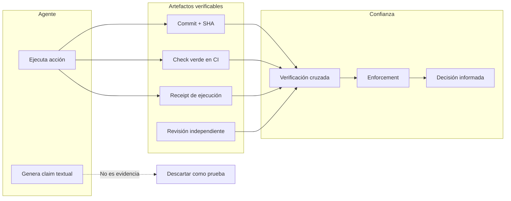

# Confianza verificable

## Resultado de aprendizaje

Explicar por qué el reporte de un agente de IA sobre su propio trabajo no constituye evidencia, y construir cadenas de confianza usando artefactos verificables: receipts criptográficos, SHAs de Git, checks automatizados, revisión independiente y reglas de enforcement.

## Respuesta simple

Lo que un agente *dice* que hizo no es evidencia de que realmente lo hizo. Un agente puede alucinar, omitir pasos, malinterpretar instrucciones o reportar éxito cuando en realidad falló. La confianza no se construye sobre lo que el agente cuenta, sino sobre **artefactos que cualquier otra persona o máquina puede verificar de forma independiente**: un commit firmado, un SHA de un artefacto, un check verde en CI, un receipt de ejecución, una revisión humana documentada.

La regla es: **no confíes en el relato, confía en el rastro**.

## Modelo mental

Imaginá que un carpintero te dice: "Ya construí la mesa". Su palabra no es suficiente para que pagues. Necesitás ver la mesa, medir sus patas, comprobar que está nivelada y que la madera es la acordada.

El carpintero puede estar seguro de que hizo un buen trabajo, pero su certeza no es verificable para vos. Necesitás evidencia que **ambos** podamos inspeccionar: la mesa misma, una cinta métrica, un nivel.

En sistemas de agentes ocurre lo mismo. El agente ejecuta acciones y genera un reporte textual. Ese reporte puede ser correcto, parcial o completamente inventado. No importa cuán convincente suene: sin un artefacto verificable externo, es solo un *claim*.

El límite de esta analogía: la mesa es tangible y se puede inspeccionar directamente. En software, los artefactos (commits, checks, receipts) son digitales y requieren herramientas para verificarlos, pero el principio es el mismo — la evidencia debe ser **independiente del actor que la generó**.

## Mapa o recorrido



El diagrama muestra el flujo: el agente ejecuta una acción y genera artefactos (commit, check, receipt). El claim textual que produce no es evidencia. La confianza se construye verificando los artefactos de forma independiente, aplicando reglas de enforcement, y tomando decisiones informadas.

## Ejemplo continuo

### Escenario base

Un agente debe actualizar un archivo de configuración para cambiar el puerto de un servidor de `3000` a `4000`.

### Con confianza no verificable

El agente ejecuta, produce un reporte: "Archivo actualizado correctamente. El puerto ahora es 4000." El operador confía, hace deploy, y el servidor sigue escuchando en el puerto 3000 porque el agente editó el archivo equivocado. Nadie lo sabe hasta que el sistema cae en producción.

### Con confianza verificable

El agente ejecuta, hace commit con mensaje `fix: cambiar puerto a 4000`, el commit tiene un SHA (`abc123`), el CI ejecuta un test que verifica que el archivo de configuración contiene `PORT=4000` y pasa. El operador revisa el diff en el PR, verifica que el cambio es el correcto, y aprueba. Luego verifica que el artefacto desplegado usa el mismo SHA que el commit aprobado.

Cada paso deja un rastro que cualquier persona puede verificar sin depender del reporte del agente.

## Recorrido práctico

### Paso 1: el agente reporta, pero no confíes todavía

Un agente ejecuta una tarea y muestra:

```
✓ Archivo src/config.ts actualizado
✓ Test pasa
✓ Commit creado
```

Esto es un **claim**. Podría ser cierto, pero no tenés forma de saberlo sin verificarlo.

### Paso 2: verificá el commit

```bash
git log -1 --oneline
# abc1234 fix: cambiar puerto a 4000
```

El commit existe. Eso ya es más fuerte que el reporte textual. Pero el commit podría estar mal — tal vez cambió el archivo incorrecto.

### Paso 3: verificá el contenido del commit

```bash
git diff abc1234^..abc1234
# - PORT=3000
# + PORT=4000
```

Ahora tenés evidencia de qué cambió exactamente. Esto ya es verificable por cualquier persona.

### Paso 4: verificá que el CI dio verde

```bash
gh run list --commit abc1234 --json conclusion
# conclusion: success
```

Un check verde asociado al HEAD del commit es **evidencia parcial**: dice que las pruebas automatizadas pasaron, pero no que el cambio sea correcto para el dominio del problema.

### Paso 5: verificá que el artefacto desplegado coincide

```bash
sha256sum dist/config.js
# coincide con el SHA del artefacto generado en CI para el commit abc1234
```

Artefacto y deploy del mismo SHA es **evidencia más fuerte**: lo que se revisó y probó es exactamente lo que se desplegó.

### Paso 6: revisión humana

```bash
gh pr view 42 --json reviews
# reviewer: "harry", state: "APPROVED"
# reviewer: "maria", state: "CHANGES_REQUESTED"
```

La revisión independiente agrega una capa más de confianza, especialmente cuando el revisor no es quien implementó el cambio.

## Cómo funciona internamente

### Claim vs evidencia

Un **claim** es una afirmación del agente sobre lo que hizo. No tiene fuerza probatoria porque el agente puede:
- alucinar que ejecutó una acción que nunca ocurrió
- reportar éxito cuando una operación falló silenciosamente
- omitir pasos intermedios que cambiarían la interpretación

Un **receipt** es un artefacto que registra una acción de forma que cualquier parte puede verificarla después. Ejemplos:
- un commit en Git: registra quién, cuándo, qué cambió
- un log de auditoría firmado: registra una operación con integridad criptográfica
- un hash de contenido: permite verificar que un artefacto no fue alterado

### SHA y pinning

Un **SHA** (Secure Hash Algorithm) produce un identificador único para un contenido. Si dos personas calculan el SHA del mismo archivo, obtienen el mismo valor. Si el archivo cambia, el SHA cambia drásticamente.

Usar SHAs permite **pinar** una versión específica: "este artefacto con SHA `xyz` es el que revisamos, probamos y aprobamos". Cualquier desviación produce un SHA diferente y se detecta automáticamente.

### Source of truth

La **fuente de verdad** es el sistema autoritativo, no el relato del agente. Ejemplos:
- Git es la fuente de verdad para el código fuente, no lo que el agente dice que cambió
- El CI output es la fuente de verdad para los resultados de tests, no el reporte del agente
- El registro de deploys es la fuente de verdad para qué versión está en producción

### Red-green

El ciclo **red-green** (Test-Driven Development) aplica a la confianza verificable:
1. **Red**: escribí un test que falla porque el cambio que esperás aún no existe
2. **Green**: el agente implementa el cambio y el test pasa
3. El test verde es evidencia parcial de que el cambio funciona como se espera

El test verde no prueba que el cambio sea el correcto para el negocio, pero prueba que el código se comporta como el test especifica. Es más confiable que el reporte del agente porque el test es ejecutable y reproducible.

### Mirror vs Authority

Un **mirror** es una copia de un recurso. Una **authority** es la fuente canónica. La confianza verificable requiere distinguir entre ambas:

- Un checkout local de un repositorio es un **mirror**. Podría estar desactualizado, tener cambios sin commit, o estar en una rama diferente.
- El repositorio remoto en el commit aprobado es la **authority**.
- Un artefacto compilado localmente es un **mirror**. El artefacto publicado desde CI es la **authority**.

La regla: **verificá siempre contra la authority, no contra un mirror**.

### Independent review

La **revisión independiente** significa que quien revisa no es quien implementó. En sistemas de agentes:

- Un agente implementa, otro agente (o humano) revisa
- El revisor usa un modelo diferente al del implementador para evitar sesgos correlacionados
- El revisor no tiene acceso al reporte del implementador, solo al artefacto (diff, PR)

Esto rompe el ciclo de "el agente que hizo el cambio también lo evalúa".

### Enforcement

El **enforcement** son las reglas que obligan a que la verificación ocurra antes de avanzar. Sin enforcement, la verificación es opcional y se salta cuando hay presión.

Ejemplos de enforcement:
- **Gates**: un paso no puede continuar hasta que el anterior esté verificado
- **Stop rules**: condiciones que detienen la ejecución automáticamente
- **Permission limits**: un agente no puede desplegar sin aprobación externa
- **Require checks**: el merge de un PR requiere checks verdes

### Stop rules

Las **stop rules** son condiciones predefinidas que detienen la ejecución sin importar lo que el agente prefiera. Ejemplos:

- "Si el CI falla, no se puede hacer merge"
- "Si el presupuesto de la sesión se agota, detener todas las llamadas a modelos"
- "Si un archivo en ruta deny fue accedido, abortar la operación"
- "Si el diff contiene cambios en archivos fuera del alcance definido, cancelar"

Las stop rules son la última línea de defensa. No dependen de la buena voluntad del agente ni de la supervisión humana constante.

## Cuándo usarlo y cuándo evitarlo

### Cuándo usar confianza verificable

- **Cambios en producción**: todo deploy debe tener una cadena verificable desde el commit hasta el artefacto desplegado
- **Modificaciones de configuración sensible**: cambios en puertos, credenciales, endpoints
- **Operaciones con impacto financiero**: cualquier acción que cueste dinero
- **Cambios en seguridad**: modificaciones de permisos, reglas de firewall, acceso a datos
- **Auditoría requerida**: contextos donde necesitás demostrar qué pasó, quién lo hizo y cuándo
- **Equipos distribuidos**: cuando el implementador y el revisor no están en la misma sala

### Cuándo evitarlo o simplificarlo

- **Tareas exploratorias**: cuando el objetivo es aprender, no producir, la verificación pesada frena la exploración
- **Prototipos desechables**: si el código se va a borrar, la cadena de confianza es desperdicio
- **Cambios triviales y reversibles**: corregir un typo en documentación no justifica revisión independiente
- **Cuando el costo de verificar supera el costo del error**: si el daño potencial de un error es menor al tiempo que toma verificarlo, reconsiderá

### Niveles según riesgo

| Riesgo del cambio | Nivel de verificación recomendado |
|---|---|
| Bajo (typo, docs) | Solo claim del agente + commit visible |
| Medio (refactor, feature no crítica) | Claim + commit + CI verde |
| Alto (seguridad, datos, dinero) | Claim + commit + CI verde + revisión independiente |
| Crítico (producción, compliance) | Todo lo anterior + artefacto pinned por SHA + stop rules + auditoría |

## Costos y trade-offs

### Costos

- **Tiempo de verificación**: cada capa de verificación agrega minutos u horas al ciclo
- **Cognitivo**: revisar diffs ajenos requiere atención y contexto
- **Herramientas**: sistemas de CI, firmado de artefactos, receipts criptográficos tienen costos de infraestructura
- **Fricción**: los gates y stop rules pueden frustrar a quienes quieren moverse rápido

### Trade-offs

- **Velocidad vs confianza**: más verificación = menos velocidad. El equilibrio depende del riesgo.
- **Automático vs humano**: los checks automáticos son rápidos pero limitados; la revisión humana es lenta pero detecta problemas semánticos
- **Granularidad**: verificar cada línea es caro; verificar solo puntos de control puede dejar escapes
- **Agente que revisa vs humano**: dos agentes con modelos distintos pueden revisar más rápido que un humano, pero si ambos modelos tienen el mismo sesgo, la revisión pierde valor

## Errores frecuentes

### 1. Confiar en el reporte del agente sin verificar

```
Síntoma: se descubre en producción que un cambio no se aplicó, aunque el agente reportó éxito.
→ Causa probable: el agente alucinó la ejecución o editó el archivo incorrecto.
→ Diagnóstico: no hay commit, diff ni check que respalde el claim.
→ Corrección: implementar la regla "no aceptar claims sin artefacto verificable".
→ Verificación: antes de cerrar una tarea, verificar que existe al menos un commit con el cambio.
```

### 2. Confundir mirror con authority

```
Síntoma: un agente reporta que "el archivo en producción tiene el cambio", pero al verificarlo no es así.
→ Causa probable: el agente verificó contra su mirror local, no contra la authority (producción real).
→ Diagnóstico: el SHA del archivo local no coincide con el SHA del archivo en producción.
→ Corrección: toda verificación debe hacerse contra la fuente canónica, no contra una copia local.
→ Verificación: mapear explícitamente para cada recurso cuál es su authority.
```

### 3. Revisión no independiente

```
Síntoma: bugs que pasan revisión y llegan a producción.
→ Causa probable: el mismo agente que implementó también revisó, o dos agentes con el mismo modelo.
→ Diagnóstico: el revisor usó el mismo modelo que el implementador, o era el mismo agente.
→ Corrección: exigir que revisor e implementador sean actores diferentes, idealmente con modelos distintos.
→ Verificación: auditar quién revisó cada cambio y qué modelo usó.
```

### 4. Checks verdes que no prueban lo correcto

```
Síntoma: el CI pasa pero el cambio está mal.
→ Causa probable: los tests no cubren la condición que deberían validar.
→ Diagnóstico: el test verde solo prueba que el código compila, no que resuelve el problema.
→ Corrección: diseñar tests que verifiquen el comportamiento esperado, no solo que no hay errores.
→ Verificación: un test que pasa antes y después del cambio no sirve como evidencia del cambio.
```

### 5. Enforcement ausente o débil

```
Síntoma: un agente despliega sin revisión.
→ Causa probable: no hay gates ni stop rules que bloqueen el deploy sin aprobación.
→ Diagnóstico: el agente tiene permisos para desplegar directamente.
→ Corrección: implementar gates que requieran verificación antes del deploy.
→ Verificación: intentar desplegar sin aprobación y verificar que el sistema lo bloquea.
```

## Comprueba lo aprendido

1. Un agente ejecuta una tarea y muestra en su reporte: "✓ Commit creado, ✓ CI verde, ✓ Deploy exitoso". ¿Cuál de estas afirmaciones es evidencia y cuál es solo un claim?

2. Dado el siguiente escenario: un agente modificó un archivo, el CI dio verde, pero al revisar el diff se descubre que el archivo modificado no es el que debía cambiarse. ¿Qué artefacto permitió detectar el error?

3. Explicá con tus palabras por qué un check verde en CI es "evidencia parcial" y no "evidencia completa".

4. Si tenés dos agentes que revisan el mismo cambio y ambos usan el mismo modelo, ¿qué problema potencial tiene esa revisión?

5. Diseñá una cadena de confianza para un cambio de configuración de base de datos (cambiar la URL de conexión). ¿Qué artefactos verificables deberían existir y en qué orden?

6. Un equipo quiere moverse rápido y decide saltarse la revisión independiente para cambios "pequeños". ¿Qué criterio objetivo podrías usar para definir qué cambios necesitan revisión y cuáles no, sin depender de la opinión de quién implementa?

## Resumen

| Concepto | Definición |
|---|---|
| **Claim** | Afirmación del agente. No es evidencia. |
| **Receipt** | Artefacto verificable que registra una acción. |
| **Source of truth** | Sistema autoritativo, no el relato del agente. |
| **SHA** | Identificador único que permite pinar una versión. |
| **Red-green** | Test que falla antes del cambio y pasa después. |
| **Revisión independiente** | Actor diferente al implementador, idealmente con modelo distinto. |
| **Mirror vs Authority** | Copia local vs fuente canónica. Verificar siempre contra authority. |
| **Enforcement** | Reglas que obligan a la verificación antes de avanzar. |
| **Stop rules** | Condiciones que detienen la ejecución automáticamente. |

La regla fundamental: **el reporte del agente no es evidencia**. La confianza se construye con artefactos que cualquier persona o máquina puede verificar de forma independiente: commits, SHAs, checks verdes, receipts, revisiones documentadas. El nivel de verificación debe escalar con el riesgo del cambio.

## Fuentes y alcance

- **Fuente conceptual**: principios de seguridad en sistemas de agentes autónomos; modelo de confianza zero-trust aplicado a flujos de CI/CD.
- **Fuente técnica primaria**: documentación de Git (pro-git), GitHub Actions (workflow syntax), SHA-256 estándar (FIPS 180-4).
- **Hechos volátiles verificados**: no se incluyen comandos, configuraciones ni comportamientos de herramientas específicas que requieran verificación de versiones.
- **Fecha de verificación**: 2026-07-27.
- **Alcance de la comprobación**: principios generales de confianza verificable aplicables a cualquier sistema de agentes. Las implementaciones concretas (opencode.json, GGA, Judgment Day, permisos) se tratan en sus lecciones específicas dentro del manual. El sistema de revisión orgánica ([Flujo orgánico y RDD](/gentle-ai-manual/07-gentle-ai/07-flujo-organico-y-rdd/)) y la asignación de modelos ([Asignar modelos con perfiles y fallbacks](/gentle-ai-manual/14-modelos-y-enrutamiento/02-asignar-modelos/)) extienden estos principios a comandos del ecosistema ([Comandos del ecosistema](/gentle-ai-manual/07-gentle-ai/05-comandos-del-ecosistema/)) y a la arquitectura de hosts ([Gentle-AI como configurador](/gentle-ai-manual/16-arquitectura-tecnica/02-arquitectura-gentle-y-hosts/)).
- **Estado**: texto original basado en conceptos establecidos de integridad de software, CI/CD y zero-trust. No depende de versiones específicas de herramientas.
