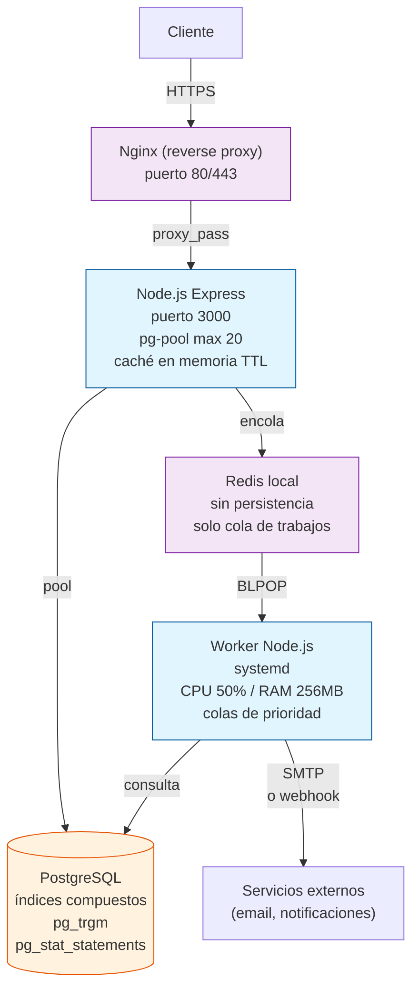

# Evolucionar un sistema bajo carga

## Contexto

Una API monolítica que funcionaba bien con 100 usuarios simultáneos empieza a dar timeouts con 500. El equipo no sabe si el cuello de botella está en la base de datos, el servidor web, o la red. Necesitás un plan de evolución arquitectónica que resuelva el problema actual sin over-engineering para el futuro.

El sistema está en producción y los timeouts ocurren en ventanas predecibles (14:00 a 16:00). El equipo de operaciones reporta que la CPU del servidor web salta al 95% durante esos picos, pero no tienen visibilidad de lo que ocurre dentro de la base de datos. Cada timeout se traduce en usuarios que reintentan la operación, lo que agrava el problema — es un clásico efecto _thundering herd_ amplificado por retries sin backoff.

El negocio no puede detenerse para una reescritura. Necesitás un plan quirúrgico: cambios incrementales, cada uno con su propia línea de base y verificación.

## Objetivo observable

Identificar 3 potenciales cuellos de botella en una arquitectura dada, priorizarlos por impacto, y proponer una evolución incremental con mediciones que validen cada paso.

Al completar este laboratorio demostrás que podés:

- Diagnosticar una API lenta sin depender de herramientas de APM costosas.
- Distinguir entre cuellos de botella de red, cómputo, base de datos y concurrencia.
- Diseñar un plan de evolución donde cada iteración es desplegable de forma independiente.
- Justificar cada decisión con datos, no con intuición.
- Escribir un plan de rollback para cada cambio.

## Escenario

Tenés un monolito Node.js/Express con PostgreSQL y un worker de cola en el mismo servidor (4 vCPU, 8GB RAM, SSD). Reportan lentitud entre las 14:00 y 16:00. Base de datos: 3 tablas principales (usuarios 50K filas, pedidos 200K, productos 5K). Sin caché, sin índices adicionales, sin pooling de conexiones.

La aplicación expone 12 endpoints REST. Los más lentos son:

- `GET /pedidos?usuario=X&desde=Y&hasta=Z` — listar pedidos por usuario y rango de fechas. Sin índice en `usuario_id` ni `fecha_creacion`. La query hace un sequential scan sobre 200K filas.
- `POST /pedidos` — crear un pedido. Inserta en `pedidos`, actualiza stock en `productos`, y encola un trabajo de notificación. Todo en la misma transacción.
- `GET /productos?busqueda=X` — búsqueda textual sobre 5K productos. Usa `LIKE '%termino%'`, que no puede usar índices B-tree estándar.

El worker de cola corre en el mismo proceso Node.js mediante `setTimeout` con un array en memoria. Cuando la cola crece más de 200 trabajos, el event loop se bloquea y las respuestas HTTP empiezan a acumularse.

## Restricciones

- Sin cambiar a microservicios (el equipo es de 3 personas).
- Sin contratar infraestructura cloud (VPS limitado).
- Sin reescribir el backend.
- Sin proveedores pagos.
- Cada cambio debe ser medible antes/después.
- Sin agregar dependencias externas no justificadas.
- Cada iteración debe tener un plan de rollback explícito.

## Información disponible

- Módulo 04 (Arquitectura moderna) — conceptos de acoplamiento, cohesión, patrones de integración.
- Módulo 05 (Diseño de sistemas) — índices, caching, colas, connection pooling, strategies de escalado vertical y horizontal.
- Módulo 15 (Terminal avanzada) — diagnóstico con herramientas del sistema.
- Comandos de diagnóstico del sistema: `top`, `htop`, `iostat`, `vmstat`, `ss -tuln`, `ps aux --sort=-%mem`.
- Documentación de PostgreSQL: `EXPLAIN ANALYZE`, `pg_stat_activity`, `pg_stat_statements`.
- Recurso externo: "Use the Index, Luke" para diseño de índices.

## Preguntas de decisión

- ¿Agregás caché (Redis/memoria) o mejorás índices primero? ¿Cuál tiene mayor impacto inmediato y cuál introduce más riesgo?
- ¿Pooling de conexiones o más servidores? Dado el VPS limitado, ¿cuál es más eficiente?
- ¿Worker separado o misma máquina con límites de recursos? ¿Conviene un proceso separado con `systemd` o dentro de Docker con restricciones de CPU y memoria?
- ¿Vale la pena migrar a algo serverless? ¿Qué restricciones lo harían contraproducente?
- ¿Optimizás queries primero o reorganizás la cola de trabajos? ¿Cuál contribuye más a los timeouts?

Cada respuesta debe apoyarse en datos del escenario, no en preferencias personales.

## Artefacto esperado

Crear `plan-escalabilidad.md` (dentro del laboratorio) con:

1. **Arquitectura actual documentada** — diagrama o descripción del estado presente incluyendo puertos, procesos y flujo de datos.
2. **3 cuellos de botella priorizados** — cada uno con evidencia de por qué es un problema, con qué comando se diagnosticó y su impacto estimado.
3. **Plan de 3 iteraciones** — cada una con:
   - Objetivo y cambio concreto
   - Métrica antes/después con comando de medición
   - Plan de rollback
   - Tiempo estimado de implementación
4. **Diagrama de arquitectura post-evolución** — usando Mermaid o similar.

## Criterios de aceptación

- Identifica 3 o más cuellos de botella con evidencia (comando + resultado esperado).
- Cada iteración es independiente (se puede deployar sola, sin esperar a las otras).
- Cada iteración tiene una métrica que mejora (tiempo de query, requests por segundo, uso de CPU).
- El plan incluye rollback explícito para cada iteración.
- No depende de proveedores pagos.
- El plan puede ser ejecutado por un equipo de 3 personas en menos de 2 semanas total.

## Rúbrica

| Nivel | Criterio |
|-------|----------|
| **Inicial** | Identifica 1 bottleneck. No hay plan. Las decisiones no están justificadas. |
| **Competente** | Identifica 2 bottlenecks ordenados por impacto. Propone 1 iteración con métrica. Sin rollback. |
| **Avanzado** | Identifica 3 bottlenecks con priorización clara. 3 iteraciones con medición pre/post. Rollback documentado. Sin over-engineering evidente. |
| **Experto** | Plan completo con tradeoffs explícitos. Script de benchmark funcional. Diagrama Mermaid de la arquitectura post-evolución. Justificación de por qué no se eligieron alternativas (serverless, microservicios, Redis externo). |

## Autoevaluación

Respondé estas 6 preguntas después de completar el artefacto. Si respondés "no" a más de una, revisá el plan.

1. **¿Priorizaste por impacto, no por facilidad?** — Si pusiste caché antes que índices, ¿lo justificás con datos? Porque índices suelen tener mayor impacto con menor complejidad.
2. **¿Cada iteración es deployable independientemente?** — Si la iteración 2 depende de la 1, ¿por qué no las fusionaste en una sola?
3. **¿La métrica elegida realmente mide la mejora?** — "Tiempo de respuesta promedio" es mejor que "se siente más rápido". Preferí percentiles (P95, P99).
4. **¿Hay plan de rollback?** — No alcanza con "revertir el commit". ¿Cómo volvés atrás sin downtime?
5. **¿Evitaste over-engineering?** — ¿Realmente necesitás Redis o podés resolverlo con caché en memoria con TTL? ¿Serverless es una opción real con el VPS actual?
6. **¿Recomendarías esto a un equipo sin tu experiencia?** — Si el plan asume conocimientos que el equipo no tiene, no es un buen plan.

## Errores frecuentes

- **Agregar caché antes de optimizar queries.** Un caché mal invalidado es peor que no tener caché. Además, si la query lenta se puede resolver con un índice, el caché solo esconde el problema.
- **Ignorar connection pooling.** Una app Node.js sin pool abre y cierra conexiones para cada request. Con 500 usuarios simultáneos, PostgreSQL se satura aceptando conexiones en lugar de ejecutar queries. `psql` con `pg_stat_activity` muestra decenas de conexiones en estado `idle`.
- **Pensar que escalar es siempre agregar servidores.** El escenario corre en un solo VPS. Antes de escalar horizontalmente hay que asegurarse de que el cuello de botella no sea una query sin índice que un servidor extra no resolvería.
- **No medir antes de optimizar.** Optimizar sin línea de base es especulación. Sin `EXPLAIN ANALYZE` no sabés si el cambio mejoró algo.
- **Migrar a microservicios como primera solución.** Para un equipo de 3 personas, microservicios multiplican la complejidad operativa sin resolver el problema real. Primero optimizá el monolito.
- **Usar `LIKE '%termino%'` sin considerar FTS.** PostgreSQL tiene `pg_trgm` y búsqueda de texto completo. No hace falta Elasticsearch.

## Extensión avanzada

Si querés ir más allá del plan:

1. **Script de benchmark funcional.** Escribí un script Node.js que use `Promise.all` para disparar 500 requests concurrentes y mida:
   - Tiempo total
   - Tasa de éxito/error
   - Distribución de tiempos (P50, P95, P99)
   Usá `ab` (Apache Bench), `wrk` o `httperf` como alternativa.

2. **Capturar las 5 queries más lentas.** Configurá `pg_stat_statements` en PostgreSQL y escribí un comando que muestre las 5 queries con mayor tiempo total acumulado:
   ```sql
   SELECT query, calls, total_time, mean_time, rows
   FROM pg_stat_statements
   ORDER BY total_time DESC
   LIMIT 5;
   ```

3. **Dashboard de diagnóstico.** Creá un script que ejecute `top`, `vmstat` e `iostat` secuencialmente durante 5 minutos con intervalos de 10 segundos y genere un reporte Markdown con los picos.

4. **Simular la carga.** Usá `k6` (herramienta open source) o `autocannon` para simular 500 usuarios virtuales contra el endpoint más lento. Documentá los resultados antes y después de cada iteración.

## Solución

La solución completa está separada del enunciado para permitir la autoevaluación. Consultá el archivo `soluciones/04-escala-y-carga-solucion.md` solo después de haber intentado el ejercicio.

### Resumen del plan

**Arquitectura actual documentada:**

```text
                         ┌─────────────┐
  Cliente ──HTTPS──►     │             │
                         │  Node.js    │
                         │  Express    │
                         │  (puerto    │
                         │   3000)     │
                         │             │
                         │  Worker     │
                         │  (cola en   │
                         │  memoria)   │
                         └──────┬──────┘
                                │
                                │ conexión directa
                                │ (sin pool)
                                ▼
                         ┌─────────────┐
                         │ PostgreSQL  │
                         │ (puerto     │
                         │  5432)      │
                         │ 3 tablas    │
                         │ sin índices │
                         │ adicionales │
                         └─────────────┘
```

Problemas identificados:
1. Sin connection pooling → PostgreSQL se satura con conexiones idle.
2. Sin índices en `pedidos.fecha_creacion` ni `pedidos.usuario_id` → sequential scans.
3. Worker inline en el event loop de Node.js → cola bloquea respuestas HTTP.

**3 cuellos de botella priorizados:**

| # | Cuello de botella | Evidencia | Impacto estimado |
|---|-------------------|-----------|------------------|
| 1 | Sequential scan en pedidos | `EXPLAIN ANALYZE SELECT * FROM pedidos WHERE usuario_id = ? AND fecha_creacion BETWEEN ? AND ?` muestra `Seq Scan` sobre 200K filas, 2.3s | Alto — afecta al endpoint más usado |
| 2 | Conexiones sin pool | `pg_stat_activity` muestra 40+ conexiones idle esperando. Cada conexión consume ~5MB de RAM en Postgres. Con 8GB de RAM, el límite práctico es ~200 conexiones antes de swap | Alto — causa timeouts por agotamiento de conexiones |
| 3 | Worker bloqueante en event loop | `top -p <pid>` muestra CPU al 95% en node. La cola en memoria con `setTimeout` sin priorización bloquea el loop de eventos | Medio — agrava los otros dos problemas |

**Plan de 3 iteraciones:**

#### Iteración 1: Conexiones e índices (día 1-2)

- **Cambio:** Agregar `pg-pool` con max 20 conexiones. Crear índice compuesto en `pedidos(usuario_id, fecha_creacion DESC)`. Crear índice en `productos(nombre)` con `pg_trgm` para búsqueda textual.
- **Métrica pre:** Tiempo de `GET /pedidos?usuario=X` = 2.3s (P95). Conexiones activas en pico: 45.
- **Métrica post:** Tiempo de `GET /pedidos?usuario=X` < 50ms (P95). Conexiones activas en pico: ≤ 20.
- **Comando de medición:**
  ```bash
  # Antes y después
  psql -c "EXPLAIN ANALYZE SELECT * FROM pedidos WHERE usuario_id = 1 AND fecha_creacion BETWEEN '2024-01-01' AND '2024-12-31';"
  psql -c "SELECT count(*) FROM pg_stat_activity WHERE state = 'idle';"
  ```
- **Rollback:** Comentar el pool y revertir migración de índices. El pool es transparente para el código de negocio si se usa una variable de entorno `DATABASE_URL` sin pool. El índice se revierte con `DROP INDEX CONCURRENTLY`.

#### Iteración 2: Worker separado (día 3-5)

- **Cambio:** Extraer el worker de cola a un proceso Node.js independiente. Comunicación vía Redis (local, sin persistencia) o archivo temporario + polling con `inotify`. Usar `systemd` para gestionar el worker con límites de CPU (50%) y memoria (256MB). Alternativa más simple: Docker con `--cpus=0.5 --memory=256m`.
- **Métrica pre:** CPU de Node.js en pico = 95%. Tiempo promedio `POST /pedidos` = 800ms.
- **Métrica post:** CPU de Node.js en pico = 60%. Tiempo promedio `POST /pedidos` = 200ms.
- **Comando de medición:**
  ```bash
  # Antes y después
  ps aux --sort=-%cpu | grep node
  # O con pidstat
  pidstat -p $(pgrep -f "node app.js") 1 60
  ```
- **Rollback:** Detener el proceso worker, revertir `systemd` unit, volver a la cola en memoria. Si se usa Redis local, detener Redis no afecta al web server (el worker reintenta conexión).

#### Iteración 3: Caché de consultas frecuentes (día 6-7)

- **Cambio:** Agregar caché en memoria con TTL para las consultas más frecuentes: catálogo de productos (TTL 5 min), endpoints GET de pedidos que repiten el mismo usuario+fecha (TTL 30s). Usar `node-cache` o el `Map` nativo de Node.js con `setInterval` de limpieza.
- **Métrica pre:** Requests repetidos al mismo endpoint GET tardan igual que la primera vez.
- **Métrica post:** Requests repetidos al mismo endpoint se sirven desde caché en <5ms. Ratio de cache hit > 40%.
- **Comando de medición:**
  ```bash
  # Agregar headers de respuesta: X-Cache: HIT o X-Cache: MISS
  curl -I http://localhost:3000/productos?busqueda=zapatos | grep X-Cache
  ```
- **Rollback:** Variable de entorno `CACHE_ENABLED=false`. Si da problemas, se desactiva sin redeploy.

**Arquitectura post-evolución:**



**Tradeoffs explícitos:**

- **¿Por qué Redis local y no externo?** — El VPS tiene suficiente RAM (8GB). Redis externo agrega latencia de red y un punto de fallo más. Si el VPS creciera a un clúster, ahí sí convendría Redis externo.
- **¿Por qué no serverless?** — El equipo es de 3 personas. Serverless (Lambda + Aurora Serverless) requiere cambiar el modelo mental de despliegue, monitoreo y costos. Para el volumen actual (500 usuarios pico), un VPS optimizado rinde más por dólar y es más predecible.
- **¿Por qué caché en memoria y no Redis como caché?** — Para las consultas GET repetitivas, un `Map` con TTL en el mismo proceso es más rápido (0ms de red) y más simple (sin dependencia externa). Redis se usa solo para la cola del worker.
- **¿Por qué índices primero?** — Porque tienen el mayor impacto por unidad de esfuerzo. Un índice compuesto bien diseñado puede reducir tiempos de 2.3s a 5ms. Ninguna otra optimización da tanto retorno con tan poco riesgo.

## Fuentes

- **Documentación oficial de PostgreSQL:** `EXPLAIN ANALYZE` (<https://www.postgresql.org/docs/current/using-explain.html>), `pg_stat_statements` (<https://www.postgresql.org/docs/current/pgstatstatements.html>), `pg_trgm` (<https://www.postgresql.org/docs/current/pgtrgm.html>).
- **"Use the Index, Luke"** — Markus Winand. Guía práctica para diseño de índices relacionales. (<https://use-the-index-luke.com/>).
- **`pg-pool` (node-postgres)** — Documentación oficial de pooling de conexiones para Node.js. (<https://node-postgres.com/features/pooling>).
- **Módulo 04** del manual — Arquitectura moderna: acoplamiento, cohesión, integración.
- **Módulo 05** del manual — Diseño de sistemas: índices, caching, colas, escalado.
- **Módulo 15** del manual — Terminal avanzada: diagnóstico con `top`, `htop`, `iostat`, `vmstat`, `ss`.
- **Docker resource constraints** — Limitación de CPU y memoria por contenedor. (<https://docs.docker.com/config/containers/resource_constraints/>).
- **`systemd` resource control** — `CPUQuota` y `MemoryMax` en unidades de systemd. (<https://www.freedesktop.org/software/systemd/man/latest/systemd.resource-control.html>).
- **Concepto de _thundering herd_** — Documentado en "System Design Interview" de Alex Xu y en la documentación de PostgreSQL sobre `pg_advisory_lock`.
