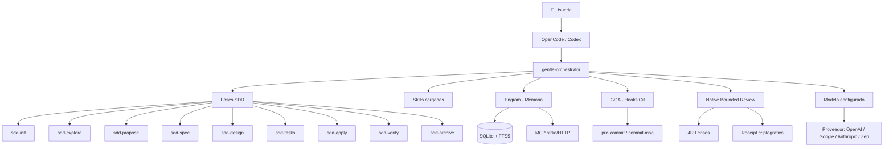

<div class="landing-hero">
  <h1 class="landing-title">Gentle AI — <span class="landing-highlight">Mega Manual</span></h1>
  <p class="landing-subtitle">
    El manual pedagógico, técnico e interactivo del ecosistema <strong>Gentleman Programming</strong>.
  </p>
  <p class="landing-description">
    Aprendé a usar agentes de IA para diseñar, construir, revisar y gobernar productos de software — desde cero hasta producción.
  </p>
  <div class="landing-cta">
    <a href="/gentle-ai-mega-manual-es/00-empezar-aqui/" class="landing-button-primary">Empezar aquí</a>
    <a href="/gentle-ai-mega-manual-es/05-instalacion/" class="landing-button-secondary">Instalar</a>
  </div>
</div>

<div class="landing-section">
  <h2>🗺️ El ecosistema</h2>


</div>

<div class="landing-section">
  <h2>🧭 Rutas de aprendizaje</h2>
  <p class="landing-section-desc">Elegí tu punto de partida según tu perfil:</p>

  <div class="landing-routes">
    <div class="landing-route">
      <span class="route-icon">🟢</span>
      <div class="route-content">
        <strong>Principiante total</strong>
        <p>Empezar aquí → fundamentos → primer proyecto</p>
      </div>
    </div>
    <div class="landing-route">
      <span class="route-icon">🟡</span>
      <div class="route-content">
        <strong>Ya sé programar</strong>
        <p>Ecosistema Gentle → instalación → SDD</p>
      </div>
    </div>
    <div class="landing-route">
      <span class="route-icon">🔵</span>
      <div class="route-content">
        <strong>Uso OpenCode</strong>
        <p>Configuración → modelos → skills</p>
      </div>
    </div>
    <div class="landing-route">
      <span class="route-icon">🟣</span>
      <div class="route-content">
        <strong>Uso Codex</strong>
        <p>Perfiles TOML → multiagente → enrutamiento</p>
      </div>
    </div>
    <div class="landing-route">
      <span class="route-icon">🟠</span>
      <div class="route-content">
        <strong>Quiero entender Engram</strong>
        <p>Memoria persistente → protocolo MCP → búsqueda</p>
      </div>
    </div>
    <div class="landing-route">
      <span class="route-icon">🔴</span>
      <div class="route-content">
        <strong>Quiero configurar modelos</strong>
        <p>Catálogo → enrutamiento → perfiles de costo</p>
      </div>
    </div>
    <div class="landing-route">
      <span class="route-icon">⚫</span>
      <div class="route-content">
        <strong>Quiero construir un producto</strong>
        <p>SDD completo → frontend + backend → deploy</p>
      </div>
    </div>
    <div class="landing-route">
      <span class="route-icon">🟤</span>
      <div class="route-content">
        <strong>Quiero entender la arquitectura</strong>
        <p>Código fuente → diseño interno → contribución</p>
      </div>
    </div>
  </div>
</div>

<div class="landing-section">
  <h2>📚 Módulos</h2>

  <div class="landing-modules">
    <div class="module-card">
      <span class="module-num">00</span>
      <div class="module-info">
        <strong>Empezar aquí</strong>
        <span class="module-badge level-1">Nivel 1</span>
        <p>Orientación, mapa del manual, cómo leerlo</p>
      </div>
      <span class="module-time">10 min</span>
    </div>
    <div class="module-card">
      <span class="module-num">01</span>
      <div class="module-info">
        <strong>Fundamentos tecnológicos</strong>
        <span class="module-badge level-1">Nivel 1</span>
        <p>Hardware, software, terminal, procesos</p>
      </div>
      <span class="module-time">60 min</span>
    </div>
    <div class="module-card">
      <span class="module-num">02</span>
      <div class="module-info">
        <strong>Git y GitHub</strong>
        <span class="module-badge level-1">Nivel 1</span>
        <p>Commits, ramas, PRs, hooks</p>
      </div>
      <span class="module-time">90 min</span>
    </div>
    <div class="module-card">
      <span class="module-num">03</span>
      <div class="module-info">
        <strong>Fundamentos de IA</strong>
        <span class="module-badge level-1">Nivel 1</span>
        <p>Modelos, tokens, proveedores, MCP</p>
      </div>
      <span class="module-time">60 min</span>
    </div>
    <div class="module-card">
      <span class="module-num">04</span>
      <div class="module-info">
        <strong>Ecosistema Gentle</strong>
        <span class="module-badge level-1">Nivel 1</span>
        <p>Mapa completo del ecosistema</p>
      </div>
      <span class="module-time">20 min</span>
    </div>
    <div class="module-card">
      <span class="module-num">05</span>
      <div class="module-info">
        <strong>Instalación</strong>
        <span class="module-badge level-1">Nivel 1</span>
        <p>Instalar y verificar gentle-ai</p>
      </div>
      <span class="module-time">30 min</span>
    </div>
    <div class="module-card">
      <span class="module-num">06</span>
      <div class="module-info">
        <strong>Primer proyecto</strong>
        <span class="module-badge level-2">Nivel 2</span>
        <p>Tu primer ciclo SDD completo</p>
      </div>
      <span class="module-time">60 min</span>
    </div>
    <div class="module-card">
      <span class="module-num">07</span>
      <div class="module-info">
        <strong>Gentle-AI</strong>
        <span class="module-badge level-2">Nivel 2</span>
        <p>CLI, TUI, pipeline, configuración</p>
      </div>
      <span class="module-time">30 min</span>
    </div>
    <div class="module-card">
      <span class="module-num">08</span>
      <div class="module-info">
        <strong>SDD</strong>
        <span class="module-badge level-2">Nivel 2</span>
        <p>10 fases, artefactos, verificación</p>
      </div>
      <span class="module-time">35 min</span>
    </div>
    <div class="module-card">
      <span class="module-num">09</span>
      <div class="module-info">
        <strong>Engram</strong>
        <span class="module-badge level-2">Nivel 2</span>
        <p>Memoria persistente, SQLite, FTS5</p>
      </div>
      <span class="module-time">40 min</span>
    </div>
    <div class="module-card">
      <span class="module-num">10</span>
      <div class="module-info">
        <strong>Skills</strong>
        <span class="module-badge level-2">Nivel 2</span>
        <p>Crear, probar y registrar skills</p>
      </div>
      <span class="module-time">25 min</span>
    </div>
    <div class="module-card">
      <span class="module-num">11</span>
      <div class="module-info">
        <strong>Calidad y revisión</strong>
        <span class="module-badge level-2">Nivel 2</span>
        <p>GGA, Native Review, Judgment Day</p>
      </div>
      <span class="module-time">40 min</span>
    </div>
    <div class="module-card">
      <span class="module-num">12</span>
      <div class="module-info">
        <strong>OpenCode</strong>
        <span class="module-badge level-2">Nivel 2</span>
        <p>Configuración, agentes, perfiles</p>
      </div>
      <span class="module-time">45 min</span>
    </div>
    <div class="module-card">
      <span class="module-num">13</span>
      <div class="module-info">
        <strong>Codex</strong>
        <span class="module-badge level-2">Nivel 2</span>
        <p>Perfiles TOML, multiagente</p>
      </div>
      <span class="module-time">30 min</span>
    </div>
    <div class="module-card">
      <span class="module-num">14</span>
      <div class="module-info">
        <strong>Modelos y enrutamiento</strong>
        <span class="module-badge level-2">Nivel 2</span>
        <p>Catálogo, routing, perfiles de costo</p>
      </div>
      <span class="module-time">45 min</span>
    </div>
    <div class="module-card">
      <span class="module-num">15</span>
      <div class="module-info">
        <strong>Terminal</strong>
        <span class="module-badge level-1">Nivel 1</span>
        <p>CLI, pipes, procesos, scripts</p>
      </div>
      <span class="module-time">30 min</span>
    </div>
    <div class="module-card">
      <span class="module-num">16</span>
      <div class="module-info">
        <strong>Arquitectura técnica</strong>
        <span class="module-badge level-3">Nivel 3</span>
        <p>Código fuente, paquetes Go, diseño</p>
      </div>
      <span class="module-time">60 min</span>
    </div>
    <div class="module-card">
      <span class="module-num">17</span>
      <div class="module-info">
        <strong>Seguridad y costos</strong>
        <span class="module-badge level-2">Nivel 2</span>
        <p>Permisos, presupuestos, gobierno</p>
      </div>
      <span class="module-time">40 min</span>
    </div>
    <div class="module-card">
      <span class="module-num">18</span>
      <div class="module-info">
        <strong>Construcción de productos</strong>
        <span class="module-badge level-3">Nivel 3</span>
        <p>Integración completa idea → deploy</p>
      </div>
      <span class="module-time">90 min</span>
    </div>
    <div class="module-card">
      <span class="module-num">19</span>
      <div class="module-info">
        <strong>Laboratorios</strong>
        <span class="module-badge level-2">Nivel 2-3</span>
        <p>20 ejercicios prácticos acumulativos</p>
      </div>
      <span class="module-time">120 min</span>
    </div>
    <div class="module-card">
      <span class="module-num">20</span>
      <div class="module-info">
        <strong>Referencia</strong>
        <span class="module-badge level-3">Nivel 3</span>
        <p>Comandos, glosario, catálogo, matriz</p>
      </div>
      <span class="module-time">Consulta</span>
    </div>
  </div>
</div>

<div class="landing-section landing-versions">
  <h2>📸 Versiones</h2>
  <div class="version-bar">
    <div class="version-item">
      <span class="version-label">gentle-ai</span>
      <code class="version-value">v2.1.10</code>
      <span class="version-status version-stable">estable</span>
    </div>
    <div class="version-item">
      <span class="version-label">engram</span>
      <code class="version-value">v1.19.0</code>
      <span class="version-status version-stable">estable</span>
    </div>
    <div class="version-item">
      <span class="version-label">opencode</span>
      <code class="version-value">v1.17.20</code>
      <span class="version-status version-stable">estable</span>
    </div>
  </div>
</div>

<div class="landing-section landing-experimental">
  <h2>⚠️ Funciones experimentales</h2>
  <p>Las funciones marcadas como <span class="badge-experimental">🧪 Experimental</span> están señalizadas en todo el manual. Pueden cambiar sin previo aviso.</p>
</div>

<div class="landing-section landing-quickstart">
  <h2>🚀 Inicio rápido</h2>

```bash
# Clonar e instalar
git clone https://github.com/Gentleman-Programming/gentle-ai-mega-manual-es.git
cd gentle-ai-mega-manual-es
npm install

# Desarrollo local
npm run dev

# Construir para producción
npm run build
```

</div>

<div class="landing-section landing-repos">
  <h2>🔗 Repositorios del ecosistema</h2>

  <div class="repo-grid">
    <a href="https://github.com/Gentleman-Programming/gentle-ai" class="repo-card" target="_blank" rel="noopener">
      <strong>gentle-ai</strong>
      <span>Orquestador, CLI, SDD</span>
    </a>
    <a href="https://github.com/Gentleman-Programming/engram" class="repo-card" target="_blank" rel="noopener">
      <strong>engram</strong>
      <span>Memoria persistente</span>
    </a>
    <a href="https://github.com/Gentleman-Programming/gentleman-guardian-angel" class="repo-card" target="_blank" rel="noopener">
      <strong>GGA</strong>
      <span>Hooks Git de revisión</span>
    </a>
    <a href="https://github.com/Gentleman-Programming/Gentleman-Skills" class="repo-card" target="_blank" rel="noopener">
      <strong>Gentleman-Skills</strong>
      <span>Biblioteca de skills</span>
    </a>
  </div>
</div>
