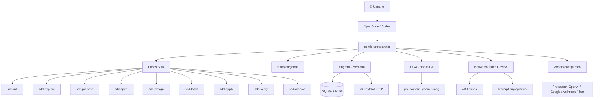

import ProfileCards from '../../components/curriculum/ProfileCards.astro';
import ModuleIndex from '../../components/curriculum/ModuleIndex.astro';
import VersionNote from '../../components/curriculum/VersionNote.astro';

<div class="landing-hero">
  <h1 class="landing-title">Gentle AI — <span class="landing-highlight">Mega Manual</span></h1>
  <p class="landing-subtitle">
    El manual pedagógico, técnico e interactivo del ecosistema <strong>Gentleman Programming</strong>.
  </p>
  <p class="landing-description">
    Aprendé a usar agentes de IA para diseñar, construir, revisar y gobernar productos de software — desde cero hasta producción.
  </p>
  <div class="landing-cta">
    <a href="./00-empezar-aqui/01-bienvenida/" class="landing-button-primary">Empezar aquí</a>
    <a href="./05-instalacion/01-instalar-gentle-ai/" class="landing-button-secondary">Instalar</a>
  </div>
</div>

<ProfileCards />

<div class="landing-section">
  <h2>🗺️ El ecosistema</h2>


</div>

<ModuleIndex />

<div class="landing-section landing-versions">
  <h2>📸 Versiones verificadas</h2>
  <VersionNote />
</div>

<div class="landing-section landing-experimental">
  <h2>⚠️ Funciones experimentales</h2>
  <p>Las funciones marcadas como <span class="badge-experimental">🧪 Experimental</span> están señalizadas en todo el manual. Pueden cambiar sin previo aviso.</p>
</div>

<div class="landing-section landing-quickstart">
  <h2>🚀 Inicio rápido</h2>

```bash
# Clonar e instalar
git clone https://github.com/harrysxavio/gentle-ai-manual.git
cd gentle-ai-manual
npm install

# Desarrollo local
npm run dev

# Construir para producción
npm run build
```

</div>

<div class="landing-section landing-repos">
  <h2>🔗 Repositorios del ecosistema</h2>

  <div class="repo-grid">
    <a href="https://github.com/Gentleman-Programming/gentle-ai" class="repo-card" target="_blank" rel="noopener">
      <strong>gentle-ai</strong>
      <span>Orquestador, CLI, SDD</span>
    </a>
    <a href="https://github.com/Gentleman-Programming/engram" class="repo-card" target="_blank" rel="noopener">
      <strong>engram</strong>
      <span>Memoria persistente</span>
    </a>
    <a href="https://github.com/Gentleman-Programming/gentleman-guardian-angel" class="repo-card" target="_blank" rel="noopener">
      <strong>GGA</strong>
      <span>Hooks Git de revisión</span>
    </a>
    <a href="https://github.com/Gentleman-Programming/Gentleman-Skills" class="repo-card" target="_blank" rel="noopener">
      <strong>Gentleman-Skills</strong>
      <span>Biblioteca de skills</span>
    </a>
  </div>
</div>
